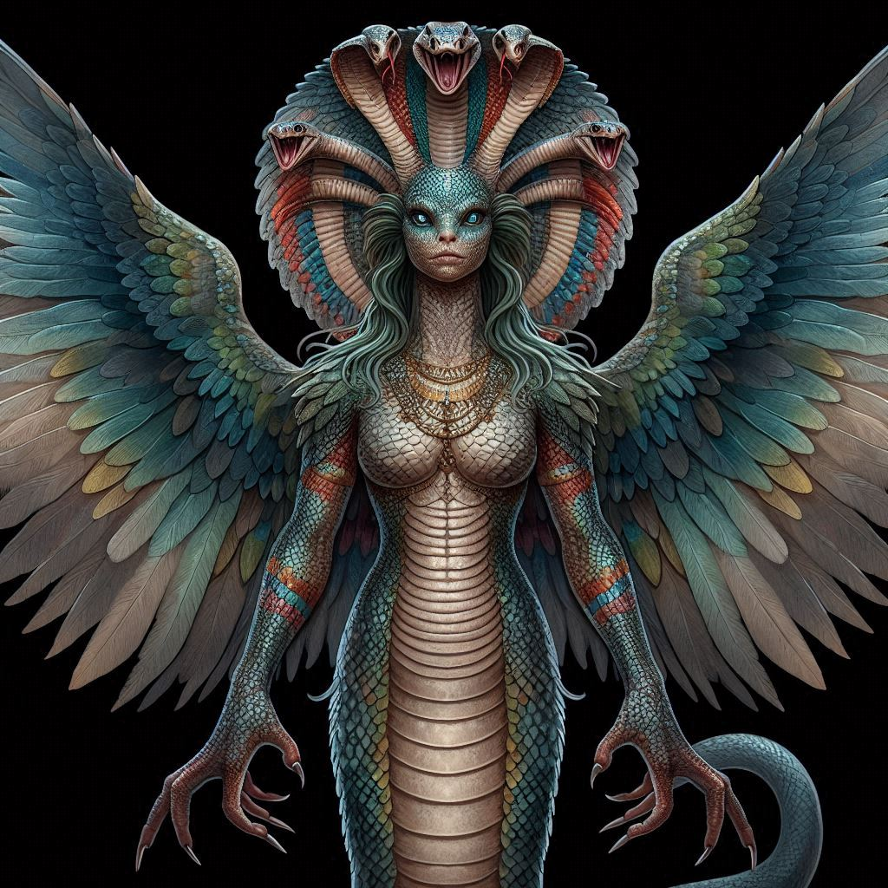
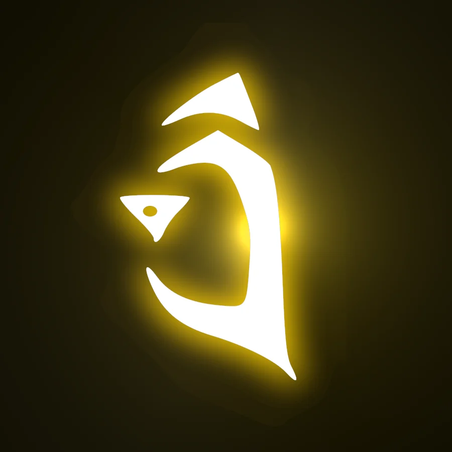

# Arc-7-Junima-rescue

## Session 213. 2024 May 27th Monday + 4710 AR Erastus 29th + Junima rescue part 1.

Blackrock inn, talking to Oswen.

Found Junima's letter to Selenor.

Welter's room.
- Bag.
- Ancient scrolls.

Time distortion.

FOUR WEEKS LATER.
* 4710 AR, 26th Arodus.

12:00.

Big orc x 1.
18 GP.
The normal orcs x 3.
12 GP.
Worg x 4 = 18 GP.

## Session 214. 2024 June 8th Saturday + 4710 AR, 26th Arodus. + Junima rescue part 2.

Now in the middle of the wyvern quest.

12:00 → 1 hour spent in the blackrock inn → 13:00.
13:00 → 2 hours spent wyvern hunting = 14:00.

## Session 215. 2024 June 9th Sunday + 4710 AR, 26th Arodus. + Junima rescue part 3.

Back in time.
Amar's time.
4710 AR Erastus 29th.
13:00.
Amar has been the Harrower for 5 days (Erastus 26th).

Amar talks to ticktock man.

Amar goes to Magnimar.

@ the Guilded cage.
Black suits, gold ties.

Meets James Darkmoon, sees history of Earth warfare.

15:00
At Sandpoint home base.

18:00.
Laucian POV.
Laucian talks to Tammerhawk.

Laucian spends 4 weeks at the concordance of elements.
Laucian's strategies nearly get some elemental soldiers killed.
Laucian earned 90ish gold.

Modwinn is here.

Allisee, Cardigan, Selenor agree to bring 'THIS AND THAT' items to Loras.

## Session 215. 2024 June 24th Monday + 4710 AR, 26th Arodus. + Junima rescue part 4.

Rescuing the ranger, Aleric.

19:00.
The party are at the Black rock mine.

## Session 216. 2024 July 13th Saturday + 4710 AR, 26th Arodus. + Junima rescue part 5.

Selenor is in aerial form.
10 minutes.
3 x 10 = 30.
30 - 2 = 28.

Selenor chases 3 orcs.
Selenor gets a dragon apple of inevitable death.

Spider warehouse fight.
Allisee is Stage 1 → 0.
Selenor is stage 1 → 0.

## Info dump.

- Location: Black-rock mines, Indigo isles. 
- Plane: Battle-zoo.

Allisee reads the ritual scroll.

This time knowing that her connection to the divine is what must be thought upon.

Allisee does not worship a particular deity, instead allowing her open connection to flow outwards.

Something in Allisee's blood stirs, growls and roars in Allisee's mind: the roar of a dragon.

Allisee, you have awakened something deep within yourself, and within this scroll.
You see the shards of sin glow, though Selenor does not seem to notice.

A beam of light leaps from the scroll, and before you there stands this entity:

She has 7 feathered wings.

She says:

"A banner caller? There is no way your line is long dead."

She looks curiously at you.

"No, you are something else."

She sees the scroll.

"With the rites of the previous incarnation."

She grabs you a powerful grip, lifting you into the air.
As you move from your previous position, your companions do not notice, as you look down, you see yourself standing 
where you were.

This must be happening only in your mind, or something like that...

"Do you know what you almost did? You nearly called the broken mistress HERE to the plane of hidden, her blood could 
be used to find..."

Her eyes go wide in surprise... and perhaps fear?

"A servant of the moon, a traitor of your blood. How dare you? Is this your feeble attempt to kill me? To kill the 
mistress?"

Her hands start to crush you, she seems to perceive you as the enemy.

Allisee says:
`"Hey, hey easy you can crush me after we talk, please??
I'm not trying to kill you, I don't even know you.
For the broken mistress, I guess I see where you are coming from, but I also want to talk to her before I decide what 
I do.
I'm here to save grandma right now, not to kill or call anything or anyone!"`

The snake woman maintains her tight grasp but does not tighten it further:
`I detect no lies from your mouth.
Instead, I sense doubt, and a longing for knowledge.
I am one of The Undying Divine Serpents, or Tuds for short.
You summoned me with a scroll of light, a ritual of the dawn.
It uses illumination magic, a magic that died when the star stone damaged magic forever.
I smell in you both the blood of the faithful, but I see...`

Tuds has a look at your moonstone arm:
`A blessing of the moon, our arch enemy.
Though I suppose this may be lost upon your unknowing mind, the war between the bear and the snake has long since 
faded into the mists of history...
Which makes me more curious, how you came to wield such an item?
Who are you?
Why did you summon me?`

Tuds looks around, her eyes wide in surprise:
`AND WHY ARE WE AT A PRISON?`

Allisee replies:
[19/07/2024 04:54]
`"1 question at a time.
This moon power I inherited from an Orc guy called Un-Trull I think
I'm still figuring some stuff out like the grimm past it seems to have,
but I didn't come to that part yet.
I am Alissee of the house Tra-Umna of Taldor,
mother unknown but somehow related to your broken mistress or whatever I think.
I had no idea this scroll summoned anything I was just trying to figure out what it does,
and now I guess I kind of know but still don't.  
And this is a prison?
Looks like a normal mineshaft to me...
But if you are mentioning this because Selenor's grandma is imprisonned here, then I'm curious.`
`Now I get 4 questions right?"`
[19/07/2024 05:02]
`Alissee will try to recall knowledge/identify magic on Occultism
to figure out exactly if what popped out of the scroll is an illusion.`

Tuds gazes into your eyes, squints, her snake hair hisses and moves close to your face:
"Still, I detect no deception, no falsehoods.
Yes, that arm, that foul weapon, has cut down many of my brethren in the wars for magical supremacy and mastery, for
freedom.
That arm is a weapon of tyranny.
From your mother flows a bloodline that once spilt blood for our master, the god of sin and magic: Lissala."

Tuds seems to freeze for a moment before saying:
"... well, that was once the case at least, now Lissala lies dead, as does the moon goddess."

A smile plays on the edges of Tuds lips:
"And the moon goddess is SO dead that her name no longer exists, her name is gone, her essence, more or less fully
erased from reality."

The hint of a smile on Tud's face is quickly gone, replaced with curiosity and contempt:
"Whatever spark is left in you allowed you to tap into the reserves of magic in this scroll, the last flickers of a
murdered form of magic.
Though this is a dawn scroll, it is capable of teaching someone the ancient rites, though for whatever purpose that
would still serve is lost upon me."

Tuds looks at the mineshaft:
>"What is below us is not a mine.
There was an event, an event that is sealed from being remembered by almost all, a battle that began the
poisoning of the light.
Such a poison would later be exploited by humankind and drive out the light.
There is a being locked away; deep below, he is one of a collection of servants whose freedom marks the end of days.
I know only of one of his companions, a tall creature, with black obsidian skin, with the face of a jackal.
The one below here is far greater than he.
Whatever you do, do not release him.
Who is this grandma?
What is she doing here?"

Allisee says:
> "Wow, your friends really got that moon goddess good, well done...
So for more information on the grandma, ask Selenor the guy in heavy armor over there,
> I know she has 'green flame magic' is a kind of witch and is called Junima.
She got kidnapped, I blame Selenor and his gray flame father side or whatever.
> And from what you are telling me and what we know,
> I'm guessing the people who did that are trying to maybe release that thing. 
> It seems we both want that thing not released, so how about a temporary truce?
Also, I now have 6 questions don't think I'm not keeping score."

With a roll of 43 in master-tier occultism, Allisee contemplates:
"Allisee will try
to recall knowledge/identify magic on Occultism to figure out exactly if what popped out of the scroll is an illusion."
Allisee, you realise that as part of summoning this creature, you have phased yourself out of reality.
You currently exist in an astral-projected form, a sort of in between middle reality.
She is not fully here and neither are you, instead meeting in the middle.
You are a manifestation of your soul, though she seems must more adept at manifesting than you are.

Tuds pauses for a moment, contemplating her response, maintaining her grip on your throat.
Tuds slowly lowers you to the ground:
> "The star-stone killed my goddess, same as yours.
> It is part of our sacred duty to prevent that thing from getting out, it would mean the end of days.
> I have a proposal.
> I will give you a holy ring, it will pass you off as a follower of Lissala, allowing you to read sin-speak and 
> many other benefits.
> However, in return, I will place within you, within your very soul: a slither of Lissala.
> This slither is a piece of runic magic, a seed of light."

Tuds raises her hand in floating in it, appears a sin-ring.
> "Take the ring, stop this threat, save the moon, save everything."

What do you do?

Allisee says:
>"What does this Slither do exactly?
> I'm usually careful of deals like that cause what do I know I could die from 
> it as soon as this is all over."

Tuds says:
>"In truth, I do not fully know, it has been the duty of those who are left to place the slither where it may most 
> likely find root.
> As for killing you, I see no point in such an action; we are allies now.
> Though I warn you, in future my brethren, if you are to ever cross paths with them, may not be as understanding as 
> I. In such circumstances, use the ring, it will serve you well in winning favour."

Allisee says:
>" Well, it is fishy, but it is not like I have a real choice, I suppose...
I'll take that deal
IF you also answer my 5 more questions because I think it is only fair I ask the same number of questions you did.
What are those banner callers you mentioned?
How do you think I am related to them?
What’s your affiliation with the broken mistress that I suppose is the ghost in the lighthouse?
I am not using actual names intentionally so as to not accidentally provoke anything.
Why did Lissala and the Moon goddess fight each other?
And would it be possible to beat, seal or kill the companion of the creature that you talked about,
the black jackal face thing?"

Tuds says:
>"The banner callers were the survivors of the age of dragons, they were a bunch of guilds who wanted to survive 
the great wars and turmoil.
> Emperor Xin invited them in, allowed them to stay and granted them a position of strength in the empire. 
> In return, the guilds provided their banners to the empire, providing great boons: knowledge, might, magic, etc.
> You are one of those banner callers.
> Though I cannot tell you more, for I do not know more.
> The broken mistress is a divine servant of Lissala, I know not of any lighthouses.
> Why did Lissala fight the moon goddess?
> It was to do with two main reasons.
> The first reason they fought was because of their stance on magical knowledge; Lissala believed in freedom of 
> knowledge, allowing everyone to know anything.
> The moon goddess restricted knowledge! 
> They fought to the death over a magical secret, the most important magical secret.
> The dominance of all magic.
> Of what this secret is?
> I do not know the secrets of magic.
> As for killing such a creature, you are nowhere near powerful enough, wise enough or stupid enough to try.
> So, does this please you?
> Do you accept the ring?"

Allisee says:
>""Very well, I accept the ring and the 'Slither' and swear to do anything in my power to keep the thing that's imprisoned here from getting out."

Tuds moves her hand downwards, and the ring floats in the air and melds around your fingers on your flesh arm.
Immediately a 7-pointed star tattoo burns into the skin on the back of your hand.
You become haunted by visions of a falling star.
As these visions take hold, at the centre of the 7-pointed star is this symbol:

Your armour shifts, changes and becomes a green tight-fitting cloak that goes past your chin, partly concealing your 
face.
All along the cloak are gleaming golden runic swirling patterns.

Tuds is amazed and somewhat amused:
`"The ring detected your greed and responded as such, the tattoo I was expected, but I did not think you had such a 
capacity for magic or sin to personify it.
You amuse me, endlessly."`

The symbol starts to shift and change, the colours of the robe and the robe's shape start to shift and change as 
well...to that of envy.

Allisee's tattoo is now the runic symbol of envy.

Allisee's robes are now primarily a dark mossy green ballroom gown with the under-dress hanging down as a rich royal 
purple, 
and the 
innermost 
and longest cloth going to the ground is a bloody sunset orange. 

The green ballroom-like-gown that is wide at the hips and narrows towards its waist before widening out 
again at the shoulders but being thin at the neck.

The ballroom gown is a morphed illusion, a manifestation of Allisee's envy, which means it does not inhibit movement 
and can physically morph to squeeze.

It will also adjust to Allisee's size.

Tuds says:
`Goodbye, but I am sure we will meet again.`

## Session 217. 2024 July 21st Sunday + 4710 AR, 26th Arodus. + Junima rescue part 6.

19:30.
Selenor unlocked the cellar.

Then Locus, the expanding void, appears and joins the party.

Denufair The Bunny now counts as a psychic mouse eldamon.

19:50.

20:00.
Spirit realm.

Fight! 
Dragon beast ghost x 2 & dragon rider guard ghost x 2.

20:20.

Fight!
The Ghost metal golem.
End of life.
Recharge.
Round 2. Round 6. 
Locus slowed 1 until round 11.

20:30.
Ghost fight over.

## Session 218. 2024 August 10th Saturday + 4710 AR, 26th Arodus. + Junima rescue part 7.

Viole Jule Grace joins the group.

21:00.
- Dragon rider skeleton hoard fight.
- Take a breather & refocus.

21:10.

21:30.

Allisee's mum is Yubis Dara!

## Session 219. 2024 August 31st Saturday + 4710 AR, 26th Arodus. + Junima rescue part 8.

22:00.
Vargos joins the party.

The party are about to enter the tomb of the dead.

Ross's notes:

We open the portal to Selanors Grandma. 
Out then comes the grandma. We Are in a dark, forgotten place. 
The rocks that Viole picks up brings out visions of Doom and destruction. 
Carnon picks up a different, smaller rock and his inner connection to the universe DARKENS AROUND HIS FINGERS. 
Carnon drops it and backs away in fear. Selenor, sensing a competition, picks up a bigger one, and as he does it EXPLODES. 
Going on a frenzy to try to clear the blocked passage, he clears a few rocks but one of the rocks fights back, sliding right through Selenor's hand. One the door is 9 circles. One is cracked. One is merging with another. A crystal lotus vision appears. Most of them are fading in and out and have few details. One of them is a symbol for the moon. This is cracked and damaged. Selenor explodes more rocks, and reveals a tunnel that has had something dragged through it. One of Ex Ranger Knight Captain of the Knights of Lost Tim's Wives tries to dig through the black rock, but the black rock fights back and sends him the vision of more destruction. Ex Ranger Knight Captain of the Knights of Lost Tim becomes CHANGED?? Turns into a sort of EEL. Unholy eel? Unholy Consecrated? Tim gets touched by Viole, and Tim's eel features try to stick onto Viole, and Viole gets a rash. Something stops Viole from getting infected. God symbols, god names makes them glow.

Pharasma, Asmodeus, Crystal Lotus, Sarenrae, Desna, Nimbologue, Arestil.

Carnon knows so much. He recognises something rather strange. This seal was made by about 8 different DIVINE castors. This strange unlikely alliance were able to channel the power of the deities to create a unifying seal. This is a MYTHICAL seal barrier. If this seal is ever to be opened, it means that ever deity allows them to open it. Selenor puts his hand in the middle of the door, as his body gets covered in strange, intricate designs. He floats centimetres of the ground, as books start to float around him, and he glows in a grey flame, and the door unlocks.

This motherfucker just channelled 8 different divines, and bypassed their lock. 
Selenor has Screwdrivered his screw. 
He has hammered his nail. 
He is a cup that has been filled with water. 
He is a vagina that ha- no no no too far.

Behind the door is a staircase that descends downwards a few meters, and makes is filled with skeletons. Tim says he 
will guard his wives' rears and stay behind. (alternatively, his autism makes him count each skeleton). 
Some skeletons has necromantic symbols. Not necessarily unholy, but more Dhampiric undeath.  
As we travel through the crypts, the skeletons pop out, some not being able to fully animate, and instead just the heads pop up, (the source of their reanimation). Further into the crypt, a massive hulking bone creature moves ahead, crushing several piles of bones. Above average wyvern.

Combat Ensues. 
Allisee explodes and cracks a skeleton into a laser beam of magic. Carnon's Gun explodes in his face. Viole spell strikes. 
Allisee takes 15 minutes to do their turn. Selenor does a lot of damage, Carnon's turn takes 15 seconds. Cardigan does good world play. Viole shivers the skeletons timbres. Selenor does more damage. Allisee does ??? The Totally not drake flies up 20 feet, shoots a bone at allisee. The skulls does more soul sucking. Allisee is extremely resistant to sucking. (does she not have a soul, therefore immune?) Allisee begs Selenor for help. Selenor tries a high jump on moving, shambling ground filled with bones, and surprising everyone suceeds. Carnon strolls down to shoot the skull, and Viole finishes it off. Combat Ends.

Allisee finds a box with an old draconic sigil, pre Syn Riders. 
Height of their power, before the fall. Inside is a bobblehead of a dragon. Ornament? Syn Rider Merch. Dragon Pop Head. 
Viole is being pulled by Rovagog? Viole tries to pick up a femur to use a club, but Allisee start to harass them about their Femur's extended warrantee.

Session ends.

## Session 220. 2024 September 15th Sunday + 4710 AR, 26th Arodus. + Junima rescue part 9.

23:00.
23:20. Refocus & take a breather.

1. Pharasma, 
2. Asmodeus, 
3. Crystal Lotus, 
4. Sarenrae,
5. Nhimbaloth, 
6. Rovagug.
7. Desna.
8. Achaekek (mantis god).
9. MISSING.

The 2 missing Gods from the gravestones: MISSING and Nhimbaloth.

1. Pharasma,
2. Asmodeus,
3. Crystal Lotus,
4. Sarenrae,
5. Rovagug.
6. Desna.
7. Achaekek (mantis god).

- Selenor has stage 1 cancer.
- Allisee got a glove made of a hand.
- The party got the shield of Lissala.
- Allisee & Selenor have BANE curse.

## Session 221. 2024 September 21st Saturday + 4710 AR, 26th Arodus. + Junima rescue part 10.

- Viole cures the BANE curse.
- Ritual room.

00:00.

Raokan, the servant of the 5th, is released.

## Session 222. 2024 October 19th Saturday + 4710 AR, 27th Arodus. + Junima rescue part 11.

Players present:
1. Horia.
2. Ross.
3. Tony Moonlight.

01:00.

Selenor signs daemonic contract.
Selenor is ambidextrous.
On his right hand is a tattoo of death.

Death squad:
- Zillif.
- Tempest.
- Verda.
- An ancient agent of death skeleton.

Sett Mummy fight!

Paralysed.
Allisee is paralysed until round 4.
Carnon is paralysed until round 6.

Suffocating.
Junima: 1.
Carnon: 1.

Resist: 16.

## Session 223. 2024 November 3rd Sunday + 4710 AR, 27th Arodus. + Junima rescue part 12.

On the plane of battle-zoo.

02:00.
Arc 7 is basically over.

Black rock inn is destroyed.

Frozen prison plane. (Can be named by Selenor.)

- Allisee knows that the frozen prison plane has a connection to Yubis. This is because of 3 reasons:
1. The elemental lord of water.
2. Jack Frost's (connection ice magic) to Yubis.
3. Yubis's ice-magic spirit is stronger in a plane of ice-magic.

Junima's conversation with Selenor:
- Camadaithe & Junima fell in love.
- Junima miscarried.
- There was a strange blue moon that night and for several days afterwards.

Aleric becomes a war daemon.

- The party go to the library of dead worlds.
- A watcher talks to the party and explains that the horsemen are attacking many worlds and that this must be stopped.
- The watcher says that their kind will assist in sealing away each of the horseman's abilities to freely attack 
  material planes.

> Runewild.
>> - Junima finds the grave of her stillborn empty in the pool of the rabbit-turtle.

## Session 224. 2024 November 16rd Saturday + 4710 AR, 27th Arodus. + Junima rescue part 13.

Play by post:
`Selenor places his hand on Junima’s shoulder and says, 
“I am sorry for what happened to you.
I am sorry that you never experienced a normal life, one where you would grow old and pass peacefully,
surrounded by your family.
Instead, you ended up with an abusive mother who created you as a weapon for her war.

"I am sorry that your chance at motherhood was robbed by unknown enemies, and your child’s grave disturbed.
All I can say is that I will never understand why mortals, outsiders, gods,
and even my creators keep saying, ‘You don’t know what people would do for love.’

"Zilif’s love for his daughter doomed many, and yet, if she knew what he had done, she would hate him.
Your love for your daughter, and for Camadaithe,
filled you with so much sorrow that it drove both of you to distance yourselves—from each other and from your daughter.

"My creators’ love for each other led to my creation, but also to death.
My father’s love for your daughter led him to call you a ‘wee girl’
when you were tortured, and he abandoned you to the mercy of this rider of death.
My stepfather’s love for Korvosa led him to become a slave to an ungrateful god of pain.
My stepmother’s love for mortals led to me being constantly bullied, betrayed,
and beaten by them, simply because they can’t withstand the truth.”
Lastly, Andaisin's love for herself made me into a weapon of flesh and blood who imitates what you would call a person.

Selenor’s soulless eyes stare at Junima as he continues,
"I am unable to feel this so-called love… and yet I have endured all of this.
I know that family is important, which is why I would die for you over and over again.
I also know that doomsday must be stopped, but my ability to choose is limited by my directives.
Unlike you, I am a passive player in this grand game—I can only react to your choices.

"And now I ask you this, Junima: why are you crying?
Tears won’t wash away the pain or the trauma.
You have two choices, as I see it.
Either you remain, as my father called you, a ‘wee girl’, or you harden your heart,
protect your family, and knock some sense in your hag mother.
Abaddon’s vast daemonic armies are marching across countless worlds as we speak.
If you want the people you love to survive this doomsday,
you must embrace your powers and call-to-arms the long-dead heroes of the Hag Wars to your cause.
Whatever you choose, I will stand by your side not out of love,
but I do care about you, and it is my duty as your grand-creation to assist you in any way I can.”

Selenor after a deep sigh says "`You’ve got a good heart.
Don’t ever lose it, no matter how hard the world tries to break you."

- Selenor & Junima hug.

02:00.

Home base has a toggle zone of truth.

SELENOR IS DENOUNCED BY PHARASMA.

Rest. 8 hours.

- 28th Arodus. 09:30.

Hori is free! 10 Find the Path crystal stones are handed out to Plethyn.
