# C00 Riddleport: Timeline

Where the party went, in order. Each outer box is an area, and each box inside it is a room or spot the party spent time in.

- 🗓️ **IRL** is measured from the first post there to the first post at the next place.
- ⏳ **In-game** time is filled in by the GM. An area's total appears once all of its rooms have one.

```mermaid
flowchart TD
    subgraph a0["1. Before play · 🗓️ IRL <1h ▰▱▱▱▱▱▱▱▱▱ · ⏳ In-game ?"]
    direction TB
        v0["<b>1.1 Setup posts</b><br/>🗓️ IRL <1h ▰▱▱▱▱▱▱▱▱▱<br/>⏳ In-game ?"]
    end
    subgraph a1["2. The sewers · 🗓️ IRL 2w 1d ▰▱▱▱▱▱▱▱▱▱ · ⏳ In-game ?"]
    direction TB
        v1["<b>2.1 Sewer pipe</b><br/>🗓️ IRL 6d 9h ▰▱▱▱▱▱▱▱▱▱<br/>⏳ In-game ?"]
        v2["<b>2.2 Intersection of a sewer</b><br/>🗓️ IRL 1w 1d ▰▱▱▱▱▱▱▱▱▱<br/>⏳ In-game ?"]
    end
    subgraph a2["3. Riddleport · 🗓️ IRL 1d 9h ▰▱▱▱▱▱▱▱▱▱ · ⏳ In-game ?"]
    direction TB
        v3["<b>3.1 Alleyway</b><br/>🗓️ IRL 8h ▰▱▱▱▱▱▱▱▱▱<br/>⏳ In-game ?"]
        v4["<b>3.2 Bakery</b><br/>🗓️ IRL 1d 2h ▰▱▱▱▱▱▱▱▱▱<br/>⏳ In-game ?"]
    end
    subgraph a3["4. St. Caspian's Salvation · 🗓️ IRL 51w 4d ▰▰▰▰▰▰▰▰▰▰ · ⏳ In-game ?"]
    direction TB
        v5["<b>4.1 Iron gate</b><br/>🗓️ IRL 3d 5h ▰▱▱▱▱▱▱▱▱▱<br/>⏳ In-game ?"]
        v6["<b>4.2 Door</b><br/>🗓️ IRL 5d 23h ▰▱▱▱▱▱▱▱▱▱<br/>⏳ In-game ?"]
        v7["<b>4.3 Hall</b><br/>🗓️ IRL 4w 5d ▰▰▰▰▱▱▱▱▱▱<br/>⏳ In-game ?"]
        v8["<b>4.4 Roof</b><br/>🗓️ IRL 1d 9h ▰▱▱▱▱▱▱▱▱▱<br/>⏳ In-game ?"]
        v9["<b>4.5 Hall</b><br/>🗓️ IRL 3d 7h ▰▱▱▱▱▱▱▱▱▱<br/>⏳ In-game ?"]
        v10["<b>4.6 Roof</b><br/>🗓️ IRL <1h ▰▱▱▱▱▱▱▱▱▱<br/>⏳ In-game ?"]
        v11["<b>4.7 Inner chapel</b><br/>🗓️ IRL 2w 5d ▰▰▱▱▱▱▱▱▱▱<br/>⏳ In-game ?"]
        v12["<b>4.8 Hall</b><br/>🗓️ IRL <1h ▰▱▱▱▱▱▱▱▱▱<br/>⏳ In-game ?"]
        v13["<b>4.9 Large hallway</b><br/>🗓️ IRL <1h ▰▱▱▱▱▱▱▱▱▱<br/>⏳ In-game ?"]
        v14["<b>4.10 Corridors</b><br/>🗓️ IRL <1h ▰▱▱▱▱▱▱▱▱▱<br/>⏳ In-game ?"]
        v15["<b>4.11 Outside of room 9</b><br/>🗓️ IRL <1h ▰▱▱▱▱▱▱▱▱▱<br/>⏳ In-game ?"]
        v16["<b>4.12 Room 9</b><br/>🗓️ IRL 4w 2d ▰▰▰▱▱▱▱▱▱▱<br/>⏳ In-game ?"]
        v17["<b>4.13 Door</b><br/>🗓️ IRL 4h ▰▱▱▱▱▱▱▱▱▱<br/>⏳ In-game ?"]
        v18["<b>4.14 Room 12</b><br/>🗓️ IRL 2w 1d ▰▰▱▱▱▱▱▱▱▱<br/>⏳ In-game ?"]
        v19["<b>4.15 Door</b><br/>🗓️ IRL <1h ▰▱▱▱▱▱▱▱▱▱<br/>⏳ In-game ?"]
        v20["<b>4.16 Room 13</b><br/>🗓️ IRL 10w 1h ▰▰▰▰▰▰▰▰▱▱<br/>⏳ In-game ?"]
        v21["<b>4.17 Corridors</b><br/>🗓️ IRL 1w 1d ▰▱▱▱▱▱▱▱▱▱<br/>⏳ In-game ?"]
        v22["<b>4.18 Library</b><br/>🗓️ IRL 4w 5d ▰▰▰▰▱▱▱▱▱▱<br/>⏳ In-game ?"]
        v23["<b>4.19 Tower</b><br/>🗓️ IRL 1w 1d ▰▱▱▱▱▱▱▱▱▱<br/>⏳ In-game ?"]
        v24["<b>4.20 Stone platform</b><br/>🗓️ IRL 1d 2h ▰▱▱▱▱▱▱▱▱▱<br/>⏳ In-game ?"]
        v25["<b>4.21 Upper bell tower</b><br/>🗓️ IRL 5d 21h ▰▱▱▱▱▱▱▱▱▱<br/>⏳ In-game ?"]
        v26["<b>4.22 Tower</b><br/>🗓️ IRL 5d 3h ▰▱▱▱▱▱▱▱▱▱<br/>⏳ In-game ?"]
        v27["<b>4.23 Corridors</b><br/>🗓️ IRL 6d 16h ▰▱▱▱▱▱▱▱▱▱<br/>⏳ In-game ?"]
        v28["<b>4.24 Tower</b><br/>🗓️ IRL 1w 2h ▰▱▱▱▱▱▱▱▱▱<br/>⏳ In-game ?"]
        v29["<b>4.25 Upper bell tower</b><br/>🗓️ IRL 7w 3d ▰▰▰▰▰▰▱▱▱▱<br/>⏳ In-game ?"]
        v30["<b>4.26 Tower</b><br/>🗓️ IRL <1h ▰▱▱▱▱▱▱▱▱▱<br/>⏳ In-game ?"]
        v31["<b>4.27 Large hallway</b><br/>🗓️ IRL 3w 3d ▰▰▰▱▱▱▱▱▱▱<br/>⏳ In-game ?"]
        v32["<b>4.28 Temple grounds</b><br/>🗓️ IRL 3w 4d ▰▰▰▱▱▱▱▱▱▱<br/>⏳ In-game ?"]
    end
    subgraph a4["5. Riddleport · 🗓️ IRL 1w 12h ▰▱▱▱▱▱▱▱▱▱ · ⏳ In-game ?"]
    direction TB
        v33["<b>5.1 Streets</b><br/>🗓️ IRL <1h ▰▱▱▱▱▱▱▱▱▱<br/>⏳ In-game ?"]
        v34["<b>5.2 Pawn shop</b><br/>🗓️ IRL 1w 12h ▰▱▱▱▱▱▱▱▱▱<br/>⏳ In-game ?"]
    end
    subgraph a5["6. The Silver Succubi · 🗓️ IRL 35w 2d ▰▰▰▰▰▰▰▱▱▱ · ⏳ In-game ?"]
    direction TB
        v35["<b>6.1 Plaza</b><br/>🗓️ IRL 1w 4d ▰▱▱▱▱▱▱▱▱▱<br/>⏳ In-game ?"]
        v36["<b>6.2 Entrance hallway</b><br/>🗓️ IRL <1h ▰▱▱▱▱▱▱▱▱▱<br/>⏳ In-game ?"]
        v37["<b>6.3 Casino floor</b><br/>🗓️ IRL 12w 6d ▰▰▰▰▰▰▰▰▰▰<br/>⏳ In-game ?"]
        v38["<b>6.4 Staircase</b><br/>🗓️ IRL <1h ▰▱▱▱▱▱▱▱▱▱<br/>⏳ In-game ?"]
        v39["<b>6.5 Hallway</b><br/>🗓️ IRL <1h ▰▱▱▱▱▱▱▱▱▱<br/>⏳ In-game ?"]
        v40["<b>6.6 Marlo's office</b><br/>🗓️ IRL 5w 4d ▰▰▰▰▱▱▱▱▱▱<br/>⏳ In-game ?"]
        v41["<b>6.7 Casino floor</b><br/>🗓️ IRL 4w 2d ▰▰▰▱▱▱▱▱▱▱<br/>⏳ In-game ?"]
        v42["<b>6.8 Shop</b><br/>🗓️ IRL 10w 6d ▰▰▰▰▰▰▰▰▱▱<br/>⏳ In-game ?"]
    end
    v0 --> v1
    v1 --> v2
    v2 --> v3
    v3 --> v4
    v4 --> v5
    v5 --> v6
    v6 --> v7
    v7 --> v8
    v8 --> v9
    v9 --> v10
    v10 --> v11
    v11 --> v12
    v12 --> v13
    v13 --> v14
    v14 --> v15
    v15 --> v16
    v16 --> v17
    v17 --> v18
    v18 --> v19
    v19 --> v20
    v20 --> v21
    v21 --> v22
    v22 --> v23
    v23 --> v24
    v24 --> v25
    v25 --> v26
    v26 --> v27
    v27 --> v28
    v28 --> v29
    v29 --> v30
    v30 --> v31
    v31 --> v32
    v32 --> v33
    v33 --> v34
    v34 --> v35
    v35 --> v36
    v36 --> v37
    v37 --> v38
    v38 --> v39
    v39 --> v40
    v40 --> v41
    v41 --> v42
```

## 1. Before play

- 🗓️ **IRL:** 20 Dec 2024 to 20 Dec 2024, <1h
- ⏳ **In-game:** not all rooms filled in

### 1.1 Setup posts

- 🗓️ **IRL:** 20 Dec 2024 to 20 Dec 2024, <1h, 2 posts
- ⏳ **In-game:** not filled in (`"2024-12#1"` in `timelines/C00-Riddleport.json`)
- 💬 **Time said in posts:** "The year is 4669."

**Events**

- 20 Dec: Manifested in the past.
- 20 Dec: Learned the year was 4669.

## 2. The sewers

- 🗓️ **IRL:** 20 Dec 2024 to 5 Jan 2025, 2w 1d
- ⏳ **In-game:** not all rooms filled in

### 2.1 Sewer pipe

- 🗓️ **IRL:** 20 Dec 2024 to 27 Dec 2024, 6d 9h, 28 posts
- ⏳ **In-game:** not filled in (`"2024-12#3"` in `timelines/C00-Riddleport.json`)

**Events**

- 20 Dec: Awakened in a sewer pipe and were told to make level 2 characters.
- 20 Dec: Gained DUAL CLASS from the Rune Wheel.
- 21 Dec: Stated Carnon would be a Leshy Fighter / Animist.
- 21 Dec: Stated the character would be Fighter/champ.
- 23 Dec: Learned very little time would pass when in Riddleport.
- 27 Dec: Reached the start of the campaign.

### 2.2 Intersection of a sewer

- 🗓️ **IRL:** 27 Dec 2024 to 5 Jan 2025, 1w 1d, 27 posts
- ⏳ **In-game:** not filled in (`"2024-12#31"` in `timelines/C00-Riddleport.json`)

**Events**

- 27 Dec: Found themselves at the intersection of a sewer laying on piles of shit.
- 27 Dec: Were asked what happens next.
- 28 Dec: Connected mind to the runewheel to weave a being of his own design.
- 28 Dec: Named her Necrila, daughter of the chronicler.
- 28 Dec: Connected consciousness to the runewheel to consider who was needed.
- 31 Dec: Connected to the runewheel to consider who would be best.
- 04 Jan: Cardigan Green appeared beside the party as a bubble of green light.
- 04 Jan: Cardigan sat in the waste after the power was dispelled.
- 04 Jan: Sinhow stood up and asked for lights.
- 04 Jan: Necrila approached the group and asked where they were.
- 04 Jan: Sinhow asked Cardigan to lead the way out of the sewer.
- 05 Jan: Sinhow used Arcane Sense to cast detect magic.

## 3. Riddleport

- 🗓️ **IRL:** 5 Jan 2025 to 6 Jan 2025, 1d 9h
- ⏳ **In-game:** not all rooms filled in

### 3.1 Alleyway

- 🗓️ **IRL:** 5 Jan 2025 to 5 Jan 2025, 8h, 18 posts
- ⏳ **In-game:** not filled in (`"2025-01#21"` in `timelines/C00-Riddleport.json`)
- 💬 **Time said in posts:** "early morning"

**Events**

- 05 Jan: Cardigan's Eldamon brought the party above ground.
- 05 Jan: Cardigan returned with a map bought for 10 GP.
- 05 Jan: The party gained a map granting a +1 item bonus to related checks.
- 05 Jan: Cardigan identified their location as the Leeward District.
- 05 Jan: Several prostitutes walked past the alleyway entrance.
- 05 Jan: The party saw a Wainwright, an open bakery, and a church of Sarenrae.

### 3.2 Bakery

- 🗓️ **IRL:** 5 Jan 2025 to 6 Jan 2025, 1d 2h, 8 posts
- ⏳ **In-game:** not filled in (`"2025-01#39"` in `timelines/C00-Riddleport.json`)

**Events**

- 05 Jan: Sinhow entered the bakery.
- 05 Jan: Sinhow asked the baker about breads and pastries.
- 05 Jan: Cardigan looked sad at the state of the church.
- 06 Jan: The party left the bakery with a loaf of fancy bread.

## 4. St. Caspian's Salvation

- 🗓️ **IRL:** 6 Jan 2025 to 3 Jan 2026, 51w 4d
- ⏳ **In-game:** not all rooms filled in

### 4.1 Iron gate

- 🗓️ **IRL:** 6 Jan 2025 to 9 Jan 2025, 3d 5h, 7 posts
- ⏳ **In-game:** not filled in (`"2025-01#47"` in `timelines/C00-Riddleport.json`)

**Events**

- 06 Jan: Sinhow led the party toward the church and asked about back entrances.
- 09 Jan: The party found the 2 metre iron gate unlocked.
- 09 Jan: The party saw a large oak tree between the fence and the church.
- 09 Jan: Cardigan recalled climbing the tree with Boggly.

### 4.2 Door

- 🗓️ **IRL:** 9 Jan 2025 to 15 Jan 2025, 5d 23h, 27 posts
- ⏳ **In-game:** not filled in (`"2025-01#54"` in `timelines/C00-Riddleport.json`)

**Events**

- 09 Jan: Sinhow walked to the church door and knocked.
- 13 Jan: Filiaur attempted to open the door but found it locked.
- 13 Jan: An elderly catfolk opened the door and demanded what they wanted.
- 15 Jan: Caroline introduced herself and asked if they wanted work.
- 15 Jan: Caroline told the group to follow her up the southern staircase.
- 15 Jan: Sinhow opened the hall door and counted the people inside.

### 4.3 Hall

- 🗓️ **IRL:** 15 Jan 2025 to 17 Feb 2025, 4w 5d, 52 posts
- ⏳ **In-game:** not filled in (`"2025-01#81"` in `timelines/C00-Riddleport.json`)

**Events**

- 15 Jan: The party saw sick and starved people cluttered along the hall.
- 21 Jan: A shadow-flesh little girl stared at the party.
- 24 Jan: Necrila asked if the girl was part of the priesthood.
- 29 Jan: The party saw an old stone well in the centre of the room.
- 29 Jan: Mika the Redeemer called for a blood sacrifice.
- 30 Jan: An attacker charged at Necrila with a serrated dagger.
- 08 Feb: Mika's red glowing eyes stopped glowing.
- 08 Feb: Mika stumbled backwards to the well.
- 08 Feb: Mika fell backwards into the well.
- 08 Feb: The well water turned to blood and Mika's body dissolved.
- 14 Feb: Sinhow inspected the bear and looked at the girl.
- 17 Feb: Sinhow suggested finding Necrilla on the roof.

### 4.4 Roof

- 🗓️ **IRL:** 18 Feb 2025 to 18 Feb 2025, 1d 9h, 15 posts
- ⏳ **In-game:** not filled in (`"2025-02#30"` in `timelines/C00-Riddleport.json`)

**Events**

- 18 Feb: Necrila dragged it into the sunlight.
- 18 Feb: The little building turned to ash.
- 18 Feb: Nothing was left on the roof.
- 18 Feb: A woman giggled briefly and then there was silence.
- 18 Feb: Necrila spoke to the sun and roared in triumph.
- 18 Feb: Necrila entered back into the building.

### 4.5 Hall

- 🗓️ **IRL:** 19 Feb 2025 to 22 Feb 2025, 3d 7h, 4 posts
- ⏳ **In-game:** not filled in (`"2025-02#45"` in `timelines/C00-Riddleport.json`)

**Events**

- 19 Feb: Sinhow looked around for Cardigan.
- 21 Feb: Sinhow asked Cardigan what she found out about the church.
- 22 Feb: Sinhow decided to find Necrilla and go up the ladder.

### 4.6 Roof

- 🗓️ **IRL:** 22 Feb 2025 to 22 Feb 2025, <1h, 3 posts
- ⏳ **In-game:** not filled in (`"2025-02#49"` in `timelines/C00-Riddleport.json`)

**Events**

- 22 Feb: Sinhow asked about a walkway.
- 22 Feb: The group gathered on the roof.
- 22 Feb: The group prepared to go into the inner chapel.

### 4.7 Inner chapel

- 🗓️ **IRL:** 22 Feb 2025 to 13 Mar 2025, 2w 5d, 40 posts
- ⏳ **In-game:** not filled in (`"2025-02#52"` in `timelines/C00-Riddleport.json`)

**Events**

- 22 Feb: The group pushed open the wooden doors.
- 22 Feb: The group entered a stone room with flaming braziers.
- 26 Feb: The group saw a priest praying with children and adults.
- 26 Feb: The group saw an acolyte watching them.
- 26 Feb: The priest invited the group to join the prayers.
- 27 Feb: Necrila rejoined the group and spoke to Cardigan.
- 03 Mar: Jhonas tensed and asked if the group worked with the group.
- 04 Mar: Jhonas whispered that wine was given to Father Patrick to keep him placated.
- 10 Mar: Father Patrick ended prayers and greeted the group.
- 11 Mar: Father Patrick remembered Cardigan as a name given by Yubis to a Gnomish baby.
- 11 Mar: Father Patrick welcomed the group to the temple of Sarenrae.

### 4.8 Hall

- 🗓️ **IRL:** 13 Mar 2025 to 13 Mar 2025, <1h, 2 posts
- ⏳ **In-game:** not filled in (`"2025-03#24"` in `timelines/C00-Riddleport.json`)

**Events**

- 13 Mar: The group went back to the front hall.
- 13 Mar: The group went up the stairs.

### 4.9 Large hallway

- 🗓️ **IRL:** 13 Mar 2025 to 13 Mar 2025, <1h, 11 posts
- ⏳ **In-game:** not filled in (`"2025-03#26"` in `timelines/C00-Riddleport.json`)

**Events**

- 13 Mar: The group arrived in a large hallway with corridors and doors.
- 13 Mar: The group saw the hallway floor covered in rubbish and mess.
- 13 Mar: Caroline introduced Knuckles the man and Fetch the dog.
- 13 Mar: Caroline told the group to follow her.

### 4.10 Corridors

- 🗓️ **IRL:** 13 Mar 2025 to 13 Mar 2025, <1h, 1 posts
- ⏳ **In-game:** not filled in (`"2025-03#37"` in `timelines/C00-Riddleport.json`)

**Events**

- 13 Mar: The group went down several corridors and stopped at numbered rooms.

### 4.11 Outside of room 9

- 🗓️ **IRL:** 13 Mar 2025 to 13 Mar 2025, <1h, 2 posts
- ⏳ **In-game:** not filled in (`"2025-03#38"` in `timelines/C00-Riddleport.json`)

**Events**

- 13 Mar: Caroline took the group outside of room 9.
- 13 Mar: Caroline opened the door of room 9.

### 4.12 Room 9

- 🗓️ **IRL:** 13 Mar 2025 to 13 Apr 2025, 4w 2d, 145 posts
- ⏳ **In-game:** not filled in (`"2025-03#40"` in `timelines/C00-Riddleport.json`)

**Events**

- 13 Mar: The group found Balston and Mad Rat inside room 9.
- 13 Mar: Balston asked what brought the group to the temple of Sarenrae.
- 16 Mar: Cardigan's Meese killed Balston with an addling blast.
- 17 Mar: Mad Rat dropped his daggers and claimed he was not with the gang.
- 19 Mar: Mad Rat said he worked for Avery Slyeg looking for Beltias Kreun.
- 19 Mar: Mad Rat said Beltias Kreun was plotting up in the Bell Tower.
- 06 Apr: Necrila killed Knuckles Redbone.
- 06 Apr: Knuckles Redbone and Fetch died.
- 06 Apr: Necrila chopped off Knuckles head.
- 13 Apr: Mad Rat said Brandy Nurrus and Garspheal Elstrice were in Room 12.
- 13 Apr: Mad Rat said Badeye Rumblefist and Rasper Ellias were in Room 13 with scorpions.
- 13 Apr: Sinhow ordered the group to head to Room 12.

### 4.13 Door

- 🗓️ **IRL:** 13 Apr 2025 to 14 Apr 2025, 4h, 6 posts
- ⏳ **In-game:** not filled in (`"2025-04#39"` in `timelines/C00-Riddleport.json`)

**Events**

- 13 Apr: Mad Rat pointed at the door labelled 12.
- 13 Apr: A gruff voice yelled from inside.
- 14 Apr: Brandy Nurrus opened the door.

### 4.14 Room 12

- 🗓️ **IRL:** 14 Apr 2025 to 29 Apr 2025, 2w 1d, 67 posts
- ⏳ **In-game:** not filled in (`"2025-04#45"` in `timelines/C00-Riddleport.json`)

**Events**

- 14 Apr: Brandy Nurrus accused the group of not being cleaners.
- 17 Apr: Necrila beheaded a bandit.
- 17 Apr: Mad Rat killed the wood elf dead.
- 18 Apr: The group found a small box.
- 18 Apr: The box contained silver cutlery and a strange +1 spyglass.
- 20 Apr: Sinhow herded the party toward the door of Room 13.

### 4.15 Door

- 🗓️ **IRL:** 29 Apr 2025 to 29 Apr 2025, <1h, 3 posts
- ⏳ **In-game:** not filled in (`"2025-04#112"` in `timelines/C00-Riddleport.json`)

**Events**

- 29 Apr: The group walked up to door 13.
- 29 Apr: Two voices cheered on a cock fight inside.

### 4.16 Room 13

- 🗓️ **IRL:** 29 Apr 2025 to 8 Jul 2025, 10w 1h, 169 posts
- ⏳ **In-game:** not filled in (`"2025-04#115"` in `timelines/C00-Riddleport.json`)
- 💬 **Time said in posts:** "30 minutes pass."; "10 more minutes pass."; "only the afternoon"

**Events**

- 29 Apr: Four monstrous dog-sized scorpions stood in a plank arena.
- 29 Apr: Rasper told the party to piss off.
- 29 Apr: Rasper Ellias asked Mad Rat if the boss needed them.
- 01 May: Filiaur messaged Sinhow suggesting waiting until the scorpion fight was over.
- 06 May: Rumble fist told the group to piss off.
- 06 May: Rasper agreed and tried to close the door.
- 07 May: Injured scorpions lay on straw beds in the corners of the room.
- 18 May: Necrila sang in Necril before combat.
- 25 May: Combat began.
- 10 Jun: Injured scorpions limped over to join the fight.
- 18 Jun: Two scorpions died.
- 27 Jun: Prof. Filiaur Bluestar was left near death.
- 27 Jun: Sinhow killed Badeye Rumblefist.
- 27 Jun: Yaseitori killed Rasper Ellias.
- 27 Jun: Combat ended.
- 03 Jul: 18 HP was healed.
- 03 Jul: Yaseitori introduced himself and said he tracked a stolen necklace here.
- 05 Jul: Mad Rat listed the surviving gang members.
- 05 Jul: Filiaur proposed distracting Pidge to ambush him.
- 07 Jul: Moonshine stumbled out from around the corner.
- 08 Jul: Rax slipped inside through the ajar door.

### 4.17 Corridors

- 🗓️ **IRL:** 8 Jul 2025 to 17 Jul 2025, 1w 1d, 55 posts
- ⏳ **In-game:** not filled in (`"2025-07#54"` in `timelines/C00-Riddleport.json`)

**Events**

- 08 Jul: The party opened the door and found a tied-up pirate woman.
- 08 Jul: Sinhow lowered the prisoner's gag and questioned her.
- 08 Jul: Moonshine tried to pick the prisoner's handcuffs.
- 09 Jul: Filiaur explained the ambush plan against Pidge.
- 09 Jul: Rax offered to hit Pidge with a Skunk Bomb.
- 17 Jul: The party made their way down the corridor.

### 4.18 Library

- 🗓️ **IRL:** 17 Jul 2025 to 19 Aug 2025, 4w 5d, 72 posts
- ⏳ **In-game:** not filled in (`"2025-07#109"` in `timelines/C00-Riddleport.json`)

**Events**

- 17 Jul: Mad Rat opened the door to the cold pigeon room.
- 17 Jul: Hundreds of pigeons perched on the ceiling beam.
- 17 Jul: Pidge healed a baby pigeon and released it into the air.
- 18 Jul: Yaseitori stepped forward to protect Pidge.
- 23 Jul: Pidge walked into the portal and left.
- 23 Jul: Sinhow said the party would move towards the bell tower.
- 02 Aug: Mad Rat proposed going up the tower using stealth.
- 02 Aug: Sinhow suggested climbing the outside to cut the rope.
- 05 Aug: Moonshine produced a signal whistle.
- 05 Aug: Sinhow outlined the climb, cut, and whistle signal plan.
- 19 Aug: Moonshine prepared a climbing kit and repeated the plan.

### 4.19 Tower

- 🗓️ **IRL:** 19 Aug 2025 to 25 Aug 2025, 1w 1d, 86 posts
- ⏳ **In-game:** not filled in (`"2025-08#17"` in `timelines/C00-Riddleport.json`)

**Events**

- 19 Aug: The party left the temple.
- 19 Aug: The party reached the tower part of the structure.
- 19 Aug: The GM stated the tower was 30 metres tall.
- 21 Aug: Moonshine agreed to climb with Yaseitori.
- 21 Aug: Moonshine completed the climb to 100 feet.
- 25 Aug: Yaseitori completed the climb to 100 feet.

### 4.20 Stone platform

- 🗓️ **IRL:** 28 Aug 2025 to 29 Aug 2025, 1d 2h, 10 posts
- ⏳ **In-game:** not filled in (`"2025-08#103"` in `timelines/C00-Riddleport.json`)

**Events**

- 28 Aug: The climbers arrived on a stone platform before wooden doors.
- 28 Aug: The GM said the doors led to the upper bell tower.
- 29 Aug: Moonshine looked for a string to cut on the platform.
- 29 Aug: Cardigan wondered inside the temple about the bell tower.
- 29 Aug: Moonshine pushed the doors open to peer inside.

### 4.21 Upper bell tower

- 🗓️ **IRL:** 29 Aug 2025 to 3 Sep 2025, 5d 21h, 28 posts
- ⏳ **In-game:** not filled in (`"2025-08#113"` in `timelines/C00-Riddleport.json`)

**Events**

- 29 Aug: The party saw a massive metal bell.
- 29 Aug: The party saw spiral steps descending downstairs.
- 31 Aug: The GM asked what the party would do next.
- 02 Sep: Yaseitori headed inside and checked for someone hiding.
- 02 Sep: Found arcane runes scrawled upon the bell surface.
- 03 Sep: Identified the runes as manipulating primal earth energy.
- 03 Sep: Moonshine shrugged and suggested trying the bell.
- 03 Sep: Yaseitori walked toward the abseiling gear and suggested cutting it.
- 03 Sep: Suggested weakening the rope so it tore when used.

### 4.22 Tower

- 🗓️ **IRL:** 4 Sep 2025 to 7 Sep 2025, 5d 3h, 14 posts
- ⏳ **In-game:** not filled in (`"2025-09#26"` in `timelines/C00-Riddleport.json`)

**Events**

- 04 Sep: Moonshine took the device down the tower to the abseiling equipment.
- 05 Sep: Grabbed the device, went down the tower and rigged it to fall apart.
- 07 Sep: Yaseitori decided to wait on top.
- 07 Sep: Moonshine blew the signal whistle.

### 4.23 Corridors

- 🗓️ **IRL:** 9 Sep 2025 to 16 Sep 2025, 6d 16h, 25 posts
- ⏳ **In-game:** not filled in (`"2025-09#40"` in `timelines/C00-Riddleport.json`)

**Events**

- 12 Sep: Necrila won initiative with 25.
- 12 Sep: Started combat encounter The Bell Tower of Beltias Kreun.
- 12 Sep: Stood outside the door to the spiral stairs room and opened the door.
- 12 Sep: Stood upon the platform of the bell tower in misty rain and gained the Rune-Wheel blessing.
- 12 Sep: Igarashi Enya ran away when her nerve broke.
- 14 Sep: Found a spiral staircase of grey stone behind the door in the same corridor.

### 4.24 Tower

- 🗓️ **IRL:** 16 Sep 2025 to 23 Sep 2025, 1w 2h, 14 posts
- ⏳ **In-game:** not filled in (`"2025-09#65"` in `timelines/C00-Riddleport.json`)

**Events**

- 16 Sep: Rax took the lead and checked the stairs for traps.
- 16 Sep: Cardigan and Rax climbed the stairs.
- 21 Sep: Moved everyone up the stairs at max speed.
- 23 Sep: Noted that checking for traps slowed movement.

### 4.25 Upper bell tower

- 🗓️ **IRL:** 23 Sep 2025 to 14 Nov 2025, 7w 3d, 91 posts
- ⏳ **In-game:** not filled in (`"2025-09#79"` in `timelines/C00-Riddleport.json`)

**Events**

- 23 Sep: A man ran up the stairs to the bell and was surprised to see Yaseitori.
- 23 Sep: Asked if everyone was running up again.
- 23 Sep: Calculated Cardigan reached 42.5 feet up the stairs.
- 29 Sep: Summarized Round 2 movement up the stairs and across Kreun room.
- 04 Oct: Yaseitori failed to demoralise Kreun and entered Tiger Stance with Hunt Prey.
- 04 Oct: Kreun used the sabotaged abseil device, the cord snapped, and he fell and grabbed an edge.
- 16 Oct: Rax hit Kreun with two skunk bombs for 2 damage.
- 16 Oct: Mad Rat hit with a crossbow strike for 4 damage.
- 16 Oct: Sinhow rushed down the stairs.
- 25 Oct: Filiaur's puppet grabbed Kreun.
- 03 Nov: GM posted Round 3 combat status for The Bell Tower of Beltias Kreun and waited for player responses.
- 14 Nov: GM asked about taking Mad Rat's turn.
- 14 Nov: Ryo noted Mad Rat had acted and Cardigan was awaited.

### 4.26 Tower

- 🗓️ **IRL:** 14 Nov 2025 to 14 Nov 2025, <1h, 1 posts
- ⏳ **In-game:** not filled in (`"2025-11#6"` in `timelines/C00-Riddleport.json`)

**Events**

- 14 Nov: Sinhow yelled and rushed down the spiral stairs to ground level.

### 4.27 Large hallway

- 🗓️ **IRL:** 14 Nov 2025 to 9 Dec 2025, 3w 3d, 53 posts
- ⏳ **In-game:** not filled in (`"2025-11#7"` in `timelines/C00-Riddleport.json`)

**Events**

- 14 Nov: Cardigan moved down the main spiral stairs to the 2nd floor hallway near the bell-tower room.
- 14 Nov: GM reposted Round 3 combat status with unacted and acted lists.
- 27 Nov: GM noted waiting on four players.
- 02 Dec: Players discussed paused game and missing macros in OOC chatter.
- 03 Dec: Lenma sprinted down stairs to bottom near hallway entrance.
- 07 Dec: GM reported party positions across tower, stairs and hallway.
- 09 Dec: Beltias Kreun critically succeeded his second Escape attempt.
- 09 Dec: Beltias Kreun stood up after escaping.

### 4.28 Temple grounds

- 🗓️ **IRL:** 9 Dec 2025 to 3 Jan 2026, 3w 4d, 103 posts
- ⏳ **In-game:** not filled in (`"2025-12#49"` in `timelines/C00-Riddleport.json`)

**Events**

- 09 Dec: Sinhow smashed through window and fell onto cobblestones outside.
- 09 Dec: Filiaur moved through corridor to edge of the window.
- 09 Dec: Party surrounded Kreun at ground level outside the temple.
- 09 Dec: Beltias Kreun strode north across temple grounds toward back gates.
- 13 Dec: Beltias Kreun surrendered and fell to his knees.
- 27 Dec: Rax treated Beltias wounds to keep him alive.
- 03 Jan: Saw fire rising on roof of temple
- 03 Jan: Learned corpses were being burned with last rites
- 03 Jan: Learned Mad Rat knew the way
- 03 Jan: Saw Kreun's ciphered papers and loot from bell tower
- 03 Jan: Watched Cardigan cry over priest's gift

## 5. Riddleport

- 🗓️ **IRL:** 3 Jan 2026 to 5 Jan 2026, 1w 12h
- ⏳ **In-game:** not all rooms filled in

### 5.1 Streets

- 🗓️ **IRL:** 3 Jan 2026 to 3 Jan 2026, <1h, 3 posts
- ⏳ **In-game:** not filled in (`"2026-01#19"` in `timelines/C00-Riddleport.json`)
- 💬 **Time said in posts:** "for about 10 minutes"

**Events**

- 03 Jan: Followed Mad Rat through Riddleport for about 10 minutes
- 03 Jan: Saw wilds of pirate city
- 03 Jan: Saw mid-day parties, fighting and crime

### 5.2 Pawn shop

- 🗓️ **IRL:** 3 Jan 2026 to 5 Jan 2026, 1w 12h, 8 posts
- ⏳ **In-game:** not filled in (`"2026-01#22"` in `timelines/C00-Riddleport.json`)
- 💬 **Time said in posts:** "a few minutes later"

**Events**

- 03 Jan: Stopped at small pawn shop to wait
- 03 Jan: Saw Mad Rat pop out minutes later
- 03 Jan: Learned Crimelord Cyrus wanted to see party with Beltias
- 03 Jan: Learned next stop was Silver Succubi night club

## 6. The Silver Succubi

- 🗓️ **IRL:** 10 Jan 2026 to 15 Sep 2026, 35w 2d
- ⏳ **In-game:** not all rooms filled in

### 6.1 Plaza

- 🗓️ **IRL:** 10 Jan 2026 to 14 Jan 2026, 1w 4d, 25 posts
- ⏳ **In-game:** not filled in (`"2026-01#30"` in `timelines/C00-Riddleport.json`)

**Events**

- 10 Jan: Neared Silver Succubus
- 14 Jan: Followed Mad Rat into wide plaza
- 14 Jan: Saw eight-foot succubus statue before doors
- 14 Jan: Learned Mr Cyrus ran legitimate business
- 14 Jan: Learned not to stare at Mr Cyrus's clockwork hand
- 14 Jan: Said party was ready to enter

### 6.2 Entrance hallway

- 🗓️ **IRL:** 22 Jan 2026 to 22 Jan 2026, <1h, 11 posts
- ⏳ **In-game:** not filled in (`"2026-01#55"` in `timelines/C00-Riddleport.json`)

**Events**

- 22 Jan: Entered Silver Succubi through swinging doors
- 22 Jan: Walked through short entrance hallway
- 22 Jan: Met one-eyed orc Davy Crab-Basket
- 22 Jan: Learned Davy recognised Beltias

### 6.3 Casino floor

- 🗓️ **IRL:** 22 Jan 2026 to 22 Apr 2026, 12w 6d, 249 posts
- ⏳ **In-game:** not filled in (`"2026-01#66"` in `timelines/C00-Riddleport.json`)

**Events**

- 22 Jan: Passed through black stone double doors
- 22 Jan: Saw casino floor sprawl before party
- 22 Jan: Saw Cardigan take blue bomb shot
- 31 Jan: Met head barmaid Callie Duskbarrel
- 31 Jan: Watched Eliora marvel at Kreun's capture
- 31 Jan: Heard Gobu mistake Necrila for angel of death
- 12 Feb: Rax explained Moonshine's drink was a free trust stimulant.
- 14 Feb: Callie warned Rax and Moonshine that Marlo was coming down for Beltias.
- 14 Feb: The cyphermage girl recognized Gobu as Marlo's hired goblin.
- 19 Feb: Gobu inserted a coin into the brass vending machine.
- 24 Feb: Gobu received a moderate healing potion and a dark green mystery potion.
- 28 Feb: Callie said Moonshine had been fired for being drunk on shift.
- 01 Mar: Necrila explained she was sent to watch over Elias Tammerhawk.
- 01 Mar: Marlo arrived on the casino floor.
- 01 Mar: Marlo confronted Beltias Kreun in chains on his casino floor.
- 01 Mar: Necrila introduced herself as a void shell named Necrila.
- 10 Mar: Necrila asked to be allowed to deliver Kreun's fate.
- 17 Mar: Moonshine accepted Rax as leader if everyone got paid.
- 06 Apr: Cardigan talked about having Eldamon fight someone. [↗](https://t.me/Path_Wars/66154/142810)
- 06 Apr: Cardigan introduced herself to a newcomer and their bird. [↗](https://t.me/Path_Wars/66154/142841)
- 06 Apr: Party tasted something cheesy and heard scratching noises. [↗](https://t.me/Path_Wars/66154/142847)
- 19 Apr: GM asked if the party wished to move up to Marlo's office. [↗](https://t.me/Path_Wars/66154/146284)
- 19 Apr: Party agreed to go to Marlo's office. [↗](https://t.me/Path_Wars/66154/146294)

### 6.4 Staircase

- 🗓️ **IRL:** 22 Apr 2026 to 22 Apr 2026, <1h, 10 posts
- ⏳ **In-game:** not filled in (`"2026-04#18"` in `timelines/C00-Riddleport.json`)

**Events**

- 22 Apr: Party moved upstairs. [↗](https://t.me/Path_Wars/66154/147217)
- 22 Apr: Staircase was described as narrow wood and brass with paintings of burning ships. [↗](https://t.me/Path_Wars/66154/147218)
- 22 Apr: Marlo's clockwork hand ticked on the bannister ahead. [↗](https://t.me/Path_Wars/66154/147219)
- 22 Apr: Sounds of the club grew quieter. [↗](https://t.me/Path_Wars/66154/147223)

### 6.5 Hallway

- 🗓️ **IRL:** 22 Apr 2026 to 22 Apr 2026, <1h, 5 posts
- ⏳ **In-game:** not filled in (`"2026-04#28"` in `timelines/C00-Riddleport.json`)

**Events**

- 22 Apr: Party went down a hallway at the top of the staircase. [↗](https://t.me/Path_Wars/66154/147227)
- 22 Apr: Party found a steel reinforced door at the end of the hallway. [↗](https://t.me/Path_Wars/66154/147228)
- 22 Apr: Davy Crab Basket stood next to the steel door. [↗](https://t.me/Path_Wars/66154/147229)
- 22 Apr: Davy opened the door. [↗](https://t.me/Path_Wars/66154/147231)

### 6.6 Marlo's office

- 🗓️ **IRL:** 22 Apr 2026 to 1 Jun 2026, 5w 4d, 116 posts
- ⏳ **In-game:** not filled in (`"2026-04#33"` in `timelines/C00-Riddleport.json`)
- 💬 **Time said in posts:** "15:00"

**Events**

- 22 Apr: Party entered Marlo's office. [↗](https://t.me/Path_Wars/66154/147232)
- 22 Apr: Party saw maps of Riddleport and trade routes on the wall. [↗](https://t.me/Path_Wars/66154/147236)
- 22 Apr: Party saw the Cyphergate through the transparent stone window. [↗](https://t.me/Path_Wars/66154/147244)
- 22 Apr: Marlo said they should talk business. [↗](https://t.me/Path_Wars/66154/147262)
- 28 Apr: Necrila asked about the captured crime lord's fate and her father's business. [↗](https://t.me/Path_Wars/66154/149390)
- 28 Apr: Filiaur checked the wanted poster for a reward. [↗](https://t.me/Path_Wars/66154/149517)
- 10 May: Marlo presented bounty posts for Beltias Kreun. [↗](https://t.me/Path_Wars/66154/152049)
- 10 May: Marlo pitched his plan to make the city safer. [↗](https://t.me/Path_Wars/66154/152055)
- 11 May: Necrila shook hands with Marlo on hearing his deal. [↗](https://t.me/Path_Wars/66154/152627)
- 24 May: Marlo offered 10 gold a week standard pay to the group. [↗](https://t.me/Path_Wars/66154/155484)
- 24 May: Marlo tasked the group with killing Anger to earn the job. [↗](https://t.me/Path_Wars/66154/155486)
- 31 May: Kyomi introduced herself and Ridge to the group. [↗](https://t.me/Path_Wars/66154/157317)
- 01 Jun: Filiaur signed the contract. [↗](https://t.me/Path_Wars/66154/157846)
- 01 Jun: Marlo shook hands with the party. [↗](https://t.me/Path_Wars/66154/157878)
- 01 Jun: Marlo told the group to play nice. [↗](https://t.me/Path_Wars/66154/157880)
- 01 Jun: The group finished signing contracts. [↗](https://t.me/Path_Wars/66154/157882)
- 01 Jun: Marlo asked how to prepare for Anger. [↗](https://t.me/Path_Wars/66154/157936)
- 01 Jun: Marlo offered the armoury and shop for preparation. [↗](https://t.me/Path_Wars/66154/157986)

### 6.7 Casino floor

- 🗓️ **IRL:** 1 Jun 2026 to 1 Jul 2026, 4w 2d, 71 posts
- ⏳ **In-game:** not filled in (`"2026-06#12"` in `timelines/C00-Riddleport.json`)
- 💬 **Time said in posts:** "tomorrow"

**Events**

- 01 Jun: The party gathered at a casino table to plan. [↗](https://t.me/Path_Wars/66154/158001)
- 01 Jun: Cardigan described a stitched dragon and gnome soul origin. [↗](https://t.me/Path_Wars/66154/158039)
- 01 Jun: Cardigan declared the group the Heroes of Riddleport. [↗](https://t.me/Path_Wars/66154/158069)
- 07 Jun: Xharyies approached the table and asked to join. [↗](https://t.me/Path_Wars/66154/159626)
- 09 Jun: Cardigan said Marlo wanted Anger killed tomorrow. [↗](https://t.me/Path_Wars/66154/159865)
- 29 Jun: Rax left to head home to restock supplies. [↗](https://t.me/Path_Wars/66154/163696)
- 01 Jul: GM asked Rax where to go and what to do. [↗](https://t.me/Path_Wars/66154/164243)

### 6.8 Shop

- 🗓️ **IRL:** 1 Jul 2026 to 15 Sep 2026, 10w 6d, 109 posts
- ⏳ **In-game:** not filled in (`"2026-07#2"` in `timelines/C00-Riddleport.json`)
- 💬 **Time said in posts:** "tomorrow"; "tomorrow"; "tomorrow morning"

**Events**

- 01 Jul: The party went across the room and into the shop. [↗](https://t.me/Path_Wars/66154/164282)
- 01 Jul: Mira Ashvane and Davy Crab-Basket came out from behind the counters. [↗](https://t.me/Path_Wars/66154/164290)
- 05 Jul: Filiaur pulled out treasures to part with. [↗](https://t.me/Path_Wars/66154/165294)
- 08 Jul: Mira examined the sailing charts and described them as living cartography. [↗](https://t.me/Path_Wars/66154/165974)
- 08 Jul: Davy appraised the silver cutlery set and offered five-and-twenty gold to fence it. [↗](https://t.me/Path_Wars/66154/165976)
- 30 Jul: Davy sold the requested items at standard prices. [↗](https://t.me/Path_Wars/66154/169051)
- 01 Aug: Davy gave Anthony a switchsythe. [↗](https://t.me/Path_Wars/66154/169737)
- 05 Aug: Anthony said prep work was done and urged to move. [↗](https://t.me/Path_Wars/66154/170301)
- 10 Aug: The GM proposed sleep-skipping to tomorrow. [↗](https://t.me/Path_Wars/66154/171359)
- 26 Aug: A gnomish woman behind a paperwork-covered desk asked about an attack. [↗](https://t.me/Path_Wars/66154/175419)
- 30 Aug: A young server tripped in front of Davy and apologized. [↗](https://t.me/Path_Wars/66154/176223)
- 08 Sep: Cardigan offered Rin and Tater coin to help with work for Marlo. [↗](https://t.me/Path_Wars/66154/177592)
- 12 Sep: Rin's shadow emerged and insulted Cardigan. [↗](https://t.me/Path_Wars/66154/178423)
- 12 Sep: Cardigan said a wizard dude would try to rob the chest. [↗](https://t.me/Path_Wars/66154/178496)
- 13 Sep: Cardigan said the plan was to kill the wizard on sight tomorrow. [↗](https://t.me/Path_Wars/66154/178778)
- 14 Sep: Shadow said Rin did magic stuff and he was there to hit things. [↗](https://t.me/Path_Wars/66154/179046)
- 15 Sep: Cardigan said she was going to sleep and would meet them tomorrow. [↗](https://t.me/Path_Wars/66154/179486)
