# C01 Doomsday Funtime: Timeline

Where the party went, in order. Each outer box is an area, and each box inside it is a room or spot the party spent time in.

- 🗓️ **IRL** is measured from the first post there to the first post at the next place.
- ⏳ **In-game** time is filled in by the GM. An area's total appears once all of its rooms have one.

```mermaid
flowchart TD
    subgraph a0["1. Location not stated · 🗓️ IRL 11w 4d ▰▰▰▰▰▱▱▱▱▱ · ⏳ In-game ?"]
    direction TB
        v0["<b>1.1 Not stated</b><br/>🗓️ IRL 11w 4d ▰▰▰▰▰▰▰▰▰▱<br/>⏳ In-game ?"]
    end
    subgraph a1["2. Gauntlight · 🗓️ IRL 13w 22h ▰▰▰▰▰▰▱▱▱▱ · ⏳ In-game ?"]
    direction TB
        v1["<b>2.1 Gauntlight</b><br/>🗓️ IRL 3d 1h ▰▱▱▱▱▱▱▱▱▱<br/>⏳ In-game ?"]
        v2["<b>2.2 Temple of the Canker</b><br/>🗓️ IRL 8w 14h ▰▰▰▰▰▰▱▱▱▱<br/>⏳ In-game ?"]
        v3["<b>2.3 Vast slimy cavern</b><br/>🗓️ IRL 4w 4d ▰▰▰▱▱▱▱▱▱▱<br/>⏳ In-game ?"]
    end
    subgraph a2["3. Otari · 🗓️ IRL 8w 14h ▰▰▰▱▱▱▱▱▱▱ · ⏳ In-game ?"]
    direction TB
        v4["<b>3.1 Mayor's Manor</b><br/>🗓️ IRL <1h ▰▱▱▱▱▱▱▱▱▱<br/>⏳ In-game ?"]
        v5["<b>3.2 Entry hall</b><br/>🗓️ IRL 8w 13h ▰▰▰▰▰▰▱▱▱▱<br/>⏳ In-game ?"]
    end
    subgraph a3["4. Sandpoint · 🗓️ IRL <1h ▰▱▱▱▱▱▱▱▱▱ · ⏳ In-game ?"]
    direction TB
        v6["<b>4.1 Sandpoint</b><br/>🗓️ IRL <1h ▰▱▱▱▱▱▱▱▱▱<br/>⏳ In-game ?"]
    end
    subgraph a4["5. Gauntlight · 🗓️ IRL 13w 2d ▰▰▰▰▰▰▱▱▱▱ · ⏳ In-game ?"]
    direction TB
        v7["<b>5.1 Next room</b><br/>🗓️ IRL 13w 2d ▰▰▰▰▰▰▰▰▰▰<br/>⏳ In-game ?"]
    end
    subgraph a5["6. Black rock island · 🗓️ IRL 4w 3d ▰▰▱▱▱▱▱▱▱▱ · ⏳ In-game ?"]
    direction TB
        v8["<b>6.1 Black rock island</b><br/>🗓️ IRL 4w 3d ▰▰▰▱▱▱▱▱▱▱<br/>⏳ In-game ?"]
    end
    subgraph a6["7. The Spirit Realm · 🗓️ IRL 11w 3d ▰▰▰▰▰▱▱▱▱▱ · ⏳ In-game ?"]
    direction TB
        v9["<b>7.1 The Spirit Realm</b><br/>🗓️ IRL 11w 3d ▰▰▰▰▰▰▰▰▰▱<br/>⏳ In-game ?"]
    end
    subgraph a7["8. Runewild · 🗓️ IRL 7w 5d ▰▰▰▱▱▱▱▱▱▱ · ⏳ In-game ?"]
    direction TB
        v10["<b>8.1 Pond of Holi</b><br/>🗓️ IRL 7w 5d ▰▰▰▰▰▰▱▱▱▱<br/>⏳ In-game ?"]
    end
    subgraph a8["9. Sandpoint · 🗓️ IRL 1d 21h ▰▱▱▱▱▱▱▱▱▱ · ⏳ In-game ?"]
    direction TB
        v11["<b>9.1 Sandpoint</b><br/>🗓️ IRL 1d 21h ▰▱▱▱▱▱▱▱▱▱<br/>⏳ In-game ?"]
    end
    subgraph a9["10. House of the Kobra · 🗓️ IRL 2w 1d ▰▱▱▱▱▱▱▱▱▱ · ⏳ In-game ?"]
    direction TB
        v12["<b>10.1 House of the Kobra</b><br/>🗓️ IRL 2w 1d ▰▰▱▱▱▱▱▱▱▱<br/>⏳ In-game ?"]
    end
    subgraph a10["11. Osirion · 🗓️ IRL 2w 9h ▰▱▱▱▱▱▱▱▱▱ · ⏳ In-game ?"]
    direction TB
        v13["<b>11.1 Beggar's subway</b><br/>🗓️ IRL 2w 9h ▰▰▱▱▱▱▱▱▱▱<br/>⏳ In-game ?"]
    end
    subgraph a11["12. Eto · 🗓️ IRL 23w 2d ▰▰▰▰▰▰▰▰▰▰ · ⏳ In-game ?"]
    direction TB
        v14["<b>12.1 University of Eto</b><br/>🗓️ IRL 2w 4d ▰▰▱▱▱▱▱▱▱▱<br/>⏳ In-game ?"]
        v15["<b>12.2 Alchemy shop</b><br/>🗓️ IRL 4w 5d ▰▰▰▰▱▱▱▱▱▱<br/>⏳ In-game ?"]
        v16["<b>12.3 University of Eto</b><br/>🗓️ IRL <1h ▰▱▱▱▱▱▱▱▱▱<br/>⏳ In-game ?"]
        v17["<b>12.4 Warehouse</b><br/>🗓️ IRL 2h ▰▱▱▱▱▱▱▱▱▱<br/>⏳ In-game ?"]
        v18["<b>12.5 University of Eto</b><br/>🗓️ IRL 4d 7h ▰▱▱▱▱▱▱▱▱▱<br/>⏳ In-game ?"]
        v19["<b>12.6 Secret room</b><br/>🗓️ IRL 2d 13h ▰▱▱▱▱▱▱▱▱▱<br/>⏳ In-game ?"]
        v20["<b>12.7 University of Eto</b><br/>🗓️ IRL <1h ▰▱▱▱▱▱▱▱▱▱<br/>⏳ In-game ?"]
        v21["<b>12.8 Bath house</b><br/>🗓️ IRL 7h ▰▱▱▱▱▱▱▱▱▱<br/>⏳ In-game ?"]
        v22["<b>12.9 The Dancing Dunes</b><br/>🗓️ IRL 4d 18h ▰▱▱▱▱▱▱▱▱▱<br/>⏳ In-game ?"]
        v23["<b>12.10 House of the White Snake</b><br/>🗓️ IRL <1h ▰▱▱▱▱▱▱▱▱▱<br/>⏳ In-game ?"]
        v24["<b>12.11 Selenor's room</b><br/>🗓️ IRL 2w 1d ▰▰▱▱▱▱▱▱▱▱<br/>⏳ In-game ?"]
        v25["<b>12.12 Pillars of the Sun</b><br/>🗓️ IRL 1d 2h ▰▱▱▱▱▱▱▱▱▱<br/>⏳ In-game ?"]
        v26["<b>12.13 Crater</b><br/>🗓️ IRL 1w 2d ▰▱▱▱▱▱▱▱▱▱<br/>⏳ In-game ?"]
        v27["<b>12.14 Ravenous black sphinx</b><br/>🗓️ IRL 1w 4d ▰▱▱▱▱▱▱▱▱▱<br/>⏳ In-game ?"]
        v28["<b>12.15 Chamber of Mektep-Han</b><br/>🗓️ IRL 1w 6d ▰▱▱▱▱▱▱▱▱▱<br/>⏳ In-game ?"]
        v29["<b>12.16 Living library</b><br/>🗓️ IRL 3w 6d ▰▰▰▱▱▱▱▱▱▱<br/>⏳ In-game ?"]
        v30["<b>12.17 Ravenous black sphinx</b><br/>🗓️ IRL 3d 19h ▰▱▱▱▱▱▱▱▱▱<br/>⏳ In-game ?"]
        v31["<b>12.18 Desert outside the black sphinx</b><br/>🗓️ IRL 1w 3d ▰▱▱▱▱▱▱▱▱▱<br/>⏳ In-game ?"]
        v32["<b>12.19 Eto</b><br/>🗓️ IRL 1w 2h ▰▱▱▱▱▱▱▱▱▱<br/>⏳ In-game ?"]
        v33["<b>12.20 The Dancing Dunes</b><br/>🗓️ IRL 2h ▰▱▱▱▱▱▱▱▱▱<br/>⏳ In-game ?"]
    end
    subgraph a12["13. Magnimar · 🗓️ IRL 5w 8h ▰▰▱▱▱▱▱▱▱▱ · ⏳ In-game ?"]
    direction TB
        v34["<b>13.1 Magnimar</b><br/>🗓️ IRL 4w 8h ▰▰▰▱▱▱▱▱▱▱<br/>⏳ In-game ?"]
        v35["<b>13.2 Irespan</b><br/>🗓️ IRL 6d 20h ▰▱▱▱▱▱▱▱▱▱<br/>⏳ In-game ?"]
        v36["<b>13.3 Dream Parlour</b><br/>🗓️ IRL 4h ▰▱▱▱▱▱▱▱▱▱<br/>⏳ In-game ?"]
    end
    subgraph a13["14. The Dream Market · 🗓️ IRL 2h ▰▱▱▱▱▱▱▱▱▱ · ⏳ In-game ?"]
    direction TB
        v37["<b>14.1 The Dream Market</b><br/>🗓️ IRL 2h ▰▱▱▱▱▱▱▱▱▱<br/>⏳ In-game ?"]
    end
    subgraph a14["15. The Nightmare Market · 🗓️ IRL 9w 1d ▰▰▰▰▱▱▱▱▱▱ · ⏳ In-game ?"]
    direction TB
        v38["<b>15.1 The Nightmare Market</b><br/>🗓️ IRL 2w 1d ▰▰▱▱▱▱▱▱▱▱<br/>⏳ In-game ?"]
        v39["<b>15.2 Lighthouse Pit</b><br/>🗓️ IRL 7w 2h ▰▰▰▰▰▱▱▱▱▱<br/>⏳ In-game ?"]
    end
    subgraph a15["16. Always One Step Ahead · 🗓️ IRL 5w 3d ▰▰▱▱▱▱▱▱▱▱ · ⏳ In-game ?"]
    direction TB
        v40["<b>16.1 Shop</b><br/>🗓️ IRL 4d 23h ▰▱▱▱▱▱▱▱▱▱<br/>⏳ In-game ?"]
        v41["<b>16.2 Office / sleeping quarters</b><br/>🗓️ IRL 4w 5d ▰▰▰▰▱▱▱▱▱▱<br/>⏳ In-game ?"]
    end
    subgraph a16["17. Horse Forge · 🗓️ IRL 4w 2d ▰▰▱▱▱▱▱▱▱▱ · ⏳ In-game ?"]
    direction TB
        v42["<b>17.1 Horse Forge</b><br/>🗓️ IRL 4w 2d ▰▰▰▱▱▱▱▱▱▱<br/>⏳ In-game ?"]
    end
    subgraph a17["18. The Harrow · 🗓️ IRL <1h ▰▱▱▱▱▱▱▱▱▱ · ⏳ In-game ?"]
    direction TB
        v43["<b>18.1 Smith's Volcano</b><br/>🗓️ IRL <1h ▰▱▱▱▱▱▱▱▱▱<br/>⏳ In-game ?"]
    end
    subgraph a18["19. Magnimar · 🗓️ IRL 2w 2h ▰▱▱▱▱▱▱▱▱▱ · ⏳ In-game ?"]
    direction TB
        v44["<b>19.1 Cathedral of Abadar</b><br/>🗓️ IRL <1h ▰▱▱▱▱▱▱▱▱▱<br/>⏳ In-game ?"]
        v45["<b>19.2 Naos district</b><br/>🗓️ IRL 2w 2h ▰▰▱▱▱▱▱▱▱▱<br/>⏳ In-game ?"]
    end
    subgraph a19["20. Sandpoint · 🗓️ IRL 1d 19h ▰▱▱▱▱▱▱▱▱▱ · ⏳ In-game ?"]
    direction TB
        v46["<b>20.1 Sandpoint</b><br/>🗓️ IRL 1d 19h ▰▱▱▱▱▱▱▱▱▱<br/>⏳ In-game ?"]
    end
    subgraph a20["21. Magnimar · 🗓️ IRL 2d 8h ▰▱▱▱▱▱▱▱▱▱ · ⏳ In-game ?"]
    direction TB
        v47["<b>21.1 Church of Pharasma</b><br/>🗓️ IRL 3h ▰▱▱▱▱▱▱▱▱▱<br/>⏳ In-game ?"]
        v48["<b>21.2 Inside the Church</b><br/>🗓️ IRL <1h ▰▱▱▱▱▱▱▱▱▱<br/>⏳ In-game ?"]
        v49["<b>21.3 Garden of Endings</b><br/>🗓️ IRL 2d 5h ▰▱▱▱▱▱▱▱▱▱<br/>⏳ In-game ?"]
    end
    subgraph a21["22. Sandpoint · 🗓️ IRL 2d 13h ▰▱▱▱▱▱▱▱▱▱ · ⏳ In-game ?"]
    direction TB
        v50["<b>22.1 Sandpoint</b><br/>🗓️ IRL 2d 13h ▰▱▱▱▱▱▱▱▱▱<br/>⏳ In-game ?"]
    end
    subgraph a22["23. Magnimar · 🗓️ IRL 2w 8h ▰▱▱▱▱▱▱▱▱▱ · ⏳ In-game ?"]
    direction TB
        v51["<b>23.1 Garden of Endings</b><br/>🗓️ IRL 2w 8h ▰▰▱▱▱▱▱▱▱▱<br/>⏳ In-game ?"]
    end
    subgraph a23["24. Professor Klyrthosh Umi Brelun's house · 🗓️ IRL 6d 20h ▰▱▱▱▱▱▱▱▱▱ · ⏳ In-game ?"]
    direction TB
        v52["<b>24.1 Professor Klyrthosh Umi Brelun's house</b><br/>🗓️ IRL 6d 20h ▰▱▱▱▱▱▱▱▱▱<br/>⏳ In-game ?"]
    end
    subgraph a24["25. Magnimar · 🗓️ IRL 12w 1d ▰▰▰▰▰▱▱▱▱▱ · ⏳ In-game ?"]
    direction TB
        v53["<b>25.1 Outside the temple of Pharasma</b><br/>🗓️ IRL 10w 3d ▰▰▰▰▰▰▰▰▱▱<br/>⏳ In-game ?"]
        v54["<b>25.2 Main room</b><br/>🗓️ IRL 1w 4d ▰▱▱▱▱▱▱▱▱▱<br/>⏳ In-game ?"]
    end
    subgraph a25["26. 4-storey townhouse · 🗓️ IRL 1w 4d ▰▱▱▱▱▱▱▱▱▱ · ⏳ In-game ?"]
    direction TB
        v55["<b>26.1 Hallway</b><br/>🗓️ IRL <1h ▰▱▱▱▱▱▱▱▱▱<br/>⏳ In-game ?"]
        v56["<b>26.2 Long rectangular room</b><br/>🗓️ IRL 1w 9h ▰▱▱▱▱▱▱▱▱▱<br/>⏳ In-game ?"]
        v57["<b>26.3 Mage's sanctum</b><br/>🗓️ IRL 4d 4h ▰▱▱▱▱▱▱▱▱▱<br/>⏳ In-game ?"]
    end
    subgraph a26["27. Anac-Toria · 🗓️ IRL <1h ▰▱▱▱▱▱▱▱▱▱ · ⏳ In-game ?"]
    direction TB
        v58["<b>27.1 Edge of town</b><br/>🗓️ IRL <1h ▰▱▱▱▱▱▱▱▱▱<br/>⏳ In-game ?"]
    end
    subgraph a27["28. Bog · 🗓️ IRL 1w 2d ▰▱▱▱▱▱▱▱▱▱ · ⏳ In-game ?"]
    direction TB
        v59["<b>28.1 Bog</b><br/>🗓️ IRL 1w 2d ▰▱▱▱▱▱▱▱▱▱<br/>⏳ In-game ?"]
    end
    subgraph a28["29. Farmhouse · 🗓️ IRL 1w 6d ▰▱▱▱▱▱▱▱▱▱ · ⏳ In-game ?"]
    direction TB
        v60["<b>29.1 Hallway</b><br/>🗓️ IRL 2h ▰▱▱▱▱▱▱▱▱▱<br/>⏳ In-game ?"]
        v61["<b>29.2 Backroom</b><br/>🗓️ IRL 1w 6d ▰▱▱▱▱▱▱▱▱▱<br/>⏳ In-game ?"]
    end
    subgraph a29["30. Raven Grow · 🗓️ IRL 10w 21h ▰▰▰▰▱▱▱▱▱▱ · ⏳ In-game ?"]
    direction TB
        v62["<b>30.1 Raven Grow</b><br/>🗓️ IRL 6w 1d ▰▰▰▰▰▱▱▱▱▱<br/>⏳ In-game ?"]
        v63["<b>30.2 Outskirts</b><br/>🗓️ IRL 3w 6d ▰▰▰▱▱▱▱▱▱▱<br/>⏳ In-game ?"]
    end
    subgraph a30["31. The Harrow · 🗓️ IRL 3w 6d ▰▰▱▱▱▱▱▱▱▱ · ⏳ In-game ?"]
    direction TB
        v64["<b>31.1 Smith's Volcano</b><br/>🗓️ IRL 3w 6d ▰▰▰▱▱▱▱▱▱▱<br/>⏳ In-game ?"]
    end
    v0 --> v1
    v1 --> v2
    v2 --> v3
    v3 --> v4
    v4 --> v5
    v5 --> v6
    v6 --> v7
    v7 --> v8
    v8 --> v9
    v9 --> v10
    v10 --> v11
    v11 --> v12
    v12 --> v13
    v13 --> v14
    v14 --> v15
    v15 --> v16
    v16 --> v17
    v17 --> v18
    v18 --> v19
    v19 --> v20
    v20 --> v21
    v21 --> v22
    v22 --> v23
    v23 --> v24
    v24 --> v25
    v25 --> v26
    v26 --> v27
    v27 --> v28
    v28 --> v29
    v29 --> v30
    v30 --> v31
    v31 --> v32
    v32 --> v33
    v33 --> v34
    v34 --> v35
    v35 --> v36
    v36 --> v37
    v37 --> v38
    v38 --> v39
    v39 --> v40
    v40 --> v41
    v41 --> v42
    v42 --> v43
    v43 --> v44
    v44 --> v45
    v45 --> v46
    v46 --> v47
    v47 --> v48
    v48 --> v49
    v49 --> v50
    v50 --> v51
    v51 --> v52
    v52 --> v53
    v53 --> v54
    v54 --> v55
    v55 --> v56
    v56 --> v57
    v57 --> v58
    v58 --> v59
    v59 --> v60
    v60 --> v61
    v61 --> v62
    v62 --> v63
    v63 --> v64
```

## 1. Location not stated

- 🗓️ **IRL:** 26 Aug 2023 to 30 Sep 2023, 11w 4d
- ⏳ **In-game:** not all rooms filled in

### 1.1 Not stated

- 🗓️ **IRL:** 26 Aug 2023 to 30 Sep 2023, 11w 4d, 100 posts
- ⏳ **In-game:** not filled in (`"2023-08#1"` in `timelines/C01-Doomsday-Funtime.json`)

**Events**

- 26 Aug: Amar stood before a strange monstrous fish man.
- 26 Aug: The creature swung at Amar.
- 26 Aug: The GM stated Amar was in a strange throne room with an eroded throne.
- 26 Aug: Amar surged into the air and punched the ground with flaming stone.
- 26 Aug: Amar cut the sea creature's underbelly with a rapier strike.
- 26 Aug: The creature dived into the ground and reappeared to strike Amar.
- 30 Sep: GM began Session 191 Gauntlight Part 2.
- 30 Sep: Cardigan looked at the group and at Allissee and Selenor who had taken charge of the outing.
- 30 Sep: Modwinn felt disturbed seeing Cardigan emotional, tried to reach for her hand, and looked to Selennor for guidance.

## 2. Gauntlight

- 🗓️ **IRL:** 16 Nov 2023 to 16 Feb 2024, 13w 22h
- ⏳ **In-game:** not all rooms filled in

### 2.1 Gauntlight

- 🗓️ **IRL:** 16 Nov 2023 to 16 Nov 2023, 3d 1h, 2 posts
- ⏳ **In-game:** not filled in (`"2023-11#1"` in `timelines/C01-Doomsday-Funtime.json`)

**Events**

- 16 Nov: GM opened Session 195 in Gauntlight.
- 16 Nov: Selenor cast a sending spell for Amar asking Darkmoon if she was single.

### 2.2 Temple of the Canker

- 🗓️ **IRL:** 19 Nov 2023 to 15 Jan 2024, 8w 14h, 2 posts
- ⏳ **In-game:** not filled in (`"2023-11#3"` in `timelines/C01-Doomsday-Funtime.json`)

**Events**

- 19 Nov: GM stated the location was the temple of the Canker.
- 15 Jan: GM posted an empty message.

### 2.3 Vast slimy cavern

- 🗓️ **IRL:** 15 Jan 2024 to 16 Feb 2024, 4w 4d, 7 posts
- ⏳ **In-game:** not filled in (`"2024-01#2"` in `timelines/C01-Doomsday-Funtime.json`)

**Events**

- 15 Jan: Party slid down the rubbish chute into a vast slimy cavern following Selenor.
- 15 Jan: Party entered exploration mode.
- 15 Jan: GM asked what the party did next.
- 15 Jan: Party asked how dark it was.
- 15 Jan: Party attempted Perception to gauge the cavern size and identify the slime and its source.
- 15 Jan: Party asked about rubbish below and where it went from there.
- 16 Feb: GM posted a blank message.

## 3. Otari

- 🗓️ **IRL:** 16 Feb 2024 to 12 Apr 2024, 8w 14h
- ⏳ **In-game:** not all rooms filled in

### 3.1 Mayor's Manor

- 🗓️ **IRL:** 16 Feb 2024 to 16 Feb 2024, <1h, 4 posts
- ⏳ **In-game:** not filled in (`"2024-02#2"` in `timelines/C01-Doomsday-Funtime.json`)
- 💬 **Time said in posts:** "17:00"

**Events**

- 16 Feb: GM stated the party was in the Mayor's Manor in Otari.
- 16 Feb: GM noted Nemesiux, Zutlieg and JimmyJackJones were in the manor.
- 16 Feb: GM noted ritsu1409 was also present.

### 3.2 Entry hall

- 🗓️ **IRL:** 16 Feb 2024 to 12 Apr 2024, 8w 13h, 43 posts
- ⏳ **In-game:** not filled in (`"2024-02#6"` in `timelines/C01-Doomsday-Funtime.json`)
- 💬 **Time said in posts:** "4710 AR Erastus 28th"

**Events**

- 16 Feb: The group found themselves in the entry hall of the manor.
- 16 Feb: Selenor asked the mayor to keep identities confidential and offered to protect the town from Belcora.
- 16 Feb: Selenor told a guard the augury predicted woe and weal.
- 16 Feb: Zutlieg suggested leaving to let everyone calm down.
- 17 Feb: Selenor cast scrying on the mayor.
- 18 Feb: Selenor went into sleep mode and rested asleep.
- 21 Mar: Selenor whispered to Wrin inside his head and asked for help.
- 12 Apr: GM said the party was in the dank mouldy cavern outside the main temple chamber.
- 12 Apr: Allisee reminded Selenor of their agreement to check the place out.
- 12 Apr: Cardigan recognized Selenor.
- 12 Apr: GM posted images labelled Pride, Greed and Lust.
- 12 Apr: Selenor grabbed the shards.
- 12 Apr: Selenor said the party should go into the next room.

## 4. Sandpoint

- 🗓️ **IRL:** 12 Apr 2024 to 12 Apr 2024, <1h
- ⏳ **In-game:** not all rooms filled in

### 4.1 Sandpoint

- 🗓️ **IRL:** 12 Apr 2024 to 12 Apr 2024, <1h, 1 posts
- ⏳ **In-game:** not filled in (`"2024-04#10"` in `timelines/C01-Doomsday-Funtime.json`)

**Events**

- 12 Apr: Selenor wrote a letter explaining the negative effects of the lust shard rune.
- 12 Apr: Selenor went through the Harrow to Sandpoint and handed the letter to Tomahawks.

## 5. Gauntlight

- 🗓️ **IRL:** 12 Apr 2024 to 29 Apr 2024, 13w 2d
- ⏳ **In-game:** not all rooms filled in

### 5.1 Next room

- 🗓️ **IRL:** 12 Apr 2024 to 29 Apr 2024, 13w 2d, 2 posts
- ⏳ **In-game:** not filled in (`"2024-04#11"` in `timelines/C01-Doomsday-Funtime.json`)

**Events**

- 12 Apr: Selenor returned to the dungeon and ventured into the next room with the party.
- 29 Apr: Selenor knocked on the door.

## 6. Black rock island

- 🗓️ **IRL:** 15 Jul 2024 to 11 Aug 2024, 4w 3d
- ⏳ **In-game:** not all rooms filled in

### 6.1 Black rock island

- 🗓️ **IRL:** 15 Jul 2024 to 11 Aug 2024, 4w 3d, 32 posts
- ⏳ **In-game:** not filled in (`"2024-07#1"` in `timelines/C01-Doomsday-Funtime.json`)

**Events**

- 15 Jul: Party had defeated 3 magic spiders and found a key and ritual scroll in a fiendish corpse.
- 15 Jul: Selenor and Allisee tried to understand and decipher the ritual scroll.
- 19 Jul: Allisee read the ritual scroll and awakened a draconic presence with a beam of light.
- 19 Jul: A seven-winged woman seized Allisee in a mental vision and lifted her into the air.
- 19 Jul: Tuds offered a holy ring in return for placing something within Allisee.
- 19 Jul: Allisee conditionally accepted the deal and asked five questions.
- 11 Aug: The GM posted the episode title.

## 7. The Spirit Realm

- 🗓️ **IRL:** 15 Aug 2024 to 4 Nov 2024, 11w 3d
- ⏳ **In-game:** not all rooms filled in

### 7.1 The Spirit Realm

- 🗓️ **IRL:** 15 Aug 2024 to 4 Nov 2024, 11w 3d, 18 posts
- ⏳ **In-game:** not filled in (`"2024-08#2"` in `timelines/C01-Doomsday-Funtime.json`)
- 💬 **Time said in posts:** "4710 AR, 26th Arodus"

**Events**

- 15 Aug: Session 218 began mid-adventure in The Spirit Realm for Junima rescue.
- 15 Aug: Selenor warned that broken souls were never the same even when put back together.
- 17 Aug: A portal opened before Allisee and a figure stepped forward to bestow a gift.
- 17 Aug: The figure handed Allisee an elixir image link.
- 17 Aug: The robotic figure wished improved probability of success.
- 17 Aug: The figure left via the portal and the portal closed.
- 12 Oct: Session 221 began for Junima rescue part 10.
- 12 Oct: The servant of the 5th was unleashed and the binding spell was partially shattered.
- 12 Oct: The party stood in the room with Zillith, Zutlieg and companions who had turned to DEATH to make a deal.
- 12 Oct: Selenor asked if Keleri was their daughter and who tortured his grand creator.
- 13 Oct: Selenor said her body was damaged when he got there and asked who did it.
- 13 Oct: Selenor quoted his mother about asking or remaining silent forever.
- 04 Nov: GM posted an empty message.

## 8. Runewild

- 🗓️ **IRL:** 4 Nov 2024 to 29 Dec 2024, 7w 5d
- ⏳ **In-game:** not all rooms filled in

### 8.1 Pond of Holi

- 🗓️ **IRL:** 4 Nov 2024 to 29 Dec 2024, 7w 5d, 45 posts
- ⏳ **In-game:** not filled in (`"2024-11#2"` in `timelines/C01-Doomsday-Funtime.json`)
- 💬 **Time said in posts:** "10 minutes later"; "28th Arodus"; "It is 9am"; "The day after the awakening of the Rune wheel"

**Events**

- 04 Nov: Party was in the Runewild at the pond of Holi with the half tortoise-folk half rabbit-folk.
- 04 Nov: Junima looked at the empty miscarriage orb.
- 04 Nov: Selenor asked for a reply about the husk spying and the lich outsider.
- 04 Nov: Selenor asked Danufair why he had been quiet.
- 04 Nov: Junima walked to Andaisin in tears and said he had his features too.
- 13 Nov: Selenor told someone to keep a good heart no matter what.
- 19 Dec: Nazraz appeared on Zarzan Quilit's shoulder and thanked the group.
- 19 Dec: Zarzan Quilit reacted with disbelief to Selenor holding three shards of sin.
- 19 Dec: Zarzan Quilit turned to the ocean and began chanting arcane words.
- 20 Dec: Tammerhawk arrived via teleportation with Brodert Quink.
- 20 Dec: Tammerhawk whispered into a sea shell of sending.
- 20 Dec: Tammerhawk turned to the Rune Wheel and began casting.

## 9. Sandpoint

- 🗓️ **IRL:** 29 Dec 2024 to 30 Dec 2024, 1d 21h
- ⏳ **In-game:** not all rooms filled in

### 9.1 Sandpoint

- 🗓️ **IRL:** 29 Dec 2024 to 30 Dec 2024, 1d 21h, 4 posts
- ⏳ **In-game:** not filled in (`"2024-12#35"` in `timelines/C01-Doomsday-Funtime.json`)
- 💬 **Time said in posts:** "28th Arodus"

**Events**

- 29 Dec: The party was at the Sandpoint homebase.
- 29 Dec: Keleri stepped into the room and commented on glass on the floor.
- 30 Dec: The group got the artefacts.

## 10. House of the Kobra

- 🗓️ **IRL:** 30 Dec 2024 to 12 Jan 2025, 2w 1d
- ⏳ **In-game:** not all rooms filled in

### 10.1 House of the Kobra

- 🗓️ **IRL:** 30 Dec 2024 to 12 Jan 2025, 2w 1d, 19 posts
- ⏳ **In-game:** not filled in (`"2024-12#39"` in `timelines/C01-Doomsday-Funtime.json`)
- 💬 **Time said in posts:** "29th Arodus"; "10:00"; "8 hours of rest + daily preparation"; "10:30"; "4710 AR, 29th Arodus"

**Events**

- 30 Dec: The group returned to the House of the Kobra spa and hotel.
- 30 Dec: The group slept for the night.
- 30 Dec: The group rested, prepared daily, and ate breakfast.
- 05 Jan: Session 231 started covering Osiria ritual part 3.
- 05 Jan: Cardigan showed the map to the group.
- 05 Jan: Viole told the group not to draw blood or escalate the encounter with Madame Zelekhati to violence.
- 06 Jan: Selenor received two side quests about puppets and Sphere of Light Candle Magic.
- 06 Jan: The group was told to complete Torch's other quests.

## 11. Osirion

- 🗓️ **IRL:** 15 Jan 2025 to 25 Jan 2025, 2w 9h
- ⏳ **In-game:** not all rooms filled in

### 11.1 Beggar's subway

- 🗓️ **IRL:** 15 Jan 2025 to 25 Jan 2025, 2w 9h, 21 posts
- ⏳ **In-game:** not filled in (`"2025-01#17"` in `timelines/C01-Doomsday-Funtime.json`)
- 💬 **Time said in posts:** "15:10"; "4710 AR, 29th Arodus"; "16:00"

**Events**

- 15 Jan: The risen guard left and the party were in the beggar's subway.
- 15 Jan: Cardigan suggested checking out landmarks while in Osirion.
- 15 Jan: Carnon asked Selenor what else was left to accomplish.
- 15 Jan: Allisee mentioned a gift that would make her more friendly.
- 15 Jan: Carnon asked where to start looking for the assassin.
- 15 Jan: Selenor suggested making a deal to get info from the gang boss.

## 12. Eto

- 🗓️ **IRL:** 29 Jan 2025 to 12 Jul 2025, 23w 2d
- ⏳ **In-game:** not all rooms filled in

### 12.1 University of Eto

- 🗓️ **IRL:** 29 Jan 2025 to 2 Feb 2025, 2w 4d, 8 posts
- ⏳ **In-game:** not filled in (`"2025-01#38"` in `timelines/C01-Doomsday-Funtime.json`)
- 💬 **Time said in posts:** "4710 AR, 29th Arodus"

**Events**

- 29 Jan: Kaito worked as guest professor in University of Eto and crafted Nightmare rune.
- 01 Feb: GM started Eto part 6.
- 02 Feb: Kaito sensed an assassin nearby, hid with the party, drank a potion and turned invisible to sneak around.

### 12.2 Alchemy shop

- 🗓️ **IRL:** 17 Feb 2025 to 23 Mar 2025, 4w 5d, 14 posts
- ⏳ **In-game:** not filled in (`"2025-02#8"` in `timelines/C01-Doomsday-Funtime.json`)
- 💬 **Time said in posts:** "18:30"; "15-minutes pass: 18:45"; "4710 AR, 29th Arodus"; "19:30"; "20:00"; "21:00"; "22:00"; "23:00"

**Events**

- 17 Feb: The party hid in the Alchemy shop expecting the assassin to come back.
- 22 Feb: Kaito sneaked from room to room trying to find the assassin.
- 23 Feb: Kaito searched all rooms, found no one, sneaked back and asked what to do next.
- 19 Mar: Agreed with the red mantis assassin not to kill her.
- 19 Mar: Met Rino and talked to the 100 finger gang.
- 23 Mar: Stood outside the alchemy shop while risen guards patrolled and learned the command word was VEIL.
- 23 Mar: Cardigan asked ghoul Khamos to send the prayer book down to Viole and Allisee.
- 23 Mar: The book was sent down.
- 23 Mar: Received the book from a robed man who reentered the admin building while sand golems guarded the door.

### 12.3 University of Eto

- 🗓️ **IRL:** 23 Mar 2025 to 23 Mar 2025, <1h, 10 posts
- ⏳ **In-game:** not filled in (`"2025-03#9"` in `timelines/C01-Doomsday-Funtime.json`)

**Events**

- 23 Mar: Viole grabbed Allisee and headed to the meeting area.
- 23 Mar: Viole read the shrunken prayer book with difficulty due to its small size.
- 23 Mar: Learned the book was of the Osirion pantheon, primarily Khepri.
- 23 Mar: Read the second book about the city of Wati.
- 23 Mar: Learned Wati was a city of Pharasma.
- 23 Mar: Learned Wati was connected to cults of Nethys studying the unbinding spell.

### 12.4 Warehouse

- 🗓️ **IRL:** 23 Mar 2025 to 23 Mar 2025, 2h, 73 posts
- ⏳ **In-game:** not filled in (`"2025-03#19"` in `timelines/C01-Doomsday-Funtime.json`)

**Events**

- 23 Mar: Went to a warehouse sided building at the far end of the university grounds.
- 23 Mar: Entered the warehouse where workers carried rope, bags and books.
- 23 Mar: Professor Ionacu Lozar walked in unexpectedly early.
- 23 Mar: Viole rushed up and slipped into the professor, knocking him down.
- 23 Mar: Saw a scarab tucked below Professor Ionacu Lozar's shirt.
- 23 Mar: Left while no one was watching.

### 12.5 University of Eto

- 🗓️ **IRL:** 23 Mar 2025 to 24 Mar 2025, 4d 7h, 6 posts
- ⏳ **In-game:** not filled in (`"2025-03#92"` in `timelines/C01-Doomsday-Funtime.json`)

**Events**

- 23 Mar: Headed back to the administration building to wait for Carnon.
- 23 Mar: Completed 3/4 objectives.
- 23 Mar: Made checks for the 1st and 2nd costing 8gp and 1gp as crits.
- 24 Mar: Learnt the spells.

### 12.6 Secret room

- 🗓️ **IRL:** 27 Mar 2025 to 27 Mar 2025, 2d 13h, 3 posts
- ⏳ **In-game:** not filled in (`"2025-03#98"` in `timelines/C01-Doomsday-Funtime.json`)

**Events**

- 27 Mar: Kaito pored over relationships and intelligence in his secret room studying the brothel.
- 27 Mar: Asked what information was still missing to know or steal the secret.
- 27 Mar: Readied for his brothel shift, altered his appearance and made his way to the brothel.

### 12.7 University of Eto

- 🗓️ **IRL:** 30 Mar 2025 to 30 Mar 2025, <1h, 3 posts
- ⏳ **In-game:** not filled in (`"2025-03#101"` in `timelines/C01-Doomsday-Funtime.json`)
- 💬 **Time said in posts:** "11:00"; "11:55"; "4710 AR, 29th Arodus"

**Events**

- 30 Mar: Recapped spending an hour in the warehouse, slipping the books, noticing the amulet and leaving the warehouse.
- 30 Mar: Recapped Carnon tripping for 2 hours and getting a robotic hand of the mossy skull.
- 30 Mar: Started the March 30th session with Anthony and Tony present.
- 30 Mar: Asked what happened next.

### 12.8 Bath house

- 🗓️ **IRL:** 30 Mar 2025 to 30 Mar 2025, 7h, 17 posts
- ⏳ **In-game:** not filled in (`"2025-03#104"` in `timelines/C01-Doomsday-Funtime.json`)

**Events**

- 30 Mar: Headed to the bath house to discuss the brothel.
- 30 Mar: Learned intimate services pricing at The Dancing Dunes.
- 30 Mar: Learned accommodations and companionship pricing.
- 30 Mar: Shared the pricing with the whole party.
- 30 Mar: Cardigan looked excited at the explanation.
- 30 Mar: Showed an Ibis holy symbol and learned it was Thoth from Cardigan.

### 12.9 The Dancing Dunes

- 🗓️ **IRL:** 30 Mar 2025 to 4 Apr 2025, 4d 18h, 12 posts
- ⏳ **In-game:** not filled in (`"2025-03#121"` in `timelines/C01-Doomsday-Funtime.json`)

**Events**

- 30 Mar: Confirmed the brothel was called dancing dune.
- 30 Mar: Arrived there for the security shift.
- 30 Mar: Conducted reconnaissance of the brothel layout, noting rooms, contents and corridors and verifying the floorplan.
- 04 Apr: Session 240 started.
- 04 Apr: GM explained each star point represented different beginnings and life sections.
- 04 Apr: Selenor described birth, childhood, apprenticeship, marriage and new ventures.

### 12.10 House of the White Snake

- 🗓️ **IRL:** 4 Apr 2025 to 4 Apr 2025, <1h, 2 posts
- ⏳ **In-game:** not filled in (`"2025-04#7"` in `timelines/C01-Doomsday-Funtime.json`)

**Events**

- 04 Apr: Selenor and the party returned from the temple of Alseta.
- 04 Apr: The party talked to Torch in the house of the white snake.

### 12.11 Selenor's room

- 🗓️ **IRL:** 4 Apr 2025 to 19 Apr 2025, 2w 1d, 14 posts
- ⏳ **In-game:** not filled in (`"2025-04#9"` in `timelines/C01-Doomsday-Funtime.json`)
- 💬 **Time said in posts:** "4710 AR, 30th Arodus"; "13:00"; "13:30"; "14:00"

**Events**

- 04 Apr: The party talked in Selenor's room.
- 04 Apr: Selenor asked Torch about destroying the 100-finger gang and accepted Torch's job in Ustalav.
- 04 Apr: Torch said the third riddle could get an audience.
- 13 Apr: The party went to talk to Torch.
- 13 Apr: Torch said gifting Madame Zelekhati a Sanditt could get an audience.

### 12.12 Pillars of the Sun

- 🗓️ **IRL:** 19 Apr 2025 to 20 Apr 2025, 1d 2h, 9 posts
- ⏳ **In-game:** not filled in (`"2025-04#23"` in `timelines/C01-Doomsday-Funtime.json`)
- 💬 **Time said in posts:** "4710 AR, 30th Arodus"; "15:30"; "18:00"

**Events**

- 19 Apr: The party went to the Pillars of the Sun to help professor Lozar find the 3rd riddle.
- 19 Apr: Selenor found the hidden pattern, the party opened the door and beat the mummy lord.
- 20 Apr: The party looted the corpse.
- 20 Apr: The party gave the +2 staff to Selenor.

### 12.13 Crater

- 🗓️ **IRL:** 20 Apr 2025 to 20 Apr 2025, 1w 2d, 10 posts
- ⏳ **In-game:** not filled in (`"2025-04#32"` in `timelines/C01-Doomsday-Funtime.json`)
- 💬 **Time said in posts:** "4710 AR, 30th Arodus"; "21:00"; "21:00 -> 05:00"; "06:00"; "Arodus 31st"; "Wealday"

**Events**

- 20 Apr: The party waited in the crater with a giant sand vortex, slept and did daily prep.
- 20 Apr: Cardigan, Carnon, Selenor, Allisee, Viole and Haku fought a Bleeding Blades Trap.
- 20 Apr: Cardigan recorded 2 raw scars.
- 20 Apr: Allisee recorded 1 raw scar.
- 20 Apr: Carnon recorded 1 raw scar.
- 20 Apr: Carnon said it had not been removed yet.

### 12.14 Ravenous black sphinx

- 🗓️ **IRL:** 29 Apr 2025 to 11 May 2025, 1w 4d, 24 posts
- ⏳ **In-game:** not filled in (`"2025-04#42"` in `timelines/C01-Doomsday-Funtime.json`)
- 💬 **Time said in posts:** "4710 AR, Wealday 31st Arodus"; "06:10"; "06:30"

**Events**

- 29 Apr: The group waited within the ravenous black sphinx.
- 29 Apr: Professor Lozar commented on the sphinx guard and the party's fresh wounds.
- 29 Apr: Professor Lozar said he would publish a scholarly article about Savan.
- 10 May: Cardigan, Carnon, Selenor, Allisee, Viole, Haku Stormfan and Perphenius Galen defeated a bottomless pit.
- 10 May: Cardigan asked Viole if she liked playing cards.
- 10 May: Viole pulled out a deck and sat down with Cardigan.
- 11 May: Cardigan, Carnon, Selenor, Allisee, Viole, Haku Stormfan and Perphenius Galen defeated the test of the necromancer undead.
- 11 May: Perphenius Galen joined the party and wounds were treated.

### 12.15 Chamber of Mektep-Han

- 🗓️ **IRL:** 11 May 2025 to 25 May 2025, 1w 6d, 24 posts
- ⏳ **In-game:** not filled in (`"2025-05#22"` in `timelines/C01-Doomsday-Funtime.json`)

**Events**

- 11 May: The party returned to the chamber of Mektep-Han.
- 11 May: Mektep-Han congratulated the party on completing 1 of the 3 challenges.
- 11 May: Mektep-Han said 2 more challenges remained to complete.
- 11 May: The first door glowed with purple light and then disappeared.
- 11 May: Allisee suggested going to the second door.
- 11 May: Selenor used the ancient skull to translate in ancient Osirion.

### 12.16 Living library

- 🗓️ **IRL:** 25 May 2025 to 19 Jun 2025, 3w 6d, 26 posts
- ⏳ **In-game:** not filled in (`"2025-05#46"` in `timelines/C01-Doomsday-Funtime.json`)
- 💬 **Time said in posts:** "4710 AR, Wealday 31st Arodus"; "Wealday 31st Arodus"

**Events**

- 25 May: The party entered the Living library and gained bonuses to disbelieve scorpions.
- 27 May: The Living library encounter continued with Viole poisoned and Allisee noticing rare scrolls in the scholar's desk.
- 08 Jun: Round 4 continued with Zelvuul casting runic weapon and Haku activating the silver hourglass and grabbing a book.
- 08 Jun: Selenor's suspended retribution triggered when the nearest scorpion strode.
- 14 Jun: The party received loot for test #2.
- 14 Jun: The GM recorded Nethys test #2 experience for the present characters.
- 18 Jun: Carnon asked about a door to the next challenge and what its guardian said.
- 19 Jun: Carnon asked for the lore drop from the secret research.

### 12.17 Ravenous black sphinx

- 🗓️ **IRL:** 21 Jun 2025 to 24 Jun 2025, 3d 19h, 36 posts
- ⏳ **In-game:** not filled in (`"2025-06#24"` in `timelines/C01-Doomsday-Funtime.json`)
- 💬 **Time said in posts:** "9 am"; "Wealday 31st Arodus"; "08:30"; "almost 10:00"

**Events**

- 21 Jun: The group descended.
- 21 Jun: Carnon described the guardian of the third challenge holding a key and a spellbook and noted the sundisk and moondial said 9 am.
- 21 Jun: Selenor received one-third of the final spell and a sanditt.
- 22 Jun: The party learned the final spell referenced the Crumbling Tower and the Lost Prince.
- 22 Jun: Professor Ionacu Lozar warned the party to keep the butterfly secret and not to lose it.
- 22 Jun: Carnon started going for the exit to make way to the academy.

### 12.18 Desert outside the black sphinx

- 🗓️ **IRL:** 24 Jun 2025 to 5 Jul 2025, 1w 3d, 15 posts
- ⏳ **In-game:** not filled in (`"2025-06#60"` in `timelines/C01-Doomsday-Funtime.json`)

**Events**

- 24 Jun: The party stood in the desert outside the black sphinx while the professor explained Zelvuul turned to ash.
- 24 Jun: The professor passed Selenor a copy of the personnel file and noted a possible cypher mage background.
- 24 Jun: The professor recommended destroying the lenses to weaken the Osirion faction.
- 24 Jun: Selenor asked Allissee for permission to destroy the lenses.
- 28 Jun: Professor Ionacu Lozar revealed he was a water genie who did not age and would be reborn upon death.
- 03 Jul: Professor Ionacu Lozar answered Selenor about mortals becoming genies.
- 03 Jul: Selenor used chronoler lore to recall the genie king name and the rovagug spawn.
- 04 Jul: The GM named Nefreti Clepati.
- 04 Jul: The GM posted a Selenor versus Sanditt image.
- 05 Jul: The GM posted the Eto part 18 session log.

### 12.19 Eto

- 🗓️ **IRL:** 5 Jul 2025 to 11 Jul 2025, 1w 2h, 11 posts
- ⏳ **In-game:** not filled in (`"2025-07#8"` in `timelines/C01-Doomsday-Funtime.json`)
- 💬 **Time said in posts:** "10:00"; "11:30"

**Events**

- 05 Jul: Professor Ionacu Lozar gave Carnon a university badge and teleported the party back to Eto.
- 05 Jul: Neferet Anu-Sekh taught the party spells for free.
- 05 Jul: The GM asked what the party does next.
- 11 Jul: The GM posted an image.

### 12.20 The Dancing Dunes

- 🗓️ **IRL:** 12 Jul 2025 to 12 Jul 2025, 2h, 3 posts
- ⏳ **In-game:** not filled in (`"2025-07#19"` in `timelines/C01-Doomsday-Funtime.json`)
- 💬 **Time said in posts:** "12:00"; "12:30"

**Events**

- 12 Jul: Carnon waited outside the Dancing Dunes while Allisee and Haku were in the pool garden and Selenor and Viole were in the waiting area.
- 12 Jul: Carnon sold his soul to The Pale and became a Pale Soul.
- 12 Jul: The GM named Lord Kasmarck.
- 12 Jul: Haku said Lord Kasmarck holds slaves for entertainment in Magnimar.

## 13. Magnimar

- 🗓️ **IRL:** 12 Jul 2025 to 16 Aug 2025, 5w 8h
- ⏳ **In-game:** not all rooms filled in

### 13.1 Magnimar

- 🗓️ **IRL:** 12 Jul 2025 to 2 Aug 2025, 4w 8h, 54 posts
- ⏳ **In-game:** not filled in (`"2025-07#22"` in `timelines/C01-Doomsday-Funtime.json`)
- 💬 **Time said in posts:** "16:00"; "17:00"; "23:00"; "23:30"; "19:30"; "Day 3 of the Tea Master Questline."; "Rova 3rd"; "Rova 4th"; "1am"; "20:10 -> 20:30"

**Events**

- 12 Jul: The party left Eto and Amenopheus took them back to Magnimar.
- 12 Jul: Haku flew to the Concordance of Elements building to join the faction.
- 12 Jul: The nobles drank the memory tea and gathered around.
- 19 Jul: The party fought an undead commander, zombie hordes and a giant zombie.
- 19 Jul: Flesh golem and carrion golem slaves broke free and went berserk.
- 27 Jul: Haku bought Rino and Torven Blackwater evaluated Allisee's carpet before the consecration phases.
- 02 Aug: GM announced the Law Golem of Chaos fight.
- 02 Aug: Allisee stated the golem was harmed by lawful and sonic magic.
- 02 Aug: Allisee called the foe a chaos golem, not a law golem.
- 02 Aug: Selenor joked about a date with Koromun.

### 13.2 Irespan

- 🗓️ **IRL:** 9 Aug 2025 to 16 Aug 2025, 6d 20h, 169 posts
- ⏳ **In-game:** not filled in (`"2025-08#12"` in `timelines/C01-Doomsday-Funtime.json`)
- 💬 **Time said in posts:** "4710 AR, Rova 4th"; "4710 AR, Rova 5th, Moonday"

**Events**

- 09 Aug: Combat started against the Chaos-Infected Law Golem in the Irespan.
- 11 Aug: Carnon devised a stratagem, marked the centre and struck the golem.
- 13 Aug: Selenor strode to flank, critically hit and raised shield.
- 13 Aug: The golem invoked chaos twice and altered Carnon with reach and clumsy 2.
- 13 Aug: The golem stepped forward and hit and critically hit Carnon.
- 16 Aug: Haku asked Vaasha what brought him there and spoke with him and Cardigan.

### 13.3 Dream Parlour

- 🗓️ **IRL:** 16 Aug 2025 to 16 Aug 2025, 4h, 23 posts
- ⏳ **In-game:** not filled in (`"2025-08#181"` in `timelines/C01-Doomsday-Funtime.json`)
- 💬 **Time said in posts:** "4710 AR, Rova 5th, Moonday"; "1 hour"

**Events**

- 16 Aug: The party continued the golem fight and the Collector told Allisee about Kira Sellsword.
- 16 Aug: The party started Phase 1 Entering The Dream.
- 16 Aug: Cardigan cast guidance and critically succeeded forming a mental barrier.
- 16 Aug: Haku critically succeeded at distinguishing shared and individual experiences.
- 16 Aug: Allisee brewed tea and the party handed it out, stabilising the mindscapes.
- 16 Aug: The party learned many people were having nightmares of vermin.

## 14. The Dream Market

- 🗓️ **IRL:** 16 Aug 2025 to 16 Aug 2025, 2h
- ⏳ **In-game:** not all rooms filled in

### 14.1 The Dream Market

- 🗓️ **IRL:** 16 Aug 2025 to 16 Aug 2025, 2h, 7 posts
- ⏳ **In-game:** not filled in (`"2025-08#204"` in `timelines/C01-Doomsday-Funtime.json`)
- 💬 **Time said in posts:** "3 hours of dream-time"

**Events**

- 16 Aug: The party started Phase 2 to create Dream-tea from dream essence.
- 16 Aug: Haku posted checks toward the Dream Market tasks.
- 16 Aug: Carnon posted checks toward the Dream Market tasks.

## 15. The Nightmare Market

- 🗓️ **IRL:** 16 Aug 2025 to 20 Oct 2025, 9w 1d
- ⏳ **In-game:** not all rooms filled in

### 15.1 The Nightmare Market

- 🗓️ **IRL:** 16 Aug 2025 to 1 Sep 2025, 2w 1d, 44 posts
- ⏳ **In-game:** not filled in (`"2025-08#211"` in `timelines/C01-Doomsday-Funtime.json`)
- 💬 **Time said in posts:** "4710 AR, Rova 6th, Toilday"; "2025 August 31st Sunday + 4710 AR, Rova 6th, Toilday: A work day."

**Events**

- 16 Aug: The party started Phase 3 in the Nightmare Market on Zarta Dralneen's recommendation.
- 18 Aug: The party critically succeeded the will save to form a mental barrier.
- 28 Aug: GM summarized Phase 3 nightmare brewing progress.
- 28 Aug: GM asked Allisee to describe a night of stargazing with his sister.
- 28 Aug: Everyone experienced a shared telepathic experience.
- 01 Sep: Allisee's stargazing story was recounted.

### 15.2 Lighthouse Pit

- 🗓️ **IRL:** 1 Sep 2025 to 20 Oct 2025, 7w 2h, 62 posts
- ⏳ **In-game:** not filled in (`"2025-09#2"` in `timelines/C01-Doomsday-Funtime.json`)
- 💬 **Time said in posts:** "2025 September 6th Saturday + 4710 AR, Rova 7th, Wealday: A work day."; "10:00."; "14:00 -> 18:00."; "19:00 -> 23:00."; "- The next day -"

**Events**

- 01 Sep: The party went to the Lighthouse Pit.
- 06 Sep: The party gathered in the loud crowded Lighthouse Pit.
- 07 Sep: The championship matches phase began with the Crimson Dancer.
- 07 Sep: Allisee succeeded at dispelling the magic bow.
- 07 Sep: Phase 4 was completed.
- 07 Sep: Kira Sell-Sword The Crimson Dancer regained control of her blood magic.
- 19 Oct: Session header recorded the date and players present.
- 19 Oct: Recap stated Amar had been blasted to ash.
- 19 Oct: Recap stated 1,000 people had collapsed.
- 19 Oct: The party passed out.
- 20 Oct: Moss won initiative with 41.

## 16. Always One Step Ahead

- 🗓️ **IRL:** 20 Oct 2025 to 15 Nov 2025, 5w 3d
- ⏳ **In-game:** not all rooms filled in

### 16.1 Shop

- 🗓️ **IRL:** 20 Oct 2025 to 25 Oct 2025, 4d 23h, 47 posts
- ⏳ **In-game:** not filled in (`"2025-10#16"` in `timelines/C01-Doomsday-Funtime.json`)
- 💬 **Time said in posts:** "10:00."

**Events**

- 20 Oct: Combat encounter against Alla The Boring Rat began in Always One Step Ahead.
- 20 Oct: Svir shot a bone devil with spellstrike and loaded a storm bullet.
- 20 Oct: Cardigan recalled knowledge and learned bone devils were weak to holy.
- 20 Oct: Cardigan cast disintegrate and dealt 75 damage to a bone devil.
- 20 Oct: Mortigus started suffocating from throat slash.
- 25 Oct: Alla escaped with translocate and the party stole harrow decks and harrowing materials.

### 16.2 Office / sleeping quarters

- 🗓️ **IRL:** 25 Oct 2025 to 15 Nov 2025, 4w 5d, 24 posts
- ⏳ **In-game:** not filled in (`"2025-10#63"` in `timelines/C01-Doomsday-Funtime.json`)
- 💬 **Time said in posts:** "10:30."; "11:00"; "11:00 -> +10 min - 11:10"

**Events**

- 25 Oct: The party reached Room 3 and Locke's employees boarded up the hole in the wall.
- 25 Oct: Haku found the card.
- 25 Oct: The find was confirmed as from the destiny deck.
- 25 Oct: Haku found a hollowed-out anti-magic book containing THE VISION and 4 scrolls after searching the office.
- 25 Oct: The scrolls were put in the Party Loot.
- 14 Nov: Remained at Always 1 Step ahead at 11:00 with part of Jacky's soul captured in a soul gem.
- 14 Nov: Selenor cast talking corpse and asked what they were looking for and what harrow knowledge was sought.
- 14 Nov: Exchanged out-of-character remarks about a tea off.
- 15 Nov: Carnon shifted stance to Gaze Sharp as Steel at the start of combat.

## 17. Horse Forge

- 🗓️ **IRL:** 27 Nov 2025 to 23 Dec 2025, 4w 2d
- ⏳ **In-game:** not all rooms filled in

### 17.1 Horse Forge

- 🗓️ **IRL:** 27 Nov 2025 to 23 Dec 2025, 4w 2d, 30 posts
- ⏳ **In-game:** not filled in (`"2025-11#13"` in `timelines/C01-Doomsday-Funtime.json`)

**Events**

- 27 Nov: Combat in the Horse Forge started with Selenor winning initiative with 44.
- 28 Nov: Combat in the Horse Forge was restated with the party listed as unacted.
- 01 Dec: Selenor beheaded The Butcher and absorbed the she-devil's soul and bagged her corpse.
- 01 Dec: Cardigan said she felt stronger.
- 01 Dec: Alissee took the Butcher's weapon.
- 01 Dec: Carnon took the monster parts.
- 22 Dec: The party got the carnival card.
- 23 Dec: Selenor sensed Amar Rookmoon through the Harrow card.

## 18. The Harrow

- 🗓️ **IRL:** 27 Dec 2025 to 27 Dec 2025, <1h
- ⏳ **In-game:** not all rooms filled in

### 18.1 Smith's Volcano

- 🗓️ **IRL:** 27 Dec 2025 to 27 Dec 2025, <1h, 1 posts
- ⏳ **In-game:** not filled in (`"2025-12#29"` in `timelines/C01-Doomsday-Funtime.json`)
- 💬 **Time said in posts:** "4710 AR, Rova 10th (Star-day)"; "18:00"; "18:10"

**Events**

- 27 Dec: Selenor told Sonnorae that Amar was not fully dead.
- 27 Dec: Selenor had Aarlak's magic watch.
- 27 Dec: The party travelled to Smith's Volcano to find the Ticktock Man.
- 27 Dec: Selenor talked to Voricose the Harrow Cyclops bartender.

## 19. Magnimar

- 🗓️ **IRL:** 27 Dec 2025 to 10 Jan 2026, 2w 2h
- ⏳ **In-game:** not all rooms filled in

### 19.1 Cathedral of Abadar

- 🗓️ **IRL:** 27 Dec 2025 to 27 Dec 2025, <1h, 2 posts
- ⏳ **In-game:** not filled in (`"2025-12#30"` in `timelines/C01-Doomsday-Funtime.json`)

**Events**

- 27 Dec: The buying and selling concluded.
- 27 Dec: The party left the cathedral.

### 19.2 Naos district

- 🗓️ **IRL:** 27 Dec 2025 to 10 Jan 2026, 2w 2h, 10 posts
- ⏳ **In-game:** not filled in (`"2025-12#32"` in `timelines/C01-Doomsday-Funtime.json`)
- 💬 **Time said in posts:** "4710 AR, Rova 10th (Star-day)"; "21:30"; "this morning"

**Events**

- 27 Dec: The party were in the Naos district of Magnimar.
- 29 Dec: Tywin waited to talk to Selenor in the cathedral of Abadar.
- 03 Jan: Recap noted the party was in the cathedral of Abadar with new characters introduced.
- 03 Jan: Cardigan ate some fruit.
- 03 Jan: Cardigan mentioned a new dragon friend to Allisee.
- 08 Jan: Cardigan flicked porridge at Allisee and Selenor and asked Carnon why everyone was quiet.

## 20. Sandpoint

- 🗓️ **IRL:** 10 Jan 2026 to 10 Jan 2026, 1d 19h
- ⏳ **In-game:** not all rooms filled in

### 20.1 Sandpoint

- 🗓️ **IRL:** 10 Jan 2026 to 10 Jan 2026, 1d 19h, 4 posts
- ⏳ **In-game:** not filled in (`"2026-01#8"` in `timelines/C01-Doomsday-Funtime.json`)
- 💬 **Time said in posts:** "4710 AR, Rova 11th (Sun-day)"; "07:00"

**Events**

- 10 Jan: The party did daily preparations and breakfast at Sandpoint homebase and left recruits with Vaasha.
- 10 Jan: Selenor asked to see the High Mourner.
- 10 Jan: The party was asked if they would go to the temple of Pharasma.
- 10 Jan: Selenor agreed to go.

## 21. Magnimar

- 🗓️ **IRL:** 12 Jan 2026 to 13 Jan 2026, 2d 8h
- ⏳ **In-game:** not all rooms filled in

### 21.1 Church of Pharasma

- 🗓️ **IRL:** 12 Jan 2026 to 12 Jan 2026, 3h, 30 posts
- ⏳ **In-game:** not filled in (`"2026-01#12"` in `timelines/C01-Doomsday-Funtime.json`)

**Events**

- 12 Jan: The party arrived at the Church of Pharasma.
- 12 Jan: The party saw the thirty-foot statue of the Lady of Graves before the entrance.
- 12 Jan: The Plague Doctor told Selenor he was four minutes early.
- 12 Jan: The Plague Doctor said the High Mourner awaited in the Garden of Endings and told the party to follow.
- 12 Jan: The doors swung open as the Plague Doctor turned.

### 21.2 Inside the Church

- 🗓️ **IRL:** 12 Jan 2026 to 12 Jan 2026, <1h, 17 posts
- ⏳ **In-game:** not filled in (`"2026-01#42"` in `timelines/C01-Doomsday-Funtime.json`)

**Events**

- 12 Jan: The party entered inside the church.
- 12 Jan: The party saw the altar dominated by a ten-foot silver spiral.
- 12 Jan: The occupants stopped and stared at the group.
- 12 Jan: The party went through the door and consecrated passage toward the Garden.

### 21.3 Garden of Endings

- 🗓️ **IRL:** 12 Jan 2026 to 13 Jan 2026, 2d 5h, 24 posts
- ⏳ **In-game:** not filled in (`"2026-01#59"` in `timelines/C01-Doomsday-Funtime.json`)

**Events**

- 12 Jan: The party entered the Garden of Endings.
- 12 Jan: The party found the High Mourner lying on a stone table in a soul plague coma.
- 12 Jan: Kethran Mournhollow said the High Mourner's soul was contested and the plague was a tether.
- 12 Jan: Kethran said the professor friend was dead and the party must complete what was left undone.

## 22. Sandpoint

- 🗓️ **IRL:** 14 Jan 2026 to 14 Jan 2026, 2d 13h
- ⏳ **In-game:** not all rooms filled in

### 22.1 Sandpoint

- 🗓️ **IRL:** 14 Jan 2026 to 14 Jan 2026, 2d 13h, 1 posts
- ⏳ **In-game:** not filled in (`"2026-01#83"` in `timelines/C01-Doomsday-Funtime.json`)

**Events**

- 14 Jan: Taru'kara arrived in Sandpoint by teleportation circle from Magnimar.

## 23. Magnimar

- 🗓️ **IRL:** 16 Jan 2026 to 31 Jan 2026, 2w 8h
- ⏳ **In-game:** not all rooms filled in

### 23.1 Garden of Endings

- 🗓️ **IRL:** 16 Jan 2026 to 31 Jan 2026, 2w 8h, 58 posts
- ⏳ **In-game:** not filled in (`"2026-01#84"` in `timelines/C01-Doomsday-Funtime.json`)
- 💬 **Time said in posts:** "31st of Arodus"; "Eleven days ago"

**Events**

- 16 Jan: Kethran said Professor Ionacu Lozar was dead and the funeral would be held in Ravengro and the party was named in the will.
- 17 Jan: Kethran asked the party to release the trapped spirits to the Boneyard to weaken the tether.
- 17 Jan: Kethran said the Lady would contest the tether and wake the High Mourner if the task was completed.
- 17 Jan: Selenor said he would go to Ustalav and asked about ghouls under the city.
- 23 Jan: Keleri passed a map to the group.
- 24 Jan: Selenor crafted a holy item of Sarenrae using Leda's blood.

## 24. Professor Klyrthosh Umi Brelun's house

- 🗓️ **IRL:** 31 Jan 2026 to 7 Feb 2026, 6d 20h
- ⏳ **In-game:** not all rooms filled in

### 24.1 Professor Klyrthosh Umi Brelun's house

- 🗓️ **IRL:** 31 Jan 2026 to 7 Feb 2026, 6d 20h, 14 posts
- ⏳ **In-game:** not filled in (`"2026-01#142"` in `timelines/C01-Doomsday-Funtime.json`)
- 💬 **Time said in posts:** "4710 AR, Rova 11th (Sun-day)"; "4710 AR, Rova 11th (Sun-day)"; "Raven Grow Day 1/30"

**Events**

- 31 Jan: The party gathered at Professor Klyrthosh Umi Brelun's house with Cardigan and Umi present.
- 31 Jan: Cardigan asked Selenor if he was okay.
- 31 Jan: Carnon made an out-of-character remark about Selenor traumatizing a child with illusion magic.
- 31 Jan: It was noted that Keleri was nearly 50 years old.
- 07 Feb: GM stated the in-game location and date.
- 07 Feb: GM said the party were going to the temple of Pharasma.

## 25. Magnimar

- 🗓️ **IRL:** 7 Feb 2026 to 3 May 2026, 12w 1d
- ⏳ **In-game:** not all rooms filled in

### 25.1 Outside the temple of Pharasma

- 🗓️ **IRL:** 7 Feb 2026 to 21 Apr 2026, 10w 3d, 100 posts
- ⏳ **In-game:** not filled in (`"2026-02#5"` in `timelines/C01-Doomsday-Funtime.json`)
- 💬 **Time said in posts:** "4710 AR, Rova 11th (Sun-day)"; "Raven Grow Day 1/30"; "21:00"; "21:15"

**Events**

- 07 Feb: The party arrived.
- 14 Feb: The party stood outside the temple of Pharasma.
- 14 Feb: A female acolyte greeted the party.
- 16 Feb: Carnon asked about creating a magically enchanted statue.
- 24 Feb: The acolyte offered to take the party to Father Vauran.
- 25 Feb: Sister Eladria introduced herself as record keeper of the temple.
- 01 Mar: Eladria described the temple records of births, deaths and burials.
- 01 Mar: Father Vauran approached and greeted the party.
- 01 Mar: Viki said the party wished to build a statue of the fallen Professor.
- 10 Mar: Father Vauran demanded a non-sentimental reason for blessing the statue.
- 16 Mar: Father Vauran ordered Selenor to close the third eye and explain what he was.
- 16 Mar: Father Vauran noticed a woman listening and said the talk could not continue there.
- 21 Apr: GM recapped the Fake Crypt session with Father Vauran, ghost hunting supplies, and return to Umi for fish stew. [↗](https://t.me/Path_Wars/25059/146760)
- 21 Apr: GM asked what happened next. [↗](https://t.me/Path_Wars/25059/146771)
- 21 Apr: GM pinged three players. [↗](https://t.me/Path_Wars/25059/146843)
- 21 Apr: Player asked for scene description and whether it was the same day. [↗](https://t.me/Path_Wars/25059/146864)

### 25.2 Main room

- 🗓️ **IRL:** 21 Apr 2026 to 3 May 2026, 1w 4d, 17 posts
- ⏳ **In-game:** not filled in (`"2026-04#9"` in `timelines/C01-Doomsday-Funtime.json`)
- 💬 **Time said in posts:** "at dusk"; "at six"; "Before supper"; "4710 AR, Rova 12th (Moonday)"; "Raven Grow Day 2/30"; "2.5 hours until 9am"

**Events**

- 21 Apr: GM stated the party was in the temple of Pharasma's main room with a desk. [↗](https://t.me/Path_Wars/25059/146874)
- 28 Apr: Vauran said the consecration held at the surface and the pressure predated the blessing. [↗](https://t.me/Path_Wars/25059/149030)
- 28 Apr: Vauran asked where the eyeball came from. [↗](https://t.me/Path_Wars/25059/149031)
- 28 Apr: Vauran told the group to bring materials and go at dusk. [↗](https://t.me/Path_Wars/25059/149033)
- 28 Apr: Vauran said the work would take more than one evening and to come back at six before supper. [↗](https://t.me/Path_Wars/25059/149034)
- 28 Apr: Selenor confronted the priest about dying and aiding the town before leaving the room. [↗](https://t.me/Path_Wars/25059/149388)
- 02 May: Father Vauran told the party to have supper then work. [↗](https://t.me/Path_Wars/25059/150304)
- 03 May: GM posted session notes about downtime and Raven Grow. [↗](https://t.me/Path_Wars/25059/150373)
- 03 May: GM asked the party what they said to Anikia Dom. [↗](https://t.me/Path_Wars/25059/150374)
- 03 May: GM asked if the party stepped into the room. [↗](https://t.me/Path_Wars/25059/150429)

## 26. 4-storey townhouse

- 🗓️ **IRL:** 3 May 2026 to 15 May 2026, 1w 4d
- ⏳ **In-game:** not all rooms filled in

### 26.1 Hallway

- 🗓️ **IRL:** 3 May 2026 to 3 May 2026, <1h, 1 posts
- ⏳ **In-game:** not filled in (`"2026-05#7"` in `timelines/C01-Doomsday-Funtime.json`)

**Events**

- 03 May: GM stated the party was in the hallway of the townhouse. [↗](https://t.me/Path_Wars/25059/150430)

### 26.2 Long rectangular room

- 🗓️ **IRL:** 3 May 2026 to 10 May 2026, 1w 9h, 62 posts
- ⏳ **In-game:** not filled in (`"2026-05#8"` in `timelines/C01-Doomsday-Funtime.json`)

**Events**

- 03 May: Selenor stepped into the room and greeted Anikia. [↗](https://t.me/Path_Wars/25059/150431)
- 03 May: GM described a long rectangular room with fireplace and table. [↗](https://t.me/Path_Wars/25059/150437)
- 03 May: Selenor asked about the kidnapped mummy bounty. [↗](https://t.me/Path_Wars/25059/150524)
- 03 May: Landon walked in mid-gesture. [↗](https://t.me/Path_Wars/25059/150615)
- 10 May: Anikia explained bog mummies and the missing oldest mummy. [↗](https://t.me/Path_Wars/25059/152275)
- 10 May: Anikia told the party to follow her down the hallway. [↗](https://t.me/Path_Wars/25059/152305)

### 26.3 Mage's sanctum

- 🗓️ **IRL:** 10 May 2026 to 15 May 2026, 4d 4h, 123 posts
- ⏳ **In-game:** not filled in (`"2026-05#70"` in `timelines/C01-Doomsday-Funtime.json`)

**Events**

- 10 May: The party went down stairs to a basement. [↗](https://t.me/Path_Wars/25059/152319)
- 10 May: A door opened to a circular room with runic walls. [↗](https://t.me/Path_Wars/25059/152326)
- 10 May: The party stepped into the sealed sanctum room. [↗](https://t.me/Path_Wars/25059/152330)
- 10 May: Anikia said she reported to Ademe. [↗](https://t.me/Path_Wars/25059/152356)
- 11 May: Anikia said Paradise agents had the mummy. [↗](https://t.me/Path_Wars/25059/152407)
- 12 May: Anikia tasked head engineer Landon with the expedition. [↗](https://t.me/Path_Wars/25059/153105)

## 27. Anac-Toria

- 🗓️ **IRL:** 15 May 2026 to 15 May 2026, <1h
- ⏳ **In-game:** not all rooms filled in

### 27.1 Edge of town

- 🗓️ **IRL:** 15 May 2026 to 15 May 2026, <1h, 9 posts
- ⏳ **In-game:** not filled in (`"2026-05#193"` in `timelines/C01-Doomsday-Funtime.json`)

**Events**

- 15 May: Landon led the group out of the mansion past the workshop. [↗](https://t.me/Path_Wars/25059/153758)
- 15 May: The group reached the edge of town. [↗](https://t.me/Path_Wars/25059/153762)
- 15 May: GM said the bog lay beyond. [↗](https://t.me/Path_Wars/25059/153763)

## 28. Bog

- 🗓️ **IRL:** 15 May 2026 to 24 May 2026, 1w 2d
- ⏳ **In-game:** not all rooms filled in

### 28.1 Bog

- 🗓️ **IRL:** 15 May 2026 to 24 May 2026, 1w 2d, 43 posts
- ⏳ **In-game:** not filled in (`"2026-05#202"` in `timelines/C01-Doomsday-Funtime.json`)
- 💬 **Time said in posts:** "4710 AR, Rova 12th (Moonday)"; "Raven Grow Day 2/30"; "13:00pm"

**Events**

- 15 May: The group stepped off the paths onto the wet bog earth. [↗](https://t.me/Path_Wars/25059/153767)
- 15 May: GM said the bog counted as difficult terrain. [↗](https://t.me/Path_Wars/25059/153770)
- 15 May: GM said the party found the camp after 2 hours. [↗](https://t.me/Path_Wars/25059/153773)
- 23 May: Selenor said he was going in to the farmhouse. [↗](https://t.me/Path_Wars/25059/155281)
- 24 May: The party walked down the road approaching the farmhouse. [↗](https://t.me/Path_Wars/25059/155790)

## 29. Farmhouse

- 🗓️ **IRL:** 24 May 2026 to 1 Jun 2026, 1w 6d
- ⏳ **In-game:** not all rooms filled in

### 29.1 Hallway

- 🗓️ **IRL:** 24 May 2026 to 25 May 2026, 2h, 20 posts
- ⏳ **In-game:** not filled in (`"2026-05#245"` in `timelines/C01-Doomsday-Funtime.json`)

**Events**

- 24 May: Landon sent Vera through the door first. [↗](https://t.me/Path_Wars/25059/155954)
- 25 May: GM described the hallway as a pit of darkness. [↗](https://t.me/Path_Wars/25059/156111)
- 25 May: GM noted light coming from down the hall around a corner. [↗](https://t.me/Path_Wars/25059/156126)
- 25 May: GM said the group saw two sets of footprints. [↗](https://t.me/Path_Wars/25059/156133)

### 29.2 Backroom

- 🗓️ **IRL:** 25 May 2026 to 1 Jun 2026, 1w 6d, 187 posts
- ⏳ **In-game:** not filled in (`"2026-05#265"` in `timelines/C01-Doomsday-Funtime.json`)
- 💬 **Time said in posts:** "Raven Grow Day 2/30"; "21:00pm"; "4710 AR, Rova 12th, 21:00"

**Events**

- 25 May: The party found a backroom with two men and a glass coffin. [↗](https://t.me/Path_Wars/25059/156164)
- 25 May: The men were identified as Otto Toulouse and Evan. [↗](https://t.me/Path_Wars/25059/156181)
- 25 May: Selenor confronted Otto and Evan about the mummy and bog. [↗](https://t.me/Path_Wars/25059/156200)
- 25 May: Selenor cast sending to Ademe about the mummy and fey. [↗](https://t.me/Path_Wars/25059/156240)
- 25 May: The mummy arose as Lady Isabella Vex. [↗](https://t.me/Path_Wars/25059/156344)
- 25 May: Lady Vex left and the party discussed taking Otto to the sheriff. [↗](https://t.me/Path_Wars/25059/156407)
- 01 Jun: GM started Session 279 in the farm house with Selenor and Carnon present. [↗](https://t.me/Path_Wars/25059/157765)

## 30. Raven Grow

- 🗓️ **IRL:** 7 Jun 2026 to 16 Aug 2026, 10w 21h
- ⏳ **In-game:** not all rooms filled in

### 30.1 Raven Grow

- 🗓️ **IRL:** 7 Jun 2026 to 19 Jul 2026, 6w 1d, 51 posts
- ⏳ **In-game:** not filled in (`"2026-06#2"` in `timelines/C01-Doomsday-Funtime.json`)
- 💬 **Time said in posts:** "Raven Grow Day 3/30"; "09:00am"; "10:30am"; "Raven Grow Day 3/30"; "10:30am"; "Day 3/30"; "11:00am"; "12:30pm"; "12:30"

**Events**

- 07 Jun: GM started Session 280 in Raven Grow with Selenor, Carnon, Elinoa and Allisee present. [↗](https://t.me/Path_Wars/25059/159189)
- 07 Jun: Cardigan asked Selenor if he made a new friend while walking to the councilwoman's office. [↗](https://t.me/Path_Wars/25059/159225)
- 08 Jun: Cardigan told Selenor he was famous and strong and flexed her muscles. [↗](https://t.me/Path_Wars/25059/159689)
- 21 Jun: Allisee started going to Councilwoman Shanda's office. [↗](https://t.me/Path_Wars/25059/162523)
- 27 Jun: GM started Session 281 in Raven Grow. [↗](https://t.me/Path_Wars/25059/163301)
- 28 Jun: GM recorded combat with 140 Giant Rats and awarded experience. [↗](https://t.me/Path_Wars/22566/163331)
- 07 Jul: The party waited for an IRL session to happen. [↗](https://t.me/Path_Wars/25059/165729)
- 08 Jul: The GM recapped session 281 in Raven Grow on Day 3/30 from 10:30am to 11:00am. [↗](https://t.me/Path_Wars/25059/165931)
- 11 Jul: The GM recapped session 282 in Raven Grow on Day 3/30 at 12:30pm. [↗](https://t.me/Path_Wars/25059/166393)
- 13 Jul: The party preferred an IRL session for the battle because of mechanics. [↗](https://t.me/Path_Wars/25059/166547)
- 16 Jul: Fuzzy described character build edits in the wrong topic. [↗](https://t.me/Path_Wars/25059/167418)
- 19 Jul: The GM recapped session 283 in Raven Grow on Day 3/30 at 12:30pm. [↗](https://t.me/Path_Wars/25059/167912)

### 30.2 Outskirts

- 🗓️ **IRL:** 20 Jul 2026 to 16 Aug 2026, 3w 6d, 122 posts
- ⏳ **In-game:** not filled in (`"2026-07#44"` in `timelines/C01-Doomsday-Funtime.json`)
- 💬 **Time said in posts:** "Rova 13th (Toilday)"; "Rova 14th (Wealday)"

**Events**

- 20 Jul: The party found a helmet covering a bright lamp near a large tree. [↗](https://t.me/Path_Wars/25059/168148)
- 20 Jul: Cardigan asked if they were going to check out the helmet. [↗](https://t.me/Path_Wars/25059/168187)
- 23 Jul: A voice from the helmet asked to be dug out to address chaos. [↗](https://t.me/Path_Wars/25059/168312)
- 23 Jul: Selenor started digging out the buried helmet. [↗](https://t.me/Path_Wars/25059/168314)
- 27 Jul: Selenor and Cardigan spent 20 minutes unburying Fuzzy. [↗](https://t.me/Path_Wars/25059/168759)
- 27 Jul: Fuzzy introduced itself as a human-forged emissary of Axis. [↗](https://t.me/Path_Wars/25059/168795)
- 01 Aug: The party had breakfast with Keleri-Umi. [↗](https://t.me/Path_Wars/25059/169562)
- 01 Aug: Zokar Elkarid and the child from the river arrived at the door. [↗](https://t.me/Path_Wars/25059/169580)
- 06 Aug: Zokar thanked the party and handed out food at the table. [↗](https://t.me/Path_Wars/25059/170335)
- 09 Aug: Baylan found Pevrin physically fine but heard echo magic. [↗](https://t.me/Path_Wars/25059/171063)
- 10 Aug: The party learned occult energy was clinging to Pevrin. [↗](https://t.me/Path_Wars/25059/171374)
- 10 Aug: Pevrin ran out the door to play. [↗](https://t.me/Path_Wars/25059/171408)

## 31. The Harrow

- 🗓️ **IRL:** 16 Aug 2026 to 13 Sep 2026, 3w 6d
- ⏳ **In-game:** not all rooms filled in

### 31.1 Smith's Volcano

- 🗓️ **IRL:** 16 Aug 2026 to 13 Sep 2026, 3w 6d, 41 posts
- ⏳ **In-game:** not filled in (`"2026-08#61"` in `timelines/C01-Doomsday-Funtime.json`)
- 💬 **Time said in posts:** "15:00"; "Day 4"

**Events**

- 16 Aug: The party waited in the Harrow ready to go back to Raven Grow. [↗](https://t.me/Path_Wars/25059/172537)
- 18 Aug: Anthony suggested checking records for decapitating serial killers. [↗](https://t.me/Path_Wars/25059/173121)
- 18 Aug: The GM asked if the party wanted to go to the prison. [↗](https://t.me/Path_Wars/25059/173125)
- 18 Aug: The party discussed whether Cardigan could track the ghost. [↗](https://t.me/Path_Wars/25059/173133)
- 18 Aug: The GM explained the Ethereal Plane is home to ghosts. [↗](https://t.me/Path_Wars/25059/173143)
- 18 Aug: The GM asked to move the conversation to chat. [↗](https://t.me/Path_Wars/25059/173147)
- 02 Sep: Baylan said the party would likely return to the prison to continue exorcising it and look for information on the throat-slashing ghost. [↗](https://t.me/Path_Wars/25059/176788)
- 03 Sep: Alisee put a hand on Cardigan's shoulder and warned her not to read the book because it was bad for her. [↗](https://t.me/Path_Wars/25059/176854)
- 05 Sep: Katmidlar asked what was wrong with Cardigan reading a book of obscene character. [↗](https://t.me/Path_Wars/25059/177114)
- 06 Sep: Cardigan jumped up excitedly and said to go questing. [↗](https://t.me/Path_Wars/25059/177301)
- 06 Sep: Cardigan said she had a weird relationship with a space fog monster woman and flexed her ghoul flesh arm. [↗](https://t.me/Path_Wars/25059/177312)
- 13 Sep: Cardigan asked Selenor what their next move was. [↗](https://t.me/Path_Wars/25059/178758)
