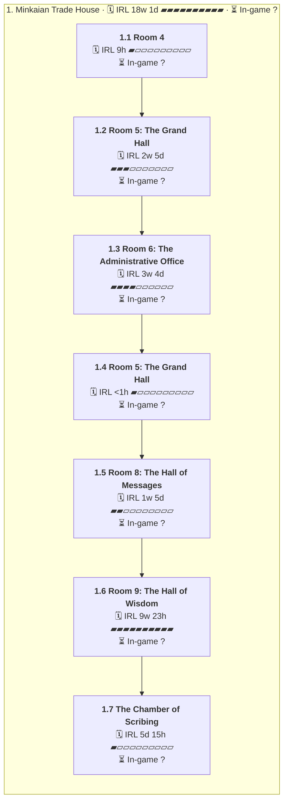

# C04 Magni Guard: Timeline

Where the party went, in order. Each outer box is an area, and each box inside it is a room or spot the party spent time in.

- 🗓️ **IRL** is measured from the first post there to the first post at the next place.
- ⏳ **In-game** time is filled in by the GM. An area's total appears once all of its rooms have one.

## 1. Minkaian Trade House

- 🗓️ **IRL:** 11 May 2026 to 15 Sep 2026, 18w 1d
- ⏳ **In-game:** not all rooms filled in

### 1.1 Room 4

- 🗓️ **IRL:** 11 May 2026 to 11 May 2026, 9h, 6 posts
- ⏳ **In-game:** not filled in (`"2026-05#1"` in `timelines/C04-Magni-Guard.json`)

**Events**

- 11 May: Báyakan listened at the next door, opened it and scanned the next room for danger. [↗](https://t.me/Path_Wars/76799/152451)
- 11 May: Natalia opened the door for Báyakan. [↗](https://t.me/Path_Wars/76799/152468)
- 11 May: Akuma took a breather. [↗](https://t.me/Path_Wars/76799/152491)
- 11 May: Nadya took a breather. [↗](https://t.me/Path_Wars/76799/152492)
- 11 May: Dart trap monster parts were added to the party stash for 30GP. [↗](https://t.me/Path_Wars/76799/152494)

### 1.2 Room 5: The Grand Hall

- 🗓️ **IRL:** 11 May 2026 to 26 May 2026, 2w 5d, 44 posts
- ⏳ **In-game:** not filled in (`"2026-05#7"` in `timelines/C04-Magni-Guard.json`)
- 💬 **Time said in posts:** "10 minutes"

**Events**

- 11 May: The door was opened revealing Room 5 with floorboards removed. [↗](https://t.me/Path_Wars/76799/152495)
- 11 May: Doopa said kobolds made a maze and warned to be careful. [↗](https://t.me/Path_Wars/76799/152498)
- 17 May: Changer said he was not nimble but was happy to proceed. [↗](https://t.me/Path_Wars/76799/154205)
- 24 May: Natalia cast Rousing Splash on willing party members. [↗](https://t.me/Path_Wars/76799/155522)
- 24 May: Changer stepped forward and the unfinished floor held. [↗](https://t.me/Path_Wars/76799/155706)
- 24 May: The party spent 10 minutes checking the door and found it was not trapped. [↗](https://t.me/Path_Wars/76799/155732)

### 1.3 Room 6: The Administrative Office

- 🗓️ **IRL:** 31 May 2026 to 25 Jun 2026, 3w 4d, 113 posts
- ⏳ **In-game:** not filled in (`"2026-05#51"` in `timelines/C04-Magni-Guard.json`)

**Events**

- 31 May: Changer opened the door. [↗](https://t.me/Path_Wars/76799/157229)
- 31 May: The Magni Guard approached the door collectively. [↗](https://t.me/Path_Wars/76799/157241)
- 31 May: The party saw a swarm of blood seekers feasting on corpses. [↗](https://t.me/Path_Wars/76799/157243)
- 31 May: Changer won initiative with 25. [↗](https://t.me/Path_Wars/144765/157249)
- 31 May: Three human bodies were found pierced and torn by blood seekers. [↗](https://t.me/Path_Wars/76799/157250)
- 31 May: The encounter was logged as Room 6 Administrative Office with allies acting first. [↗](https://t.me/Path_Wars/144765/157252)
- 02 Jun: Báyakan killed a bloodseeker with an ultrasonic pulse. [↗](https://t.me/Path_Wars/144765/158270)
- 03 Jun: The party killed the fourth bug and ended combat. [↗](https://t.me/Path_Wars/144765/158594)
- 07 Jun: The party noticed a key on one of the corpses. [↗](https://t.me/Path_Wars/76799/159492)
- 15 Jun: The party opened the safe and found 45 gold pieces. [↗](https://t.me/Path_Wars/76799/161471)
- 15 Jun: Báyakan noticed the toshigami statue was rigged to spew fire. [↗](https://t.me/Path_Wars/76799/161531)
- 16 Jun: Báyakan checked the next door for traps. [↗](https://t.me/Path_Wars/76799/161781)

### 1.4 Room 5: The Grand Hall

- 🗓️ **IRL:** 25 Jun 2026 to 25 Jun 2026, <1h, 5 posts
- ⏳ **In-game:** not filled in (`"2026-06#99"` in `timelines/C04-Magni-Guard.json`)

**Events**

- 25 Jun: The party returned to room 5. [↗](https://t.me/Path_Wars/76799/162994)
- 25 Jun: Báyakan noticed weak points where standing on the wood could cause a fall. [↗](https://t.me/Path_Wars/76799/162995)
- 25 Jun: The party walked across the hallway safely. [↗](https://t.me/Path_Wars/76799/163005)

### 1.5 Room 8: The Hall of Messages

- 🗓️ **IRL:** 25 Jun 2026 to 1 Jul 2026, 1w 5d, 20 posts
- ⏳ **In-game:** not filled in (`"2026-06#104"` in `timelines/C04-Magni-Guard.json`)

**Events**

- 25 Jun: The party stepped into room 8, the hall of messages. [↗](https://t.me/Path_Wars/76799/163008)
- 25 Jun: The party found four corpses laid under the tables. [↗](https://t.me/Path_Wars/76799/163011)
- 26 Jun: A medicine check confirmed the bodies were not workers and were not killed recently or here. [↗](https://t.me/Path_Wars/76799/163184)
- 27 Jun: Doopa said the bodies were new to him. [↗](https://t.me/Path_Wars/76799/163302)
- 29 Jun: Báyakan swept the immediate area for hazards. [↗](https://t.me/Path_Wars/76799/163838)
- 01 Jul: Changer said saving Magnimarian citizens lives was high priority. [↗](https://t.me/Path_Wars/76799/164236)
- 01 Jul: Changer stood at the doorway to await the party. [↗](https://t.me/Path_Wars/76799/164238)
- 01 Jul: Nadya tossed the bodies and stood ready to move on. [↗](https://t.me/Path_Wars/76799/164303)

### 1.6 Room 9: The Hall of Wisdom

- 🗓️ **IRL:** 8 Jul 2026 to 9 Sep 2026, 9w 23h, 95 posts
- ⏳ **In-game:** not filled in (`"2026-07#7"` in `timelines/C04-Magni-Guard.json`)

**Events**

- 08 Jul: The party moved onto room 9. [↗](https://t.me/Path_Wars/76799/165935)
- 08 Jul: The room contained bronze bells, cushions and sticky webbing. [↗](https://t.me/Path_Wars/76799/165940)
- 08 Jul: Báyakan noticed an untriggered snare hidden in the hallway doorway. [↗](https://t.me/Path_Wars/76799/165954)
- 30 Jul: The pulse revealed a female kobold scout on a spider mount hiding in the webbing. [↗](https://t.me/Path_Wars/76799/169053)
- 31 Jul: Báyakan warned about the kobold and snare and suggested a tough member go first. [↗](https://t.me/Path_Wars/76799/169333)
- 31 Jul: Changer offered to enter with a raised shield. [↗](https://t.me/Path_Wars/76799/169457)
- 10 Aug: Changer offered to go in first with his steel shield. [↗](https://t.me/Path_Wars/76799/171298)
- 26 Aug: Rex arrived in a breastplate as backup sent from the lieutenant. [↗](https://t.me/Path_Wars/76799/174951)
- 26 Aug: Nadya briefed Rex on the mission and avoiding deaths. [↗](https://t.me/Path_Wars/76799/174978)
- 26 Aug: Steele arrived in mixed leather and metal armor. [↗](https://t.me/Path_Wars/76799/175100)
- 26 Aug: Kitt introduced themselves as on assignment from the Chaplain Unit. [↗](https://t.me/Path_Wars/76799/175115)
- 27 Aug: Báyakan pointed out the snare trap and spider-mounted kobold across the threshold. [↗](https://t.me/Path_Wars/76799/175646)
- 02 Sep: detective attempted to disarm the snare with magical guidance. [↗](https://t.me/Path_Wars/76799/176693)
- 08 Sep: Steele introduced herself as Former Sergeant Steele of the Magnimar City Watch. [↗](https://t.me/Path_Wars/76799/177608)
- 09 Sep: party walked to the doorway. [↗](https://t.me/Path_Wars/76799/177912)
- 09 Sep: Changer warned of a kobold riding a spider and a snare hidden under rubbish. [↗](https://t.me/Path_Wars/76799/177915)
- 09 Sep: trap was disabled but a crossbow bolt was launched from above. [↗](https://t.me/Path_Wars/76799/177918)
- 09 Sep: party entered combat. [↗](https://t.me/Path_Wars/76799/177919)

### 1.7 The Chamber of Scribing

- 🗓️ **IRL:** 10 Sep 2026 to 15 Sep 2026, 5d 15h, 44 posts
- ⏳ **In-game:** not filled in (`"2026-09#20"` in `timelines/C04-Magni-Guard.json`)

**Events**

- 10 Sep: encounter Kobold and Spider Sneak Attack started in The Chamber of Scribing. [↗](https://t.me/Path_Wars/144765/178059)
- 10 Sep: Doopa introduced herself. [↗](https://t.me/Path_Wars/76799/178061)
- 10 Sep: Kitt restrained Kreski with a vine and raised a shield. [↗](https://t.me/Path_Wars/76799/178114)
- 13 Sep: damage to the spider was undone because it was 25 feet up on the wall. [↗](https://t.me/Path_Wars/144765/178664)
- 14 Sep: Margle took 8 damage from magic. [↗](https://t.me/Path_Wars/144765/178896)
- 14 Sep: kobold refused surrender saying they would not be slaves. [↗](https://t.me/Path_Wars/76799/179031)
