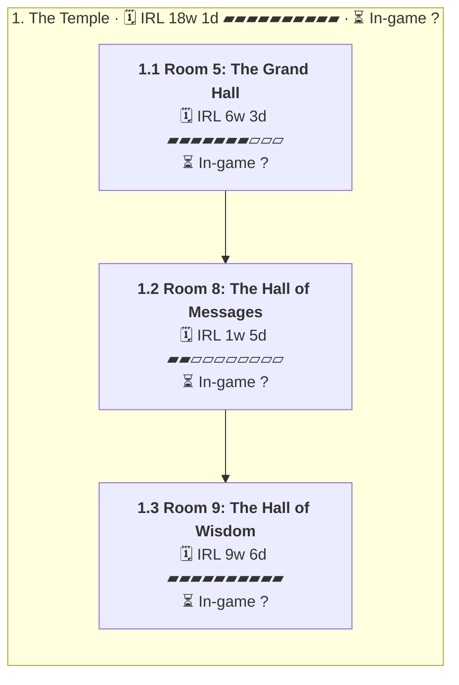

# C04 Magni Guard: Timeline

Where the party went, in order. Each outer box is an area, and each box inside it is a room or spot the party spent time in.

- 🗓️ **IRL** is measured from the first post there to the first post at the next place.
- ⏳ **In-game** time is filled in by the GM. An area's total appears once all of its rooms have one.

## 1. The Temple

- 🗓️ **IRL:** 11 May 2026 to 15 Sep 2026, 18w 1d
- ⏳ **In-game:** not all rooms filled in

### 1.1 Room 5: The Grand Hall

- 🗓️ **IRL:** 11 May 2026 to 25 Jun 2026, 6w 3d, 168 posts
- ⏳ **In-game:** not filled in (`"2026-05#1"` in `timelines/C04-Magni-Guard.json`)

**Events**

- 11 May: Báyakan listened at the door and opened it. [↗](https://t.me/Path_Wars/76799/152451)
- 11 May: Dart trap monster parts were added to the party stash. [↗](https://t.me/Path_Wars/76799/152494)
- 11 May: The party entered room 5, The Grand Hall of the Temple. [↗](https://t.me/Path_Wars/76799/152495)
- 11 May: Doopa talked about the maze they made. [↗](https://t.me/Path_Wars/76799/152498)
- 24 May: Natalia cast Rousing Splash on party members. [↗](https://t.me/Path_Wars/76799/155522)
- 24 May: Changer stepped onto the unfinished floor and it held. [↗](https://t.me/Path_Wars/76799/155693)
- 31 May: Changer opened the door to reveal a swarm of blood seekers feasting on corpses. [↗](https://t.me/Path_Wars/76799/157229)
- 31 May: Combat started against the blood seekers. [↗](https://t.me/Path_Wars/76799/157245)
- 02 Jun: Chase killed a blood seeker with a pulse of sound. [↗](https://t.me/Path_Wars/144765/158270)
- 03 Jun: Akuma killed the final bug to end combat. [↗](https://t.me/Path_Wars/144765/158593)
- 07 Jun: The party found a key on one of the human worker corpses. [↗](https://t.me/Path_Wars/76799/159492)
- 15 Jun: The party opened the safe and found 45 gold pieces. [↗](https://t.me/Path_Wars/76799/161471)
- 15 Jun: Bayakan noticed that the statue of the antlered old woman was rigged to spew fire. [↗](https://t.me/Path_Wars/76799/161531)
- 25 Jun: Bayakan noticed several points where standing on the wood could result in a fall. [↗](https://t.me/Path_Wars/76799/162995)
- 25 Jun: The party walked across the hallway safely. [↗](https://t.me/Path_Wars/76799/163005)

### 1.2 Room 8: The Hall of Messages

- 🗓️ **IRL:** 25 Jun 2026 to 1 Jul 2026, 1w 5d, 20 posts
- ⏳ **In-game:** not filled in (`"2026-06#104"` in `timelines/C04-Magni-Guard.json`)

**Events**

- 26 Jun: Nadya examined the bodies and confirmed they were dead and not killed recently. [↗](https://t.me/Path_Wars/76799/163184)
- 01 Jul: Changer discussed saving Magnimarian citizens. [↗](https://t.me/Path_Wars/76799/164236)
- 01 Jul: Changer stated he would await the party at the door. [↗](https://t.me/Path_Wars/76799/164237)
- 01 Jul: Changer stood at the doorway. [↗](https://t.me/Path_Wars/76799/164238)
- 01 Jul: Nadya briefly tossed the bodies and stood ready to move on. [↗](https://t.me/Path_Wars/76799/164303)

### 1.3 Room 9: The Hall of Wisdom

- 🗓️ **IRL:** 8 Jul 2026 to 15 Sep 2026, 9w 6d, 139 posts
- ⏳ **In-game:** not filled in (`"2026-07#7"` in `timelines/C04-Magni-Guard.json`)

**Events**

- 08 Jul: The party moved onto room 9. [↗](https://t.me/Path_Wars/76799/165935)
- 08 Jul: A plaque named room 9 as the hall of wisdom. [↗](https://t.me/Path_Wars/76799/165936)
- 08 Jul: Báyakan Tiktik rolled 20 on a perception check. [↗](https://t.me/Path_Wars/76799/165945)
- 08 Jul: Báyakan Tiktik succeeded VS DC 19. [↗](https://t.me/Path_Wars/76799/165953)
- 10 Jul: Chase Darkthorne pointed out the snare and sent an ultrasonic pulse into the webbed area. [↗](https://t.me/Path_Wars/76799/166238)
- 30 Jul: A female kobold scout on her spider mount was revealed hiding in the webbing. [↗](https://t.me/Path_Wars/76799/169053)
- 31 Jul: Báyakan suggested someone physically tough go through first. [↗](https://t.me/Path_Wars/76799/169333)
- 03 Aug: Changer expressed a desire for a structural change after the mission. [↗](https://t.me/Path_Wars/76799/170113)
- 26 Aug: Rex arrived at the room as backup sent from the lieutenant. [↗](https://t.me/Path_Wars/76799/174951)
- 26 Aug: Changer pointed down the hallway toward the opponents. [↗](https://t.me/Path_Wars/76799/174961)
- 26 Aug: Steele arrived at the scene as a former sergeant of the Magnimar City Guard. [↗](https://t.me/Path_Wars/76799/175100)
- 26 Aug: Kitt introduced themselves as being on assignment from the Chaplain Unit. [↗](https://t.me/Path_Wars/76799/175115)
- 26 Aug: Rex cautiously walked into the doorway. [↗](https://t.me/Path_Wars/76799/175623)
- 27 Aug: Chase Darkthorne noted the snare trap across the threshold and the spider mounted kobold. [↗](https://t.me/Path_Wars/76799/175646)
- 02 Sep: Chase Darkthorne disarmed a snare trap in the doorway. [↗](https://t.me/Path_Wars/76799/176693)
- 09 Sep: A crossbow bolt was launched at Chase when the trap was disabled. [↗](https://t.me/Path_Wars/76799/177918)
- 10 Sep: Combat started against the kobold and spider in the chamber. [↗](https://t.me/Path_Wars/144765/178059)
- 10 Sep: Kitt restricted the kobold Kreski's movement with a tangle vine. [↗](https://t.me/Path_Wars/76799/178114)
- 14 Sep: Chase Darkthorne cast a spell dealing damage to the spider Margle. [↗](https://t.me/Path_Wars/144765/178895)
- 14 Sep: Rex shot the spider Margle with a crossbow for 3 damage. [↗](https://t.me/Path_Wars/144765/178902)
