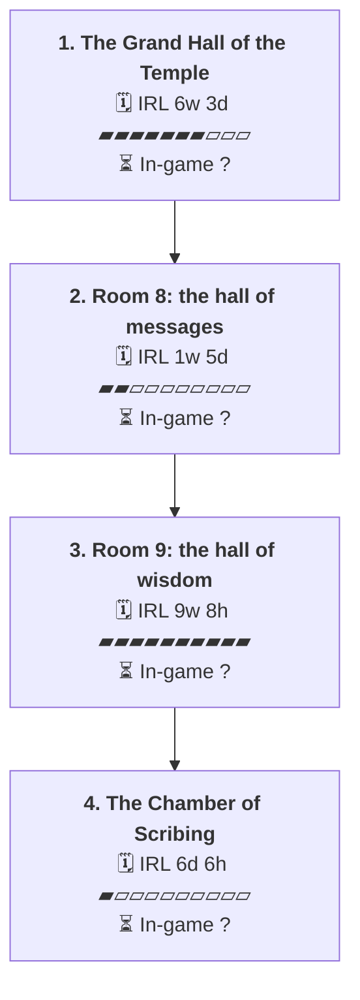

# C04 Magni Guard: Timeline

Where the party went, in order. Each box is one visit to a place.

- 🗓️ **IRL** is measured from the first post there to the first post at the next place.
- ⏳ **In-game** time is filled in by the GM.

## 1. The Grand Hall of the Temple

- 🗓️ **IRL:** 11 May 2026 to 25 Jun 2026, 6w 3d, 168 posts
- ⏳ **In-game:** not filled in (`"2026-05#1"` in `timelines/C04-Magni-Guard.json`)

**Events**

- 11 May: Báyakan listens at the door and opens it. [↗](https://t.me/Path_Wars/76799/152451)
- 11 May: Natalia opens the door for Báyakan. [↗](https://t.me/Path_Wars/76799/152468)
- 11 May: The DART TRAP monster parts are added to the party stash. [↗](https://t.me/Path_Wars/76799/152494)
- 11 May: The door is opened to reveal room 5: The Grand Hall of the Temple. [↗](https://t.me/Path_Wars/76799/152495)
- 11 May: Doopa claims they made a maze. [↗](https://t.me/Path_Wars/76799/152498)
- 13 May: Nadya questions Doopa about the maze construction. [↗](https://t.me/Path_Wars/76799/153414)
- 24 May: Natalia casts Rousing Splash on party members. [↗](https://t.me/Path_Wars/76799/155522)
- 24 May: Changer accepts the rousing splash. [↗](https://t.me/Path_Wars/76799/155547)
- 24 May: Changer takes a step forward onto the unfinished floor. [↗](https://t.me/Path_Wars/76799/155693)
- 24 May: Nadya carefully follows Changer and directs his movements. [↗](https://t.me/Path_Wars/76799/155721)
- 24 May: The party determines the door is not trapped after a check. [↗](https://t.me/Path_Wars/76799/155732)
- 31 May: Changer opens the door. [↗](https://t.me/Path_Wars/76799/157229)
- 31 May: The party sees a swarm of blood seekers feasting on corpses and combat begins. [↗](https://t.me/Path_Wars/76799/157243)
- 31 May: Changer wins initiative for the encounter. [↗](https://t.me/Path_Wars/144765/157249)
- 02 Jun: The party defeats the blood seekers in combat. [↗](https://t.me/Path_Wars/144765/158270)
- 03 Jun: Monster parts are added to the group stash. [↗](https://t.me/Path_Wars/144765/158598)
- 07 Jun: The party investigates the blood seeker corpses and finds a key, a safe, a bottle of rare sake, and a bejewelled brooch. [↗](https://t.me/Path_Wars/76799/159490)
- 07 Jun: The party explores the eastern section containing the hall of Kami and discovers a charred corpse near a booby-trapped statue. [↗](https://t.me/Path_Wars/76799/159498)
- 15 Jun: The party opens the safe and finds 45 gold pieces. [↗](https://t.me/Path_Wars/76799/161471)
- 25 Jun: Bayakan notices several hazardous points on the wooden floor where a fall could occur. [↗](https://t.me/Path_Wars/76799/162995)
- 25 Jun: The party safely walks across the hallway. [↗](https://t.me/Path_Wars/76799/163005)

## 2. Room 8: the hall of messages

- 🗓️ **IRL:** 25 Jun 2026 to 1 Jul 2026, 1w 5d, 20 posts
- ⏳ **In-game:** not filled in (`"2026-06#104"` in `timelines/C04-Magni-Guard.json`)

**Events**

- 25 Jun: The party enters the hall of messages containing angled sand tables and four arrow-studded corpses. [↗](https://t.me/Path_Wars/76799/163007)
- 26 Jun: Nadya and Doopa examine the corpses, confirming they are dead, not recent, and not workers. [↗](https://t.me/Path_Wars/76799/163184)
- 01 Jul: The GM noted Changer wanted to save Magnimarian citizens and would await at the door. [↗](https://t.me/Path_Wars/76799/164236)
- 01 Jul: Changer stood at the doorway. [↗](https://t.me/Path_Wars/76799/164238)
- 01 Jul: Nadya briefly tossed the bodies and stood ready to move on. [↗](https://t.me/Path_Wars/76799/164303)

## 3. Room 9: the hall of wisdom

- 🗓️ **IRL:** 8 Jul 2026 to 8 Sep 2026, 9w 8h, 85 posts
- ⏳ **In-game:** not filled in (`"2026-07#7"` in `timelines/C04-Magni-Guard.json`)

**Events**

- 08 Jul: The party moved onto room 9. [↗](https://t.me/Path_Wars/76799/165935)
- 08 Jul: A plaque named room 9 as the hall of wisdom. [↗](https://t.me/Path_Wars/76799/165936)
- 08 Jul: Báyakan Tiktik succeeded VS DC 19 on a perception check. [↗](https://t.me/Path_Wars/76799/165953)
- 10 Jul: Chase Darkthorne pointed out the snare and sent an ultrasonic pulse into the webbed area. [↗](https://t.me/Path_Wars/76799/166238)
- 30 Jul: A female kobold scout on her spider mount was revealed hiding in the webbing. [↗](https://t.me/Path_Wars/76799/169053)
- 03 Aug: Changer expressed that his form was not built for physical confrontation. [↗](https://t.me/Path_Wars/76799/170113)
- 26 Aug: Rex arrived as backup sent from the lieutenant. [↗](https://t.me/Path_Wars/76799/174951)
- 26 Aug: Steele arrived at the scene wearing armor and a mix of leather and metal. [↗](https://t.me/Path_Wars/76799/175100)
- 26 Aug: Kitt introduced himself as being on assignment from the Chaplain Unit. [↗](https://t.me/Path_Wars/76799/175115)
- 26 Aug: Rex cautiously walked into the doorway. [↗](https://t.me/Path_Wars/76799/175623)
- 27 Aug: Chase Darkthorne pointed out a snare trap across the threshold and a spider mounted kobold lurking above. [↗](https://t.me/Path_Wars/76799/175646)
- 02 Sep: Chase Darkthorne reaches for his tool kit, uses magic, and attempts to disarm a snare. [↗](https://t.me/Path_Wars/76799/176693)
- 07 Sep: Changer mentions cold storage facilities back at base. [↗](https://t.me/Path_Wars/76799/177445)
- 07 Sep: Changer introduces himself as an assistant officer of the Magni Guard. [↗](https://t.me/Path_Wars/76799/177491)
- 07 Sep: Changer states saving hostages and apprehending criminals is the top priority. [↗](https://t.me/Path_Wars/76799/177492)
- 07 Sep: Changer mentions backup integration based on performance output. [↗](https://t.me/Path_Wars/76799/177493)
- 07 Sep: Changer notes standard Magni Guard training for non-lethal blows. [↗](https://t.me/Path_Wars/76799/177494)
- 07 Sep: Changer asks Officer Nadya if mentioning the zoo helps the investigation. [↗](https://t.me/Path_Wars/76799/177495)
- 07 Sep: Changer comments on zoo occupants requiring direct confrontation. [↗](https://t.me/Path_Wars/76799/177496)
- 08 Sep: Alastair Tan states former Sergeant Steele's background in the Magnimar City Watch. [↗](https://t.me/Path_Wars/76799/177608)

## 4. The Chamber of Scribing

- 🗓️ **IRL:** 9 Sep 2026 to 15 Sep 2026, 6d 6h, 54 posts
- ⏳ **In-game:** not filled in (`"2026-09#10"` in `timelines/C04-Magni-Guard.json`)

**Events**

- 09 Sep: The party walks to the doorway before story progression pauses. [↗](https://t.me/Path_Wars/76799/177912)
- 09 Sep: Changer asks to state rank. [↗](https://t.me/Path_Wars/76799/177913)
- 09 Sep: Changer raises a nonexistent shield. [↗](https://t.me/Path_Wars/76799/177914)
- 09 Sep: Changer warns about a kobold riding a spider and a hidden snare. [↗](https://t.me/Path_Wars/76799/177915)
- 09 Sep: Changer notes defusing the snare will trigger a foe attack. [↗](https://t.me/Path_Wars/76799/177917)
- 09 Sep: A trap is disabled, and a crossbow bolt is launched from above. [↗](https://t.me/Path_Wars/76799/177918)
- 09 Sep: Combat begins. [↗](https://t.me/Path_Wars/76799/177919)
- 09 Sep: Alastair Tan notes a low initiative roll. [↗](https://t.me/Path_Wars/144765/177930)
- 09 Sep: Steele is startled by the bolt before composing herself. [↗](https://t.me/Path_Wars/76799/177931)
- 10 Sep: Bayakan Tiktik wins initiative, disables the snare, and takes 7 damage from a kobold scout. [↗](https://t.me/Path_Wars/144765/178059)
- 10 Sep: Changer strides forward, uses telekinetic projectile, and deals 6 damage making Kreski bloodied. [↗](https://t.me/Path_Wars/144765/178060)
- 10 Sep: Doopa the kobold says hello. [↗](https://t.me/Path_Wars/76799/178061)
- 10 Sep: Changer lands a blow and tells the kobold to surrender to the Magni Guard. [↗](https://t.me/Path_Wars/76799/178062)
- 10 Sep: Doopa yells for Kreski to give up. [↗](https://t.me/Path_Wars/76799/178063)
- 10 Sep: The GM lists unacted and acted allies for round one. [↗](https://t.me/Path_Wars/144765/178064)
- 10 Sep: Alastair Tan outlines an action plan involving movement, snagging strike with a sap, and a second strike. [↗](https://t.me/Path_Wars/144765/178096)
- 10 Sep: Alastair Tan rolls a success dealing 4 nonlethal bludgeoning damage. [↗](https://t.me/Path_Wars/144765/178097)
- 10 Sep: Alastair Tan's second strike misses. [↗](https://t.me/Path_Wars/144765/178098)
- 10 Sep: Ryo Yamakawa uses tangle vine and raises a shield. [↗](https://t.me/Path_Wars/144765/178103)
- 10 Sep: Kitt restricts kobold Kreski's movement with a vine and raises a shield. [↗](https://t.me/Path_Wars/76799/178114)
- 10 Sep: Steele steps forward with her sap, strikes the spider, grabs the mount, and misses her next strike. [↗](https://t.me/Path_Wars/76799/178115)
- 12 Sep: Cannon McMahon heals Bayakan and gives temp hp. [↗](https://t.me/Path_Wars/144765/178375)
- 13 Sep: Margle the spider takes 4 damage. [↗](https://t.me/Path_Wars/144765/178654)
- 13 Sep: Mangle is applied imposing a speed penalty for 1 round. [↗](https://t.me/Path_Wars/144765/178662)
- 13 Sep: The GM questions how the spider is being hit 25 feet up on a wall web. [↗](https://t.me/Path_Wars/144765/178663)
- 13 Sep: The GM undoes 4 damage because the spider cannot be hit with a sap. [↗](https://t.me/Path_Wars/144765/178664)
- 13 Sep: Kitt raises a shield against the kobold and spider mount. [↗](https://t.me/Path_Wars/144765/178679)
- 13 Sep: Kreski panics as mangle becomes unsteady. [↗](https://t.me/Path_Wars/76799/178684)
- 13 Sep: Kreski tells Mangle to calm down in draconic. [↗](https://t.me/Path_Wars/76799/178685)
- 13 Sep: Kreski and Mangle are positioned 25 feet up the wall. [↗](https://t.me/Path_Wars/76799/178686)
- 13 Sep: Rex strides twice to flank Kreski and misses his mace strike. [↗](https://t.me/Path_Wars/144765/178704)
- 13 Sep: Rex enters a rage, strides to flank Kreski, misses, and comments on the slippery target. [↗](https://t.me/Path_Wars/76799/178711)
- 14 Sep: Chase Darkthorne takes medicine from Nadya, casts magic missile at the spider, and pulls back. [↗](https://t.me/Path_Wars/144765/178895)
- 14 Sep: Margle takes 8 damage. [↗](https://t.me/Path_Wars/144765/178896)
- 14 Sep: Margle becomes bloodied. [↗](https://t.me/Path_Wars/144765/178897)
- 14 Sep: Volf retcons an action to stride and shoot Margle with a crossbow for 3 damage. [↗](https://t.me/Path_Wars/144765/178902)
- 14 Sep: Volf pushes past people into the room and shoots at the spider. [↗](https://t.me/Path_Wars/76799/178903)
- 14 Sep: Alastair Tan retcons actions to stride, demoralise Kreski, and do nothing. [↗](https://t.me/Path_Wars/144765/178937)
- 14 Sep: Steele marches in, shouts a warning to surrender, and draws her longsword. [↗](https://t.me/Path_Wars/76799/178938)
- 14 Sep: Margle takes 3 damage. [↗](https://t.me/Path_Wars/144765/179001)
- 14 Sep: The kobold screeches back in draconic refusing to be slaves. [↗](https://t.me/Path_Wars/76799/179031)
- 15 Sep: Captain Vex Ashburn takes damage from injury echo and plasma caster. [↗](https://t.me/Path_Wars/144765/179418)
