# C04b Magni Watch: Timeline

Where the party went, in order. Each outer box is an area, and each box inside it is a room or spot the party spent time in.

- 🗓️ **IRL** is measured from the first post there to the first post at the next place.
- ⏳ **In-game** time is filled in by the GM. An area's total appears once all of its rooms have one.

```mermaid
flowchart TD
    subgraph a0["1. Before play · 🗓️ IRL 2w 1d ▰▱▱▱▱▱▱▱▱▱ · ⏳ In-game ?"]
    direction TB
        v0["<b>1.1 Setup posts</b><br/>🗓️ IRL 2w 1d ▰▰▰▱▱▱▱▱▱▱<br/>⏳ In-game ?"]
    end
    subgraph a1["2. Lavarsus's office · 🗓️ IRL 4w 3d ▰▰▱▱▱▱▱▱▱▱ · ⏳ In-game ?"]
    direction TB
        v1["<b>2.1 Lavarsus's office</b><br/>🗓️ IRL 4w 3d ▰▰▰▰▰▰▰▱▱▱<br/>⏳ In-game ?"]
    end
    subgraph a2["3. Location not stated · 🗓️ IRL 1w 3d ▰▱▱▱▱▱▱▱▱▱ · ⏳ In-game ?"]
    direction TB
        v2["<b>3.1 Not stated</b><br/>🗓️ IRL 1w 3d ▰▰▱▱▱▱▱▱▱▱<br/>⏳ In-game ?"]
    end
    subgraph a3["4. The tipsy tenth · 🗓️ IRL 6d 16h ▰▱▱▱▱▱▱▱▱▱ · ⏳ In-game ?"]
    direction TB
        v3["<b>4.1 The tipsy tenth</b><br/>🗓️ IRL 6d 16h ▰▱▱▱▱▱▱▱▱▱<br/>⏳ In-game ?"]
    end
    subgraph a4["5. Lavarsus's office · 🗓️ IRL 5d 11h ▰▱▱▱▱▱▱▱▱▱ · ⏳ In-game ?"]
    direction TB
        v4["<b>5.1 Lavarsus's office</b><br/>🗓️ IRL 5d 11h ▰▱▱▱▱▱▱▱▱▱<br/>⏳ In-game ?"]
    end
    subgraph a5["6. The tipsy tenth · 🗓️ IRL 2d 21h ▰▱▱▱▱▱▱▱▱▱ · ⏳ In-game ?"]
    direction TB
        v5["<b>6.1 The tipsy tenth</b><br/>🗓️ IRL 2d 21h ▰▱▱▱▱▱▱▱▱▱<br/>⏳ In-game ?"]
    end
    subgraph a6["7. Lavarsus's office · 🗓️ IRL 1w 2d ▰▱▱▱▱▱▱▱▱▱ · ⏳ In-game ?"]
    direction TB
        v6["<b>7.1 Lavarsus's office</b><br/>🗓️ IRL 1w 2d ▰▰▱▱▱▱▱▱▱▱<br/>⏳ In-game ?"]
    end
    subgraph a7["8. Lower Dockway · 🗓️ IRL 5w 22h ▰▰▰▱▱▱▱▱▱▱ · ⏳ In-game ?"]
    direction TB
        v7["<b>8.1 Food stalls</b><br/>🗓️ IRL 5w 22h ▰▰▰▰▰▰▰▰▱▱<br/>⏳ In-game ?"]
    end
    subgraph a8["9. Lowcleft district · 🗓️ IRL 1w 3h ▰▱▱▱▱▱▱▱▱▱ · ⏳ In-game ?"]
    direction TB
        v8["<b>9.1 Lowcleft district</b><br/>🗓️ IRL 1w 3h ▰▰▱▱▱▱▱▱▱▱<br/>⏳ In-game ?"]
    end
    subgraph a9["10. Dock · 🗓️ IRL 2d ▰▱▱▱▱▱▱▱▱▱ · ⏳ In-game ?"]
    direction TB
        v9["<b>10.1 Dock</b><br/>🗓️ IRL 2d ▰▱▱▱▱▱▱▱▱▱<br/>⏳ In-game ?"]
    end
    subgraph a10["11. Porphyry's Equipment for Evokers · 🗓️ IRL 3d 4h ▰▱▱▱▱▱▱▱▱▱ · ⏳ In-game ?"]
    direction TB
        v10["<b>11.1 Porphyry's Equipment for Evokers</b><br/>🗓️ IRL 3d 4h ▰▱▱▱▱▱▱▱▱▱<br/>⏳ In-game ?"]
    end
    subgraph a11["12. Magnimar Zoo · 🗓️ IRL 9w 1d ▰▰▰▰▰▱▱▱▱▱ · ⏳ In-game ?"]
    direction TB
        v11["<b>12.1 Marketplace</b><br/>🗓️ IRL 1w 3d ▰▰▱▱▱▱▱▱▱▱<br/>⏳ In-game ?"]
        v12["<b>12.2 Snack shop</b><br/>🗓️ IRL 4d 3h ▰▱▱▱▱▱▱▱▱▱<br/>⏳ In-game ?"]
        v13["<b>12.3 Black smith</b><br/>🗓️ IRL 2w 6d ▰▰▰▰▰▱▱▱▱▱<br/>⏳ In-game ?"]
        v14["<b>12.4 Penguin exhibit</b><br/>🗓️ IRL 2d 10h ▰▱▱▱▱▱▱▱▱▱<br/>⏳ In-game ?"]
        v15["<b>12.5 Owlbear exhibit</b><br/>🗓️ IRL <1h ▰▱▱▱▱▱▱▱▱▱<br/>⏳ In-game ?"]
        v16["<b>12.6 South Hall</b><br/>🗓️ IRL 5d ▰▱▱▱▱▱▱▱▱▱<br/>⏳ In-game ?"]
        v17["<b>12.7 Reptile room</b><br/>🗓️ IRL 5d 1h ▰▱▱▱▱▱▱▱▱▱<br/>⏳ In-game ?"]
        v18["<b>12.8 Manager's office</b><br/>🗓️ IRL 1w 14h ▰▰▱▱▱▱▱▱▱▱<br/>⏳ In-game ?"]
        v19["<b>12.9 Wagons</b><br/>🗓️ IRL <1h ▰▱▱▱▱▱▱▱▱▱<br/>⏳ In-game ?"]
        v20["<b>12.10 Rust monster exhibit</b><br/>🗓️ IRL <1h ▰▱▱▱▱▱▱▱▱▱<br/>⏳ In-game ?"]
        v21["<b>12.11 Crystal ankhrav enclosure</b><br/>🗓️ IRL 1d 11h ▰▱▱▱▱▱▱▱▱▱<br/>⏳ In-game ?"]
        v22["<b>12.12 Supply shed</b><br/>🗓️ IRL 1w 1d ▰▰▱▱▱▱▱▱▱▱<br/>⏳ In-game ?"]
    end
    subgraph a12["13. Arvensoar · 🗓️ IRL <1h ▰▱▱▱▱▱▱▱▱▱ · ⏳ In-game ?"]
    direction TB
        v23["<b>13.1 Office</b><br/>🗓️ IRL <1h ▰▱▱▱▱▱▱▱▱▱<br/>⏳ In-game ?"]
        v24["<b>13.2 Arvensoar</b><br/>🗓️ IRL <1h ▰▱▱▱▱▱▱▱▱▱<br/>⏳ In-game ?"]
    end
    subgraph a13["14. Cosy stone house · 🗓️ IRL <1h ▰▱▱▱▱▱▱▱▱▱ · ⏳ In-game ?"]
    direction TB
        v25["<b>14.1 Cosy stone house</b><br/>🗓️ IRL <1h ▰▱▱▱▱▱▱▱▱▱<br/>⏳ In-game ?"]
    end
    subgraph a14["15. Arvensoar · 🗓️ IRL 1d 9h ▰▱▱▱▱▱▱▱▱▱ · ⏳ In-game ?"]
    direction TB
        v26["<b>15.1 Office</b><br/>🗓️ IRL 1d 9h ▰▱▱▱▱▱▱▱▱▱<br/>⏳ In-game ?"]
    end
    subgraph a15["16. Lowcleft district · 🗓️ IRL 2d 19h ▰▱▱▱▱▱▱▱▱▱ · ⏳ In-game ?"]
    direction TB
        v27["<b>16.1 Den</b><br/>🗓️ IRL 1h ▰▱▱▱▱▱▱▱▱▱<br/>⏳ In-game ?"]
        v28["<b>16.2 Long thin stone room</b><br/>🗓️ IRL 2d 17h ▰▱▱▱▱▱▱▱▱▱<br/>⏳ In-game ?"]
    end
    subgraph a16["17. Arvensoar · 🗓️ IRL 11h ▰▱▱▱▱▱▱▱▱▱ · ⏳ In-game ?"]
    direction TB
        v29["<b>17.1 Office</b><br/>🗓️ IRL 11h ▰▱▱▱▱▱▱▱▱▱<br/>⏳ In-game ?"]
    end
    subgraph a17["18. Lowcleft district · 🗓️ IRL 2w 17h ▰▱▱▱▱▱▱▱▱▱ · ⏳ In-game ?"]
    direction TB
        v30["<b>18.1 Long thin stone room</b><br/>🗓️ IRL 11h ▰▱▱▱▱▱▱▱▱▱<br/>⏳ In-game ?"]
        v31["<b>18.2 Street</b><br/>🗓️ IRL 2w 7h ▰▰▰▱▱▱▱▱▱▱<br/>⏳ In-game ?"]
    end
    subgraph a18["19. Dockway · 🗓️ IRL <1h ▰▱▱▱▱▱▱▱▱▱ · ⏳ In-game ?"]
    direction TB
        v32["<b>19.1 Dockway</b><br/>🗓️ IRL <1h ▰▱▱▱▱▱▱▱▱▱<br/>⏳ In-game ?"]
    end
    subgraph a19["20. Cosy stone house · 🗓️ IRL 2w 22h ▰▱▱▱▱▱▱▱▱▱ · ⏳ In-game ?"]
    direction TB
        v33["<b>20.1 Cosy stone house</b><br/>🗓️ IRL 2w 22h ▰▰▰▱▱▱▱▱▱▱<br/>⏳ In-game ?"]
    end
    subgraph a20["21. Carriage · 🗓️ IRL <1h ▰▱▱▱▱▱▱▱▱▱ · ⏳ In-game ?"]
    direction TB
        v34["<b>21.1 Carriage</b><br/>🗓️ IRL <1h ▰▱▱▱▱▱▱▱▱▱<br/>⏳ In-game ?"]
    end
    subgraph a21["22. Large manor house · 🗓️ IRL 22h ▰▱▱▱▱▱▱▱▱▱ · ⏳ In-game ?"]
    direction TB
        v35["<b>22.1 Garden</b><br/>🗓️ IRL 22h ▰▱▱▱▱▱▱▱▱▱<br/>⏳ In-game ?"]
    end
    subgraph a22["23. Stone room · 🗓️ IRL 3w 4d ▰▰▱▱▱▱▱▱▱▱ · ⏳ In-game ?"]
    direction TB
        v36["<b>23.1 Stone room</b><br/>🗓️ IRL 3w 4d ▰▰▰▰▰▰▱▱▱▱<br/>⏳ In-game ?"]
    end
    subgraph a23["24. Infirmary · 🗓️ IRL 2w 4d ▰▱▱▱▱▱▱▱▱▱ · ⏳ In-game ?"]
    direction TB
        v37["<b>24.1 Infirmary</b><br/>🗓️ IRL 2w 4d ▰▰▰▰▱▱▱▱▱▱<br/>⏳ In-game ?"]
    end
    subgraph a24["25. Lavarsus's office · 🗓️ IRL 6d 9h ▰▱▱▱▱▱▱▱▱▱ · ⏳ In-game ?"]
    direction TB
        v38["<b>25.1 Lavarsus's office</b><br/>🗓️ IRL 6d 9h ▰▱▱▱▱▱▱▱▱▱<br/>⏳ In-game ?"]
    end
    subgraph a25["26. Location not stated · 🗓️ IRL 2w 3d ▰▱▱▱▱▱▱▱▱▱ · ⏳ In-game ?"]
    direction TB
        v39["<b>26.1 Not stated</b><br/>🗓️ IRL 2w 3d ▰▰▰▰▱▱▱▱▱▱<br/>⏳ In-game ?"]
    end
    subgraph a26["27. Dockway · 🗓️ IRL 1d 20h ▰▱▱▱▱▱▱▱▱▱ · ⏳ In-game ?"]
    direction TB
        v40["<b>27.1 Dockway entrance, northeast corner</b><br/>🗓️ IRL 1d 20h ▰▱▱▱▱▱▱▱▱▱<br/>⏳ In-game ?"]
    end
    subgraph a27["28. Minkaian Trade House · 🗓️ IRL 18w 6d ▰▰▰▰▰▰▰▰▰▰ · ⏳ In-game ?"]
    direction TB
        v41["<b>28.1 Construction site</b><br/>🗓️ IRL 3w 1d ▰▰▰▰▰▱▱▱▱▱<br/>⏳ In-game ?"]
        v42["<b>28.2 Front stairs</b><br/>🗓️ IRL 4w 5d ▰▰▰▰▰▰▰▱▱▱<br/>⏳ In-game ?"]
        v43["<b>28.3 Top of building</b><br/>🗓️ IRL <1h ▰▱▱▱▱▱▱▱▱▱<br/>⏳ In-game ?"]
        v44["<b>28.4 1st floor</b><br/>🗓️ IRL 4d 16h ▰▱▱▱▱▱▱▱▱▱<br/>⏳ In-game ?"]
        v45["<b>28.5 Fountain room</b><br/>🗓️ IRL 6w 3d ▰▰▰▰▰▰▰▰▰▰<br/>⏳ In-game ?"]
        v46["<b>28.6 Open-air garden walkway</b><br/>🗓️ IRL 5d 9h ▰▱▱▱▱▱▱▱▱▱<br/>⏳ In-game ?"]
        v47["<b>28.7 Room 4</b><br/>🗓️ IRL 2w 6d ▰▰▰▰▰▱▱▱▱▱<br/>⏳ In-game ?"]
    end
    v0 --> v1
    v1 --> v2
    v2 --> v3
    v3 --> v4
    v4 --> v5
    v5 --> v6
    v6 --> v7
    v7 --> v8
    v8 --> v9
    v9 --> v10
    v10 --> v11
    v11 --> v12
    v12 --> v13
    v13 --> v14
    v14 --> v15
    v15 --> v16
    v16 --> v17
    v17 --> v18
    v18 --> v19
    v19 --> v20
    v20 --> v21
    v21 --> v22
    v22 --> v23
    v23 --> v24
    v24 --> v25
    v25 --> v26
    v26 --> v27
    v27 --> v28
    v28 --> v29
    v29 --> v30
    v30 --> v31
    v31 --> v32
    v32 --> v33
    v33 --> v34
    v34 --> v35
    v35 --> v36
    v36 --> v37
    v37 --> v38
    v38 --> v39
    v39 --> v40
    v40 --> v41
    v41 --> v42
    v42 --> v43
    v43 --> v44
    v44 --> v45
    v45 --> v46
    v46 --> v47
```

## 1. Before play

- 🗓️ **IRL:** 4 Mar 2025 to 9 Mar 2025, 2w 1d
- ⏳ **In-game:** not all rooms filled in

### 1.1 Setup posts

- 🗓️ **IRL:** 4 Mar 2025 to 9 Mar 2025, 2w 1d, 2 posts
- ⏳ **In-game:** not filled in (`"2025-03#1"` in `timelines/C04b-Magni-Watch.json`)

**Events**

- 04 Mar: GM introduced the premise that the party were the police.
- 09 Mar: GM described Lieutenant Lavarsus's appearance.

## 2. Lavarsus's office

- 🗓️ **IRL:** 19 Mar 2025 to 19 Apr 2025, 4w 3d
- ⏳ **In-game:** not all rooms filled in

### 2.1 Lavarsus's office

- 🗓️ **IRL:** 19 Mar 2025 to 19 Apr 2025, 4w 3d, 36 posts
- ⏳ **In-game:** not filled in (`"2025-03#3"` in `timelines/C04b-Magni-Watch.json`)

**Events**

- 19 Mar: Group gathered in Lavarsus's office to sign contract and receive badge and equipment.
- 20 Mar: Nadya entered the office late in an improperly worn uniform.
- 22 Mar: Lysandra watched from the window and shook her head at Nadya.
- 23 Mar: Nadya drank from a vial and complained about the windows.
- 24 Mar: Lavarsus lit his cigar while he awaited the rest of the group.
- 25 Mar: Lavarsus spoke of Korvosa with disdain.
- 13 Apr: Lieutenant Lavarsus put on coffee while awaiting the late captain.
- 14 Apr: The potfox made beverages for the group.
- 18 Apr: Zilde EvenGuard arrived late and apologized.
- 19 Apr: Lieutenant Lavarsus issued special magical badges that fine criminals.
- 19 Apr: Lieutenant Lavarsus warned the group not to misuse the badges.
- 19 Apr: Lieutenant Lavarsus ordered the group to go play bouncer at the tipsy tengu.

## 3. Location not stated

- 🗓️ **IRL:** 20 Apr 2025 to 21 Apr 2025, 1w 3d
- ⏳ **In-game:** not all rooms filled in

### 3.1 Not stated

- 🗓️ **IRL:** 20 Apr 2025 to 21 Apr 2025, 1w 3d, 2 posts
- ⏳ **In-game:** not filled in (`"2025-04#26"` in `timelines/C04b-Magni-Watch.json`)

**Events**

- 20 Apr: Nadya took a badge and stepped out to wait while the others exited the office.
- 21 Apr: Nadya complained about the office sunlight and offered treatment for bruises and scratches.

## 4. The tipsy tenth

- 🗓️ **IRL:** 30 Apr 2025 to 7 May 2025, 6d 16h
- ⏳ **In-game:** not all rooms filled in

### 4.1 The tipsy tenth

- 🗓️ **IRL:** 30 Apr 2025 to 7 May 2025, 6d 16h, 68 posts
- ⏳ **In-game:** not filled in (`"2025-04#28"` in `timelines/C04b-Magni-Watch.json`)
- 💬 **Time said in posts:** "tomorrow"; "the middle of the day"

**Events**

- 30 Apr: The group went to the tipsy tenth.
- 30 Apr: Zilde opened the door to the tipsy tenth and looked for the bar keep.
- 01 May: Lysandra stepped into the bar and looked for trouble.
- 01 May: Nadya offered an elixir to Pratchett.
- 03 May: Nadya addressed the ongoing disturbance theatrically.
- 03 May: The four adventurers calmed down and surrendered.
- 05 May: Nadya activated the badge and told the adventurers to leave.
- 07 May: Lysandra exited the Tipsy Tengu to report in.

## 5. Lavarsus's office

- 🗓️ **IRL:** 7 May 2025 to 13 May 2025, 5d 11h
- ⏳ **In-game:** not all rooms filled in

### 5.1 Lavarsus's office

- 🗓️ **IRL:** 7 May 2025 to 13 May 2025, 5d 11h, 14 posts
- ⏳ **In-game:** not filled in (`"2025-05#67"` in `timelines/C04b-Magni-Watch.json`)
- 💬 **Time said in posts:** "early tomorrow"; "Tomorrow morning"; "tomorrow"

**Events**

- 07 May: The party arrived at the lieutenant's office.
- 07 May: Captain Acacia Uriana left.
- 07 May: Lieutenant Lavarsus told the party to head home.
- 07 May: Lysandra saluted and left the building.
- 07 May: Eclipsar saluted and left.

## 6. The tipsy tenth

- 🗓️ **IRL:** 13 May 2025 to 15 May 2025, 2d 21h
- ⏳ **In-game:** not all rooms filled in

### 6.1 The tipsy tenth

- 🗓️ **IRL:** 13 May 2025 to 15 May 2025, 2d 21h, 6 posts
- ⏳ **In-game:** not filled in (`"2025-05#81"` in `timelines/C04b-Magni-Watch.json`)
- 💬 **Time said in posts:** "the next day"

**Events**

- 13 May: The party went to the Tipsy Tengus for free drinks and lodging.
- 13 May: Nadya drank and smoked leftover supplies.

## 7. Lavarsus's office

- 🗓️ **IRL:** 15 May 2025 to 20 May 2025, 1w 2d
- ⏳ **In-game:** not all rooms filled in

### 7.1 Lavarsus's office

- 🗓️ **IRL:** 15 May 2025 to 20 May 2025, 1w 2d, 16 posts
- ⏳ **In-game:** not filled in (`"2025-05#87"` in `timelines/C04b-Magni-Watch.json`)
- 💬 **Time said in posts:** "yesterday"

**Events**

- 15 May: Zilde went to the Lieutenant for more orders.
- 17 May: Sergeant Moldun Ollo greeted the group and checked badges.
- 17 May: Sergeant Moldun Ollo fell asleep mid-sentence.
- 20 May: Sergeant Moldun Ollo apologized for falling asleep.
- 20 May: Sergeant Moldun Ollo gave the party a marked patrol map.
- 20 May: Zilde took the map and thanked the Sergeant.

## 8. Lower Dockway

- 🗓️ **IRL:** 25 May 2025 to 29 Jun 2025, 5w 22h
- ⏳ **In-game:** not all rooms filled in

### 8.1 Food stalls

- 🗓️ **IRL:** 25 May 2025 to 29 Jun 2025, 5w 22h, 49 posts
- ⏳ **In-game:** not filled in (`"2025-05#103"` in `timelines/C04b-Magni-Watch.json`)

**Events**

- 25 May: The party went out on patrol.
- 25 May: The party went to investigate a problem at the dockway.
- 25 May: Lysandra shouted for help and rushed to move barrels.
- 25 May: Lysandra carried a barrel away from hazard.
- 25 May: Nadya cast command on the closest fighting goblin.
- 27 May: Pelmo chanted bridge magic at Nadya.
- 18 Jun: Nadya demanded the goblins surrender so she could treat their burns.
- 20 Jun: The barrels were about to explode.
- 28 Jun: Zilde drowned the barrels in the horse trough.
- 28 Jun: Akuma arrived and said he was assigned to the unit.
- 29 Jun: Nadya treated the goblin with alchemy and offered flayleaf.
- 29 Jun: The party received 30 Gold Pieces and seized weapons and alchemist fires.

## 9. Lowcleft district

- 🗓️ **IRL:** 29 Jun 2025 to 7 Jul 2025, 1w 3h
- ⏳ **In-game:** not all rooms filled in

### 9.1 Lowcleft district

- 🗓️ **IRL:** 29 Jun 2025 to 7 Jul 2025, 1w 3h, 58 posts
- ⏳ **In-game:** not filled in (`"2025-06#36"` in `timelines/C04b-Magni-Watch.json`)

**Events**

- 29 Jun: The group continued patrols across the lowcleft district.
- 29 Jun: A merchant yelled for guards to stop a fleeing woman.
- 29 Jun: Akuma attempted an Athletics check to block her path.
- 29 Jun: Combat began against the woman.
- 30 Jun: Nadya cast command to knock the thief prone.
- 03 Jul: Akuma critically slashed the thief with his katana.
- 07 Jul: Zilde struck the thief with her holy fire longsword.
- 07 Jul: The thief surrendered.
- 07 Jul: The merchant got his belongings back.
- 07 Jul: The group received 22 gold fined from the thief.
- 07 Jul: The party received a telepathic message about skeletons attacking dock workers.

## 10. Dock

- 🗓️ **IRL:** 7 Jul 2025 to 9 Jul 2025, 2d
- ⏳ **In-game:** not all rooms filled in

### 10.1 Dock

- 🗓️ **IRL:** 7 Jul 2025 to 9 Jul 2025, 2d, 33 posts
- ⏳ **In-game:** not filled in (`"2025-07#29"` in `timelines/C04b-Magni-Watch.json`)

**Events**

- 07 Jul: The party rushed to the dock where skeletons attacked workers.
- 07 Jul: Gijō introduced himself on the way to the docks.
- 07 Jul: Nadya cast force barrage on a skeleton.
- 09 Jul: Lysandra slashed the remaining skeleton.
- 09 Jul: All skeletons were destroyed.
- 09 Jul: A firework spelling GUARDS appeared in the sky.

## 11. Porphyry's Equipment for Evokers

- 🗓️ **IRL:** 9 Jul 2025 to 12 Jul 2025, 3d 4h
- ⏳ **In-game:** not all rooms filled in

### 11.1 Porphyry's Equipment for Evokers

- 🗓️ **IRL:** 9 Jul 2025 to 12 Jul 2025, 3d 4h, 39 posts
- ⏳ **In-game:** not filled in (`"2025-07#62"` in `timelines/C04b-Magni-Watch.json`)

**Events**

- 09 Jul: The party followed the fireworks to the magic shop.
- 09 Jul: Marin Porphyry scolded the party for taking so long.
- 10 Jul: Nadya called inside to talk to Eunice.
- 12 Jul: Eunice dropped his wand.
- 12 Jul: Sergeant Ollo ordered the party to handle escaped zoo creatures.

## 12. Magnimar Zoo

- 🗓️ **IRL:** 12 Jul 2025 to 14 Sep 2025, 9w 1d
- ⏳ **In-game:** not all rooms filled in

### 12.1 Marketplace

- 🗓️ **IRL:** 12 Jul 2025 to 22 Jul 2025, 1w 3d, 75 posts
- ⏳ **In-game:** not filled in (`"2025-07#101"` in `timelines/C04b-Magni-Watch.json`)

**Events**

- 12 Jul: The party ran to the zoo.
- 12 Jul: The party arrived at the marketplace outside the zoo fence.
- 12 Jul: Changer introduced himself as a defence golem.
- 16 Jul: Gijō tripped the cockatrice.
- 22 Jul: Changer's device blasted the cockatrice for acid damage.
- 22 Jul: The cockatrice was beaten.

### 12.2 Snack shop

- 🗓️ **IRL:** 22 Jul 2025 to 26 Jul 2025, 4d 3h, 60 posts
- ⏳ **In-game:** not filled in (`"2025-07#176"` in `timelines/C04b-Magni-Watch.json`)

**Events**

- 22 Jul: The party entered the snack shop and met Emmaline Greengold.
- 22 Jul: Hoots the Owlbear screeched.
- 22 Jul: Hoots struck Akuma for 5 damage.
- 22 Jul: Gijō tripped the owlbear.
- 25 Jul: The owlbear fell unconscious.
- 26 Jul: Akuma comforted the creature.

### 12.3 Black smith

- 🗓️ **IRL:** 26 Jul 2025 to 15 Aug 2025, 2w 6d, 93 posts
- ⏳ **In-game:** not filled in (`"2025-07#236"` in `timelines/C04b-Magni-Watch.json`)

**Events**

- 26 Jul: The party saw the black smith doors burst open from the shop.
- 26 Jul: The party recognized Rusty chewing on the metalwork.
- 27 Jul: Changer shot Rusty for 8 damage.
- 27 Jul: Akuma gored the creature with his horns.
- 27 Jul: Gijō ran up and grabbed the creature.
- 27 Jul: Nadya tried to daze the rust monster from range.
- 07 Aug: Rusty the Rust Monster fell unconscious.
- 09 Aug: Machiq reported his shop was destroyed and asked to file a report.
- 09 Aug: Machiq offered to guide the party to his store near the blacksmith's.
- 09 Aug: Lysandra drew her blades and headed toward the altercation sound.
- 15 Aug: Both hyenas were knocked unconscious.
- 15 Aug: The party learned something was happening at the Penguin exhibit.

### 12.4 Penguin exhibit

- 🗓️ **IRL:** 15 Aug 2025 to 18 Aug 2025, 2d 10h, 43 posts
- ⏳ **In-game:** not filled in (`"2025-08#63"` in `timelines/C04b-Magni-Watch.json`)

**Events**

- 15 Aug: The Magni Watch rushed to the penguin exhibit.
- 15 Aug: The penguin shrieked in primal terror.
- 18 Aug: Machiq tossed a rock into the water to attract the creature.
- 18 Aug: A giant viper lunged out of the water and bit.
- 18 Aug: Zilde knocked the viper unconscious.
- 18 Aug: The party received a hero point.

### 12.5 Owlbear exhibit

- 🗓️ **IRL:** 18 Aug 2025 to 18 Aug 2025, <1h, 5 posts
- ⏳ **In-game:** not filled in (`"2025-08#106"` in `timelines/C04b-Magni-Watch.json`)

**Events**

- 18 Aug: The party rushed past locked cages toward the next part of the zoo.
- 18 Aug: The party recovered coins, a short-sword, a dagger, rings and necklaces at the owlbear exhibit.
- 18 Aug: The Magni Stash total reached 92 gold.
- 18 Aug: The party rushed on.

### 12.6 South Hall

- 🗓️ **IRL:** 18 Aug 2025 to 23 Aug 2025, 5d, 64 posts
- ⏳ **In-game:** not filled in (`"2025-08#111"` in `timelines/C04b-Magni-Watch.json`)
- 💬 **Time said in posts:** "a quick 10 minutes"; "Over ten minutes"; "after your 10 minute rest"

**Events**

- 18 Aug: The party entered the South Hall of the Zoo.
- 18 Aug: Machiq was left at dying 2.
- 18 Aug: The beetle was knocked out.
- 18 Aug: Akuma healed Machiq and struck the rabbit.
- 19 Aug: The party took a quick 10 minutes to rest.
- 21 Aug: Akuma picked up a horn that shaped into a katana and a club.

### 12.7 Reptile room

- 🗓️ **IRL:** 23 Aug 2025 to 28 Aug 2025, 5d 1h, 36 posts
- ⏳ **In-game:** not filled in (`"2025-08#175"` in `timelines/C04b-Magni-Watch.json`)

**Events**

- 23 Aug: The party reached a room at the end of the hallway.
- 25 Aug: The party found frightened patrons and zookeepers huddled inside a cage.
- 25 Aug: Telomand and Raisa thanked the guards and introduced themselves.
- 25 Aug: Nil asked the party to find his son Jerov and handed over a photo.
- 25 Aug: Telomand listed the remaining areas left to check.
- 26 Aug: Lysandra said they needed to find and subdue the beast.

### 12.8 Manager's office

- 🗓️ **IRL:** 28 Aug 2025 to 3 Sep 2025, 1w 14h, 40 posts
- ⏳ **In-game:** not filled in (`"2025-08#211"` in `timelines/C04b-Magni-Watch.json`)
- 💬 **Time said in posts:** "After a few minutes"

**Events**

- 28 Aug: The party reached a locked office.
- 29 Aug: The party found keys for a wagon on the table.
- 29 Aug: The party found 5500 copper pieces in the drawer.
- 29 Aug: The party found an unsent letter ending the Knights marriage.
- 29 Aug: Akuma flipped the Bed switch.
- 29 Aug: Machiq pulled the lever again with Akuma on the bed.
- 03 Sep: Akuma described what he saw about a carriage outside
- 03 Sep: Lysandra said she would lead the way out to look for the ankhrav

### 12.9 Wagons

- 🗓️ **IRL:** 4 Sep 2025 to 5 Sep 2025, <1h, 19 posts
- ⏳ **In-game:** not filled in (`"2025-09#6"` in `timelines/C04b-Magni-Watch.json`)

**Events**

- 04 Sep: Went outside and saw two wagons
- 04 Sep: Explored Minera Frum's wagon
- 04 Sep: Found Minera Frum's diary describing relationship with Mr Knight
- 04 Sep: Found healing potions and other creature care items in cupboards
- 04 Sep: Badges glowed and absorbed the items

### 12.10 Rust monster exhibit

- 🗓️ **IRL:** 5 Sep 2025 to 5 Sep 2025, <1h, 5 posts
- ⏳ **In-game:** not filled in (`"2025-09#25"` in `timelines/C04b-Magni-Watch.json`)

**Events**

- 05 Sep: Walked through the Rust monster exhibit
- 05 Sep: Saw dried blood
- 05 Sep: Saw sign for Rusty the Rust Monster
- 05 Sep: Kept going

### 12.11 Crystal ankhrav enclosure

- 🗓️ **IRL:** 5 Sep 2025 to 6 Sep 2025, 1d 11h, 48 posts
- ⏳ **In-game:** not filled in (`"2025-09#30"` in `timelines/C04b-Magni-Watch.json`)

**Events**

- 05 Sep: Walked through the crystal ankhrav enclosure
- 05 Sep: Heard weeping behind a boulder
- 05 Sep: Saw the bastard burst from the ground
- 06 Sep: Ended combat
- 06 Sep: Learned the boy's name was Jerov and his father was Nils
- 06 Sep: Returned the boy to Nils and received 17 gold pieces

### 12.12 Supply shed

- 🗓️ **IRL:** 6 Sep 2025 to 14 Sep 2025, 1w 1d, 41 posts
- ⏳ **In-game:** not filled in (`"2025-09#78"` in `timelines/C04b-Magni-Watch.json`)
- 💬 **Time said in posts:** "rest of the day"

**Events**

- 06 Sep: Found Remy the gnomish zoo keeper in the supply shed
- 07 Sep: Received 2 heavy crossbows with bolts from Remy
- 07 Sep: Saved the Magnimar zoo
- 07 Sep: Completed 5 percent of Magni Watch
- 07 Sep: Machiq said he would sue Remy
- 14 Sep: Summarized downtime plans for Nadya, Machiq, Gijo, Lysandra, Akuma and Zilde

## 13. Arvensoar

- 🗓️ **IRL:** 14 Sep 2025 to 14 Sep 2025, <1h
- ⏳ **In-game:** not all rooms filled in

### 13.1 Office

- 🗓️ **IRL:** 14 Sep 2025 to 14 Sep 2025, <1h, 1 posts
- ⏳ **In-game:** not filled in (`"2025-09#119"` in `timelines/C04b-Magni-Watch.json`)

**Events**

- 14 Sep: Headed to the Arvensoar and found a dwarf asleep in the office

### 13.2 Arvensoar

- 🗓️ **IRL:** 14 Sep 2025 to 14 Sep 2025, <1h, 1 posts
- ⏳ **In-game:** not filled in (`"2025-09#120"` in `timelines/C04b-Magni-Watch.json`)

**Events**

- 14 Sep: Trained together

## 14. Cosy stone house

- 🗓️ **IRL:** 14 Sep 2025 to 14 Sep 2025, <1h
- ⏳ **In-game:** not all rooms filled in

### 14.1 Cosy stone house

- 🗓️ **IRL:** 14 Sep 2025 to 14 Sep 2025, <1h, 5 posts
- ⏳ **In-game:** not filled in (`"2025-09#121"` in `timelines/C04b-Magni-Watch.json`)

**Events**

- 14 Sep: Walked from the Arvensoar to the house
- 14 Sep: Arrived at the cosy stone house
- 14 Sep: Saw James Darkmoon reading a Cheliax-sealed letter

## 15. Arvensoar

- 🗓️ **IRL:** 14 Sep 2025 to 14 Sep 2025, 1d 9h
- ⏳ **In-game:** not all rooms filled in

### 15.1 Office

- 🗓️ **IRL:** 14 Sep 2025 to 14 Sep 2025, 1d 9h, 2 posts
- ⏳ **In-game:** not filled in (`"2025-09#126"` in `timelines/C04b-Magni-Watch.json`)

**Events**

- 14 Sep: Met Sergeant Moldun Ollo

## 16. Lowcleft district

- 🗓️ **IRL:** 16 Sep 2025 to 16 Sep 2025, 2d 19h
- ⏳ **In-game:** not all rooms filled in

### 16.1 Den

- 🗓️ **IRL:** 16 Sep 2025 to 16 Sep 2025, 1h, 6 posts
- ⏳ **In-game:** not filled in (`"2025-09#128"` in `timelines/C04b-Magni-Watch.json`)

**Events**

- 16 Sep: Met the hairy fetchling who drew a dagger in the den
- 16 Sep: Nadya shapechanged and explained the uniform

### 16.2 Long thin stone room

- 🗓️ **IRL:** 16 Sep 2025 to 16 Sep 2025, 2d 17h, 13 posts
- ⏳ **In-game:** not filled in (`"2025-09#134"` in `timelines/C04b-Magni-Watch.json`)

**Events**

- 16 Sep: Took the lift down several floors
- 16 Sep: Entered the long thin stone room with figures on cushions
- 16 Sep: Shackle offered smoke, eat or inject
- 16 Sep: Nadya chose smoke
- 16 Sep: Nadya took a hit

## 17. Arvensoar

- 🗓️ **IRL:** 18 Sep 2025 to 18 Sep 2025, 11h
- ⏳ **In-game:** not all rooms filled in

### 17.1 Office

- 🗓️ **IRL:** 18 Sep 2025 to 18 Sep 2025, 11h, 1 posts
- ⏳ **In-game:** not filled in (`"2025-09#147"` in `timelines/C04b-Magni-Watch.json`)

**Events**

- 18 Sep: Machiq left the office slamming the door

## 18. Lowcleft district

- 🗓️ **IRL:** 19 Sep 2025 to 4 Oct 2025, 2w 17h
- ⏳ **In-game:** not all rooms filled in

### 18.1 Long thin stone room

- 🗓️ **IRL:** 19 Sep 2025 to 19 Sep 2025, 11h, 6 posts
- ⏳ **In-game:** not filled in (`"2025-09#148"` in `timelines/C04b-Magni-Watch.json`)

**Events**

- 19 Sep: Learned Nadya had a letter
- 19 Sep: Nadya pocketed the envelope and described the experience
- 19 Sep: Nadya warned about the seal

### 18.2 Street

- 🗓️ **IRL:** 19 Sep 2025 to 4 Oct 2025, 2w 7h, 7 posts
- ⏳ **In-game:** not filled in (`"2025-09#154"` in `timelines/C04b-Magni-Watch.json`)

**Events**

- 19 Sep: Headed out to an empty spot and cracked the seal
- 19 Sep: Headed toward the Tipsy Tengu
- 21 Sep: Asked if everyone else was handled
- 03 Oct: Zilde said she would come too.
- 04 Oct: James told Zilde to stay and prepare and left the room and house.
- 04 Oct: James did not want Zilde to come with him.

## 19. Dockway

- 🗓️ **IRL:** 4 Oct 2025 to 4 Oct 2025, <1h
- ⏳ **In-game:** not all rooms filled in

### 19.1 Dockway

- 🗓️ **IRL:** 4 Oct 2025 to 4 Oct 2025, <1h, 3 posts
- ⏳ **In-game:** not filled in (`"2025-10#4"` in `timelines/C04b-Magni-Watch.json`)

**Events**

- 04 Oct: Nadya encountered James while walking through the dockway.
- 04 Oct: James confirmed Nadya received her letter and told her to come with him.
- 04 Oct: Nadya greeted the captain and asked if she was needed now.

## 20. Cosy stone house

- 🗓️ **IRL:** 4 Oct 2025 to 18 Oct 2025, 2w 22h
- ⏳ **In-game:** not all rooms filled in

### 20.1 Cosy stone house

- 🗓️ **IRL:** 4 Oct 2025 to 18 Oct 2025, 2w 22h, 16 posts
- ⏳ **In-game:** not filled in (`"2025-10#7"` in `timelines/C04b-Magni-Watch.json`)
- 💬 **Time said in posts:** "tonight"

**Events**

- 04 Oct: James fetched the others from the Arvensoar and walked to his house with the party.
- 09 Oct: James gathered the group and everyone reunited at Zilde's house.
- 09 Oct: James briefed the group on garden party security duty and guard uniforms.
- 10 Oct: Nadya fitted her ceremonial uniform in the armory and offered to help others.
- 14 Oct: James said the group needed more training and time.
- 18 Oct: James seemed satisfied the group was ready to go.

## 21. Carriage

- 🗓️ **IRL:** 18 Oct 2025 to 18 Oct 2025, <1h
- ⏳ **In-game:** not all rooms filled in

### 21.1 Carriage

- 🗓️ **IRL:** 18 Oct 2025 to 18 Oct 2025, <1h, 3 posts
- ⏳ **In-game:** not filled in (`"2025-10#23"` in `timelines/C04b-Magni-Watch.json`)

**Events**

- 18 Oct: A carriage took the group up the seacleft cliff.
- 18 Oct: The group travelled across the city.
- 18 Oct: The group travelled to the Alabaster district.

## 22. Large manor house

- 🗓️ **IRL:** 18 Oct 2025 to 19 Oct 2025, 22h
- ⏳ **In-game:** not all rooms filled in

### 22.1 Garden

- 🗓️ **IRL:** 18 Oct 2025 to 19 Oct 2025, 22h, 56 posts
- ⏳ **In-game:** not filled in (`"2025-10#26"` in `timelines/C04b-Magni-Watch.json`)
- 💬 **Time said in posts:** "For 2 hours"; "For 3 hours after that"; "about 20 minutes"

**Events**

- 18 Oct: The Magni Watch arrived at a large black and red manor house.
- 19 Oct: James gave patrol areas and check-in instructions.
- 19 Oct: Viole and the other Heroes of Magnimar appeared.
- 19 Oct: The group tried the unity tea at the Paracountess insistence.
- 19 Oct: Around 1,000 people collapsed with black and green veins spreading.
- 19 Oct: Viole and James cast something on the Magni Watch and they passed out alive.

## 23. Stone room

- 🗓️ **IRL:** 19 Oct 2025 to 14 Nov 2025, 3w 4d
- ⏳ **In-game:** not all rooms filled in

### 23.1 Stone room

- 🗓️ **IRL:** 19 Oct 2025 to 14 Nov 2025, 3w 4d, 65 posts
- ⏳ **In-game:** not filled in (`"2025-10#82"` in `timelines/C04b-Magni-Watch.json`)
- 💬 **Time said in posts:** "45ish hours later"; "around dusk"; "around 18:00"; "just under 48 hours"; "seventy-two hours straight"

**Events**

- 20 Oct: The group awakened very sore.
- 21 Oct: The group found themselves in a stone room with a glass ceiling.
- 21 Oct: Koriah said they survived soul poisoning and Sister Miravelle prayed for just under 48 hours.
- 21 Oct: The elf introduced herself as Koriah Sunstrike.
- 22 Oct: Detective Desdelen Bolera introduced herself as investigating the party.
- 24 Oct: Akuma's green and black mark changed towards fiery red and dark blue.
- 03 Nov: Detective Bolera answered Machiq about how the curse affected people.
- 03 Nov: Akuma asked where the person he was speaking with was from.
- 03 Nov: Akuma commented on an accent slip and learning Varisian.
- 14 Nov: Akuma told the captain it was an honor to serve and that he should get rest.
- 14 Nov: Akuma saluted and left the room toward his bed.

## 24. Infirmary

- 🗓️ **IRL:** 14 Nov 2025 to 17 Nov 2025, 2w 4d
- ⏳ **In-game:** not all rooms filled in

### 24.1 Infirmary

- 🗓️ **IRL:** 14 Nov 2025 to 17 Nov 2025, 2w 4d, 15 posts
- ⏳ **In-game:** not filled in (`"2025-11#10"` in `timelines/C04b-Magni-Watch.json`)

**Events**

- 14 Nov: The focus returned to the infirmary.
- 14 Nov: Consulting Detective Báyakan introduced himself as newly appointed to the team.
- 14 Nov: Akuma welcomed Báyakan and joked about not squishing him.
- 14 Nov: Nadya explained she was a kitsune who chose her appearance.
- 14 Nov: Akuma shared that his mother died to give him life and he did not know his father.
- 17 Nov: Nadya said they would see what the captain had for them tomorrow.

## 25. Lavarsus's office

- 🗓️ **IRL:** 3 Dec 2025 to 9 Dec 2025, 6d 9h
- ⏳ **In-game:** not all rooms filled in

### 25.1 Lavarsus's office

- 🗓️ **IRL:** 3 Dec 2025 to 9 Dec 2025, 6d 9h, 21 posts
- ⏳ **In-game:** not filled in (`"2025-12#1"` in `timelines/C04b-Magni-Watch.json`)
- 💬 **Time said in posts:** "the next morning"; "two nights ago"

**Events**

- 03 Dec: The party reported for duty and were ushered into Lavarsus's office.
- 03 Dec: Lavarsus assigned the party to investigate the missing persons reports.
- 03 Dec: Lavarsus ordered the party to start with the Minkaian Trade House in the Dockway.
- 09 Dec: Lavarsus told the party to get out of his office and find the Trade House near the Bazaar of Sails.

## 26. Location not stated

- 🗓️ **IRL:** 9 Dec 2025 to 27 Dec 2025, 2w 3d
- ⏳ **In-game:** not all rooms filled in

### 26.1 Not stated

- 🗓️ **IRL:** 9 Dec 2025 to 27 Dec 2025, 2w 3d, 61 posts
- ⏳ **In-game:** not filled in (`"2025-12#22"` in `timelines/C04b-Magni-Watch.json`)

**Events**

- 09 Dec: Akuma stepped out of the office.
- 09 Dec: Báyakan summarized the missing wizard Kemeneles, ice wine merchant, Jalmeri tourists and Minkaian stonemasons.
- 17 Dec: Changer said Korvosa was the primary external threat and the party was not an internal threat.
- 17 Dec: Changer said the Minkaian Trade House was 1.7 miles northeast and warned about Korvosan agents.
- 26 Dec: Changer announced additional personnel waiting at the Dockway entrance.
- 27 Dec: The party watched the heroes of Magnimar go past in a carriage from dockway to Naos.

## 27. Dockway

- 🗓️ **IRL:** 27 Dec 2025 to 29 Dec 2025, 1d 20h
- ⏳ **In-game:** not all rooms filled in

### 27.1 Dockway entrance, northeast corner

- 🗓️ **IRL:** 27 Dec 2025 to 29 Dec 2025, 1d 20h, 9 posts
- ⏳ **In-game:** not filled in (`"2025-12#83"` in `timelines/C04b-Magni-Watch.json`)

**Events**

- 27 Dec: The party arrived at the Dockway entrance and met a uniformed kobold.
- 27 Dec: Kitt jumped up and down and waved to get the party's attention.
- 27 Dec: Kitt introduced as Inspector Kitt of the Chaplains Unit.
- 29 Dec: Changer ordered the group onward to the trade house.

## 28. Minkaian Trade House

- 🗓️ **IRL:** 29 Dec 2025 to 10 May 2026, 18w 6d
- ⏳ **In-game:** not all rooms filled in

### 28.1 Construction site

- 🗓️ **IRL:** 29 Dec 2025 to 17 Jan 2026, 3w 1d, 54 posts
- ⏳ **In-game:** not filled in (`"2025-12#92"` in `timelines/C04b-Magni-Watch.json`)
- 💬 **Time said in posts:** "A few nights ago"; "THIS morning"

**Events**

- 29 Dec: The party saw an unfinished Tian-Xia tower behind tall red walls.
- 29 Dec: Builders, guards, planners, cooks and labourers ran around yelling.
- 29 Dec: Nadya called out to the woman as Magniwatch.
- 30 Dec: A limestone gargoyle-like watcher moved through the crowd to join the party.
- 30 Dec: Báyakan flew to the woman's shoulder and showed his badge.
- 03 Jan: Ama Uomi introduced herself as project coordinator for the Lantern Lodge.
- 03 Jan: Ama Uomi said five Minkaian stonemasons vanished a few nights ago.
- 03 Jan: Ama Uomi said the kobold crew demanded back pay and threatened to collapse the support beams.
- 03 Jan: Kitt offered to help resolve the situation peacefully.
- 16 Jan: Ama Uomi reported the guarded front stairs had gone quiet.
- 16 Jan: Ama Uomi looked toward the marble steps marking the temple entrance.

### 28.2 Front stairs

- 🗓️ **IRL:** 20 Jan 2026 to 23 Feb 2026, 4w 5d, 32 posts
- ⏳ **In-game:** not filled in (`"2026-01#32"` in `timelines/C04b-Magni-Watch.json`)

**Events**

- 20 Jan: Akuma started toward the stairs with his arms raised.
- 20 Jan: Nadya watched Akuma advance warily.
- 26 Jan: A voice from inside the building invited the party in and told them to watch their step.
- 26 Jan: The GM asked if Kitt spoke Draconic.
- 27 Jan: Akuma asked out of character what the kobolds said in Draconic.
- 07 Feb: Overheard two Draconic voices arguing about posts in fountain room, ceiling and offering hall
- 09 Feb: Báyakan reported the back near the flimsy parchment wall likely had fewer traps
- 09 Feb: Nadya voted for the back way and prioritized the missing people
- 09 Feb: Akuma asked Changer to offer surrender and looked for a climb point
- 15 Feb: Paper-and-lattice wall panels were within arm's reach
- 23 Feb: Changer walked up to the front doors

### 28.3 Top of building

- 🗓️ **IRL:** 23 Feb 2026 to 23 Feb 2026, <1h, 4 posts
- ⏳ **In-game:** not filled in (`"2026-02#25"` in `timelines/C04b-Magni-Watch.json`)

**Events**

- 23 Feb: Party stood on top of the building while Changer stayed on ground level
- 23 Feb: Changer knocked on the front doors and ordered surrender in Magnimar's name
- 23 Feb: Received no answer

### 28.4 1st floor

- 🗓️ **IRL:** 23 Feb 2026 to 24 Feb 2026, 4d 16h, 10 posts
- ⏳ **In-game:** not filled in (`"2026-02#29"` in `timelines/C04b-Magni-Watch.json`)

**Events**

- 23 Feb: Party stood upon the 1st floor
- 23 Feb: Felt warm heat rising from the room below
- 23 Feb: Heard bubbling sound and rushing water
- 23 Feb: Akuma attempted to move into the building quietly to spot kobolds
- 24 Feb: Báyakan quietly followed Akuma
- 24 Feb: Kitt followed behind the others

### 28.5 Fountain room

- 🗓️ **IRL:** 28 Feb 2026 to 14 Apr 2026, 6w 3d, 78 posts
- ⏳ **In-game:** not filled in (`"2026-02#39"` in `timelines/C04b-Magni-Watch.json`)

**Events**

- 28 Feb: Breached from the roof
- 28 Feb: Nadya was noisy during the breach
- 28 Feb: Saw a female kobold guarding a large water fountain holding a detonator switch
- 28 Feb: Saw the front entrance was rigged with traps they had avoided
- 28 Feb: Kobold threatened to boil everyone if they came closer
- 28 Feb: Felt boiling fountain water heating the room
- 01 Mar: Doopa put the detonator on the ground and gave her name.
- 10 Mar: The party learned the fountain would still explode.
- 10 Mar: Báyakan offered to attempt to disable the fountain trap.
- 16 Mar: Doopa said Rekarek was in the big room with the fox statues.
- 16 Mar: Doopa said Skerix was upstairs with the hostages.
- 16 Mar: Báyakan made four clean disconnects of the pressure plates.
- 06 Apr: Changer said the party was on the clock and must proceed. [↗](https://t.me/Path_Wars/76799/142441)
- 06 Apr: Link agreed to proceed. [↗](https://t.me/Path_Wars/76799/142869)
- 14 Apr: The party moved forward. [↗](https://t.me/Path_Wars/76799/144715)

### 28.6 Open-air garden walkway

- 🗓️ **IRL:** 14 Apr 2026 to 19 Apr 2026, 5d 9h, 106 posts
- ⏳ **In-game:** not filled in (`"2026-04#8"` in `timelines/C04b-Magni-Watch.json`)

**Events**

- 14 Apr: The party exited the fountain room east through the open-air garden walkway. [↗](https://t.me/Path_Wars/76799/144726)
- 14 Apr: The party was ambushed with crossbow bolts. [↗](https://t.me/Path_Wars/76799/144727)
- 14 Apr: Nadya was hit for 24 damage and left dying. [↗](https://t.me/Path_Wars/76799/144742)
- 14 Apr: Changer healed Nadya and saved her life. [↗](https://t.me/Path_Wars/76799/144804)
- 14 Apr: Both kobolds were knocked unconscious. [↗](https://t.me/Path_Wars/144765/145127)
- 19 Apr: The party opened the door to Room 4. [↗](https://t.me/Path_Wars/76799/146162)

### 28.7 Room 4

- 🗓️ **IRL:** 19 Apr 2026 to 10 May 2026, 2w 6d, 293 posts
- ⏳ **In-game:** not filled in (`"2026-04#114"` in `timelines/C04b-Magni-Watch.json`)

**Events**

- 19 Apr: The dart trap sprang and rained darts on Akuma. [↗](https://t.me/Path_Wars/76799/146178)
- 20 Apr: Akuma was fully healed. [↗](https://t.me/Path_Wars/144765/146500)
- 24 Apr: Natalia and Cackle entered the room and aided Akuma. [↗](https://t.me/Path_Wars/144765/147598)
- 28 Apr: Nadya took 30 damage from a critical dart hit. [↗](https://t.me/Path_Wars/144765/149044)
- 28 Apr: Báyakan disabled another dart tube. [↗](https://t.me/Path_Wars/144765/149237)
- 28 Apr: Akuma fought defensively against the darts. [↗](https://t.me/Path_Wars/144765/149547)
- 03 May: Cackle died after the dart trap hit him. [↗](https://t.me/Path_Wars/144765/150581)
- 03 May: Anko jammed one of the dart pipes. [↗](https://t.me/Path_Wars/76799/150740)
- 03 May: Changer clogged the final dart tube and disabled the trap. [↗](https://t.me/Path_Wars/76799/150829)
- 03 May: Natalia introduced herself to the party. [↗](https://t.me/Path_Wars/76799/150843)
- 06 May: Kitt started treating Akuma's wounds. [↗](https://t.me/Path_Wars/76799/151329)
- 10 May: Changer broke down the dart trap for parts. [↗](https://t.me/Path_Wars/76799/152202)
