# C05 Grand Explorers: Timeline

Where the party went, in order. Each outer box is an area, and each box inside it is a room or spot the party spent time in.

- 🗓️ **IRL** is measured from the first post there to the first post at the next place.
- ⏳ **In-game** time is filled in by the GM. An area's total appears once all of its rooms have one.

```mermaid
flowchart TD
    subgraph a0["1. Before play · 🗓️ IRL <1h ▰▱▱▱▱▱▱▱▱▱ · ⏳ In-game ?"]
    direction TB
        v0["<b>1.1 Setup posts</b><br/>🗓️ IRL <1h ▰▱▱▱▱▱▱▱▱▱<br/>⏳ In-game ?"]
    end
    subgraph a1["2. Large round stone corridor · 🗓️ IRL 13w 19h ▰▰▰▰▱▱▱▱▱▱ · ⏳ In-game ?"]
    direction TB
        v1["<b>2.1 Large round stone corridor</b><br/>🗓️ IRL 12w 1d ▰▰▰▰▰▰▰▰▰▰<br/>⏳ In-game ?"]
        v2["<b>2.2 Centre of the room</b><br/>🗓️ IRL 6d 17h ▰▱▱▱▱▱▱▱▱▱<br/>⏳ In-game ?"]
    end
    subgraph a2["3. Grove · 🗓️ IRL 1w 5d ▰▱▱▱▱▱▱▱▱▱ · ⏳ In-game ?"]
    direction TB
        v3["<b>3.1 Alleyway outside of the grove</b><br/>🗓️ IRL 1w 5d ▰▰▱▱▱▱▱▱▱▱<br/>⏳ In-game ?"]
    end
    subgraph a3["4. Vine hall · 🗓️ IRL 7w 2d ▰▰▱▱▱▱▱▱▱▱ · ⏳ In-game ?"]
    direction TB
        v4["<b>4.1 Busy courtyard</b><br/>🗓️ IRL 2w 2d ▰▰▱▱▱▱▱▱▱▱<br/>⏳ In-game ?"]
        v5["<b>4.2 Large hall covered in vines</b><br/>🗓️ IRL 4w 6d ▰▰▰▰▱▱▱▱▱▱<br/>⏳ In-game ?"]
    end
    subgraph a4["5. Ancient druid castle · 🗓️ IRL 3w 4d ▰▱▱▱▱▱▱▱▱▱ · ⏳ In-game ?"]
    direction TB
        v6["<b>5.1 Winding corridors</b><br/>🗓️ IRL 2h ▰▱▱▱▱▱▱▱▱▱<br/>⏳ In-game ?"]
        v7["<b>5.2 Druidic armory</b><br/>🗓️ IRL 2w 4d ▰▰▱▱▱▱▱▱▱▱<br/>⏳ In-game ?"]
        v8["<b>5.3 Long room filled with bunk beds</b><br/>🗓️ IRL 6d 18h ▰▱▱▱▱▱▱▱▱▱<br/>⏳ In-game ?"]
    end
    subgraph a5["6. River kingdoms · 🗓️ IRL 5d 10h ▰▱▱▱▱▱▱▱▱▱ · ⏳ In-game ?"]
    direction TB
        v9["<b>6.1 Roads to the forest</b><br/>🗓️ IRL 5d 10h ▰▱▱▱▱▱▱▱▱▱<br/>⏳ In-game ?"]
    end
    subgraph a6["7. Forest · 🗓️ IRL 3w 6h ▰▱▱▱▱▱▱▱▱▱ · ⏳ In-game ?"]
    direction TB
        v10["<b>7.1 Massive circular clearing</b><br/>🗓️ IRL 3w 6h ▰▰▰▱▱▱▱▱▱▱<br/>⏳ In-game ?"]
    end
    subgraph a7["8. Greenleaf Forest House · 🗓️ IRL 4w 16h ▰▱▱▱▱▱▱▱▱▱ · ⏳ In-game ?"]
    direction TB
        v11["<b>8.1 Even larger clearing</b><br/>🗓️ IRL 4w 16h ▰▰▰▱▱▱▱▱▱▱<br/>⏳ In-game ?"]
    end
    subgraph a8["9. The fortress · 🗓️ IRL 30w 4d ▰▰▰▰▰▰▰▰▰▰ · ⏳ In-game ?"]
    direction TB
        v12["<b>9.1 The gatehouse</b><br/>🗓️ IRL 2w 2d ▰▰▱▱▱▱▱▱▱▱<br/>⏳ In-game ?"]
        v13["<b>9.2 The spiral staircase</b><br/>🗓️ IRL 9w 5d ▰▰▰▰▰▰▰▰▱▱<br/>⏳ In-game ?"]
        v14["<b>9.3 Greenhouse</b><br/>🗓️ IRL 1w 1d ▰▱▱▱▱▱▱▱▱▱<br/>⏳ In-game ?"]
        v15["<b>9.4 Fabric production room</b><br/>🗓️ IRL 6d 1h ▰▱▱▱▱▱▱▱▱▱<br/>⏳ In-game ?"]
        v16["<b>9.5 Library and laboratory</b><br/>🗓️ IRL 1d ▰▱▱▱▱▱▱▱▱▱<br/>⏳ In-game ?"]
        v17["<b>9.6 Fabric production room</b><br/>🗓️ IRL 6d ▰▱▱▱▱▱▱▱▱▱<br/>⏳ In-game ?"]
        v18["<b>9.7 Library and laboratory</b><br/>🗓️ IRL 4d 8h ▰▱▱▱▱▱▱▱▱▱<br/>⏳ In-game ?"]
        v19["<b>9.8 Dining hall</b><br/>🗓️ IRL 1w ▰▱▱▱▱▱▱▱▱▱<br/>⏳ In-game ?"]
        v20["<b>9.9 Library and laboratory</b><br/>🗓️ IRL 6d 4h ▰▱▱▱▱▱▱▱▱▱<br/>⏳ In-game ?"]
        v21["<b>9.10 Rope bridge</b><br/>🗓️ IRL 19h ▰▱▱▱▱▱▱▱▱▱<br/>⏳ In-game ?"]
        v22["<b>9.11 Storage room</b><br/>🗓️ IRL 1d 11h ▰▱▱▱▱▱▱▱▱▱<br/>⏳ In-game ?"]
        v23["<b>9.12 The fortress</b><br/>🗓️ IRL 3w 6d ▰▰▰▱▱▱▱▱▱▱<br/>⏳ In-game ?"]
        v24["<b>9.13 Next room</b><br/>🗓️ IRL 4w 3d ▰▰▰▰▱▱▱▱▱▱<br/>⏳ In-game ?"]
        v25["<b>9.14 Rope bridge</b><br/>🗓️ IRL <1h ▰▱▱▱▱▱▱▱▱▱<br/>⏳ In-game ?"]
        v26["<b>9.15 Workshop</b><br/>🗓️ IRL 4w 1d ▰▰▰▱▱▱▱▱▱▱<br/>⏳ In-game ?"]
        v27["<b>9.16 The spiral staircase</b><br/>🗓️ IRL <1h ▰▱▱▱▱▱▱▱▱▱<br/>⏳ In-game ?"]
    end
    subgraph a9["10. Treehouse · 🗓️ IRL 27w 2d ▰▰▰▰▰▰▰▰▰▱ · ⏳ In-game ?"]
    direction TB
        v28["<b>10.1 Walkway</b><br/>🗓️ IRL 10w 2d ▰▰▰▰▰▰▰▰▰▱<br/>⏳ In-game ?"]
        v29["<b>10.2 Water management room</b><br/>🗓️ IRL 9w 6d ▰▰▰▰▰▰▰▰▱▱<br/>⏳ In-game ?"]
        v30["<b>10.3 Alchemy lab</b><br/>🗓️ IRL <1h ▰▱▱▱▱▱▱▱▱▱<br/>⏳ In-game ?"]
        v31["<b>10.4 Lodging room</b><br/>🗓️ IRL 3w 1d ▰▰▰▱▱▱▱▱▱▱<br/>⏳ In-game ?"]
        v32["<b>10.5 Final room</b><br/>🗓️ IRL 3w 5d ▰▰▰▱▱▱▱▱▱▱<br/>⏳ In-game ?"]
    end
    subgraph a10["11. Forest · 🗓️ IRL 1w 8h ▰▱▱▱▱▱▱▱▱▱ · ⏳ In-game ?"]
    direction TB
        v33["<b>11.1 Forest floor</b><br/>🗓️ IRL 1w 8h ▰▱▱▱▱▱▱▱▱▱<br/>⏳ In-game ?"]
    end
    subgraph a11["12. Vine hall · 🗓️ IRL 6d 5h ▰▱▱▱▱▱▱▱▱▱ · ⏳ In-game ?"]
    direction TB
        v34["<b>12.1 Large hall covered in vines</b><br/>🗓️ IRL 6d 5h ▰▱▱▱▱▱▱▱▱▱<br/>⏳ In-game ?"]
    end
    subgraph a12["13. Seven Arches · 🗓️ IRL 2w 2h ▰▱▱▱▱▱▱▱▱▱ · ⏳ In-game ?"]
    direction TB
        v35["<b>13.1 Grand library</b><br/>🗓️ IRL 2w 2h ▰▰▱▱▱▱▱▱▱▱<br/>⏳ In-game ?"]
    end
    subgraph a13["14. Hospital · 🗓️ IRL 1w 2d ▰▱▱▱▱▱▱▱▱▱ · ⏳ In-game ?"]
    direction TB
        v36["<b>14.1 Hospital</b><br/>🗓️ IRL 1w 2d ▰▱▱▱▱▱▱▱▱▱<br/>⏳ In-game ?"]
    end
    subgraph a14["15. Seven Arches · 🗓️ IRL 1w 6d ▰▱▱▱▱▱▱▱▱▱ · ⏳ In-game ?"]
    direction TB
        v37["<b>15.1 Morgue</b><br/>🗓️ IRL 1w 6d ▰▰▱▱▱▱▱▱▱▱<br/>⏳ In-game ?"]
    end
    subgraph a15["16. Endless dark void · 🗓️ IRL 12h ▰▱▱▱▱▱▱▱▱▱ · ⏳ In-game ?"]
    direction TB
        v38["<b>16.1 Endless dark void</b><br/>🗓️ IRL 12h ▰▱▱▱▱▱▱▱▱▱<br/>⏳ In-game ?"]
    end
    subgraph a16["17. Seven Arches · 🗓️ IRL 18h ▰▱▱▱▱▱▱▱▱▱ · ⏳ In-game ?"]
    direction TB
        v39["<b>17.1 Morgue</b><br/>🗓️ IRL 18h ▰▱▱▱▱▱▱▱▱▱<br/>⏳ In-game ?"]
    end
    subgraph a17["18. Endless dark void · 🗓️ IRL 2w 7h ▰▱▱▱▱▱▱▱▱▱ · ⏳ In-game ?"]
    direction TB
        v40["<b>18.1 Endless dark void</b><br/>🗓️ IRL 2w 7h ▰▰▱▱▱▱▱▱▱▱<br/>⏳ In-game ?"]
    end
    subgraph a18["19. Seven Arches · 🗓️ IRL <1h ▰▱▱▱▱▱▱▱▱▱ · ⏳ In-game ?"]
    direction TB
        v41["<b>19.1 Morgue</b><br/>🗓️ IRL <1h ▰▱▱▱▱▱▱▱▱▱<br/>⏳ In-game ?"]
    end
    subgraph a19["20. Endless dark void · 🗓️ IRL 13h ▰▱▱▱▱▱▱▱▱▱ · ⏳ In-game ?"]
    direction TB
        v42["<b>20.1 Endless dark void</b><br/>🗓️ IRL 13h ▰▱▱▱▱▱▱▱▱▱<br/>⏳ In-game ?"]
    end
    subgraph a20["21. Unfamiliar room · 🗓️ IRL 2w 1d ▰▱▱▱▱▱▱▱▱▱ · ⏳ In-game ?"]
    direction TB
        v43["<b>21.1 Unfamiliar room</b><br/>🗓️ IRL 2w 1d ▰▰▱▱▱▱▱▱▱▱<br/>⏳ In-game ?"]
    end
    subgraph a21["22. Seven Arches · 🗓️ IRL 4w 3d ▰▱▱▱▱▱▱▱▱▱ · ⏳ In-game ?"]
    direction TB
        v44["<b>22.1 Stony road</b><br/>🗓️ IRL 2d 9h ▰▱▱▱▱▱▱▱▱▱<br/>⏳ In-game ?"]
        v45["<b>22.2 Misty hills</b><br/>🗓️ IRL 11h ▰▱▱▱▱▱▱▱▱▱<br/>⏳ In-game ?"]
        v46["<b>22.3 Clearing in the trees</b><br/>🗓️ IRL 1w 1d ▰▱▱▱▱▱▱▱▱▱<br/>⏳ In-game ?"]
        v47["<b>22.4 Farmlands</b><br/>🗓️ IRL 1w 2d ▰▱▱▱▱▱▱▱▱▱<br/>⏳ In-game ?"]
        v48["<b>22.5 Clearing in the trees</b><br/>🗓️ IRL 1w 3d ▰▱▱▱▱▱▱▱▱▱<br/>⏳ In-game ?"]
    end
    v0 --> v1
    v1 --> v2
    v2 --> v3
    v3 --> v4
    v4 --> v5
    v5 --> v6
    v6 --> v7
    v7 --> v8
    v8 --> v9
    v9 --> v10
    v10 --> v11
    v11 --> v12
    v12 --> v13
    v13 --> v14
    v14 --> v15
    v15 --> v16
    v16 --> v17
    v17 --> v18
    v18 --> v19
    v19 --> v20
    v20 --> v21
    v21 --> v22
    v22 --> v23
    v23 --> v24
    v24 --> v25
    v25 --> v26
    v26 --> v27
    v27 --> v28
    v28 --> v29
    v29 --> v30
    v30 --> v31
    v31 --> v32
    v32 --> v33
    v33 --> v34
    v34 --> v35
    v35 --> v36
    v36 --> v37
    v37 --> v38
    v38 --> v39
    v39 --> v40
    v40 --> v41
    v41 --> v42
    v42 --> v43
    v43 --> v44
    v44 --> v45
    v45 --> v46
    v46 --> v47
    v47 --> v48
```

## 1. Before play

- 🗓️ **IRL:** 20 Aug 2024 to 20 Aug 2024, <1h
- ⏳ **In-game:** not all rooms filled in

### 1.1 Setup posts

- 🗓️ **IRL:** 20 Aug 2024 to 20 Aug 2024, <1h, 1 posts
- ⏳ **In-game:** not filled in (`"2024-08#1"` in `timelines/C05-Grand-Explorers.json`)

**Events**

- 20 Aug: The GM posted an empty message.

## 2. Large round stone corridor

- 🗓️ **IRL:** 20 Aug 2024 to 19 Nov 2024, 13w 19h
- ⏳ **In-game:** not all rooms filled in

### 2.1 Large round stone corridor

- 🗓️ **IRL:** 20 Aug 2024 to 12 Nov 2024, 12w 1d, 23 posts
- ⏳ **In-game:** not filled in (`"2024-08#2"` in `timelines/C05-Grand-Explorers.json`)

**Events**

- 20 Aug: The group crossed the stone bridge and arrived at the large round stone corridor.
- 20 Aug: Anaiel stepped forward and looked up at the runes on the rope.
- 20 Aug: The runes were identified as a primal alarm spell drawing power from the trees.
- 20 Aug: Antoine said the alarm might have a password or could be disabled.
- 20 Aug: Rubel tried to contact Finara through the seashell ring about the alarm password.
- 27 Aug: The GM asked what happens next.
- 15 Sep: GM asked what happened next.
- 17 Sep: Anaiel looked around the area for something to disable the rope.
- 29 Sep: GM asked what happened next.
- 19 Oct: GM asked what happens next.
- 29 Oct: GM asked what next.
- 05 Nov: Rubel planned to spend 20 minutes disarming the rope trap.
- 12 Nov: The tree guardians lay down and fell asleep.
- 12 Nov: Rubel earned a hero point.
- 12 Nov: Rubel continued toward the arches watching for alarms.
- 12 Nov: Anaiel followed behind carefully.

### 2.2 Centre of the room

- 🗓️ **IRL:** 13 Nov 2024 to 19 Nov 2024, 6d 17h, 13 posts
- ⏳ **In-game:** not filled in (`"2024-11#8"` in `timelines/C05-Grand-Explorers.json`)

**Events**

- 13 Nov: The party stood in the centre of the room and felt faint magic from the arches.
- 13 Nov: The tips glowed with colours and pointed toward the closest arch.
- 13 Nov: Rubel rolled a natural 20 Arcana check to learn how the device worked.
- 19 Nov: Rubel approached the arches with the device to record them.
- 19 Nov: Rubel prepared to leave with the party and asked about rearming the rope trap.
- 19 Nov: Anaiel asked Fianara what it was.

## 3. Grove

- 🗓️ **IRL:** 19 Nov 2024 to 2 Dec 2024, 1w 5d
- ⏳ **In-game:** not all rooms filled in

### 3.1 Alleyway outside of the grove

- 🗓️ **IRL:** 19 Nov 2024 to 2 Dec 2024, 1w 5d, 14 posts
- ⏳ **In-game:** not filled in (`"2024-11#21"` in `timelines/C05-Grand-Explorers.json`)
- 💬 **Time said in posts:** "Years ago"; "A year ago"

**Events**

- 19 Nov: The party heard the theory about the real Seven Arches hidden in the Wilewood.
- 24 Nov: Fianara pulled out a large locked bound book.
- 24 Nov: Fianara asked Rubel to fill the book with findings and return it.
- 25 Nov: Anaiel promised to fill the book and took it from Fianara.
- 26 Nov: Anaiel asked if they should travel to the Vine Hall.
- 26 Nov: Rubel agreed to go.
- 02 Dec: GM posted an image.
- 02 Dec: GM posted an image.

## 4. Vine hall

- 🗓️ **IRL:** 2 Dec 2024 to 22 Jan 2025, 7w 2d
- ⏳ **In-game:** not all rooms filled in

### 4.1 Busy courtyard

- 🗓️ **IRL:** 2 Dec 2024 to 15 Dec 2024, 2w 2d, 3 posts
- ⏳ **In-game:** not filled in (`"2024-12#3"` in `timelines/C05-Grand-Explorers.json`)

**Events**

- 02 Dec: An angel-blooded dwarf druid approached the group in the courtyard and asked their business.
- 02 Dec: GM asked what happens next.
- 15 Dec: Anaiel said Fianara had recommended they come.

### 4.2 Large hall covered in vines

- 🗓️ **IRL:** 19 Dec 2024 to 22 Jan 2025, 4w 6d, 36 posts
- ⏳ **In-game:** not filled in (`"2024-12#6"` in `timelines/C05-Grand-Explorers.json`)
- 💬 **Time said in posts:** "tomorrow morning"; "almost night time"; "Tonight"

**Events**

- 19 Dec: The dwarf led the group to the large hall covered in vines.
- 19 Dec: The dwarf left and a vine-covered horse approached.
- 19 Dec: A halfling druid in ceremonial robes dismounted from the horse.
- 19 Dec: Lemma Feldthorn introduced herself and asked what the group knew about the arches.
- 23 Dec: Eimer said they were there to find the seven arches.
- 26 Dec: Anaiel gripped her wrist and asked what had changed and how.
- 02 Jan: Lemma Feldthorn explained the Bolan threat and the shadow-wither key.
- 02 Jan: Lemma Feldthorn handed Rubel 15 gold pieces.
- 02 Jan: Lemma Feldthorn promised horses, a cart, dorms and armoury access.
- 14 Jan: Illiani introduced herself to the party.
- 14 Jan: Cyrus greeted the party and set Illiani down.
- 22 Jan: Lemma Feldthorn told the party to follow the squirrel.

## 5. Ancient druid castle

- 🗓️ **IRL:** 22 Jan 2025 to 14 Feb 2025, 3w 4d
- ⏳ **In-game:** not all rooms filled in

### 5.1 Winding corridors

- 🗓️ **IRL:** 22 Jan 2025 to 22 Jan 2025, 2h, 5 posts
- ⏳ **In-game:** not filled in (`"2025-01#30"` in `timelines/C05-Grand-Explorers.json`)

**Events**

- 22 Jan: Cyrus started to follow the squirrel.
- 22 Jan: Illiani followed Cyrus and Rubel.
- 22 Jan: The squirrel led the group through winding corridors.
- 22 Jan: The group crossed bridges woven from living roots.

### 5.2 Druidic armory

- 🗓️ **IRL:** 22 Jan 2025 to 10 Feb 2025, 2w 4d, 31 posts
- ⏳ **In-game:** not filled in (`"2025-01#35"` in `timelines/C05-Grand-Explorers.json`)

**Events**

- 22 Jan: The squirrel stopped before double doors revealing the druidic armory.
- 22 Jan: The undead druid greeted the visitors.
- 25 Jan: Cyrus requested warmer garments, a blanket and hoof tools.
- 25 Jan: Rubel sold goggles, tools, armor and kukris.
- 25 Jan: Rubel sold the mosquito animal staff.
- 25 Jan: The blight druid asked if there was anything else.
- 10 Feb: Tallied cold iron weapon costs.
- 10 Feb: Totaled adventuring equipment costs.
- 10 Feb: Bought a composite shortbow.
- 10 Feb: Said the party should go to the dorms and rest.

### 5.3 Long room filled with bunk beds

- 🗓️ **IRL:** 10 Feb 2025 to 14 Feb 2025, 6d 18h, 3 posts
- ⏳ **In-game:** not filled in (`"2025-02#13"` in `timelines/C05-Grand-Explorers.json`)
- 💬 **Time said in posts:** "The next day"

**Events**

- 10 Feb: Went to a long room filled with bunk beds.
- 11 Feb: Said Illiani would sleep in the baths.
- 14 Feb: Had breakfast and set off the next day.

## 6. River kingdoms

- 🗓️ **IRL:** 17 Feb 2025 to 20 Feb 2025, 5d 10h
- ⏳ **In-game:** not all rooms filled in

### 6.1 Roads to the forest

- 🗓️ **IRL:** 17 Feb 2025 to 20 Feb 2025, 5d 10h, 12 posts
- ⏳ **In-game:** not filled in (`"2025-02#16"` in `timelines/C05-Grand-Explorers.json`)
- 💬 **Time said in posts:** "The following 3 days"

**Events**

- 17 Feb: Set off across the River kingdoms.
- 17 Feb: Said he was trained in survival.
- 17 Feb: Offered a compass for navigation.
- 18 Feb: Suggested taking the horses in and leaving the cart.
- 20 Feb: Offered to cast light cantrips in the woods.
- 20 Feb: Loaded supplies into bags and pouches.

## 7. Forest

- 🗓️ **IRL:** 22 Feb 2025 to 16 Mar 2025, 3w 6h
- ⏳ **In-game:** not all rooms filled in

### 7.1 Massive circular clearing

- 🗓️ **IRL:** 22 Feb 2025 to 16 Mar 2025, 3w 6h, 185 posts
- ⏳ **In-game:** not filled in (`"2025-02#28"` in `timelines/C05-Grand-Explorers.json`)
- 💬 **Time said in posts:** "morning time"; "for 24 hours"

**Events**

- 22 Feb: Reached a massive circular clearing.
- 22 Feb: Saw seven arches along the clearing.
- 23 Feb: Investigated the arches and their history.
- 26 Feb: Were ambushed by two shadowy wolf-like creatures.
- 26 Feb: Entered combat.
- 28 Feb: Started setting up combat on Foundry.
- 02 Mar: Shadow dogs mauled Illiani and left her dying, then the party killed both dogs.
- 08 Mar: The party advanced toward the arches and shifted into a monochrome illusion.
- 08 Mar: Everyone was ordered to roll Fortitude saves against planar warping damage.
- 09 Mar: The party found masked oak stewards sacrificing a sedated unicorn.
- 11 Mar: Rubel killed one steward, another was knocked out, and Korimona surrendered.
- 11 Mar: Illiani freed and treated the unicorn and Korimona agreed to lead the party to Bolan.

## 8. Greenleaf Forest House

- 🗓️ **IRL:** 16 Mar 2025 to 13 Apr 2025, 4w 16h
- ⏳ **In-game:** not all rooms filled in

### 8.1 Even larger clearing

- 🗓️ **IRL:** 16 Mar 2025 to 13 Apr 2025, 4w 16h, 29 posts
- ⏳ **In-game:** not filled in (`"2025-03#167"` in `timelines/C05-Grand-Explorers.json`)
- 💬 **Time said in posts:** "for an hour"

**Events**

- 16 Mar: Korimona led the group through the woods for an hour to a larger clearing.
- 16 Mar: The party saw painted wooden houses in trees linked by rope bridges.
- 19 Mar: The GM warned sentries at the gate house would spot and shoot intruders.
- 22 Mar: Korimona said rebels numbered almost twenty and opposed civilisation.
- 28 Mar: Anaiel stepped forward and suggested fighting together.
- 05 Apr: GM asked if the party would go up the stairs into the fortress.
- 09 Apr: Anaiel questioned leading the way as prisoners.
- 10 Apr: Ryo said the party needed a loud or bright signal.
- 13 Apr: GM asked for two stealth rolls for the fortress approach and staircase.

## 9. The fortress

- 🗓️ **IRL:** 13 Apr 2025 to 14 Nov 2025, 30w 4d
- ⏳ **In-game:** not all rooms filled in

### 9.1 The gatehouse

- 🗓️ **IRL:** 13 Apr 2025 to 30 Apr 2025, 2w 2d, 40 posts
- ⏳ **In-game:** not filled in (`"2025-04#8"` in `timelines/C05-Grand-Explorers.json`)

**Events**

- 13 Apr: GM said the party was in area 1 the gatehouse.
- 13 Apr: There was a sleeping pangolin in a cage next to the party.
- 18 Apr: Rubel hit a druid in the throat for 13 damage.
- 18 Apr: Rifon turned and yelled intruder.
- 18 Apr: Two leshys appeared.
- 30 Apr: Cyrus cast Warp Step and advanced to the first guard with shield raised.

### 9.2 The spiral staircase

- 🗓️ **IRL:** 30 Apr 2025 to 8 Jul 2025, 9w 5d, 106 posts
- ⏳ **In-game:** not filled in (`"2025-04#48"` in `timelines/C05-Grand-Explorers.json`)

**Events**

- 30 Apr: The party ran up the spiral staircase.
- 30 Apr: The druids were shocked.
- 30 Apr: The massive minotaur rounded the corner.
- 30 Apr: The leshies found this amusing.
- 30 Apr: Anaiel sprinted up the stairs and attacked with rifle and thunderstrike.
- 01 May: Rubel planned to break the cage, grab the animal, and move behind the staircase pillar.
- 13 May: Scrit remained restrained and skipped his turn.
- 25 May: Scrit attempted to tear apart the restraints.
- 25 May: Scrit cast Scatter Scree at two enemies on the bridge, creating difficult terrain.
- 25 May: Menelimus died.
- 25 May: Rifon was badly wounded.
- 22 Jun: Allisee moved up behind Scrit and hunted prey on the druid summoner.
- 27 Jun: Anaiel dealt 17 damage and exploded Rifon's head.
- 27 Jun: Wisteria's punch covered Anaiel in thick slowing vines.
- 28 Jun: Anaiel shot the viper's head off.
- 30 Jun: Scrit strode forward and grappled the leshy on the other side of the bridge.
- 30 Jun: Illiani moved up and shot arrows towards the enemy on the bridge.
- 06 Jul: Aekold hunted his prey and tried to recall weaknesses.
- 06 Jul: Cyrus cast Soothe on Rubel and raised his shield.
- 07 Jul: Anaiel shot the closest terrorists and cast thunderstrike.
- 07 Jul: The leshy died.
- 07 Jul: Combat ended.
- 07 Jul: The GM offered a choice of NORTH or WEST.

### 9.3 Greenhouse

- 🗓️ **IRL:** 8 Jul 2025 to 15 Jul 2025, 1w 1d, 30 posts
- ⏳ **In-game:** not filled in (`"2025-07#30"` in `timelines/C05-Grand-Explorers.json`)

**Events**

- 08 Jul: Scrit walked across the bridge and saw a man.
- 08 Jul: Illiani stepped across the bridge and greeted the others.
- 08 Jul: Illiani called for help and asked for a spare waterskin.
- 09 Jul: Rubel brought a waterskin and rations and introduced himself.
- 09 Jul: Scrit administered healing elixirs to the hurt people.
- 15 Jul: Verge reported that both of the doors were locked.

### 9.4 Fabric production room

- 🗓️ **IRL:** 16 Jul 2025 to 19 Jul 2025, 6d 1h, 8 posts
- ⏳ **In-game:** not filled in (`"2025-07#60"` in `timelines/C05-Grand-Explorers.json`)

**Events**

- 16 Jul: The party entered the fabric production room.
- 16 Jul: The party found looms and textiles.
- 16 Jul: The party found a door to the north.
- 16 Jul: The party found a ladder leading up the treehouse.
- 17 Jul: Anaiel suggested going up the ladder.
- 19 Jul: Verge examined the loom and compared the north exit to the ladder.

### 9.5 Library and laboratory

- 🗓️ **IRL:** 22 Jul 2025 to 23 Jul 2025, 1d, 14 posts
- ⏳ **In-game:** not filled in (`"2025-07#68"` in `timelines/C05-Grand-Explorers.json`)

**Events**

- 22 Jul: The party found a library and a laboratory.
- 22 Jul: The party met a dwarven Oak steward.
- 22 Jul: The dwarf asked about the noise from downstairs.
- 22 Jul: The party saw a purple and golden spider biting a web-wrapped leshy.
- 23 Jul: Delphon introduced himself.
- 23 Jul: Delphon praised the party for stopping the attackers.

### 9.6 Fabric production room

- 🗓️ **IRL:** 23 Jul 2025 to 27 Jul 2025, 6d, 34 posts
- ⏳ **In-game:** not filled in (`"2025-07#82"` in `timelines/C05-Grand-Explorers.json`)

**Events**

- 23 Jul: Rubel tricked Delphon and climbed down to signal an ambush.
- 23 Jul: Scrit hid against the wall using leaf weave.
- 23 Jul: Delphon arrived at the bottom of the ladder.
- 25 Jul: Combat started when Delphon saw the group.
- 27 Jul: Delphon died.
- 27 Jul: Scrit named the spider Octo.

### 9.7 Library and laboratory

- 🗓️ **IRL:** 29 Jul 2025 to 2 Aug 2025, 4d 8h, 17 posts
- ⏳ **In-game:** not filled in (`"2025-07#116"` in `timelines/C05-Grand-Explorers.json`)

**Events**

- 29 Jul: Scrit climbed up the ladder.
- 29 Jul: Verge followed up the ladder.
- 02 Aug: Rode the spider up the ladder.
- 02 Aug: Found the poison lab.
- 02 Aug: Found books, glass vessels, burners and distilling equipment.
- 02 Aug: Raided the shelves.
- 02 Aug: Sent loot to the party stash.
- 02 Aug: Went back down the ladder.

### 9.8 Dining hall

- 🗓️ **IRL:** 2 Aug 2025 to 9 Aug 2025, 1w, 45 posts
- ⏳ **In-game:** not filled in (`"2025-08#14"` in `timelines/C05-Grand-Explorers.json`)

**Events**

- 02 Aug: Opened the door and found a dining hall.
- 02 Aug: Saw a grig and a sprite jump out.
- 02 Aug: Scrit entered a rage and threw a Blasting Stone that missed.
- 06 Aug: Cyrus hit the sprite with his sword and raised his shield.
- 07 Aug: Anaiel killed both fey.
- 07 Aug: Heard struggling sounds from the poison lab.

### 9.9 Library and laboratory

- 🗓️ **IRL:** 9 Aug 2025 to 15 Aug 2025, 6d 4h, 19 posts
- ⏳ **In-game:** not filled in (`"2025-08#59"` in `timelines/C05-Grand-Explorers.json`)

**Events**

- 09 Aug: Scrit followed the spider to a cocoon and began freeing Twilight.
- 11 Aug: Twilight stood up and checked for injuries.
- 12 Aug: Noticed Laetheron had a whale tattoo.
- 12 Aug: Twilight wandered out of the lab.
- 14 Aug: Scrit followed on his spider.
- 15 Aug: Cyrus followed behind.

### 9.10 Rope bridge

- 🗓️ **IRL:** 15 Aug 2025 to 16 Aug 2025, 19h, 7 posts
- ⏳ **In-game:** not filled in (`"2025-08#78"` in `timelines/C05-Grand-Explorers.json`)

**Events**

- 15 Aug: Were asked to cross the rope bridge to the North.
- 16 Aug: Scrit crossed the bridge checking stability.
- 16 Aug: Scrit checked the door for creatures.

### 9.11 Storage room

- 🗓️ **IRL:** 16 Aug 2025 to 18 Aug 2025, 1d 11h, 11 posts
- ⏳ **In-game:** not filled in (`"2025-08#85"` in `timelines/C05-Grand-Explorers.json`)

**Events**

- 16 Aug: Found a storage room.
- 16 Aug: Explored the storage room.
- 18 Aug: Added loot to the party stash.
- 18 Aug: Found a door to the North-East.

### 9.12 The fortress

- 🗓️ **IRL:** 18 Aug 2025 to 14 Sep 2025, 3w 6d, 85 posts
- ⏳ **In-game:** not filled in (`"2025-08#96"` in `timelines/C05-Grand-Explorers.json`)

**Events**

- 19 Aug: Learned two pixies were having a party on cake.
- 26 Aug: Saw something move in a large jar.
- 28 Aug: Axtra asked the faeries to let her out of the jar.
- 31 Aug: Twilight asked the faeries to release the person in the jar.
- 31 Aug: Combat began against the fey.
- 31 Aug: Scrit threw a bomb that splashed both pixies.
- 01 Sep: Cyrus swung his sword at the remaining pixie.
- 06 Sep: Anaiel shot and killed the last pixie, ending combat.
- 08 Sep: Axtra climbed out of the jar after Anaiel opened it.
- 08 Sep: The party exchanged introductions with Axtra.
- 09 Sep: Twilight said they were seeking the conclave leader.
- 12 Sep: Twilight found Axtra's belongings in the small room.

### 9.13 Next room

- 🗓️ **IRL:** 15 Sep 2025 to 5 Oct 2025, 4w 3d, 17 posts
- ⏳ **In-game:** not filled in (`"2025-09#48"` in `timelines/C05-Grand-Explorers.json`)

**Events**

- 15 Sep: Twilight remarked the place was bigger than expected.
- 19 Sep: The GM explained the treehouse was well defended by guards and traps.
- 19 Sep: Rubel noted a path on the right.
- 23 Sep: Rubel and Illiani deactivated the explosive trap on the door.
- 23 Sep: The party backed into the room and peeked into the next room.
- 05 Oct: Arctus poked.

### 9.14 Rope bridge

- 🗓️ **IRL:** 16 Oct 2025 to 16 Oct 2025, <1h, 2 posts
- ⏳ **In-game:** not filled in (`"2025-10#2"` in `timelines/C05-Grand-Explorers.json`)

**Events**

- 16 Oct: The party crossed the rope bridge.
- 16 Oct: The party opened the door.

### 9.15 Workshop

- 🗓️ **IRL:** 16 Oct 2025 to 7 Nov 2025, 4w 1d, 24 posts
- ⏳ **In-game:** not filled in (`"2025-10#4"` in `timelines/C05-Grand-Explorers.json`)

**Events**

- 16 Oct: The party found themselves in a workshop.
- 16 Oct: The workshop was described as a mess with a makeshift nest and doors onto rope bridges.
- 17 Oct: Cyrus said the party meant no harm and wished to speak with Bolan.
- 18 Oct: Glit offered the chest contents to stay and finish his building.
- 23 Oct: Cyrus packed his tools and joined the party to move forward.
- 23 Oct: The party agreed to proceed up the stairs.
- 07 Nov: Arctus poked.

### 9.16 The spiral staircase

- 🗓️ **IRL:** 14 Nov 2025 to 14 Nov 2025, <1h, 4 posts
- ⏳ **In-game:** not filled in (`"2025-11#2"` in `timelines/C05-Grand-Explorers.json`)

**Events**

- 14 Nov: The party proceeded up the stairs.
- 14 Nov: Loot was sent to stash.
- 14 Nov: The party went up the wooden stairs.

## 10. Treehouse

- 🗓️ **IRL:** 14 Nov 2025 to 24 May 2026, 27w 2d
- ⏳ **In-game:** not all rooms filled in

### 10.1 Walkway

- 🗓️ **IRL:** 14 Nov 2025 to 26 Jan 2026, 10w 2d, 78 posts
- ⏳ **In-game:** not filled in (`"2025-11#6"` in `timelines/C05-Grand-Explorers.json`)

**Events**

- 14 Nov: The treehouse appeared more primally magical as they climbed.
- 14 Nov: The party encountered an old woman along the walkway.
- 14 Nov: Jeraya introduced herself and said they set off the alarms.
- 14 Nov: Jeraya introduced Moss as her spirit fox.
- 14 Nov: Jeraya stabbed Axtra in the face.
- 14 Nov: Axtra struck Jeraya with flames.
- 03 Dec: Illiani cast Forbidden Thought naming strike on the old woman stabbing friendlies.
- 16 Dec: Jeraya fell back spluttering blood.
- 16 Dec: Axtra appealed to Jeraya to give up.
- 16 Dec: Jeraya fell to one knee and threatened to call upon the power of the trees.
- 16 Dec: The fox spirit readied to attack and defend his master.
- 29 Dec: A new player asked to join as Gregory Herb, a Universal school wizard.
- 08 Jan: The shot hit her shoulder and killed her immediately.
- 08 Jan: The fox spirit came to rest on her corpse.
- 09 Jan: Axtra knelt next to the fox-like creature and mourned Moss.
- 09 Jan: Axtra picked up the fox and asked where to go next.
- 18 Jan: The central building had locked reinforced wooden doors with pipes.
- 18 Jan: The single door to the water management room looked unlocked.

### 10.2 Water management room

- 🗓️ **IRL:** 26 Jan 2026 to 6 Apr 2026, 9w 6d, 91 posts
- ⏳ **In-game:** not filled in (`"2026-01#23"` in `timelines/C05-Grand-Explorers.json`)

**Events**

- 26 Jan: Axtra approached the northern doors of the water management room to open them carefully.
- 02 Feb: Axtra pushed the door open into the water management room.
- 12 Feb: The party deciphered the Gnomish labels and noticed the main tank was bulging.
- 14 Feb: Axtra began turning the emergency vent valves to release pressure.
- 23 Feb: Axtra turned the main wheel and dropped the first gauge out of the red.
- 28 Feb: Axtra released the remaining pressure, disengaging the reinforced doors and unlocking the broom closet.
- 28 Feb: Rubel opened the broom closet door and saw King.
- 01 Mar: The group found big pods with liquid drained onto the floor in the room.
- 01 Mar: Caspian drew his warhammer and asked who put them in the pods and where they were.
- 01 Mar: Glowing whale tattoos with mythical beings were noticed on everyone.
- 02 Mar: Axtra recognized Iris by the boiler and embraced her sister.
- 04 Mar: Caspian introduced himself as a former dignitary turned adventurer.
- 10 Mar: Axtra led the group to the large door and pushed it open.
- 06 Apr: Companions stood by side ready for what came next. [↗](https://t.me/Path_Wars/51357/142774)
- 06 Apr: The door opened. [↗](https://t.me/Path_Wars/51357/142775)

### 10.3 Alchemy lab

- 🗓️ **IRL:** 6 Apr 2026 to 6 Apr 2026, <1h, 4 posts
- ⏳ **In-game:** not filled in (`"2026-04#5"` in `timelines/C05-Grand-Explorers.json`)

**Events**

- 06 Apr: Party entered the room. [↗](https://t.me/Path_Wars/51357/142778)
- 06 Apr: Party found themselves in the alchemy lab. [↗](https://t.me/Path_Wars/51357/142779)
- 06 Apr: Northern door was unlocked by the water mechanism. [↗](https://t.me/Path_Wars/51357/142780)
- 06 Apr: Party opened this door. [↗](https://t.me/Path_Wars/51357/142781)

### 10.4 Lodging room

- 🗓️ **IRL:** 6 Apr 2026 to 28 Apr 2026, 3w 1d, 44 posts
- ⏳ **In-game:** not filled in (`"2026-04#9"` in `timelines/C05-Grand-Explorers.json`)

**Events**

- 06 Apr: Party found themselves in a lodging room. [↗](https://t.me/Path_Wars/51357/142782)
- 06 Apr: Found dozens of bunk beds. [↗](https://t.me/Path_Wars/51357/142783)
- 06 Apr: Found a big cage with about 20 gnomes in the corner. [↗](https://t.me/Path_Wars/51357/142784)
- 14 Apr: Heard a prayer-like voice and leaf-like speech beyond the reinforced door. [↗](https://t.me/Path_Wars/51357/144663)
- 28 Apr: Broke down the northern door. [↗](https://t.me/Path_Wars/51357/149295)
- 28 Apr: Saw Bolan standing behind the desk. [↗](https://t.me/Path_Wars/51357/149321)

### 10.5 Final room

- 🗓️ **IRL:** 28 Apr 2026 to 24 May 2026, 3w 5d, 171 posts
- ⏳ **In-game:** not filled in (`"2026-04#53"` in `timelines/C05-Grand-Explorers.json`)

**Events**

- 28 Apr: Axtrakeela entered the room and asked for Bolan. [↗](https://t.me/Path_Wars/51357/149536)
- 09 May: Bolan said he was the Plant-Necromancer. [↗](https://t.me/Path_Wars/51357/151979)
- 17 May: Bolan lunged to attack. [↗](https://t.me/Path_Wars/51357/154209)
- 18 May: Cyrus found a diary detailing plans in the desk. [↗](https://t.me/Path_Wars/51357/154379)
- 18 May: The party leveled up to level 2. [↗](https://t.me/Path_Wars/51357/154391)
- 19 May: Doctor Edward Ritalson said Bolan was only a pawn and his master was a fey. [↗](https://t.me/Path_Wars/51357/154571)
- 24 May: The party freed the gnomes and left the treehouse. [↗](https://t.me/Path_Wars/51357/155944)

## 11. Forest

- 🗓️ **IRL:** 24 May 2026 to 1 Jun 2026, 1w 8h
- ⏳ **In-game:** not all rooms filled in

### 11.1 Forest floor

- 🗓️ **IRL:** 24 May 2026 to 1 Jun 2026, 1w 8h, 37 posts
- ⏳ **In-game:** not filled in (`"2026-05#171"` in `timelines/C05-Grand-Explorers.json`)

**Events**

- 24 May: Doctor Edward Ritalson put the unicorn to sleep with purple magic. [↗](https://t.me/Path_Wars/51357/155953)
- 24 May: Doctor Edward Ritalson said the unicorn's voice would return when it awakened. [↗](https://t.me/Path_Wars/51357/155957)
- 24 May: Korimona asked if the party killed Bolan. [↗](https://t.me/Path_Wars/51357/155959)
- 25 May: Korimona said the party were chosen and asked to join their adventures. [↗](https://t.me/Path_Wars/51357/156020)
- 29 May: Illiani said Korimona deserved an opportunity to make up for her mistakes. [↗](https://t.me/Path_Wars/51357/157016)
- 01 Jun: Korimona thanked the party at their feet. [↗](https://t.me/Path_Wars/51357/157937)
- 01 Jun: Korimona said Bolan seemed special because of the mark's aura. [↗](https://t.me/Path_Wars/51357/157942)
- 01 Jun: Illiani suggested the mark might magically influence people. [↗](https://t.me/Path_Wars/51357/158019)
- 01 Jun: Ritalson explained the mark made simpler minds see bearers as leaders. [↗](https://t.me/Path_Wars/51357/158050)
- 01 Jun: Illiani condemned the mark's magic and urged never to use it. [↗](https://t.me/Path_Wars/51357/158065)
- 01 Jun: Ritalson said he would teleport the party to Seven Arches. [↗](https://t.me/Path_Wars/51357/158073)

## 12. Vine hall

- 🗓️ **IRL:** 1 Jun 2026 to 7 Jun 2026, 6d 5h
- ⏳ **In-game:** not all rooms filled in

### 12.1 Large hall covered in vines

- 🗓️ **IRL:** 1 Jun 2026 to 7 Jun 2026, 6d 5h, 9 posts
- ⏳ **In-game:** not filled in (`"2026-06#13"` in `timelines/C05-Grand-Explorers.json`)
- 💬 **Time said in posts:** "The next day..."

**Events**

- 01 Jun: Ritalson teleported the group back to the vinehall of the Oak Stewards. [↗](https://t.me/Path_Wars/51357/158089)
- 07 Jun: Lemma thanked the party for killing Bolan and freeing the gnomes. [↗](https://t.me/Path_Wars/51357/159506)
- 07 Jun: Lemma gave the party 25 gold pieces. [↗](https://t.me/Path_Wars/51357/159507)
- 07 Jun: Lemma expressed disappointment that the Shadow-Wither key was not recovered. [↗](https://t.me/Path_Wars/51357/159509)
- 07 Jun: Lemma fed the party and provided washing and beds to rest. [↗](https://t.me/Path_Wars/51357/159512)
- 07 Jun: The next day arrived. [↗](https://t.me/Path_Wars/51357/159513)

## 13. Seven Arches

- 🗓️ **IRL:** 7 Jun 2026 to 21 Jun 2026, 2w 2h
- ⏳ **In-game:** not all rooms filled in

### 13.1 Grand library

- 🗓️ **IRL:** 7 Jun 2026 to 21 Jun 2026, 2w 2h, 26 posts
- ⏳ **In-game:** not filled in (`"2026-06#22"` in `timelines/C05-Grand-Explorers.json`)

**Events**

- 07 Jun: The party was sent to the grand library to do research. [↗](https://t.me/Path_Wars/51357/159514)
- 07 Jun: The party gained full access to the grand library through Oak Steward access. [↗](https://t.me/Path_Wars/51357/159520)
- 08 Jun: The party spent the day researching and gained 1 investigation point. [↗](https://t.me/Path_Wars/51357/159678)
- 08 Jun: Cyrus's diary revealed Bolan's master was called The Slim. [↗](https://t.me/Path_Wars/51357/159756)
- 08 Jun: The party reached 4 investigation points and completed the research. [↗](https://t.me/Path_Wars/51357/159758)
- 21 Jun: The stewards asked the party to visit attacked merchant Pablo Moss. [↗](https://t.me/Path_Wars/51357/162526)

## 14. Hospital

- 🗓️ **IRL:** 21 Jun 2026 to 1 Jul 2026, 1w 2d
- ⏳ **In-game:** not all rooms filled in

### 14.1 Hospital

- 🗓️ **IRL:** 21 Jun 2026 to 1 Jul 2026, 1w 2d, 17 posts
- ⏳ **In-game:** not filled in (`"2026-06#48"` in `timelines/C05-Grand-Explorers.json`)

**Events**

- 21 Jun: Pablo Moss lay in a hospital bed murmuring random words. [↗](https://t.me/Path_Wars/51357/162542)
- 21 Jun: Illiani tried speaking directly into Pablo's mind with mentalism. [↗](https://t.me/Path_Wars/51357/162561)
- 26 Jun: Rubel tried first-aid methods to assess Pablo's cognition. [↗](https://t.me/Path_Wars/51357/163204)
- 27 Jun: Twilight examined Pablo and asked what was wrong with him. [↗](https://t.me/Path_Wars/51357/163219)
- 29 Jun: Cyrus shouted at Pablo in a drill instructor impression to make him talk. [↗](https://t.me/Path_Wars/51357/163693)
- 01 Jul: Pablo snapped out of his confusion after intimidation. [↗](https://t.me/Path_Wars/51357/164068)
- 01 Jul: Pablo told the party about the shadow man attack. [↗](https://t.me/Path_Wars/51357/164069)
- 01 Jul: Pablo said the being killed Hatria Pebblesworth. [↗](https://t.me/Path_Wars/51357/164071)
- 01 Jul: Pablo thanked the party and needed more rest. [↗](https://t.me/Path_Wars/51357/164072)

## 15. Seven Arches

- 🗓️ **IRL:** 1 Jul 2026 to 14 Jul 2026, 1w 6d
- ⏳ **In-game:** not all rooms filled in

### 15.1 Morgue

- 🗓️ **IRL:** 1 Jul 2026 to 14 Jul 2026, 1w 6d, 28 posts
- ⏳ **In-game:** not filled in (`"2026-07#9"` in `timelines/C05-Grand-Explorers.json`)

**Events**

- 01 Jul: Oak stewards took the party to the morgue. [↗](https://t.me/Path_Wars/51357/164073)
- 01 Jul: Party saw Pebblesworth's body and her torn donkey. [↗](https://t.me/Path_Wars/51357/164075)
- 01 Jul: Twilight examined the body and guessed at the cause. [↗](https://t.me/Path_Wars/51357/164147)
- 01 Jul: Illiani recited mantras to read psychic impressions. [↗](https://t.me/Path_Wars/51357/164317)
- 07 Jul: Anna found soot indicating planar travel. [↗](https://t.me/Path_Wars/51357/165721)

## 16. Endless dark void

- 🗓️ **IRL:** 14 Jul 2026 to 14 Jul 2026, 12h
- ⏳ **In-game:** not all rooms filled in

### 16.1 Endless dark void

- 🗓️ **IRL:** 14 Jul 2026 to 14 Jul 2026, 12h, 9 posts
- ⏳ **In-game:** not filled in (`"2026-07#37"` in `timelines/C05-Grand-Explorers.json`)

**Events**

- 14 Jul: Alitheia found herself floating in a dark void. [↗](https://t.me/Path_Wars/56842/166988)
- 14 Jul: Alitheia raised her shield and looked for reference. [↗](https://t.me/Path_Wars/56842/166999)
- 14 Jul: Alitheia tried to walk forward through the void. [↗](https://t.me/Path_Wars/56842/167049)
- 14 Jul: A voice echoed about delivery to SCREECH. [↗](https://t.me/Path_Wars/56842/167187)

## 17. Seven Arches

- 🗓️ **IRL:** 15 Jul 2026 to 15 Jul 2026, 18h
- ⏳ **In-game:** not all rooms filled in

### 17.1 Morgue

- 🗓️ **IRL:** 15 Jul 2026 to 15 Jul 2026, 18h, 11 posts
- ⏳ **In-game:** not filled in (`"2026-07#46"` in `timelines/C05-Grand-Explorers.json`)

**Events**

- 15 Jul: Perception check passed with a value of 19. [↗](https://t.me/Path_Wars/51357/167316)
- 15 Jul: Nature check passed with a value of 17. [↗](https://t.me/Path_Wars/51357/167317)
- 15 Jul: Survival check critically passed with a value of 30. [↗](https://t.me/Path_Wars/51357/167318)
- 15 Jul: Anthony noted every roll was passed. [↗](https://t.me/Path_Wars/51357/167348)
- 15 Jul: Cannon claimed an earlier arcana pass. [↗](https://t.me/Path_Wars/51357/167359)

## 18. Endless dark void

- 🗓️ **IRL:** 15 Jul 2026 to 30 Jul 2026, 2w 7h
- ⏳ **In-game:** not all rooms filled in

### 18.1 Endless dark void

- 🗓️ **IRL:** 15 Jul 2026 to 30 Jul 2026, 2w 7h, 18 posts
- ⏳ **In-game:** not filled in (`"2026-07#57"` in `timelines/C05-Grand-Explorers.json`)

**Events**

- 15 Jul: Alitheia called out to the unseen voices. [↗](https://t.me/Path_Wars/56842/167413)
- 30 Jul: Voices discussed her naming by SCREECH. [↗](https://t.me/Path_Wars/56842/169078)
- 30 Jul: Thirteen immense chained mythical beings appeared. [↗](https://t.me/Path_Wars/56842/169090)
- 30 Jul: Alitheia lowered her shield and questioned the prison. [↗](https://t.me/Path_Wars/56842/169096)
- 30 Jul: Alitheia paused at the phoenix feeling warmth. [↗](https://t.me/Path_Wars/56842/169099)

## 19. Seven Arches

- 🗓️ **IRL:** 30 Jul 2026 to 30 Jul 2026, <1h
- ⏳ **In-game:** not all rooms filled in

### 19.1 Morgue

- 🗓️ **IRL:** 30 Jul 2026 to 30 Jul 2026, <1h, 10 posts
- ⏳ **In-game:** not filled in (`"2026-07#75"` in `timelines/C05-Grand-Explorers.json`)

**Events**

- 30 Jul: Nature showed two killers and shadow fey fed on the donkey. [↗](https://t.me/Path_Wars/51357/169103)
- 30 Jul: Twilight found large barefoot tracks that only watched. [↗](https://t.me/Path_Wars/51357/169105)
- 30 Jul: Rubel discovered Pebblesworth cast no shadow. [↗](https://t.me/Path_Wars/51357/169108)
- 30 Jul: Party learned the morgue gave all it could. [↗](https://t.me/Path_Wars/51357/169109)
- 30 Jul: Party learned they must go to The Thin Lands. [↗](https://t.me/Path_Wars/51357/169110)

## 20. Endless dark void

- 🗓️ **IRL:** 30 Jul 2026 to 30 Jul 2026, 13h
- ⏳ **In-game:** not all rooms filled in

### 20.1 Endless dark void

- 🗓️ **IRL:** 30 Jul 2026 to 30 Jul 2026, 13h, 13 posts
- ⏳ **In-game:** not filled in (`"2026-07#85"` in `timelines/C05-Grand-Explorers.json`)
- 💬 **Time said in posts:** "Two years pass."

**Events**

- 30 Jul: Alitheia brought her blade down on the phoenix restraints. [↗](https://t.me/Path_Wars/56842/169117)
- 30 Jul: An explosion of light enveloped Alitheia. [↗](https://t.me/Path_Wars/56842/169146)
- 30 Jul: Something left the phoenix and entered Alitheia. [↗](https://t.me/Path_Wars/56842/169149)
- 30 Jul: A mark with a phoenix appeared on her flesh. [↗](https://t.me/Path_Wars/56842/169150)
- 30 Jul: Alitheia woke up after two years passed. [↗](https://t.me/Path_Wars/56842/169152)

## 21. Unfamiliar room

- 🗓️ **IRL:** 30 Jul 2026 to 15 Aug 2026, 2w 1d
- ⏳ **In-game:** not all rooms filled in

### 21.1 Unfamiliar room

- 🗓️ **IRL:** 30 Jul 2026 to 15 Aug 2026, 2w 1d, 35 posts
- ⏳ **In-game:** not filled in (`"2026-07#98"` in `timelines/C05-Grand-Explorers.json`)

**Events**

- 30 Jul: Alitheia suited up and followed warmth to strangers. [↗](https://t.me/Path_Wars/51357/169244)
- 31 Jul: Twilight greeted Alitheia and mentioned the Thin Lands murder. [↗](https://t.me/Path_Wars/51357/169430)
- 31 Jul: Alitheia introduced herself as an acolyte of Sarenrae. [↗](https://t.me/Path_Wars/51357/169434)
- 31 Jul: Party recognized Alitheia as marked. [↗](https://t.me/Path_Wars/51357/169453)
- 31 Jul: Party learned they woke up in a fluid pod. [↗](https://t.me/Path_Wars/51357/169454)
- 01 Aug: Alitheia showed her phoenix tattoo and asked about the dream. [↗](https://t.me/Path_Wars/51357/169545)
- 03 Aug: Alitheia offered to join with fighting and basic medical training. [↗](https://t.me/Path_Wars/51357/170077)
- 09 Aug: Anna asked if the group should leave the morgue. [↗](https://t.me/Path_Wars/51357/171261)
- 10 Aug: Doctor Edward Ritalson walked into the room. [↗](https://t.me/Path_Wars/51357/171418)
- 13 Aug: Doctor Ritalson offered to teleport the group nearby. [↗](https://t.me/Path_Wars/51357/171814)
- 15 Aug: Doctor Ritalson built a portal from purple lightning. [↗](https://t.me/Path_Wars/51357/172094)

## 22. Seven Arches

- 🗓️ **IRL:** 15 Aug 2026 to 15 Sep 2026, 4w 3d
- ⏳ **In-game:** not all rooms filled in

### 22.1 Stony road

- 🗓️ **IRL:** 15 Aug 2026 to 17 Aug 2026, 2d 9h, 10 posts
- ⏳ **In-game:** not filled in (`"2026-08#28"` in `timelines/C05-Grand-Explorers.json`)

**Events**

- 15 Aug: A vortex pulled the group across reality to the farm lands. [↗](https://t.me/Path_Wars/51357/172096)
- 15 Aug: The party arrived on a stony road in the farmlands. [↗](https://t.me/Path_Wars/51357/172107)
- 15 Aug: The party saw farm houses spread across rolling hills. [↗](https://t.me/Path_Wars/51357/172108)

### 22.2 Misty hills

- 🗓️ **IRL:** 17 Aug 2026 to 18 Aug 2026, 11h, 16 posts
- ⏳ **In-game:** not filled in (`"2026-08#38"` in `timelines/C05-Grand-Explorers.json`)

**Events**

- 17 Aug: The party searched the misty hills and low valleys for fey magic. [↗](https://t.me/Path_Wars/51357/172755)
- 17 Aug: Farmers told Cyrus about fey blights. [↗](https://t.me/Path_Wars/51357/172756)
- 17 Aug: Alitheia helped the group navigate the hills. [↗](https://t.me/Path_Wars/51357/172841)
- 18 Aug: Twilight failed to provide the needed nature knowledge. [↗](https://t.me/Path_Wars/51357/172927)

### 22.3 Clearing in the trees

- 🗓️ **IRL:** 18 Aug 2026 to 19 Aug 2026, 1w 1d, 8 posts
- ⏳ **In-game:** not filled in (`"2026-08#54"` in `timelines/C05-Grand-Explorers.json`)

**Events**

- 18 Aug: The party went through a thicket to a clearing. [↗](https://t.me/Path_Wars/51357/172928)
- 18 Aug: The party found a bird with broken wings in a stick symbol. [↗](https://t.me/Path_Wars/51357/172929)
- 19 Aug: Twilight held a short rite over the bird corpse. [↗](https://t.me/Path_Wars/51357/173402)
- 19 Aug: Twilight followed the primal magic trail toward its source. [↗](https://t.me/Path_Wars/51357/173421)

### 22.4 Farmlands

- 🗓️ **IRL:** 26 Aug 2026 to 4 Sep 2026, 1w 2d, 64 posts
- ⏳ **In-game:** not filled in (`"2026-08#62"` in `timelines/C05-Grand-Explorers.json`)
- 💬 **Time said in posts:** "As the day is coming to an end"; "as the light of the sun dips down"

**Events**

- 26 Aug: Three large shadow creatures ambushed the party. [↗](https://t.me/Path_Wars/51357/174992)
- 26 Aug: Rubel killed a Shadow of Hunger. [↗](https://t.me/Path_Wars/145040/175096)
- 26 Aug: Twilight Garden killed Shadow of Hunger #01. [↗](https://t.me/Path_Wars/145040/175279)
- 26 Aug: Illiani killed the last Shadow of Hunger. [↗](https://t.me/Path_Wars/145040/175480)
- 26 Aug: The party gathered 3 sets of Dark Fey Blood worth 39 GP. [↗](https://t.me/Path_Wars/51357/175512)
- 04 Sep: Continued onwards and broke through the treeline to a clearing with a portal. [↗](https://t.me/Path_Wars/51357/176998)

### 22.5 Clearing in the trees

- 🗓️ **IRL:** 4 Sep 2026 to 15 Sep 2026, 1w 3d, 21 posts
- ⏳ **In-game:** not filled in (`"2026-09#2"` in `timelines/C05-Grand-Explorers.json`)

**Events**

- 04 Sep: Identified the view through the portal as the Shadow Lands of the First World. [↗](https://t.me/Path_Wars/51357/177001)
- 04 Sep: Noticed a whale etching on the portal stone. [↗](https://t.me/Path_Wars/51357/177004)
- 04 Sep: Sensed the source of the dead bird ritual lay beyond the portal. [↗](https://t.me/Path_Wars/51357/177005)
- 07 Sep: Anna objected to going through the shadow portal. [↗](https://t.me/Path_Wars/51357/177497)
- 07 Sep: Watched the portal swirl and glimpsed movement beyond the veil. [↗](https://t.me/Path_Wars/51357/177499)
- 15 Sep: Agreed to head through the portal. [↗](https://t.me/Path_Wars/51357/179516)
