# C06 Kibwe: Timeline

Where the party went, in order. Each outer box is an area, and each box inside it is a room or spot the party spent time in.

- 🗓️ **IRL** is measured from the first post there to the first post at the next place.
- ⏳ **In-game** time is filled in by the GM. An area's total appears once all of its rooms have one.

```mermaid
flowchart TD
    subgraph a0["1. Crumbling ruins of Holy Xatramba · 🗓️ IRL 65w 5d ▰▰▰▰▰▰▰▰▰▰ · ⏳ In-game ?"]
    direction TB
        v0["<b>1.1 Sun deprived courtyard</b><br/>🗓️ IRL 4w 1h ▰▰▰▱▱▱▱▱▱▱<br/>⏳ In-game ?"]
        v1["<b>1.2 Primary supply room</b><br/>🗓️ IRL 6h ▰▱▱▱▱▱▱▱▱▱<br/>⏳ In-game ?"]
        v2["<b>1.3 Multi-purpose room</b><br/>🗓️ IRL 2w 6d ▰▰▱▱▱▱▱▱▱▱<br/>⏳ In-game ?"]
        v3["<b>1.4 Entrance ramp</b><br/>🗓️ IRL 3h ▰▱▱▱▱▱▱▱▱▱<br/>⏳ In-game ?"]
        v4["<b>1.5 Path</b><br/>🗓️ IRL 4d 14h ▰▱▱▱▱▱▱▱▱▱<br/>⏳ In-game ?"]
        v5["<b>1.6 Room</b><br/>🗓️ IRL 6w 3d ▰▰▰▰▰▱▱▱▱▱<br/>⏳ In-game ?"]
        v6["<b>1.7 Lobby</b><br/>🗓️ IRL 11h ▰▱▱▱▱▱▱▱▱▱<br/>⏳ In-game ?"]
        v7["<b>1.8 Crumbling ruins of Holy Xatramba</b><br/>🗓️ IRL 3w 2d ▰▰▱▱▱▱▱▱▱▱<br/>⏳ In-game ?"]
        v8["<b>1.9 Beautiful converted premium suite</b><br/>🗓️ IRL 12w 3d ▰▰▰▰▰▰▰▰▰▱<br/>⏳ In-game ?"]
        v9["<b>1.10 Room</b><br/>🗓️ IRL 2w 3d ▰▰▱▱▱▱▱▱▱▱<br/>⏳ In-game ?"]
        v10["<b>1.11 Long one way corridor</b><br/>🗓️ IRL 2w 4d ▰▰▱▱▱▱▱▱▱▱<br/>⏳ In-game ?"]
        v11["<b>1.12 THE FORGE</b><br/>🗓️ IRL 3w 2d ▰▰▱▱▱▱▱▱▱▱<br/>⏳ In-game ?"]
        v12["<b>1.13 Room</b><br/>🗓️ IRL 2w 6d ▰▰▱▱▱▱▱▱▱▱<br/>⏳ In-game ?"]
        v13["<b>1.14 Sweatshop</b><br/>🗓️ IRL 5w 8h ▰▰▰▰▱▱▱▱▱▱<br/>⏳ In-game ?"]
        v14["<b>1.15 Room</b><br/>🗓️ IRL <1h ▰▱▱▱▱▱▱▱▱▱<br/>⏳ In-game ?"]
        v15["<b>1.16 Prison</b><br/>🗓️ IRL 1w 6d ▰▱▱▱▱▱▱▱▱▱<br/>⏳ In-game ?"]
        v16["<b>1.17 Hand Gallery</b><br/>🗓️ IRL 1w 12h ▰▱▱▱▱▱▱▱▱▱<br/>⏳ In-game ?"]
        v17["<b>1.18 Private shrine</b><br/>🗓️ IRL 2h ▰▱▱▱▱▱▱▱▱▱<br/>⏳ In-game ?"]
        v18["<b>1.19 Sacrificial Plaza of Forgotten Gods</b><br/>🗓️ IRL 1w 2d ▰▱▱▱▱▱▱▱▱▱<br/>⏳ In-game ?"]
        v19["<b>1.20 Private shrine</b><br/>🗓️ IRL 5d ▰▱▱▱▱▱▱▱▱▱<br/>⏳ In-game ?"]
        v20["<b>1.21 Sun deprived courtyard</b><br/>🗓️ IRL 14w 1d ▰▰▰▰▰▰▰▰▰▰<br/>⏳ In-game ?"]
    end
    subgraph a1["2. Demon pool · 🗓️ IRL 1d ▰▱▱▱▱▱▱▱▱▱ · ⏳ In-game ?"]
    direction TB
        v21["<b>2.1 Inky void</b><br/>🗓️ IRL 1d ▰▱▱▱▱▱▱▱▱▱<br/>⏳ In-game ?"]
    end
    subgraph a2["3. Crumbling ruins of Holy Xatramba · 🗓️ IRL 8h ▰▱▱▱▱▱▱▱▱▱ · ⏳ In-game ?"]
    direction TB
        v22["<b>3.1 Sun deprived courtyard</b><br/>🗓️ IRL 8h ▰▱▱▱▱▱▱▱▱▱<br/>⏳ In-game ?"]
    end
    subgraph a3["4. Demon pool · 🗓️ IRL 2d 7h ▰▱▱▱▱▱▱▱▱▱ · ⏳ In-game ?"]
    direction TB
        v23["<b>4.1 Inky void</b><br/>🗓️ IRL 2d 7h ▰▱▱▱▱▱▱▱▱▱<br/>⏳ In-game ?"]
    end
    subgraph a4["5. Crumbling ruins of Holy Xatramba · 🗓️ IRL 8w 3d ▰▱▱▱▱▱▱▱▱▱ · ⏳ In-game ?"]
    direction TB
        v24["<b>5.1 Sun deprived courtyard</b><br/>🗓️ IRL 5w 4d ▰▰▰▰▱▱▱▱▱▱<br/>⏳ In-game ?"]
        v25["<b>5.2 Japanese maple tree</b><br/>🗓️ IRL 22h ▰▱▱▱▱▱▱▱▱▱<br/>⏳ In-game ?"]
        v26["<b>5.3 Chamber</b><br/>🗓️ IRL 2w 4d ▰▰▱▱▱▱▱▱▱▱<br/>⏳ In-game ?"]
        v27["<b>5.4 Sun deprived courtyard</b><br/>🗓️ IRL <1h ▰▱▱▱▱▱▱▱▱▱<br/>⏳ In-game ?"]
    end
    subgraph a5["6. Kibwe · 🗓️ IRL 13w 6d ▰▰▱▱▱▱▱▱▱▱ · ⏳ In-game ?"]
    direction TB
        v28["<b>6.1 Kibwe</b><br/>🗓️ IRL 13w 6d ▰▰▰▰▰▰▰▰▰▰<br/>⏳ In-game ?"]
    end
    subgraph a6["7. The city · 🗓️ IRL 1w 2d ▰▱▱▱▱▱▱▱▱▱ · ⏳ In-game ?"]
    direction TB
        v29["<b>7.1 The city</b><br/>🗓️ IRL 1w 2d ▰▱▱▱▱▱▱▱▱▱<br/>⏳ In-game ?"]
    end
    subgraph a7["8. Service tunnel · 🗓️ IRL <1h ▰▱▱▱▱▱▱▱▱▱ · ⏳ In-game ?"]
    direction TB
        v30["<b>8.1 Service tunnel</b><br/>🗓️ IRL <1h ▰▱▱▱▱▱▱▱▱▱<br/>⏳ In-game ?"]
    end
    subgraph a8["9. Kibwe · 🗓️ IRL 5w 6d ▰▱▱▱▱▱▱▱▱▱ · ⏳ In-game ?"]
    direction TB
        v31["<b>9.1 Kibwe</b><br/>🗓️ IRL 1h ▰▱▱▱▱▱▱▱▱▱<br/>⏳ In-game ?"]
        v32["<b>9.2 Wide merchant streets</b><br/>🗓️ IRL 5w 6d ▰▰▰▰▱▱▱▱▱▱<br/>⏳ In-game ?"]
    end
    subgraph a9["10. Endless void · 🗓️ IRL 1w 3d ▰▱▱▱▱▱▱▱▱▱ · ⏳ In-game ?"]
    direction TB
        v33["<b>10.1 Paper-stone</b><br/>🗓️ IRL 1w 3d ▰▱▱▱▱▱▱▱▱▱<br/>⏳ In-game ?"]
    end
    subgraph a10["11. Kibwe · 🗓️ IRL 10w 18h ▰▰▱▱▱▱▱▱▱▱ · ⏳ In-game ?"]
    direction TB
        v34["<b>11.1 Wide merchant streets</b><br/>🗓️ IRL 3d 2h ▰▱▱▱▱▱▱▱▱▱<br/>⏳ In-game ?"]
        v35["<b>11.2 Watchtower</b><br/>🗓️ IRL 8w 2d ▰▰▰▰▰▰▱▱▱▱<br/>⏳ In-game ?"]
        v36["<b>11.3 Wide merchant streets</b><br/>🗓️ IRL 1w 2d ▰▱▱▱▱▱▱▱▱▱<br/>⏳ In-game ?"]
    end
    subgraph a11["12. Sun Temple · 🗓️ IRL 18w 1d ▰▰▰▱▱▱▱▱▱▱ · ⏳ In-game ?"]
    direction TB
        v37["<b>12.1 Sun Temple</b><br/>🗓️ IRL 3d 20h ▰▱▱▱▱▱▱▱▱▱<br/>⏳ In-game ?"]
        v38["<b>12.2 Alleyway</b><br/>🗓️ IRL 4w 4d ▰▰▰▱▱▱▱▱▱▱<br/>⏳ In-game ?"]
        v39["<b>12.3 The entryway</b><br/>🗓️ IRL 1d 9h ▰▱▱▱▱▱▱▱▱▱<br/>⏳ In-game ?"]
        v40["<b>12.4 Chamber of Sleeping</b><br/>🗓️ IRL 1w 5h ▰▱▱▱▱▱▱▱▱▱<br/>⏳ In-game ?"]
        v41["<b>12.5 Chamber of Welcome</b><br/>🗓️ IRL 8w 4d ▰▰▰▰▰▰▱▱▱▱<br/>⏳ In-game ?"]
        v42["<b>12.6 Scribing chamber</b><br/>🗓️ IRL 3w 1d ▰▰▱▱▱▱▱▱▱▱<br/>⏳ In-game ?"]
    end
    v0 --> v1
    v1 --> v2
    v2 --> v3
    v3 --> v4
    v4 --> v5
    v5 --> v6
    v6 --> v7
    v7 --> v8
    v8 --> v9
    v9 --> v10
    v10 --> v11
    v11 --> v12
    v12 --> v13
    v13 --> v14
    v14 --> v15
    v15 --> v16
    v16 --> v17
    v17 --> v18
    v18 --> v19
    v19 --> v20
    v20 --> v21
    v21 --> v22
    v22 --> v23
    v23 --> v24
    v24 --> v25
    v25 --> v26
    v26 --> v27
    v27 --> v28
    v28 --> v29
    v29 --> v30
    v30 --> v31
    v31 --> v32
    v32 --> v33
    v33 --> v34
    v34 --> v35
    v35 --> v36
    v36 --> v37
    v37 --> v38
    v38 --> v39
    v39 --> v40
    v40 --> v41
    v41 --> v42
```

## 1. Crumbling ruins of Holy Xatramba

- 🗓️ **IRL:** 17 Apr 2024 to 22 Jul 2025, 65w 5d
- ⏳ **In-game:** not all rooms filled in

### 1.1 Sun deprived courtyard

- 🗓️ **IRL:** 17 Apr 2024 to 10 May 2024, 4w 1h, 16 posts
- ⏳ **In-game:** not filled in (`"2024-04#1"` in `timelines/C06-Kibwe.json`)

**Events**

- 17 Apr: Found themselves in a magical testing facility.
- 17 Apr: Defeated demonic-dinosaurs and an enchanted divine chain trap.
- 17 Apr: Found an open door to the north.
- 17 Apr: Found a closed door to the south.
- 17 Apr: Stood in a sun deprived courtyard with west double doors.
- 28 Apr: Lorn opened the door.
- 10 May: Lorn, Daichi Kenshin, Cliff Chewstick, Padraig Dream-Soup, Gringles Snotbelly and Eda stood by the side.
- 10 May: GM described a room with meat-covered low tables and a northern double door.
- 10 May: Party chose to proceed onward through the northern doors.

### 1.2 Primary supply room

- 🗓️ **IRL:** 15 May 2024 to 16 May 2024, 6h, 37 posts
- ⏳ **In-game:** not filled in (`"2024-05#7"` in `timelines/C06-Kibwe.json`)

**Events**

- 15 May: Group opened the door and found the primary supply room.
- 15 May: Group saw bedrolls, ropes, cooking pots and other expedition supplies.
- 15 May: Padraig Dream-Soup noticed something strange about the equipment pile.
- 15 May: Daichi cast detect magic before opening.
- 15 May: Lorn gained a green slime-flesh arm on his skeletal arm.
- 15 May: Daichi went to the west door to open it carefully.

### 1.3 Multi-purpose room

- 🗓️ **IRL:** 16 May 2024 to 5 Jun 2024, 2w 6d, 21 posts
- ⏳ **In-game:** not filled in (`"2024-05#44"` in `timelines/C06-Kibwe.json`)

**Events**

- 16 May: GM described a multi-purpose room with runed wall, holy symbols and mirrors.
- 16 May: Group saw purple-skinned mossy ghoul-like corpses hanging from ceiling beams.
- 16 May: Lorn shot the hanging corpses.
- 16 May: Daichi walked up to decipher the runes on the wall.
- 28 May: GM described notes pointing to a scratched-over dissolving symbol.
- 05 Jun: Tarsus entered the ancient city with the others and called out to a departing dwarf.
- 05 Jun: Pádraig sniffed brown-grey powder from a spoon and offered alchemy help.
- 05 Jun: Tarsus asked for a spare healing elixir and directions to the team's point of interest.
- 05 Jun: Tiny skulked up and demanded an elixir too.

### 1.4 Entrance ramp

- 🗓️ **IRL:** 6 Jun 2024 to 6 Jun 2024, 3h, 1 posts
- ⏳ **In-game:** not filled in (`"2024-06#5"` in `timelines/C06-Kibwe.json`)

**Events**

- 06 Jun: Pádraig left Tarsus and Tiny standing in the entrance ramp and went to the carriage.

### 1.5 Path

- 🗓️ **IRL:** 6 Jun 2024 to 7 Jun 2024, 4d 14h, 3 posts
- ⏳ **In-game:** not filled in (`"2024-06#6"` in `timelines/C06-Kibwe.json`)

**Events**

- 06 Jun: Tiny grabbed the elixir and ran down the path.
- 07 Jun: Fierce Leopard adjusted his pack and shield and moved to follow Tiny.
- 07 Jun: Tarsus thanked the dwarf and followed the others toward the other adventurers' structure.

### 1.6 Room

- 🗓️ **IRL:** 10 Jun 2024 to 20 Jul 2024, 6w 3d, 37 posts
- ⏳ **In-game:** not filled in (`"2024-06#9"` in `timelines/C06-Kibwe.json`)

**Events**

- 10 Jun: The pair caught up to the group.
- 10 Jun: The party found themselves surrounded by ghouls hanging by nooses from concrete beams.
- 10 Jun: Tiny poked a ghoul with his spear and asked what the ghouls had done.
- 10 Jun: Tarsus investigated the runes on the bodies and walls with detect magic.
- 10 Jun: Allisee rolled 1d20+11.
- 11 Jun: Fierce Leopard searched the rest of the room for hidden secrets.
- 04 Jul: Tarsus identified two languages including Sin-speak intermingled with magic.
- 15 Jul: Tarsus described lab notes about bio-hacking with ooze form.
- 15 Jul: Fierce Leopard found a possible secret room or passage.
- 19 Jul: The party found a lock mechanism with an anvil symbol.
- 19 Jul: The party attempted to open the lock and used guidance and a hero point.
- 20 Jul: Tarsus diagrammed the room and the party decided to move on.

### 1.7 Lobby

- 🗓️ **IRL:** 26 Jul 2024 to 26 Jul 2024, 11h, 3 posts
- ⏳ **In-game:** not filled in (`"2024-07#32"` in `timelines/C06-Kibwe.json`)

**Events**

- 26 Jul: The party made their way back to the lobby.
- 26 Jul: The party found unlocked double doors to the south.
- 26 Jul: Tiny pushed the doors open.

### 1.8 Crumbling ruins of Holy Xatramba

- 🗓️ **IRL:** 26 Jul 2024 to 19 Aug 2024, 3w 2d, 114 posts
- ⏳ **In-game:** not filled in (`"2024-07#35"` in `timelines/C06-Kibwe.json`)

**Events**

- 26 Jul: Flies swarmed out of the room and bit the party.
- 26 Jul: The party saw a blood-stained rectangular room with benches, gore-filled tubs and corpses.
- 26 Jul: A blood-soaked fiend stood with two cultists giving a prayer and tutorial.
- 26 Jul: The fiend raised his cleaver and combat began.
- 29 Jul: The party rolled initiative with a highest result of 32.
- 10 Aug: Daichi cast Time Sense, entered arcane cascade and tripped the fiend.
- 10 Aug: Lorn dealt 46 piercing damage to the demonic creature.
- 14 Aug: Lorn's arrows destroyed the fiend.
- 18 Aug: Eda sprinted around the corner and joined the party in the room.
- 18 Aug: The second cultist was slain.
- 18 Aug: Eda killed the fleeing cultist with an eldritch shot.

### 1.9 Beautiful converted premium suite

- 🗓️ **IRL:** 19 Aug 2024 to 14 Nov 2024, 12w 3d, 116 posts
- ⏳ **In-game:** not filled in (`"2024-08#94"` in `timelines/C06-Kibwe.json`)

**Events**

- 19 Aug: Tarsus cast gale blast and shut the door after everyone moved into the next room.
- 19 Aug: Ademe sat on the massive bed and invited the party in.
- 19 Aug: Tarsus said they were after the statue taken from Kibwe.
- 20 Aug: Tiny listened at the western door.
- 20 Aug: Lorn saw a ghostly transparent Selenor standing next to him.
- 29 Aug: Tarsus recalled knowledge on the seven pointed star and examined the contract.
- 04 Sep: Lorn stood up and told the group to remember what he said.
- 15 Sep: A circle of power opened beneath Lorn and a being stepped forth from the wall.
- 15 Sep: Lorn was claimed as Sin-Lorn, weapon of the dead god.
- 15 Sep: Sin-Lorn's skeleton turned to multicoloured crystal with flesh and shackles.
- 15 Sep: Edeme told Sin-Lorn to go with his group and free the curse breaker.
- 15 Sep: Tarsus inspected Lorn's changed form with read aura and an Arcana check.
- 01 Oct: Tarsus commented on defaced gnoll bones and asked about deactivating security measures beyond the door.
- 11 Oct: Ademe explained the laboratory layout and the original purposes of the rooms.
- 16 Oct: Daichi searched the wall by hand for the hidden panel.
- 20 Oct: The party found a well hidden detection panel that would have exploded if the door was opened.
- 29 Oct: Daichi tried to disable the wiring using infiltrator tools.
- 31 Oct: The detection panel remained untriggered after a very close attempt.
- 01 Nov: Lorn moved toward the panel and tried to disable it.
- 02 Nov: The panel was disabled and the forward door appeared safe.
- 12 Nov: Fierce Leopard carried Lorn back away from the door.
- 13 Nov: Fierce Leopard checked the panel and found no traps.
- 14 Nov: Fierce Leopard raised his shield and touched the panel to open the door.

### 1.10 Room

- 🗓️ **IRL:** 14 Nov 2024 to 1 Dec 2024, 2w 3d, 46 posts
- ⏳ **In-game:** not filled in (`"2024-11#29"` in `timelines/C06-Kibwe.json`)

**Events**

- 14 Nov: The party found an arcane machine at the end of the room.
- 19 Nov: Tarsus opened the hatch on the device.
- 19 Nov: The ooze flushed down a central ventilation shaft.
- 19 Nov: Leilani Kana entered and said she was sent to recover curse breaker.
- 23 Nov: The party searched the room and found nothing additional.
- 26 Nov: The party agreed to go down D stairs.
- 01 Dec: Group traveled downwards.
- 01 Dec: Walls showed old steam valves, many rusted and broken.
- 01 Dec: Steam blasts singed hairs and burned flesh lightly.
- 01 Dec: Group reached the bottom of the stairs.

### 1.11 Long one way corridor

- 🗓️ **IRL:** 1 Dec 2024 to 20 Dec 2024, 2w 4d, 19 posts
- ⏳ **In-game:** not filled in (`"2024-12#5"` in `timelines/C06-Kibwe.json`)

**Events**

- 01 Dec: Group found a long one way corridor.
- 01 Dec: Corridor showed more valves and gauges.
- 03 Dec: Leopard scouted down the corridor with shield raised.
- 13 Dec: Group started up the stairs quietly.
- 19 Dec: Leopard checked the door for traps and opening method.
- 19 Dec: Leilani pressed the button panel.

### 1.12 THE FORGE

- 🗓️ **IRL:** 20 Dec 2024 to 10 Jan 2025, 3w 2d, 115 posts
- ⏳ **In-game:** not filled in (`"2024-12#24"` in `timelines/C06-Kibwe.json`)

**Events**

- 20 Dec: Group entered THE FORGE.
- 20 Dec: Combat started against the gorilla cultist and demonic dinosaur.
- 23 Dec: Ape cultist died.
- 27 Dec: Demon-dinosaur died.
- 31 Dec: Tiny searched all the crevices.
- 31 Dec: Tarsus refocused and checked for other exits.
- 06 Jan: Tarsus examined the unfinished chain armor.
- 06 Jan: Tarsus failed his forging attempt.
- 06 Jan: Tarsus and Daichi completed the moonlit chain armour.
- 10 Jan: Daichi opened the sliding double doors.

### 1.13 Room

- 🗓️ **IRL:** 12 Jan 2025 to 30 Jan 2025, 2w 6d, 129 posts
- ⏳ **In-game:** not filled in (`"2025-01#20"` in `timelines/C06-Kibwe.json`)

**Events**

- 12 Jan: Party found a half-finished metal-plate book on a table.
- 12 Jan: Party saw four cultists repairing weapons and equipment.
- 12 Jan: Combat began as the cultists grabbed weapons.
- 28 Jan: Leilani killed one cultist.
- 29 Jan: Party killed the last cultist and ended combat.
- 29 Jan: Daichi healed Tiny and started searching the room.

### 1.14 Sweatshop

- 🗓️ **IRL:** 1 Feb 2025 to 9 Mar 2025, 5w 8h, 54 posts
- ⏳ **In-game:** not filled in (`"2025-02#1"` in `timelines/C06-Kibwe.json`)

**Events**

- 01 Feb: GM described the sweatshop as a long strangely designed room.
- 01 Feb: GM described three doors to the west, south and east.
- 01 Feb: The party found a chest with a spyglass, runestones and blood-soaked bags.
- 17 Feb: The party resisted the temptation.
- 18 Feb: Tiny took the talking book and shoved it into his waistband.
- 26 Feb: Poking the blood-soaked bags caused metal clinking and flesh popping sounds.
- 03 Mar: Found various keys inside the meatballs.
- 03 Mar: Collected a keyring of many keys.
- 08 Mar: Learned the western door was locked with a matching key.
- 08 Mar: Learned the eastern doors were sealed by magic and mechanical forces.
- 08 Mar: Learned the southern door locks matched the keyring.
- 09 Mar: Decided to go where the keys would take them.

### 1.15 Room

- 🗓️ **IRL:** 9 Mar 2025 to 9 Mar 2025, <1h, 22 posts
- ⏳ **In-game:** not filled in (`"2025-03#29"` in `timelines/C06-Kibwe.json`)

**Events**

- 09 Mar: Found the secret passage to the Warehouse room from the Forge.
- 09 Mar: Unlocked and explored the western door.
- 09 Mar: Found a square room with Angazhan, Azlanti and Pharasma artwork and a covered painting.
- 09 Mar: Opened a west door leading to tunnels into other buildings.
- 09 Mar: Found a lever hidden behind several paintings.
- 09 Mar: Pulled the lever and theorized a second lever by the southern door.

### 1.16 Prison

- 🗓️ **IRL:** 9 Mar 2025 to 22 Mar 2025, 1w 6d, 84 posts
- ⏳ **In-game:** not filled in (`"2025-03#51"` in `timelines/C06-Kibwe.json`)

**Events**

- 09 Mar: Entered the prison with dozens of chained prisoners.
- 09 Mar: Found a torture altar with bags of dried leaves in the center.
- 09 Mar: Found the southern door carved with demon runes.
- 09 Mar: Met prisoners Dhira Graycheeks and Tavik.
- 20 Mar: Sacrificed the old man and unlocked the runed door with his blood.
- 20 Mar: Watched the freed prisoners flee leaving only the orc and rat woman.

### 1.17 Hand Gallery

- 🗓️ **IRL:** 22 Mar 2025 to 30 Mar 2025, 1w 12h, 93 posts
- ⏳ **In-game:** not filled in (`"2025-03#135"` in `timelines/C06-Kibwe.json`)

**Events**

- 22 Mar: Found plaques for the Hand Gallery and the private shrine.
- 22 Mar: Heard Eda Curse Breaker speak from behind the vault door.
- 22 Mar: Saw hundreds of six-fingered hands with plaques.
- 27 Mar: Learned the paws belonged to Gorilla Kings serving Angazhan.
- 30 Mar: Deciphered the arcane lock and unlocked the paws.
- 30 Mar: Found a storage box with magical gorilla gloves and six fingers elixir.

### 1.18 Private shrine

- 🗓️ **IRL:** 30 Mar 2025 to 30 Mar 2025, 2h, 75 posts
- ⏳ **In-game:** not filled in (`"2025-03#228"` in `timelines/C06-Kibwe.json`)

**Events**

- 30 Mar: Stepped into the black metal private shrine.
- 30 Mar: Felt alignment sickness threatening to turn them chaotic evil.
- 30 Mar: Met the tired whipped gorilla cultist Ngira cleaning the floor.
- 30 Mar: Saw Sanura appear in a flash of red light.
- 30 Mar: Unlocked both doors including the courtyard door via the shrine runes.
- 30 Mar: Noticed a divine gemstone worth 140 GP.

### 1.19 Sacrificial Plaza of Forgotten Gods

- 🗓️ **IRL:** 30 Mar 2025 to 8 Apr 2025, 1w 2d, 50 posts
- ⏳ **In-game:** not filled in (`"2025-03#303"` in `timelines/C06-Kibwe.json`)

**Events**

- 30 Mar: Entered the Sacrificial Plaza of Forgotten Gods.
- 30 Mar: Saw twelve obsidian broken pillars weeping amber fluid.
- 30 Mar: Identified the western doors as Sweat Shop and Hand Gallery entries.
- 30 Mar: Found the old man with a demon raptor and two gorilla cultists.
- 30 Mar: Heard the old man introduce himself as Nyamat Mshwe called Theron.
- 30 Mar: Saw Theron had six fingers and wore the Angazhan symbol.
- 01 Apr: Leopard angrily confronted Theron about the threat, pain, suffering and murder.
- 02 Apr: Theron claimed his god approved his quest and asked about Ademe's planned experiment.
- 05 Apr: Theron claimed he saved people from death or monstrous transformation.
- 06 Apr: Theron called Paga Nikohian a halfling supremacist and said he accepted all races.
- 08 Apr: Eda told Lorn a complex rune was written on the vault and needed magic to read.
- 08 Apr: Theron smirked and allowed Lorn to leave unimpeded.

### 1.20 Private shrine

- 🗓️ **IRL:** 8 Apr 2025 to 12 Apr 2025, 5d, 16 posts
- ⏳ **In-game:** not filled in (`"2025-04#32"` in `timelines/C06-Kibwe.json`)

**Events**

- 08 Apr: Lorn attempted a religion check on the seal.
- 09 Apr: Lorn asked Eda if she could read the seal.
- 09 Apr: Lorn left the shrine and asked Daichi if he could read the seal.
- 09 Apr: Lorn suggested the seal was powered by an outside source linked to Theron.

### 1.21 Sun deprived courtyard

- 🗓️ **IRL:** 13 Apr 2025 to 22 Jul 2025, 14w 1d, 468 posts
- ⏳ **In-game:** not filled in (`"2025-04#48"` in `timelines/C06-Kibwe.json`)
- 💬 **Time said in posts:** "10 minutes pass"

**Events**

- 13 Apr: The group reunited in the courtyard where Theron waited by the pond with companions.
- 14 Apr: Lorn fired an arrow meant for one of Theron's women.
- 18 Apr: Theron struck Daichi for 26 points of damage.
- 18 Apr: A female cultist critically hit Tarsus Longstaff for 20 damage.
- 18 Apr: Lorn struck the raptor demon twice for 32 damage in total.
- 30 Apr: Eimer cast courageous anthem and fireball.
- 01 May: The party opened combat with a flame orb that exploded on the enemy.
- 03 May: Tarsus was blasted beside the pool of dark water by demonic magic.
- 15 May: Tiny went down to Dying 1 after cultist strikes.
- 19 May: Fierce Leopard felled the demon raptor and a female cultist.
- 19 May: Iwao sheathed his sword and ran off into a tunnel.
- 24 May: Theron offered his complete and full surrender.
- 07 Jun: Lorn contacted Aderme regarding Theron's fate and Ademe arrived.
- 08 Jun: Ademe thanked for the tablets and said she would take them and whatever else she wished.
- 08 Jun: Ademe put a dagger to Theron's throat in a rage.
- 10 Jun: Farai arrived saying Kibwe sent her to aid in acquiring the statue of curse breaking.
- 20 Jun: Farai exploded and turned into a slime monster.
- 30 Jun: Kieran swung his blade at the slime and the slime ruptured a spleen for 26 points of damage.
- 03 Jul: Kieran struck the slime with radiant sword strikes.
- 06 Jul: The slime split into two smaller slimes.
- 07 Jul: Lorn killed one slime.
- 07 Jul: Eda blasted the last slime dead and combat ended.
- 16 Jul: Kieran drank from the demon pool.
- 17 Jul: Leilani went south towards the door of the vault.

## 2. Demon pool

- 🗓️ **IRL:** 22 Jul 2025 to 23 Jul 2025, 1d
- ⏳ **In-game:** not all rooms filled in

### 2.1 Inky void

- 🗓️ **IRL:** 22 Jul 2025 to 23 Jul 2025, 1d, 9 posts
- ⏳ **In-game:** not filled in (`"2025-07#90"` in `timelines/C06-Kibwe.json`)

**Events**

- 22 Jul: Kieran fell through a dark void.
- 22 Jul: Kieran saw a slimy black stand holding a flesh book covered in watching eyes.
- 23 Jul: Kieran learned he could command the book to show knowledge without unsealing it.

## 3. Crumbling ruins of Holy Xatramba

- 🗓️ **IRL:** 23 Jul 2025 to 23 Jul 2025, 8h
- ⏳ **In-game:** not all rooms filled in

### 3.1 Sun deprived courtyard

- 🗓️ **IRL:** 23 Jul 2025 to 23 Jul 2025, 8h, 6 posts
- ⏳ **In-game:** not filled in (`"2025-07#99"` in `timelines/C06-Kibwe.json`)

**Events**

- 23 Jul: Theron proclaimed the green flame had saved the world.
- 23 Jul: Akwa and Welsa drank from the pool.

## 4. Demon pool

- 🗓️ **IRL:** 23 Jul 2025 to 25 Jul 2025, 2d 7h
- ⏳ **In-game:** not all rooms filled in

### 4.1 Inky void

- 🗓️ **IRL:** 23 Jul 2025 to 25 Jul 2025, 2d 7h, 97 posts
- ⏳ **In-game:** not filled in (`"2025-07#105"` in `timelines/C06-Kibwe.json`)

**Events**

- 23 Jul: The book showed Kieran a future with dead children and Serena.
- 23 Jul: Kieran recited the ritual words from the book.
- 23 Jul: Pidge stepped out of the activated gateway.
- 25 Jul: Kieran rose reborn as a Divine Slime and the waters turned green.
- 25 Jul: Akwa became a much lesser divine-slime and her eidolon changed.
- 25 Jul: Juiblex revealed himself as the God of Slimes and awakened.

## 5. Crumbling ruins of Holy Xatramba

- 🗓️ **IRL:** 25 Jul 2025 to 23 Sep 2025, 8w 3d
- ⏳ **In-game:** not all rooms filled in

### 5.1 Sun deprived courtyard

- 🗓️ **IRL:** 25 Jul 2025 to 3 Sep 2025, 5w 4d, 411 posts
- ⏳ **In-game:** not filled in (`"2025-07#202"` in `timelines/C06-Kibwe.json`)

**Events**

- 25 Jul: Kieran and Akwa returned to the material plane and Eda collapsed.
- 25 Jul: Eda said something used over 100% of Curse Breaker power to break a beyond mythical curse.
- 27 Jul: Theron swallowed some of Kieran slime.
- 27 Jul: Kieran kicked Theron in the gut.
- 28 Jul: The door was found unlocked.
- 29 Jul: Kieran and Akwa pushed open the vault.
- 02 Aug: The vault door opened and revealed two demon guardians and the restrained Curse Breaker.
- 02 Aug: The demons threw spears and Akwa was critically hit and left dying.
- 12 Aug: Leopard charged into the room and struck a demon with his shield.
- 22 Aug: Lorn's attack killed the final demon guardian.
- 22 Aug: Eda touched the statue and collapsed to the ground.
- 24 Aug: Tarsus explained Curse Breaker had burned its soul and Eda could revive it with her life force.
- 03 Sep: A black-furred fox left a sealed letter and scurried away
- 03 Sep: The party read Aberith's letter offering assistance
- 03 Sep: Kieran asked about a red-leaved tree in Spring
- 03 Sep: Tarsus warned they had less than two days to act
- 03 Sep: The fox waited by a previously unnoticed passageway

### 5.2 Japanese maple tree

- 🗓️ **IRL:** 3 Sep 2025 to 4 Sep 2025, 22h, 11 posts
- ⏳ **In-game:** not filled in (`"2025-09#14"` in `timelines/C06-Kibwe.json`)

**Events**

- 03 Sep: Tarsus followed the fox down the passageway
- 03 Sep: Tarsus found a Japanese maple tree and a stone obelisk
- 03 Sep: A voice spoke inside Tarsus's head
- 03 Sep: Tarsus explained the dilemma about rejuvenating Curse Breaker
- 03 Sep: The voice offered help in exchange for service
- 04 Sep: Tarsus realized the letter ritual was a communication spell

### 5.3 Chamber

- 🗓️ **IRL:** 4 Sep 2025 to 23 Sep 2025, 2w 4d, 77 posts
- ⏳ **In-game:** not filled in (`"2025-09#25"` in `timelines/C06-Kibwe.json`)

**Events**

- 04 Sep: Kieran pressed his forehead against the Curse Breaker statue
- 06 Sep: A much smaller Eda was vomited out
- 08 Sep: Tarsus began the ritual
- 14 Sep: Curse Breaker was reborn and Eda's body burned to ash
- 16 Sep: The group leveled up to level 7
- 23 Sep: Eda walked through the wall leaving an Eda-shaped gap

### 5.4 Sun deprived courtyard

- 🗓️ **IRL:** 23 Sep 2025 to 23 Sep 2025, <1h, 2 posts
- ⏳ **In-game:** not filled in (`"2025-09#102"` in `timelines/C06-Kibwe.json`)

**Events**

- 23 Sep: Eda opened a portal to Kibwe in the courtyard
- 23 Sep: Eda stepped through the portal

## 6. Kibwe

- 🗓️ **IRL:** 23 Sep 2025 to 29 Dec 2025, 13w 6d
- ⏳ **In-game:** not all rooms filled in

### 6.1 Kibwe

- 🗓️ **IRL:** 23 Sep 2025 to 29 Dec 2025, 13w 6d, 64 posts
- ⏳ **In-game:** not filled in (`"2025-09#104"` in `timelines/C06-Kibwe.json`)

**Events**

- 23 Sep: Eda stood before a female red slime woman on the other side
- 23 Sep: Leopard made his way through the portal
- 23 Sep: Tarsus entered the portal
- 23 Sep: Kieran hopped through the portal
- 26 Sep: Akwa followed inside
- 26 Sep: Everyone had gone through the portal
- 04 Oct: The portal closed behind the party
- 11 Oct: Tal'lysae introduced herself and said she travelled to speak to them
- 11 Oct: Tal'lysae said she wished to help with their cause
- 11 Oct: Eda said her connection to Kibwe was severed and she must use the temple of the sun to reconnect
- 27 Oct: Kieran asked what the terms of the alliance were
- 14 Nov: Kieran asked what was expected of the city and of them.
- 14 Nov: Tal'lysae said defending the city was acceptable but they were capable of more.
- 17 Nov: Lorn said they could become more than their assigned roles by trusting one another.
- 17 Nov: Kieran nodded and agreed to do this.
- 10 Dec: Tal'lysae felt a disturbance in the air and earth.
- 10 Dec: Leilani asked Tal'lysae to speak plainly about what was felt.
- 27 Dec: Leopard hefted his shield and urged the party to move.
- 29 Dec: Tiny said he was not hired for this and wandered off.
- 29 Dec: Tal'lysae said dark forces clouded Tiny's soul.

## 7. The city

- 🗓️ **IRL:** 29 Dec 2025 to 8 Jan 2026, 1w 2d
- ⏳ **In-game:** not all rooms filled in

### 7.1 The city

- 🗓️ **IRL:** 29 Dec 2025 to 8 Jan 2026, 1w 2d, 6 posts
- ⏳ **In-game:** not filled in (`"2025-12#9"` in `timelines/C06-Kibwe.json`)
- 💬 **Time said in posts:** "for over 30 minutes"

**Events**

- 29 Dec: Kieran led the party into the city with his glowing bow.
- 08 Jan: Saw the guard towers of Kibwe stood unguarded.
- 08 Jan: Saw large slimes filled the guard towers.
- 08 Jan: Heard Tal'lysae say they would avoid the threats.
- 08 Jan: Followed Tal'lysae around the walls past destroyed hamlets.

## 8. Service tunnel

- 🗓️ **IRL:** 8 Jan 2026 to 8 Jan 2026, <1h
- ⏳ **In-game:** not all rooms filled in

### 8.1 Service tunnel

- 🗓️ **IRL:** 8 Jan 2026 to 8 Jan 2026, <1h, 6 posts
- ⏳ **In-game:** not filled in (`"2026-01#6"` in `timelines/C06-Kibwe.json`)

**Events**

- 08 Jan: Climbed down the steel ladder into the service tunnel.
- 08 Jan: Saw slime drips formed tiny crawling organisms.
- 08 Jan: Arrived at a large stone door locked by a magical rune.
- 08 Jan: Watched Eda turn the stone door to ash and leap away.

## 9. Kibwe

- 🗓️ **IRL:** 8 Jan 2026 to 18 Feb 2026, 5w 6d
- ⏳ **In-game:** not all rooms filled in

### 9.1 Kibwe

- 🗓️ **IRL:** 8 Jan 2026 to 8 Jan 2026, 1h, 16 posts
- ⏳ **In-game:** not filled in (`"2026-01#12"` in `timelines/C06-Kibwe.json`)

**Events**

- 08 Jan: Walked into the light of the city of Kibwe.
- 08 Jan: Saw the merchant streets stood nearly empty.
- 08 Jan: Saw corpses of non-humans littered the way.
- 08 Jan: Heard Tal'lysae point to the golden dome Sun Temple.
- 08 Jan: Heard Tal'lysae guess Paga Nikohian was in the Sun Temple.

### 9.2 Wide merchant streets

- 🗓️ **IRL:** 8 Jan 2026 to 18 Feb 2026, 5w 6d, 183 posts
- ⏳ **In-game:** not filled in (`"2026-01#28"` in `timelines/C06-Kibwe.json`)
- 💬 **Time said in posts:** "for days"

**Events**

- 08 Jan: Watched the merchant collapse into sewage-brown slime.
- 08 Jan: Saw the triceratops round on the group.
- 16 Jan: Saw the dwarf explode and the slime evolve.
- 26 Jan: Watched the triceratops calm and wait.
- 26 Jan: Saw the White Flame Slime surge toward the group.
- 29 Jan: Watched Master Cho dust his blade and strike the slime.
- 08 Feb: Tarsus rushed up and spellstruck the slime with lightning.
- 09 Feb: Tarsus collapsed the slime's dimensional rift to counter its teleport.
- 13 Feb: Daichi struck the slime hard as it tried to teleport.
- 16 Feb: The slime grabbed Daichi and Kieran and dealt force damage.
- 17 Feb: Fierce Leopard stepped into the slime's portal and vanished.
- 18 Feb: Slime monster parts worth 300 Gold Pieces lay scattered.

## 10. Endless void

- 🗓️ **IRL:** 18 Feb 2026 to 1 Mar 2026, 1w 3d
- ⏳ **In-game:** not all rooms filled in

### 10.1 Paper-stone

- 🗓️ **IRL:** 18 Feb 2026 to 1 Mar 2026, 1w 3d, 64 posts
- ⏳ **In-game:** not filled in (`"2026-02#119"` in `timelines/C06-Kibwe.json`)

**Events**

- 18 Feb: Fierce Leopard arrived far from Kibwe and vomited blood.
- 22 Feb: Leopard found himself on a platform in an endless void.
- 22 Feb: Leopard saw hundreds of thousands of huge starships in the clouds.
- 24 Feb: The dwarf warned that something was coming for them all.
- 28 Feb: Bashevis warned time was short as the rift shrank to a crack.
- 28 Feb: Bashevis moved to press his hands into the rift and asked if ready.
- 01 Mar: Bashevis poured flame magic into the rift.
- 01 Mar: Bashevis form was poured into the rift.
- 01 Mar: The platform shattered.
- 01 Mar: Ryo was violently lurched through time and space.

## 11. Kibwe

- 🗓️ **IRL:** 1 Mar 2026 to 10 May 2026, 10w 18h
- ⏳ **In-game:** not all rooms filled in

### 11.1 Wide merchant streets

- 🗓️ **IRL:** 1 Mar 2026 to 4 Mar 2026, 3d 2h, 64 posts
- ⏳ **In-game:** not filled in (`"2026-03#12"` in `timelines/C06-Kibwe.json`)
- 💬 **Time said in posts:** "about 30 seconds"; "20 minutes"

**Events**

- 01 Mar: Party stood on the sandy ground of Kibwe streets.
- 01 Mar: Fierce Leopard returned in a burst of white light covered in slime.
- 01 Mar: Fierce Leopard and Daichi Kenshin were at full health.
- 01 Mar: Party started walking towards the temple of the sun.
- 02 Mar: Kieran tried to shoo the triceratops away and it stayed.
- 03 Mar: The slime layer sank into the triceratops and glowed green.

### 11.2 Watchtower

- 🗓️ **IRL:** 4 Mar 2026 to 1 May 2026, 8w 2d, 962 posts
- ⏳ **In-game:** not filled in (`"2026-03#76"` in `timelines/C06-Kibwe.json`)
- 💬 **Time said in posts:** "Within an hour"; "within the hour"

**Events**

- 04 Mar: Party approached a tall wooden watchtower.
- 04 Mar: A circle of mages was seen casting a ritual on the roof.
- 04 Mar: A green orb manifested while purple lightning popped it.
- 04 Mar: Tavik reported the curse was evolving.
- 16 Mar: A massive crack split the air and the green orb flickered.
- 16 Mar: Tarsus ran up the stairs to help with the ritual.
- 10 Apr: Ji Yun's flamethrower destroyed Slime #07. [↗](https://t.me/Path_Wars/137075/143507)
- 12 Apr: Awnii appeared at the top of the watchtower. [↗](https://t.me/Path_Wars/40585/144353)
- 18 Apr: Tal'lysae declared the ritual complete. [↗](https://t.me/Path_Wars/137075/145877)
- 27 Apr: Fierce Leopard killed the last standing slime. [↗](https://t.me/Path_Wars/40585/148921)
- 28 Apr: Tal'lysae went downstairs to give medical attention. [↗](https://t.me/Path_Wars/40585/148973)
- 30 Apr: Lorn went downstairs and found the dead and survivors. [↗](https://t.me/Path_Wars/40585/149722)
- 01 May: Orb shrank and looked like a seed [↗](https://t.me/Path_Wars/40585/149880)
- 01 May: Slime tree grew in centre of tower roof [↗](https://t.me/Path_Wars/40585/149888)
- 01 May: Flower sprouted at base of tree [↗](https://t.me/Path_Wars/40585/149893)
- 01 May: Kieran saw translucent woman on roots then she vanished [↗](https://t.me/Path_Wars/40585/149899)
- 01 May: Tal'lysae lay on ground glitching out [↗](https://t.me/Path_Wars/40585/149909)
- 01 May: Tarsus hurried out of tower to street [↗](https://t.me/Path_Wars/40585/149928)

### 11.3 Wide merchant streets

- 🗓️ **IRL:** 1 May 2026 to 10 May 2026, 1w 2d, 128 posts
- ⏳ **In-game:** not filled in (`"2026-05#66"` in `timelines/C06-Kibwe.json`)
- 💬 **Time said in posts:** "10 minutes"; "10 minutes pass"

**Events**

- 03 May: Moffat said he must leave for backup shelter [↗](https://t.me/Path_Wars/40585/150462)
- 03 May: Moffat left with Nexians, mercenaries and citizens [↗](https://t.me/Path_Wars/40585/150464)
- 03 May: Kieran made his way out of tower to group [↗](https://t.me/Path_Wars/40585/150813)
- 03 May: Petals appeared in hands of group members [↗](https://t.me/Path_Wars/40585/150825)
- 07 May: Tal'lysae loaded slimes onto party mule [↗](https://t.me/Path_Wars/40585/151547)
- 08 May: Tal'lysae described bridge between flames and slime-kind [↗](https://t.me/Path_Wars/40585/151725)

## 12. Sun Temple

- 🗓️ **IRL:** 10 May 2026 to 15 Sep 2026, 18w 1d
- ⏳ **In-game:** not all rooms filled in

### 12.1 Sun Temple

- 🗓️ **IRL:** 10 May 2026 to 14 May 2026, 3d 20h, 54 posts
- ⏳ **In-game:** not filled in (`"2026-05#194"` in `timelines/C06-Kibwe.json`)

**Events**

- 10 May: Party came close to Sun temple [↗](https://t.me/Path_Wars/40585/152242)
- 10 May: Guards with scythes guarded entrance [↗](https://t.me/Path_Wars/40585/152363)
- 10 May: Ademe identified guards as dark fey mercenaries [↗](https://t.me/Path_Wars/40585/152380)
- 11 May: Tal'lysae said grey flame was Wandering Chronicler [↗](https://t.me/Path_Wars/40585/152404)
- 12 May: Lorn equipped composite longbow [↗](https://t.me/Path_Wars/40585/153084)

### 12.2 Alleyway

- 🗓️ **IRL:** 14 May 2026 to 16 Jun 2026, 4w 4d, 278 posts
- ⏳ **In-game:** not filled in (`"2026-05#248"` in `timelines/C06-Kibwe.json`)
- 💬 **Time said in posts:** "30 minutes pass"

**Events**

- 14 May: Group ducked into alleyway and rested [↗](https://t.me/Path_Wars/40585/153553)
- 18 May: Lorn fired two arrows at Dark Fey guard and flesh healed [↗](https://t.me/Path_Wars/40585/154446)
- 18 May: Tal'lysae blew head off Dark Fey Guard 1 and it regenerated [↗](https://t.me/Path_Wars/40585/154452)
- 26 May: Leopard raised shield and waited [↗](https://t.me/Path_Wars/137075/156645)
- 31 May: Tarsus recognised guards as Red Caps [↗](https://t.me/Path_Wars/40585/157550)
- 31 May: Tarsus learned hat loss removed regeneration [↗](https://t.me/Path_Wars/40585/157552)
- 01 Jun: Kieran scored two natural 20s against the Dark Fey Guards. [↗](https://t.me/Path_Wars/137075/157772)
- 07 Jun: Tal'Lysae critically hit and killed Dark Fey Guard 1. [↗](https://t.me/Path_Wars/137075/159309)
- 07 Jun: Kieran killed Dark Fey Guard 3 and all guards lay dead. [↗](https://t.me/Path_Wars/137075/159431)
- 07 Jun: Tal'Lysae said the Sun Temple lay before the party. [↗](https://t.me/Path_Wars/40585/159441)
- 09 Jun: The party stood ready outside the sealed stone doors. [↗](https://t.me/Path_Wars/40585/159887)
- 13 Jun: Anna slid down her spear and asked what was going on. [↗](https://t.me/Path_Wars/40585/160983)

### 12.3 The entryway

- 🗓️ **IRL:** 16 Jun 2026 to 17 Jun 2026, 1d 9h, 42 posts
- ⏳ **In-game:** not filled in (`"2026-06#212"` in `timelines/C06-Kibwe.json`)

**Events**

- 16 Jun: The party shoved open the doors of the Temple of the Sun. [↗](https://t.me/Path_Wars/40585/161651)
- 16 Jun: Tarsus saw room 1 of the Sun Temple open into the entryway. [↗](https://t.me/Path_Wars/40585/161652)
- 16 Jun: Daichi recalled the western door led to a sleeping room. [↗](https://t.me/Path_Wars/40585/161661)
- 16 Jun: Daichi recalled the eastern door led to the Chamber of Welcome. [↗](https://t.me/Path_Wars/40585/161662)
- 16 Jun: Masters in perception heard growing in the Chamber of Sleep. [↗](https://t.me/Path_Wars/40585/161686)
- 17 Jun: Daichi saw a flash of red fur and golden chains. [↗](https://t.me/Path_Wars/40585/161937)

### 12.4 Chamber of Sleeping

- 🗓️ **IRL:** 17 Jun 2026 to 25 Jun 2026, 1w 5h, 82 posts
- ⏳ **In-game:** not filled in (`"2026-06#254"` in `timelines/C06-Kibwe.json`)

**Events**

- 17 Jun: A cat-like Golden Guardian leapt at Daichi and combat began. [↗](https://t.me/Path_Wars/40585/161951)
- 17 Jun: The Golden Guardian died and the party saved Daichi. [↗](https://t.me/Path_Wars/137075/162004)
- 17 Jun: The party found beds and a scratched Eda statue. [↗](https://t.me/Path_Wars/40585/162013)
- 18 Jun: Tarsus repaired Daichi's armour with scrap metal. [↗](https://t.me/Path_Wars/40585/162141)
- 23 Jun: Cho heard Halfling and Dwarvish through the thick doors. [↗](https://t.me/Path_Wars/137075/162712)
- 24 Jun: The party finished healing and faced the Welcome doors. [↗](https://t.me/Path_Wars/40585/162885)

### 12.5 Chamber of Welcome

- 🗓️ **IRL:** 25 Jun 2026 to 24 Aug 2026, 8w 4d, 544 posts
- ⏳ **In-game:** not filled in (`"2026-06#336"` in `timelines/C06-Kibwe.json`)
- 💬 **Time said in posts:** "anywhere from hours to a day at most"

**Events**

- 25 Jun: The party swung open the doors to the Chamber of Welcome. [↗](https://t.me/Path_Wars/40585/162926)
- 28 Jun: Around 48 armed guards stood before the party. [↗](https://t.me/Path_Wars/40585/163336)
- 28 Jun: The guards unleashed a prepared round of crossbow bolts. [↗](https://t.me/Path_Wars/40585/163341)
- 28 Jun: Combat against the small guards began in the Chamber of Welcome. [↗](https://t.me/Path_Wars/137075/163495)
- 28 Jun: The guards spread out in groups sharing HP and actions. [↗](https://t.me/Path_Wars/137075/163510)
- 28 Jun: Lorn and Tal'Lysae won initiative with 34. [↗](https://t.me/Path_Wars/137075/163511)
- 07 Jul: The Northern Doors swung open and two gnomes confronted the party. [↗](https://t.me/Path_Wars/40585/165608)
- 07 Jul: Tal'Lysae shot and destroyed the first guard legion. [↗](https://t.me/Path_Wars/137075/165641)
- 08 Jul: Fierce Leopard struck and destroyed the second guard legion. [↗](https://t.me/Path_Wars/137075/166073)
- 14 Jul: Ji Yun burned and killed the remains of the fourth legion. [↗](https://t.me/Path_Wars/137075/166998)
- 14 Jul: Narrow and Wide threw bombs and ran north to retreat. [↗](https://t.me/Path_Wars/137075/167024)
- 27 Jul: The gnomes continued running while the party strode after them. [↗](https://t.me/Path_Wars/40585/168710)
- 01 Aug: Wide took 89 damage from Fierce Leopard. [↗](https://t.me/Path_Wars/137075/169713)
- 01 Aug: Narrow stowed bomb and rapier and surrendered. [↗](https://t.me/Path_Wars/137075/169821)
- 03 Aug: Combat ended on the first floor of the Sun Temple. [↗](https://t.me/Path_Wars/137075/170055)
- 17 Aug: Tal'Lysae gathered 320 GP worth of body parts from dead guards. [↗](https://t.me/Path_Wars/40585/172560)
- 17 Aug: Tarsus became master of the dual-mode Rod of Wonder. [↗](https://t.me/Path_Wars/40585/172807)
- 24 Aug: Party decided to head toward the trapped staircase. [↗](https://t.me/Path_Wars/40585/174214)

### 12.6 Scribing chamber

- 🗓️ **IRL:** 24 Aug 2026 to 15 Sep 2026, 3w 1d, 124 posts
- ⏳ **In-game:** not filled in (`"2026-08#166"` in `timelines/C06-Kibwe.json`)

**Events**

- 24 Aug: Party stood before the doors to the scribing chamber. [↗](https://t.me/Path_Wars/40585/174486)
- 29 Aug: No magic was found on the door except sigils. [↗](https://t.me/Path_Wars/40585/175915)
- 31 Aug: The door did not seem trapped. [↗](https://t.me/Path_Wars/40585/176375)
- 31 Aug: Tal'Lysae asked about forging a creation from slain foes. [↗](https://t.me/Path_Wars/40585/176426)
- 02 Sep: Daichi opened the door of the chamber of scribing. [↗](https://t.me/Path_Wars/40585/176769)
- 04 Sep: The party entered the scribing chamber covered in maps and stone slabs. [↗](https://t.me/Path_Wars/40585/177016)
- 04 Sep: The slabs emitted lightning bolts and combat began. [↗](https://t.me/Path_Wars/40585/177022)
- 04 Sep: Master Cho Kobo stayed out of combat to guard the gnomes. [↗](https://t.me/Path_Wars/40585/177028)
- 15 Sep: Eda Stone-Worth's voice said a new temple Guardian was needed. [↗](https://t.me/Path_Wars/40585/179175)
- 15 Sep: The lightning sigils glowed and struck five allies. [↗](https://t.me/Path_Wars/137075/179382)
