# C07 Hopeful End-Times: Timeline

Where the party went, in order. Each outer box is an area, and each box inside it is a room or spot the party spent time in.

- 🗓️ **IRL** is measured from the first post there to the first post at the next place.
- ⏳ **In-game** time is filled in by the GM. An area's total appears once all of its rooms have one.

```mermaid
flowchart TD
    subgraph a0["1. Before play · 🗓️ IRL 13w 1d ▰▰▰▰▰▰▱▱▱▱ · ⏳ In-game ?"]
    direction TB
        v0["<b>1.1 Setup posts</b><br/>🗓️ IRL 13w 1d ▰▰▰▰▰▰▰▰▰▰<br/>⏳ In-game ?"]
    end
    subgraph a1["2. Location not stated · 🗓️ IRL 7w 6d ▰▰▰▰▱▱▱▱▱▱ · ⏳ In-game ?"]
    direction TB
        v1["<b>2.1 Not stated</b><br/>🗓️ IRL 7w 6d ▰▰▰▰▰▰▱▱▱▱<br/>⏳ In-game ?"]
    end
    subgraph a2["3. The bar · 🗓️ IRL 5w 3d ▰▰▰▱▱▱▱▱▱▱ · ⏳ In-game ?"]
    direction TB
        v2["<b>3.1 The door</b><br/>🗓️ IRL 3d 19h ▰▱▱▱▱▱▱▱▱▱<br/>⏳ In-game ?"]
        v3["<b>3.2 The bar</b><br/>🗓️ IRL 4w 6d ▰▰▰▰▱▱▱▱▱▱<br/>⏳ In-game ?"]
    end
    subgraph a3["4. Location not stated · 🗓️ IRL 2d 1h ▰▱▱▱▱▱▱▱▱▱ · ⏳ In-game ?"]
    direction TB
        v4["<b>4.1 Not stated</b><br/>🗓️ IRL 2d 1h ▰▱▱▱▱▱▱▱▱▱<br/>⏳ In-game ?"]
    end
    subgraph a4["5. The bar · 🗓️ IRL <1h ▰▱▱▱▱▱▱▱▱▱ · ⏳ In-game ?"]
    direction TB
        v5["<b>5.1 The door</b><br/>🗓️ IRL <1h ▰▱▱▱▱▱▱▱▱▱<br/>⏳ In-game ?"]
    end
    subgraph a5["6. The space port · 🗓️ IRL <1h ▰▱▱▱▱▱▱▱▱▱ · ⏳ In-game ?"]
    direction TB
        v6["<b>6.1 The speed lift</b><br/>🗓️ IRL <1h ▰▱▱▱▱▱▱▱▱▱<br/>⏳ In-game ?"]
    end
    subgraph a6["7. The speed lift · 🗓️ IRL 1w 1d ▰▱▱▱▱▱▱▱▱▱ · ⏳ In-game ?"]
    direction TB
        v7["<b>7.1 The speed lift</b><br/>🗓️ IRL 1w 1d ▰▱▱▱▱▱▱▱▱▱<br/>⏳ In-game ?"]
    end
    subgraph a7["8. The Ghost Levels · 🗓️ IRL 21w 1d ▰▰▰▰▰▰▰▰▰▰ · ⏳ In-game ?"]
    direction TB
        v8["<b>8.1 The corridor</b><br/>🗓️ IRL 1w 1d ▰▱▱▱▱▱▱▱▱▱<br/>⏳ In-game ?"]
        v9["<b>8.2 Computer station</b><br/>🗓️ IRL <1h ▰▱▱▱▱▱▱▱▱▱<br/>⏳ In-game ?"]
        v10["<b>8.3 Hover train platform station</b><br/>🗓️ IRL 9h ▰▱▱▱▱▱▱▱▱▱<br/>⏳ In-game ?"]
        v11["<b>8.4 Unrendered room of darkness</b><br/>🗓️ IRL 4d 1h ▰▱▱▱▱▱▱▱▱▱<br/>⏳ In-game ?"]
        v12["<b>8.5 Hot vent room</b><br/>🗓️ IRL 3d 6h ▰▱▱▱▱▱▱▱▱▱<br/>⏳ In-game ?"]
        v13["<b>8.6 The hallway</b><br/>🗓️ IRL 5w 4d ▰▰▰▰▱▱▱▱▱▱<br/>⏳ In-game ?"]
        v14["<b>8.7 In front of the chest</b><br/>🗓️ IRL 2w 5d ▰▰▱▱▱▱▱▱▱▱<br/>⏳ In-game ?"]
        v15["<b>8.8 Platform</b><br/>🗓️ IRL 7w 3d ▰▰▰▰▰▰▱▱▱▱<br/>⏳ In-game ?"]
        v16["<b>8.9 Hall of statues</b><br/>🗓️ IRL 6d 22h ▰▱▱▱▱▱▱▱▱▱<br/>⏳ In-game ?"]
        v17["<b>8.10 Maintenance Bay</b><br/>🗓️ IRL 4d 10h ▰▱▱▱▱▱▱▱▱▱<br/>⏳ In-game ?"]
        v18["<b>8.11 3D planetary observatory</b><br/>🗓️ IRL 1w 3d ▰▱▱▱▱▱▱▱▱▱<br/>⏳ In-game ?"]
    end
    subgraph a8["9. The speed lift · 🗓️ IRL 4d 15h ▰▱▱▱▱▱▱▱▱▱ · ⏳ In-game ?"]
    direction TB
        v19["<b>9.1 The speed lift</b><br/>🗓️ IRL 4d 15h ▰▱▱▱▱▱▱▱▱▱<br/>⏳ In-game ?"]
    end
    subgraph a9["10. Little Akiton · 🗓️ IRL 4d 7h ▰▱▱▱▱▱▱▱▱▱ · ⏳ In-game ?"]
    direction TB
        v20["<b>10.1 Little Akiton</b><br/>🗓️ IRL 4d 7h ▰▱▱▱▱▱▱▱▱▱<br/>⏳ In-game ?"]
    end
    subgraph a10["11. Arta's apartment building · 🗓️ IRL 1w 5d ▰▱▱▱▱▱▱▱▱▱ · ⏳ In-game ?"]
    direction TB
        v21["<b>11.1 Arta's apartment building</b><br/>🗓️ IRL 1w 5d ▰▱▱▱▱▱▱▱▱▱<br/>⏳ In-game ?"]
    end
    subgraph a11["12. Junkyard · 🗓️ IRL 1w 15h ▰▱▱▱▱▱▱▱▱▱ · ⏳ In-game ?"]
    direction TB
        v22["<b>12.1 Junkyard</b><br/>🗓️ IRL 1w 15h ▰▱▱▱▱▱▱▱▱▱<br/>⏳ In-game ?"]
    end
    subgraph a12["13. Manee's bodega · 🗓️ IRL 21w 5d ▰▰▰▰▰▰▰▰▰▰ · ⏳ In-game ?"]
    direction TB
        v23["<b>13.1 Shop</b><br/>🗓️ IRL 2d 16h ▰▱▱▱▱▱▱▱▱▱<br/>⏳ In-game ?"]
        v24["<b>13.2 Storage basement</b><br/>🗓️ IRL 9w 5d ▰▰▰▰▰▰▰▱▱▱<br/>⏳ In-game ?"]
        v25["<b>13.3 Shop</b><br/>🗓️ IRL 11w 4d ▰▰▰▰▰▰▰▰▰▱<br/>⏳ In-game ?"]
    end
    subgraph a13["14. Little Akiton · 🗓️ IRL <1h ▰▱▱▱▱▱▱▱▱▱ · ⏳ In-game ?"]
    direction TB
        v26["<b>14.1 Little Akiton</b><br/>🗓️ IRL <1h ▰▱▱▱▱▱▱▱▱▱<br/>⏳ In-game ?"]
    end
    subgraph a14["15. Castle Counting · 🗓️ IRL 3w 3d ▰▰▱▱▱▱▱▱▱▱ · ⏳ In-game ?"]
    direction TB
        v27["<b>15.1 Shop</b><br/>🗓️ IRL 3w 3d ▰▰▰▱▱▱▱▱▱▱<br/>⏳ In-game ?"]
    end
    subgraph a15["16. AbadarCorp Courier Housing Block 7 · 🗓️ IRL 2h ▰▱▱▱▱▱▱▱▱▱ · ⏳ In-game ?"]
    direction TB
        v28["<b>16.1 AbadarCorp Courier Housing Block 7</b><br/>🗓️ IRL 2h ▰▱▱▱▱▱▱▱▱▱<br/>⏳ In-game ?"]
    end
    subgraph a16["17. A lift · 🗓️ IRL <1h ▰▱▱▱▱▱▱▱▱▱ · ⏳ In-game ?"]
    direction TB
        v29["<b>17.1 A lift</b><br/>🗓️ IRL <1h ▰▱▱▱▱▱▱▱▱▱<br/>⏳ In-game ?"]
    end
    subgraph a17["18. Corridors · 🗓️ IRL <1h ▰▱▱▱▱▱▱▱▱▱ · ⏳ In-game ?"]
    direction TB
        v30["<b>18.1 Corridors</b><br/>🗓️ IRL <1h ▰▱▱▱▱▱▱▱▱▱<br/>⏳ In-game ?"]
    end
    subgraph a18["19. The Docks · 🗓️ IRL 7w 5d ▰▰▰▰▱▱▱▱▱▱ · ⏳ In-game ?"]
    direction TB
        v31["<b>19.1 Dock 3</b><br/>🗓️ IRL 7w 5d ▰▰▰▰▰▰▱▱▱▱<br/>⏳ In-game ?"]
    end
    subgraph a19["20. Community centre · 🗓️ IRL 4w 4d ▰▰▱▱▱▱▱▱▱▱ · ⏳ In-game ?"]
    direction TB
        v32["<b>20.1 The front room</b><br/>🗓️ IRL 4w 4d ▰▰▰▱▱▱▱▱▱▱<br/>⏳ In-game ?"]
    end
    subgraph a20["21. Little Akiton · 🗓️ IRL 5d 5h ▰▱▱▱▱▱▱▱▱▱ · ⏳ In-game ?"]
    direction TB
        v33["<b>21.1 Little Akiton</b><br/>🗓️ IRL 5d 5h ▰▱▱▱▱▱▱▱▱▱<br/>⏳ In-game ?"]
    end
    subgraph a21["22. Sunny-6's Diner · 🗓️ IRL 4w 1d ▰▰▱▱▱▱▱▱▱▱ · ⏳ In-game ?"]
    direction TB
        v34["<b>22.1 Sunny-6's Diner</b><br/>🗓️ IRL 4w 1d ▰▰▰▱▱▱▱▱▱▱<br/>⏳ In-game ?"]
    end
    subgraph a22["23. Junkyard · 🗓️ IRL 7w 5d ▰▰▰▰▱▱▱▱▱▱ · ⏳ In-game ?"]
    direction TB
        v35["<b>23.1 Junkyard</b><br/>🗓️ IRL 7w 5d ▰▰▰▰▰▰▱▱▱▱<br/>⏳ In-game ?"]
    end
    subgraph a23["24. Small bunker · 🗓️ IRL 3w 1d ▰▱▱▱▱▱▱▱▱▱ · ⏳ In-game ?"]
    direction TB
        v36["<b>24.1 Small bunker</b><br/>🗓️ IRL 3w 1d ▰▰▱▱▱▱▱▱▱▱<br/>⏳ In-game ?"]
    end
    v0 --> v1
    v1 --> v2
    v2 --> v3
    v3 --> v4
    v4 --> v5
    v5 --> v6
    v6 --> v7
    v7 --> v8
    v8 --> v9
    v9 --> v10
    v10 --> v11
    v11 --> v12
    v12 --> v13
    v13 --> v14
    v14 --> v15
    v15 --> v16
    v16 --> v17
    v17 --> v18
    v18 --> v19
    v19 --> v20
    v20 --> v21
    v21 --> v22
    v22 --> v23
    v23 --> v24
    v24 --> v25
    v25 --> v26
    v26 --> v27
    v27 --> v28
    v28 --> v29
    v29 --> v30
    v30 --> v31
    v31 --> v32
    v32 --> v33
    v33 --> v34
    v34 --> v35
    v35 --> v36
```

## 1. Before play

- 🗓️ **IRL:** 26 Aug 2024 to 26 Aug 2024, 13w 1d
- ⏳ **In-game:** not all rooms filled in

### 1.1 Setup posts

- 🗓️ **IRL:** 26 Aug 2024 to 26 Aug 2024, 13w 1d, 1 posts
- ⏳ **In-game:** not filled in (`"2024-08#1"` in `timelines/C07-Hopeful-End-Times.json`)

**Events**

- 26 Aug: GM shared a link.

## 2. Location not stated

- 🗓️ **IRL:** 26 Nov 2024 to 16 Jan 2025, 7w 6d
- ⏳ **In-game:** not all rooms filled in

### 2.1 Not stated

- 🗓️ **IRL:** 26 Nov 2024 to 16 Jan 2025, 7w 6d, 5 posts
- ⏳ **In-game:** not filled in (`"2024-11#1"` in `timelines/C07-Hopeful-End-Times.json`)

**Events**

- 26 Nov: Were outside a shady bar in the Vesk Quarter on Absalom space station.
- 19 Dec: Heard buzz of music and voices from inside the bar.
- 02 Jan: The vesk waited.
- 04 Jan: Julzakama awaited in the crowd in the bar.
- 16 Jan: Julzakama continued to await in the crowd in the bar.

## 3. The bar

- 🗓️ **IRL:** 20 Jan 2025 to 28 Feb 2025, 5w 3d
- ⏳ **In-game:** not all rooms filled in

### 3.1 The door

- 🗓️ **IRL:** 20 Jan 2025 to 24 Jan 2025, 3d 19h, 12 posts
- ⏳ **In-game:** not filled in (`"2025-01#4"` in `timelines/C07-Hopeful-End-Times.json`)

**Events**

- 20 Jan: Roneles approached the bar and tried to find a seat.
- 21 Jan: Kaeda approached the trio at the bouncer and offered to help with the concert.
- 23 Jan: Lysae approached the bouncer at the door and asked about meeting someone.
- 23 Jan: Lysae asked the bouncer if he knew Julzakama.
- 24 Jan: Kaeda asked Lysae if she was looking for Julz and introduced herself.
- 24 Jan: Lysae introduced herself to Kaeda and asked about the spear.

### 3.2 The bar

- 🗓️ **IRL:** 24 Jan 2025 to 28 Feb 2025, 4w 6d, 50 posts
- ⏳ **In-game:** not filled in (`"2025-01#16"` in `timelines/C07-Hopeful-End-Times.json`)

**Events**

- 24 Jan: Lysae moved forward into the bar.
- 24 Jan: Lysae said the bouncer said the employer was in the furthest stall past the bar.
- 25 Jan: The bouncer asked the group for IDs.
- 25 Jan: Kaeda showed her ID to the bouncer and asked to be let in.
- 30 Jan: Lysae looked for a dimly lit spot to cover Kaeda at the booth.
- 30 Jan: Kaeda was lifted into the air and resisted the urge to struggle.
- 01 Feb: Lysae faded into shadows to watch the guards and Julz
- 08 Feb: Julzakama introduced himself as Julz and said he had work
- 18 Feb: Julzakama offered a job to sweep the freighter and log salvage
- 19 Feb: Kaeda asked about people, problems and profit cut
- 28 Feb: Julz handed the party a USB
- 28 Feb: Kaeda accepted the flash drive, repeated 1607 and left to follow the others

## 4. Location not stated

- 🗓️ **IRL:** 28 Feb 2025 to 2 Mar 2025, 2d 1h
- ⏳ **In-game:** not all rooms filled in

### 4.1 Not stated

- 🗓️ **IRL:** 28 Feb 2025 to 2 Mar 2025, 2d 1h, 5 posts
- ⏳ **In-game:** not filled in (`"2025-02#35"` in `timelines/C07-Hopeful-End-Times.json`)

**Events**

- 28 Feb: Lysae suggested reading what was on the drive before going far
- 28 Feb: Kaeda held out the drive outside and refused to plug it into her own device
- 28 Feb: Lysae suggested a public terminal and looked around for one
- 28 Feb: Roneles murmured about a ship of the sin empire
- 02 Mar: GM assumed travel to the space port.

## 5. The bar

- 🗓️ **IRL:** 2 Mar 2025 to 2 Mar 2025, <1h
- ⏳ **In-game:** not all rooms filled in

### 5.1 The door

- 🗓️ **IRL:** 2 Mar 2025 to 2 Mar 2025, <1h, 1 posts
- ⏳ **In-game:** not filled in (`"2025-03#2"` in `timelines/C07-Hopeful-End-Times.json`)

**Events**

- 02 Mar: Overheard drunken vesk warn about psychic vampires kidnapping people.

## 6. The space port

- 🗓️ **IRL:** 2 Mar 2025 to 2 Mar 2025, <1h
- ⏳ **In-game:** not all rooms filled in

### 6.1 The speed lift

- 🗓️ **IRL:** 2 Mar 2025 to 2 Mar 2025, <1h, 6 posts
- ⏳ **In-game:** not filled in (`"2025-03#3"` in `timelines/C07-Hopeful-End-Times.json`)

**Events**

- 02 Mar: Rode autotrain to the speed lift.
- 02 Mar: Learned the lift went to the space dock.
- 02 Mar: Heard preacher warn doomsday was nigh.
- 02 Mar: Lysae pressed the button to call the lift.

## 7. The speed lift

- 🗓️ **IRL:** 2 Mar 2025 to 11 Mar 2025, 1w 1d
- ⏳ **In-game:** not all rooms filled in

### 7.1 The speed lift

- 🗓️ **IRL:** 2 Mar 2025 to 11 Mar 2025, 1w 1d, 178 posts
- ⏳ **In-game:** not filled in (`"2025-03#9"` in `timelines/C07-Hopeful-End-Times.json`)

**Events**

- 02 Mar: Fell hundreds of floors and blacked out.
- 02 Mar: Awoke deep with jammed door and emergency lights.
- 04 Mar: Forced doors open to dark chanting corridor.
- 08 Mar: Met Clank after hatch opened above the lift.
- 09 Mar: Met Kessel after golden wormhole appeared.
- 10 Mar: Met Chua after reality distortion in the elevator.

## 8. The Ghost Levels

- 🗓️ **IRL:** 11 Mar 2025 to 7 Aug 2025, 21w 1d
- ⏳ **In-game:** not all rooms filled in

### 8.1 The corridor

- 🗓️ **IRL:** 11 Mar 2025 to 18 Mar 2025, 1w 1d, 92 posts
- ⏳ **In-game:** not filled in (`"2025-03#187"` in `timelines/C07-Hopeful-End-Times.json`)

**Events**

- 11 Mar: Walked into the corridor.
- 11 Mar: Heard robots chant IT IS AWAKE.
- 11 Mar: Entered combat with three robots.
- 14 Mar: Smashed last robot and ended combat.
- 14 Mar: Learned the corridor was area 1.
- 14 Mar: Livy built an assassin rifle from robot parts.

### 8.2 Computer station

- 🗓️ **IRL:** 19 Mar 2025 to 19 Mar 2025, <1h, 12 posts
- ⏳ **In-game:** not filled in (`"2025-03#279"` in `timelines/C07-Hopeful-End-Times.json`)

**Events**

- 19 Mar: Went northeast.
- 19 Mar: Opened door into southbound rectangular hallway.
- 19 Mar: Found computer systems along the eastern wall.
- 19 Mar: Watched screens react to the presence.
- 19 Mar: Were blinded by bright screens and beeping.

### 8.3 Hover train platform station

- 🗓️ **IRL:** 19 Mar 2025 to 19 Mar 2025, 9h, 27 posts
- ⏳ **In-game:** not filled in (`"2025-03#291"` in `timelines/C07-Hopeful-End-Times.json`)

**Events**

- 19 Mar: Arrived on outdated hover train platform station.
- 19 Mar: Noted apparent teleportation to older station part.
- 19 Mar: Learned party stood mesmerised while Livy faded.
- 19 Mar: Planned to follow simulation path down stairs.

### 8.4 Unrendered room of darkness

- 🗓️ **IRL:** 20 Mar 2025 to 24 Mar 2025, 4d 1h, 159 posts
- ⏳ **In-game:** not filled in (`"2025-03#318"` in `timelines/C07-Hopeful-End-Times.json`)

**Events**

- 20 Mar: Walked into dark unrendered room with Holo-hall computer.
- 20 Mar: Entered combat with holo avatars and imps.
- 20 Mar: Rebooted female avatar and banished two imps.
- 20 Mar: Ended combat and freed the holo deck.
- 22 Mar: Opened door marked AREA 3.
- 24 Mar: Jammed doors open after spotting magnetism.

### 8.5 Hot vent room

- 🗓️ **IRL:** 24 Mar 2025 to 26 Mar 2025, 3d 6h, 24 posts
- ⏳ **In-game:** not filled in (`"2025-03#477"` in `timelines/C07-Hopeful-End-Times.json`)

**Events**

- 24 Mar: Entered steam-filled hot room.
- 25 Mar: Found floor covered in explosive heat vents.
- 25 Mar: Disabled vents by repair.
- 26 Mar: Prepared to advance down the corridor.

### 8.6 The hallway

- 🗓️ **IRL:** 27 Mar 2025 to 3 May 2025, 5w 4d, 131 posts
- ⏳ **In-game:** not filled in (`"2025-03#501"` in `timelines/C07-Hopeful-End-Times.json`)
- 💬 **Time said in posts:** "in the last half-hour"

**Events**

- 27 Mar: Lost gravity and several fell prone.
- 27 Mar: Faced laughing space gremlin around the corner.
- 30 Mar: Tore down gravity barrier blocking vision.
- 30 Mar: Looted chest after killing the gremlin.
- 30 Mar: Debated taking future enemies alive for questioning.
- 01 Apr: Mausbert Gouda appeared upside down and vomited.
- 01 Apr: Lysae explained the group was trapped and urged them to keep moving.
- 05 Apr: The group walked past the gremlin puddle toward loot and two western doors.
- 18 Apr: The jammed western door opened.
- 30 Apr: Scared tourists opened the barricaded door and their robot offered 400 credits for rescue.
- 30 Apr: The group received +1 to perception for the remainder of the dungeon.
- 03 May: GM described a very tall ladder leading somewhere.
- 03 May: Lysae approached the ladder and began climbing stealthily.
- 03 May: Lysae reached the top of the ladder.
- 03 May: Lysae climbed back down and reported a chest in the corner.

### 8.7 In front of the chest

- 🗓️ **IRL:** 5 May 2025 to 20 May 2025, 2w 5d, 44 posts
- ⏳ **In-game:** not filled in (`"2025-05#15"` in `timelines/C07-Hopeful-End-Times.json`)

**Events**

- 05 May: The whole party arrived in front of the chest.
- 06 May: Chua opened the chest.
- 13 May: The chest revealed a frost magic laser turret releasing icy blasts.
- 13 May: Lysae shot the frost crystal and the turret exploded.
- 14 May: An attacker died from Chua telekinetic projectile.
- 15 May: Combat ended and the party earned hero points and chest loot.

### 8.8 Platform

- 🗓️ **IRL:** 25 May 2025 to 16 Jul 2025, 7w 3d, 111 posts
- ⏳ **In-game:** not filled in (`"2025-05#59"` in `timelines/C07-Hopeful-End-Times.json`)

**Events**

- 25 May: The party went North.
- 25 May: The party traveled through the corridor.
- 25 May: The party entered a room with a platform and shadowy depths.
- 29 May: Chua shuddered and advised against going that way.
- 07 Jun: Chua rolled sense motive and occultism to assess the ritual.
- 08 Jun: Chua recommended searching the rest of the floor before disrupting the ritual.
- 10 Jun: Livy suggested going to meet the cultists.
- 28 Jun: The group started to go down the ladder toward the cultists.
- 29 Jun: A brain-like creature emerged from a portal into the hallway.
- 30 Jun: The creature asked to travel with the party.
- 03 Jul: Went down the ladder.
- 03 Jul: Kaeda Sall turned to ash.
- 03 Jul: Kessel Solaria turned to ash.
- 06 Jul: Mould altar exploded.
- 10 Jul: Fungus showed vision of planets collapsing.
- 11 Jul: Altar turned to ash.

### 8.9 Hall of statues

- 🗓️ **IRL:** 16 Jul 2025 to 23 Jul 2025, 6d 22h, 150 posts
- ⏳ **In-game:** not filled in (`"2025-07#82"` in `timelines/C07-Hopeful-End-Times.json`)
- 💬 **Time said in posts:** "10 minutes"

**Events**

- 16 Jul: Found hall of statues.
- 17 Jul: Statue came to life and swung stone blade.
- 22 Jul: Phase bolt destroyed Korumun the statue.
- 22 Jul: Doors to Area 9 unlocked.
- 22 Jul: Group took 10 minutes to refocus and rest.

### 8.10 Maintenance Bay

- 🗓️ **IRL:** 23 Jul 2025 to 27 Jul 2025, 4d 10h, 62 posts
- ⏳ **In-game:** not filled in (`"2025-07#232"` in `timelines/C07-Hopeful-End-Times.json`)

**Events**

- 23 Jul: Found Maintenance Bay crowded with machinery.
- 23 Jul: Slime fell onto floor behind Mausbert.
- 27 Jul: Combat ended and Tech slime was defeated.
- 27 Jul: Loot was sent to party stash.
- 27 Jul: Chua unlocked final sealed room of ghost levels.

### 8.11 3D planetary observatory

- 🗓️ **IRL:** 27 Jul 2025 to 7 Aug 2025, 1w 3d, 84 posts
- ⏳ **In-game:** not filled in (`"2025-07#294"` in `timelines/C07-Hopeful-End-Times.json`)

**Events**

- 27 Jul: Found softly playing 3D planetary observatory.
- 27 Jul: Electric surge triggered and electric bird appeared.
- 27 Jul: Robot exploded.
- 28 Jul: Chua launched void warp bolt at bird creature.
- 02 Aug: Combat began against the Robot and Electric bird.
- 03 Aug: Remaining enemy died and combat ended.
- 03 Aug: Mausbert headed to the computer to activate it.
- 04 Aug: Party took 12 damage from the electricity trap.
- 06 Aug: Mausbert critically succeeded to disable the electrical trap.
- 07 Aug: Planet viewing system reactivated and showed Nocturn shaking.

## 9. The speed lift

- 🗓️ **IRL:** 7 Aug 2025 to 11 Aug 2025, 4d 15h
- ⏳ **In-game:** not all rooms filled in

### 9.1 The speed lift

- 🗓️ **IRL:** 7 Aug 2025 to 11 Aug 2025, 4d 15h, 46 posts
- ⏳ **In-game:** not filled in (`"2025-08#58"` in `timelines/C07-Hopeful-End-Times.json`)

**Events**

- 07 Aug: Lift activated and party got in and left the ghost levels.
- 07 Aug: Party reached level 2 and completed Story 1.
- 07 Aug: Julzakama directed party to go to little Akiton and find Nikk-Nakk.
- 07 Aug: Livy healed Arcanium and Lysae in the elevator.
- 07 Aug: Lift arrived.

## 10. Little Akiton

- 🗓️ **IRL:** 11 Aug 2025 to 15 Aug 2025, 4d 7h
- ⏳ **In-game:** not all rooms filled in

### 10.1 Little Akiton

- 🗓️ **IRL:** 11 Aug 2025 to 15 Aug 2025, 4d 7h, 60 posts
- ⏳ **In-game:** not filled in (`"2025-08#104"` in `timelines/C07-Hopeful-End-Times.json`)

**Events**

- 11 Aug: Lift doors opened revealing Little Akiton.
- 11 Aug: Mausbert and Chua repaired the hoverbike.
- 11 Aug: AOC asked the Vesk woman about her plants.
- 12 Aug: Fungi grew as if feeding on AOC.
- 12 Aug: Dwarf directed party to Arta and her friends.
- 12 Aug: Mausbert scoured the Infosphere and located Arta address.

## 11. Arta's apartment building

- 🗓️ **IRL:** 15 Aug 2025 to 28 Aug 2025, 1w 5d
- ⏳ **In-game:** not all rooms filled in

### 11.1 Arta's apartment building

- 🗓️ **IRL:** 15 Aug 2025 to 28 Aug 2025, 1w 5d, 58 posts
- ⏳ **In-game:** not filled in (`"2025-08#164"` in `timelines/C07-Hopeful-End-Times.json`)

**Events**

- 15 Aug: Party went to Arta apartment building.
- 16 Aug: Arta answered the buzzer and asked if wrong number.
- 18 Aug: Arta introduced herself as an Arcanamirium professor.
- 25 Aug: Party learned Nikk-Nakk hated AbadarCorp and loved tomatoes.
- 25 Aug: Mausbert defaced AbadarCorp logos on his clothing.
- 28 Aug: Party headed to Nikk-Nakk.

## 12. Junkyard

- 🗓️ **IRL:** 28 Aug 2025 to 3 Sep 2025, 1w 15h
- ⏳ **In-game:** not all rooms filled in

### 12.1 Junkyard

- 🗓️ **IRL:** 28 Aug 2025 to 3 Sep 2025, 1w 15h, 15 posts
- ⏳ **In-game:** not filled in (`"2025-08#222"` in `timelines/C07-Hopeful-End-Times.json`)

**Events**

- 28 Aug: Party arrived at a junkyard with chained fence and buzzer.
- 31 Aug: Nikk-Nakk offered a job conditional on doing tasks well.
- 31 Aug: Nikk-Nakk praised anti-Abadar graffiti and played a guitar riff.
- 31 Aug: Mausbert acknowledged and mentioned the Shipyard job.
- 01 Sep: Chua agreed the shipyards sounded like the best use for their talents.
- 03 Sep: Haku and Scrit agreed to go.
- 03 Sep: Chua activated his comm to search the bodega for location, services and owner info.
- 03 Sep: Chua's search hit clickbait spam and forced a system reboot and restore.

## 13. Manee's bodega

- 🗓️ **IRL:** 5 Sep 2025 to 4 Feb 2026, 21w 5d
- ⏳ **In-game:** not all rooms filled in

### 13.1 Shop

- 🗓️ **IRL:** 5 Sep 2025 to 7 Sep 2025, 2d 16h, 20 posts
- ⏳ **In-game:** not filled in (`"2025-09#7"` in `timelines/C07-Hopeful-End-Times.json`)

**Events**

- 05 Sep: The GM described Manee's shop behind a hardlight curtain in a stone archway.
- 05 Sep: Manee Moonpuncher introduced herself and recognized the party from the hoverbike repair.
- 05 Sep: Manee offered ammunition and consumables of 3rd rank or lower for sale.
- 05 Sep: Mausbert ate dumplings and confirmed the party helped with the hoverbike.
- 06 Sep: Lysae took the key and warned the basement likely held a malevolent spirit.
- 07 Sep: Chua agreed to unlock the door and head down with Roneles.

### 13.2 Storage basement

- 🗓️ **IRL:** 7 Sep 2025 to 4 Nov 2025, 9w 5d, 59 posts
- ⏳ **In-game:** not filled in (`"2025-09#27"` in `timelines/C07-Hopeful-End-Times.json`)

**Events**

- 07 Sep: The party unlocked the iron portcullis and entered the storage basement with a sarcophagus.
- 07 Sep: Mausbert looked for the crate while tidying the basement.
- 16 Sep: Two Giant Dust Weevils burrowed out and the sarcophagus glowed with dark energy.
- 17 Sep: Roneles critically succeeded and stopped the falling boxes.
- 23 Sep: A portal opened under Lysae and she fell through outside an impossibly tall city.
- 25 Sep: AOC examined the sarcophagus after the combatants died.
- 13 Oct: Understood the dark magic and counter spelled the runes, banishing the spirit.
- 13 Oct: Encounter ended.
- 16 Oct: Chua asked if that was everything and looked around for more threats.
- 03 Nov: GM recapped Manee's basement clearing offer and the portal and ammunition cache find.
- 03 Nov: GM posted an image.
- 03 Nov: Jeremy asked if a new player could join.
- 03 Nov: Horia agreed to the new player joining.
- 04 Nov: Chua checked the basement corners for leftover inventory and suggested heading up for dumplings.

### 13.3 Shop

- 🗓️ **IRL:** 14 Nov 2025 to 4 Feb 2026, 11w 4d, 85 posts
- ⏳ **In-game:** not filled in (`"2025-11#6"` in `timelines/C07-Hopeful-End-Times.json`)

**Events**

- 14 Nov: Manee asked the party for a moment before they left.
- 14 Nov: Manee checked that the party was enjoying the dumplings.
- 14 Nov: Manee thanked the party and mentioned the portal incident and strange powers.
- 14 Nov: Manee asked the party to sign for a shipment in the lower docks.
- 14 Nov: Manee manifested a flickering solar weapon and warned the lower docks could be dodgy.
- 14 Nov: Chua asked about the rival, expected interference, and offered recompense while eating dumplings.
- 10 Dec: Manee explained shipments were brought into the lower docks and Dock 3 was clear and usable.
- 10 Dec: Manee said Tego had gone missing and goods sat in dock 3.
- 10 Dec: Manee offered 400 credits to recover the goods.
- 23 Dec: Chua said he was interested in money and tossed a dumpling to Liv.
- 30 Dec: A furry creature crashed through the ceiling into the room.
- 31 Dec: A Pahtra entered the room and sat at a table by himself.
- 02 Jan: Chua told the newcomers about a job to rescue a person for creds.
- 04 Jan: Alita arrived in the shop out of nothing in scorched armor.
- 05 Jan: Chua recapped Manee's mission about a shipment to the lower docks.
- 10 Jan: Bones followed Alita after she led the way.
- 26 Jan: Bones fell through a green portal in the shop.
- 26 Jan: The group accepted the mission and made their way toward the Castle Counting arms dealer shop.
- 04 Feb: left the shop

## 14. Little Akiton

- 🗓️ **IRL:** 4 Feb 2026 to 4 Feb 2026, <1h
- ⏳ **In-game:** not all rooms filled in

### 14.1 Little Akiton

- 🗓️ **IRL:** 4 Feb 2026 to 4 Feb 2026, <1h, 7 posts
- ⏳ **In-game:** not filled in (`"2026-02#2"` in `timelines/C07-Hopeful-End-Times.json`)

**Events**

- 04 Feb: went to another shop
- 04 Feb: navigated through the cramped corridors of Little Akiton
- 04 Feb: saw someone fire a laser bolt at the holographic sun
- 04 Feb: watched the false sky flicker
- 04 Feb: reached the arms shop of CASTLE COUNTING
- 04 Feb: saw the mechanical brass sign above the door

## 15. Castle Counting

- 🗓️ **IRL:** 4 Feb 2026 to 28 Feb 2026, 3w 3d
- ⏳ **In-game:** not all rooms filled in

### 15.1 Shop

- 🗓️ **IRL:** 4 Feb 2026 to 28 Feb 2026, 3w 3d, 119 posts
- ⏳ **In-game:** not filled in (`"2026-02#9"` in `timelines/C07-Hopeful-End-Times.json`)
- 💬 **Time said in posts:** "4710, Rova 10th."

**Events**

- 04 Feb: stepped inside the shop
- 04 Feb: met shopkeep Ophelius Berrus
- 14 Feb: paid 70 credits for the rifle and minion spell gem
- 15 Feb: met newcomer Rune when he entered the shop
- 19 Feb: met newcomer Lowda Medina when he entered
- 28 Feb: received watches from Ophelius

## 16. AbadarCorp Courier Housing Block 7

- 🗓️ **IRL:** 28 Feb 2026 to 1 Mar 2026, 2h
- ⏳ **In-game:** not all rooms filled in

### 16.1 AbadarCorp Courier Housing Block 7

- 🗓️ **IRL:** 28 Feb 2026 to 1 Mar 2026, 2h, 12 posts
- ⏳ **In-game:** not filled in (`"2026-02#128"` in `timelines/C07-Hopeful-End-Times.json`)

**Events**

- 28 Feb: swung by Rune's block and Rune quickly returned
- 28 Feb: read the sign for AbadarCorp Courier Housing Block 7
- 28 Feb: headed toward smuggler's dock
- 28 Feb: passed the apartment building heading for smuggler's dock
- 01 Mar: Anthony said it would be awesome to arrive at Smugler's dock.
- 01 Mar: GM said the party was heading to Dock 3.

## 17. A lift

- 🗓️ **IRL:** 1 Mar 2026 to 1 Mar 2026, <1h
- ⏳ **In-game:** not all rooms filled in

### 17.1 A lift

- 🗓️ **IRL:** 1 Mar 2026 to 1 Mar 2026, <1h, 4 posts
- ⏳ **In-game:** not filled in (`"2026-03#4"` in `timelines/C07-Hopeful-End-Times.json`)

**Events**

- 01 Mar: Party went to a lift.
- 01 Mar: Party got in the lift.
- 01 Mar: Lift took them down a few levels.
- 01 Mar: Party got out of the lift.

## 18. Corridors

- 🗓️ **IRL:** 1 Mar 2026 to 1 Mar 2026, <1h
- ⏳ **In-game:** not all rooms filled in

### 18.1 Corridors

- 🗓️ **IRL:** 1 Mar 2026 to 1 Mar 2026, <1h, 5 posts
- ⏳ **In-game:** not filled in (`"2026-03#8"` in `timelines/C07-Hopeful-End-Times.json`)

**Events**

- 01 Mar: Party walked through metres of corridors across grated steamy hallways.
- 01 Mar: Party went down metal grate stairs.
- 01 Mar: Party went through more corridors.

## 19. The Docks

- 🗓️ **IRL:** 1 Mar 2026 to 14 Apr 2026, 7w 5d
- ⏳ **In-game:** not all rooms filled in

### 19.1 Dock 3

- 🗓️ **IRL:** 1 Mar 2026 to 14 Apr 2026, 7w 5d, 97 posts
- ⏳ **In-game:** not filled in (`"2026-03#13"` in `timelines/C07-Hopeful-End-Times.json`)
- 💬 **Time said in posts:** "a minute later"

**Events**

- 01 Mar: Party made it to the Docks.
- 01 Mar: Party found an unmoving shobhad dock worker facedown with a laser pistol nearby.
- 01 Mar: Spicy Sweet threatened the party.
- 01 Mar: Party most likely avoided combat.
- 16 Mar: GM revealed the delivery was a smuggling run.
- 17 Mar: Alita asked Tego to sign the documents.
- 06 Apr: Manee asked what brought the party and mentioned her basement and shipment. [↗](https://t.me/Path_Wars/52083/142806)
- 06 Apr: Miyuu said his headache eased nearby and he took up shop in the ceiling. [↗](https://t.me/Path_Wars/52083/142867)
- 06 Apr: Rune said he heard a Scream-like sound and followed the others. [↗](https://t.me/Path_Wars/52083/142926)
- 14 Apr: Manee said the basement and shipment were done and named Kruz and Joia. [↗](https://t.me/Path_Wars/52083/144616)
- 14 Apr: Miyuu walked out the door toward the community center. [↗](https://t.me/Path_Wars/52083/144858)
- 14 Apr: The party made their way to the community centre. [↗](https://t.me/Path_Wars/52083/145101)

## 20. Community centre

- 🗓️ **IRL:** 24 Apr 2026 to 21 May 2026, 4w 4d
- ⏳ **In-game:** not all rooms filled in

### 20.1 The front room

- 🗓️ **IRL:** 24 Apr 2026 to 21 May 2026, 4w 4d, 114 posts
- ⏳ **In-game:** not filled in (`"2026-04#25"` in `timelines/C07-Hopeful-End-Times.json`)
- 💬 **Time said in posts:** "for the next few hours"; "a school day passes"; "yesterday"; "this morning"

**Events**

- 24 Apr: The party stepped through the door hearing loud industrial fans. [↗](https://t.me/Path_Wars/52083/147981)
- 24 Apr: Joia said visitors had to work for a bed and she was busy. [↗](https://t.me/Path_Wars/52083/148012)
- 24 Apr: Joia introduced herself and asked how she could help. [↗](https://t.me/Path_Wars/52083/148014)
- 24 Apr: Miyu said Nikk-Nakk sent them to help. [↗](https://t.me/Path_Wars/52083/148043)
- 24 Apr: Joia asked if they could garden, teach, or patch someone up. [↗](https://t.me/Path_Wars/52083/148093)
- 25 Apr: Livy protested being called dangerous. [↗](https://t.me/Path_Wars/52083/148270)
- 07 May: Livy succeeded at entertaining the children. [↗](https://t.me/Path_Wars/52083/151490)
- 07 May: Chua succeeded at teaching the children. [↗](https://t.me/Path_Wars/52083/151533)
- 12 May: Roneles cleared vermin from the community garden. [↗](https://t.me/Path_Wars/52083/152899)
- 12 May: Joia praised Rune for doing a really good gardening job. [↗](https://t.me/Path_Wars/52083/153020)
- 18 May: Joia gave the party medpatches, a hypopen and magboots. [↗](https://t.me/Path_Wars/52083/154498)
- 20 May: Joia told the party to go to Sunny-6's restaurant. [↗](https://t.me/Path_Wars/52083/154801)

## 21. Little Akiton

- 🗓️ **IRL:** 26 May 2026 to 26 May 2026, 5d 5h
- ⏳ **In-game:** not all rooms filled in

### 21.1 Little Akiton

- 🗓️ **IRL:** 26 May 2026 to 26 May 2026, 5d 5h, 2 posts
- ⏳ **In-game:** not filled in (`"2026-05#97"` in `timelines/C07-Hopeful-End-Times.json`)

**Events**

- 26 May: The party walked to the diner across Little Akiton. [↗](https://t.me/Path_Wars/52083/156652)

## 22. Sunny-6's Diner

- 🗓️ **IRL:** 1 Jun 2026 to 1 Jul 2026, 4w 1d
- ⏳ **In-game:** not all rooms filled in

### 22.1 Sunny-6's Diner

- 🗓️ **IRL:** 1 Jun 2026 to 1 Jul 2026, 4w 1d, 50 posts
- ⏳ **In-game:** not filled in (`"2026-06#1"` in `timelines/C07-Hopeful-End-Times.json`)
- 💬 **Time said in posts:** "After your 4-hour shifts wrap up"

**Events**

- 01 Jun: Sunny-6 asked the party for help with diner work. [↗](https://t.me/Path_Wars/52083/157853)
- 07 Jun: Livy succeeded at Computers, Diplomacy and Crafting checks. [↗](https://t.me/Path_Wars/52083/159238)
- 07 Jun: Rune prepared all of the ingredients. [↗](https://t.me/Path_Wars/52083/159265)
- 07 Jun: Sunny-6 paid the group 80 credits after their shifts. [↗](https://t.me/Path_Wars/52083/159271)
- 25 Jun: Sunny-6 told the party about missing regular Meldo. [↗](https://t.me/Path_Wars/52083/162927)
- 25 Jun: A patron claimed vampires drained his brother and Security covered it up. [↗](https://t.me/Path_Wars/52083/162928)
- 01 Jul: Headed to the junkyard. [↗](https://t.me/Path_Wars/52083/164060)

## 23. Junkyard

- 🗓️ **IRL:** 1 Jul 2026 to 24 Aug 2026, 7w 5d
- ⏳ **In-game:** not all rooms filled in

### 23.1 Junkyard

- 🗓️ **IRL:** 1 Jul 2026 to 24 Aug 2026, 7w 5d, 240 posts
- ⏳ **In-game:** not filled in (`"2026-07#2"` in `timelines/C07-Hopeful-End-Times.json`)

**Events**

- 05 Jul: Opened the fence and headed toward the music. [↗](https://t.me/Path_Wars/52083/165274)
- 06 Jul: Livy knocked on the garage door and tried to hack the radio. [↗](https://t.me/Path_Wars/52083/165468)
- 07 Jul: Saw gears and broken parts become a swarm. [↗](https://t.me/Path_Wars/52083/165674)
- 07 Jul: Saw metal melt into a ferrofluid ooze. [↗](https://t.me/Path_Wars/52083/165677)
- 18 Jul: Destroyed the Cursed Junk Swarm. [↗](https://t.me/Path_Wars/145045/167869)
- 30 Jul: Left the slime almost defeated. [↗](https://t.me/Path_Wars/52083/169045)
- 09 Aug: Lai's pistol shot destroyed the ooze and ended combat. [↗](https://t.me/Path_Wars/145045/171266)
- 09 Aug: The party added 22GP of Metal Slime parts to the stash. [↗](https://t.me/Path_Wars/145045/171269)
- 15 Aug: Nikk-Nakk appeared in the garage doorway with a guitar. [↗](https://t.me/Path_Wars/52083/172138)
- 15 Aug: Livy greeted Lai and mistook him for a superfan. [↗](https://t.me/Path_Wars/52083/172203)
- 18 Aug: Nikk-Nakk pointed to a manhole cover and suggested talking in his other shed. [↗](https://t.me/Path_Wars/52083/172918)
- 23 Aug: Nikk-Nakk went down the manhole cover. [↗](https://t.me/Path_Wars/52083/174003)

## 24. Small bunker

- 🗓️ **IRL:** 24 Aug 2026 to 15 Sep 2026, 3w 1d
- ⏳ **In-game:** not all rooms filled in

### 24.1 Small bunker

- 🗓️ **IRL:** 24 Aug 2026 to 15 Sep 2026, 3w 1d, 113 posts
- ⏳ **In-game:** not filled in (`"2026-08#120"` in `timelines/C07-Hopeful-End-Times.json`)

**Events**

- 24 Aug: The group arrived in a small bunker with computers and supplies. [↗](https://t.me/Path_Wars/52083/174198)
- 24 Aug: Nikk-Nakk showed the AbadarCorp board and described the medical scam. [↗](https://t.me/Path_Wars/52083/174215)
- 25 Aug: Nikk-Nakk said they would give the vault money to the sick and families. [↗](https://t.me/Path_Wars/52083/174758)
- 26 Aug: Rune agreed to help hit AbadarCorp where it hurts. [↗](https://t.me/Path_Wars/52083/175081)
- 30 Aug: Nikk-Nakk gave Lai basic ukulele tips and pointers. [↗](https://t.me/Path_Wars/52083/176250)
- 31 Aug: The stash slime parts were increased from 1 to 2. [↗](https://t.me/Path_Wars/52083/176428)
- 01 Sep: Livy made a basic environmental protection module from Space gremlin parts. [↗](https://t.me/Path_Wars/52083/176497)
- 02 Sep: Livy made a streetsweeper weapon from gremlin leftovers and Ferofluid. [↗](https://t.me/Path_Wars/52083/176736)
- 03 Sep: The group planned to film the heist and post scam evidence on AbsolomTube. [↗](https://t.me/Path_Wars/52083/176856)
- 10 Sep: Nikk-Nakk plugged in the group's batteries for charging. [↗](https://t.me/Path_Wars/52083/178047)
- 13 Sep: Nikk-Nakk showed Rune an outdated interior layout on a screen. [↗](https://t.me/Path_Wars/52083/178703)
- 13 Sep: Livy constructed a camera bot from remaining monster parts. [↗](https://t.me/Path_Wars/52083/178772)
