# C08 Theria: Timeline

Where the party went, in order. Each outer box is an area, and each box inside it is a room or spot the party spent time in.

- 🗓️ **IRL** is measured from the first post there to the first post at the next place.
- ⏳ **In-game** time is filled in by the GM. An area's total appears once all of its rooms have one.

```mermaid
flowchart TD
    subgraph a0["1. Before play · 🗓️ IRL 4w 3d ▰▰▰▱▱▱▱▱▱▱ · ⏳ In-game ?"]
    direction TB
        v0["<b>1.1 Setup posts</b><br/>🗓️ IRL 4w 3d ▰▰▰▱▱▱▱▱▱▱<br/>⏳ In-game ?"]
    end
    subgraph a1["2. Location not stated · 🗓️ IRL 1d ▰▱▱▱▱▱▱▱▱▱ · ⏳ In-game ?"]
    direction TB
        v1["<b>2.1 Not stated</b><br/>🗓️ IRL 1d ▰▱▱▱▱▱▱▱▱▱<br/>⏳ In-game ?"]
    end
    subgraph a2["3. Isle of Nith · 🗓️ IRL 5w 6d ▰▰▰▱▱▱▱▱▱▱ · ⏳ In-game ?"]
    direction TB
        v2["<b>3.1 Forest</b><br/>🗓️ IRL 4h ▰▱▱▱▱▱▱▱▱▱<br/>⏳ In-game ?"]
        v3["<b>3.2 Cave</b><br/>🗓️ IRL 2w 1d ▰▱▱▱▱▱▱▱▱▱<br/>⏳ In-game ?"]
        v4["<b>3.3 Cavern</b><br/>🗓️ IRL 2w 4d ▰▰▱▱▱▱▱▱▱▱<br/>⏳ In-game ?"]
        v5["<b>3.4 Locked door</b><br/>🗓️ IRL 2d 1h ▰▱▱▱▱▱▱▱▱▱<br/>⏳ In-game ?"]
        v6["<b>3.5 Tunnel</b><br/>🗓️ IRL 1d 4h ▰▱▱▱▱▱▱▱▱▱<br/>⏳ In-game ?"]
        v7["<b>3.6 Entrance</b><br/>🗓️ IRL 3d 19h ▰▱▱▱▱▱▱▱▱▱<br/>⏳ In-game ?"]
    end
    subgraph a3["4. Domusirex · 🗓️ IRL 11w 4d ▰▰▰▰▰▰▰▱▱▱ · ⏳ In-game ?"]
    direction TB
        v8["<b>4.1 Military district</b><br/>🗓️ IRL 5d 13h ▰▱▱▱▱▱▱▱▱▱<br/>⏳ In-game ?"]
        v9["<b>4.2 The Garden View</b><br/>🗓️ IRL 5w 1d ▰▰▰▱▱▱▱▱▱▱<br/>⏳ In-game ?"]
        v10["<b>4.3 Local inn</b><br/>🗓️ IRL 22h ▰▱▱▱▱▱▱▱▱▱<br/>⏳ In-game ?"]
        v11["<b>4.4 College</b><br/>🗓️ IRL 4w 3d ▰▰▰▱▱▱▱▱▱▱<br/>⏳ In-game ?"]
        v12["<b>4.5 Domusirex</b><br/>🗓️ IRL 4d 2h ▰▱▱▱▱▱▱▱▱▱<br/>⏳ In-game ?"]
        v13["<b>4.6 Military district</b><br/>🗓️ IRL 1d 21h ▰▱▱▱▱▱▱▱▱▱<br/>⏳ In-game ?"]
        v14["<b>4.7 Southern gate</b><br/>🗓️ IRL 23h ▰▱▱▱▱▱▱▱▱▱<br/>⏳ In-game ?"]
    end
    subgraph a4["5. Wanhoop Swamp · 🗓️ IRL 8w 4d ▰▰▰▰▰▱▱▱▱▱ · ⏳ In-game ?"]
    direction TB
        v15["<b>5.1 Wanhoop Swamp</b><br/>🗓️ IRL 1w 4d ▰▱▱▱▱▱▱▱▱▱<br/>⏳ In-game ?"]
        v16["<b>5.2 Village inn</b><br/>🗓️ IRL 2w 2h ▰▱▱▱▱▱▱▱▱▱<br/>⏳ In-game ?"]
        v17["<b>5.3 Wanhoop Swamp</b><br/>🗓️ IRL 1d 20h ▰▱▱▱▱▱▱▱▱▱<br/>⏳ In-game ?"]
        v18["<b>5.4 Abandoned home</b><br/>🗓️ IRL 1w 5d ▰▱▱▱▱▱▱▱▱▱<br/>⏳ In-game ?"]
        v19["<b>5.5 Roadside stall</b><br/>🗓️ IRL 23h ▰▱▱▱▱▱▱▱▱▱<br/>⏳ In-game ?"]
        v20["<b>5.6 Run-down cabin</b><br/>🗓️ IRL 2w 5d ▰▰▱▱▱▱▱▱▱▱<br/>⏳ In-game ?"]
    end
    subgraph a5["6. Location not stated · 🗓️ IRL 11h ▰▱▱▱▱▱▱▱▱▱ · ⏳ In-game ?"]
    direction TB
        v21["<b>6.1 Not stated</b><br/>🗓️ IRL 11h ▰▱▱▱▱▱▱▱▱▱<br/>⏳ In-game ?"]
    end
    subgraph a6["7. Destroyed village · 🗓️ IRL 2w 2d ▰▱▱▱▱▱▱▱▱▱ · ⏳ In-game ?"]
    direction TB
        v22["<b>7.1 Destroyed village</b><br/>🗓️ IRL 2w 2d ▰▱▱▱▱▱▱▱▱▱<br/>⏳ In-game ?"]
    end
    subgraph a7["8. Small village · 🗓️ IRL 17w 3d ▰▰▰▰▰▰▰▰▰▰ · ⏳ In-game ?"]
    direction TB
        v23["<b>8.1 Small village</b><br/>🗓️ IRL 2d 15h ▰▱▱▱▱▱▱▱▱▱<br/>⏳ In-game ?"]
        v24["<b>8.2 Small cottage-style home</b><br/>🗓️ IRL 1w 1d ▰▱▱▱▱▱▱▱▱▱<br/>⏳ In-game ?"]
        v25["<b>8.3 Small village</b><br/>🗓️ IRL 15w 6d ▰▰▰▰▰▰▰▰▰▰<br/>⏳ In-game ?"]
    end
    v0 --> v1
    v1 --> v2
    v2 --> v3
    v3 --> v4
    v4 --> v5
    v5 --> v6
    v6 --> v7
    v7 --> v8
    v8 --> v9
    v9 --> v10
    v10 --> v11
    v11 --> v12
    v12 --> v13
    v13 --> v14
    v14 --> v15
    v15 --> v16
    v16 --> v17
    v17 --> v18
    v18 --> v19
    v19 --> v20
    v20 --> v21
    v21 --> v22
    v22 --> v23
    v23 --> v24
    v24 --> v25
```

## 1. Before play

- 🗓️ **IRL:** 4 Sep 2025 to 4 Sep 2025, 4w 3d
- ⏳ **In-game:** not all rooms filled in

### 1.1 Setup posts

- 🗓️ **IRL:** 4 Sep 2025 to 4 Sep 2025, 4w 3d, 1 posts
- ⏳ **In-game:** not filled in (`"2025-09#1"` in `timelines/C08-Theria.json`)

**Events**

- 04 Sep: GM tagged Linksanelf2006

## 2. Location not stated

- 🗓️ **IRL:** 6 Oct 2025 to 7 Oct 2025, 1d
- ⏳ **In-game:** not all rooms filled in

### 2.1 Not stated

- 🗓️ **IRL:** 6 Oct 2025 to 7 Oct 2025, 1d, 14 posts
- ⏳ **In-game:** not filled in (`"2025-10#1"` in `timelines/C08-Theria.json`)

**Events**

- 06 Oct: Party stood on deck of vessel in morning fog for final briefing.
- 06 Oct: Warpriest Valerius Kael briefed party about shore of Isle of Nith.
- 06 Oct: Brother Elias introduced himself as lieutenant leading the party.
- 07 Oct: Bereket, Waldemar and Heron introduced themselves to Elias.
- 07 Oct: Elias laid out route across island and discussed formations.

## 3. Isle of Nith

- 🗓️ **IRL:** 7 Oct 2025 to 17 Nov 2025, 5w 6d
- ⏳ **In-game:** not all rooms filled in

### 3.1 Forest

- 🗓️ **IRL:** 7 Oct 2025 to 7 Oct 2025, 4h, 21 posts
- ⏳ **In-game:** not filled in (`"2025-10#15"` in `timelines/C08-Theria.json`)

**Events**

- 07 Oct: Heron spotted figure running deeper into forest and party followed trail.
- 07 Oct: Party discussed seeing in dark and shared torches.
- 07 Oct: Heron raised shield and torch and moved forward into dark.
- 07 Oct: Ali and Waldemar noticed figure and Bereket saw trail and footprints.

### 3.2 Cave

- 🗓️ **IRL:** 7 Oct 2025 to 23 Oct 2025, 2w 1d, 146 posts
- ⏳ **In-game:** not filled in (`"2025-10#36"` in `timelines/C08-Theria.json`)

**Events**

- 07 Oct: Elias climbed down hole first and signaled it was clear.
- 07 Oct: Elias fell into spiked pit ahead in tunnel and died.
- 10 Oct: Party charged lit room and ambushed three cloaked individuals at table.
- 16 Oct: Party opened door and entered empty hallway with four doors.
- 20 Oct: Party sent owl message then breached door into small damp room.
- 21 Oct: Party left one cultist dead and one unconscious and bound him.

### 3.3 Cavern

- 🗓️ **IRL:** 23 Oct 2025 to 10 Nov 2025, 2w 4d, 84 posts
- ⏳ **In-game:** not filled in (`"2025-10#182"` in `timelines/C08-Theria.json`)

**Events**

- 23 Oct: Waldemar smashed barricaded door revealing large cavern with dais and crystals.
- 24 Oct: Bereket shot arrows at eastern archer from walkway.
- 24 Oct: Heron taunted archer and advanced with raised shield.
- 28 Oct: Waldemar struck chanting cultist with empowered maul.
- 31 Oct: Ali killed shielded cultist and moved toward chanting cultists.
- 31 Oct: Lead cultist stabbed Waldemar as chanting continued.
- 04 Nov: Berekit downed the final archer and the wounded leader warned the ritual could not be stopped.
- 04 Nov: The lead cultist went down leaving only the chanting chorus.
- 04 Nov: The chanters stabbed themselves and their blood pooled in the floor glyphs.
- 04 Nov: A woman's voice said she was free as the party felt changed.
- 09 Nov: The woman left through the passageway and the stone sealed behind her.
- 09 Nov: The party heard a cry for help and moved toward it.

### 3.4 Locked door

- 🗓️ **IRL:** 10 Nov 2025 to 12 Nov 2025, 2d 1h, 21 posts
- ⏳ **In-game:** not filled in (`"2025-11#34"` in `timelines/C08-Theria.json`)

**Events**

- 10 Nov: Shouting led the party to a locked door which Ali opened.
- 10 Nov: The party found a distressed elvish man inside.
- 11 Nov: The man said he was to be sacrificed and wanted to go home.
- 12 Nov: The man thanked the party and asked which way was out.
- 12 Nov: Waldemar handed the elf a cultist shortsword for protection.

### 3.5 Tunnel

- 🗓️ **IRL:** 12 Nov 2025 to 13 Nov 2025, 1d 4h, 8 posts
- ⏳ **In-game:** not filled in (`"2025-11#55"` in `timelines/C08-Theria.json`)

**Events**

- 12 Nov: The party found a dead dwarf in the spear trap and heard commotion from the entrance.
- 12 Nov: Ali heard outsiders arguing about entering because of traps.
- 13 Nov: Waldemar smelled various people of different races outside.
- 13 Nov: Berekit decided to clear the traps and meet the patrols at the entrance.
- 13 Nov: The party navigated the tunnel toward the entrance voices.

### 3.6 Entrance

- 🗓️ **IRL:** 13 Nov 2025 to 17 Nov 2025, 3d 19h, 6 posts
- ⏳ **In-game:** not filled in (`"2025-11#63"` in `timelines/C08-Theria.json`)

**Events**

- 13 Nov: The party was lifted out of the entrance and surrounded by soldiers.
- 14 Nov: Waldemar reported the cultists succeeded in the ritual.
- 14 Nov: Berekit presented the kidnapped man and relayed the freed entity's message.
- 16 Nov: Silas Dimroot said the cultists intended to sacrifice him.

## 4. Domusirex

- 🗓️ **IRL:** 17 Nov 2025 to 6 Feb 2026, 11w 4d
- ⏳ **In-game:** not all rooms filled in

### 4.1 Military district

- 🗓️ **IRL:** 17 Nov 2025 to 23 Nov 2025, 5d 13h, 11 posts
- ⏳ **In-game:** not filled in (`"2025-11#69"` in `timelines/C08-Theria.json`)

**Events**

- 17 Nov: The party arrived by teleportation platform in the Domusirex military district.
- 17 Nov: Heron invited the party to a quiet tavern to agree on a story.
- 22 Nov: Heron pointed out The Garden View tavern ahead.

### 4.2 The Garden View

- 🗓️ **IRL:** 23 Nov 2025 to 17 Dec 2025, 5w 1d, 30 posts
- ⏳ **In-game:** not filled in (`"2025-11#80"` in `timelines/C08-Theria.json`)

**Events**

- 23 Nov: The party arrived at The Garden View and an elvish server seated them.
- 23 Nov: Heron questioned how wizards could change the entire world.
- 25 Nov: Berekit ordered ale and discussed remembering two worlds.
- 30 Nov: Ali said she died as a human child and a higher power revived her.
- 30 Nov: Waldemar said he was born human and cursed by cultists.
- 03 Dec: Waitress served ale and offered stew
- 05 Dec: Waitress shared gossip about the college and city guard
- 16 Dec: Heron questioned waitress about strange feelings and missing time
- 16 Dec: Waitress said she had never heard the tale of warring gods
- 17 Dec: Berekit suggested the library might hold answers
- 17 Dec: Heron spoke about needing coin for his sick mother

### 4.3 Local inn

- 🗓️ **IRL:** 29 Dec 2025 to 30 Dec 2025, 22h, 3 posts
- ⏳ **In-game:** not filled in (`"2025-12#18"` in `timelines/C08-Theria.json`)
- 💬 **Time said in posts:** "In the morning"; "the next morning"

**Events**

- 29 Dec: Party found a local inn and heard birds saying Come Follow
- 30 Dec: Berekit gathered his travel pack and agreed to follow the birds
- 30 Dec: Heron followed Berekit while still groggy

### 4.4 College

- 🗓️ **IRL:** 30 Dec 2025 to 29 Jan 2026, 4w 3d, 41 posts
- ⏳ **In-game:** not filled in (`"2025-12#21"` in `timelines/C08-Theria.json`)

**Events**

- 30 Dec: Birds led the group through the streets toward the college where fewer people remained
- 30 Dec: Berekit hoped for scribing supplies and wondered who sent the birds
- 06 Jan: Met amber-eyed woman in foliage dress who walked into empty college.
- 08 Jan: Chased child-form woman down hall after she asked to be caught.
- 20 Jan: Arrived in large room with stone arches and table and met old man.
- 25 Jan: Recounted mercenary mission against cult trying to summon Nith M'aera.
- 26 Jan: Received owl figurines and task to go to three marked locations.
- 28 Jan: Watched old man leave through portal after ordering Atrix to prepare party.

### 4.5 Domusirex

- 🗓️ **IRL:** 30 Jan 2026 to 3 Feb 2026, 4d 2h, 14 posts
- ⏳ **In-game:** not filled in (`"2026-01#40"` in `timelines/C08-Theria.json`)

**Events**

- 30 Jan: Followed Atrix through halls and out of college while building bustled.
- 30 Jan: Met dwarf companion Varalia and received vision through green light.
- 31 Jan: Berekit introduced himself to dwarf and offered time for questions.
- 31 Jan: Learned from Atrix that party would have time and resources for supplies.
- 02 Feb: Varalia apologized for a mistaken sense and planted a seed and chanted over it.
- 03 Feb: Varalia learned the swamp had expanded, engulfed a village, and held rumors of dangerous creatures and a hag.
- 03 Feb: Varalia told the party about the dangers and offered help treating diseases and wounds.

### 4.6 Military district

- 🗓️ **IRL:** 3 Feb 2026 to 4 Feb 2026, 1d 21h, 5 posts
- ⏳ **In-game:** not filled in (`"2026-02#7"` in `timelines/C08-Theria.json`)
- 💬 **Time said in posts:** "Days pass"

**Events**

- 03 Feb: Captain Valerius said reports were thorough enough and a goblin removed symbols from hands.
- 04 Feb: The captain freed the party and Atrix waited outside the barracks entrance.
- 04 Feb: Heron agreed to take leave and asked Berekit if they were ready.
- 04 Feb: Berekit said he copied a scroll and was ready to head out.

### 4.7 Southern gate

- 🗓️ **IRL:** 5 Feb 2026 to 6 Feb 2026, 23h, 17 posts
- ⏳ **In-game:** not filled in (`"2026-02#12"` in `timelines/C08-Theria.json`)

**Events**

- 05 Feb: Atrix led the party out through the southern gate and changed back to her earlier form.
- 05 Feb: Atrix introduced Leaf as an aid imbued with grace.
- 06 Feb: Heron discovered his coin pouch was not where he had placed it.
- 06 Feb: The party heard a jingling sound coming from Leaf.
- 06 Feb: Atrix said Leaf had direction sense, then crumbled into leaves and blew away.
- 06 Feb: Berekit thanked Atrix and said Leaf would help with small spaces.

## 5. Wanhoop Swamp

- 🗓️ **IRL:** 6 Feb 2026 to 7 Apr 2026, 8w 4d
- ⏳ **In-game:** not all rooms filled in

### 5.1 Wanhoop Swamp

- 🗓️ **IRL:** 6 Feb 2026 to 14 Feb 2026, 1w 4d, 38 posts
- ⏳ **In-game:** not filled in (`"2026-02#29"` in `timelines/C08-Theria.json`)
- 💬 **Time said in posts:** "A few days pass"; "nearly the entire day"

**Events**

- 06 Feb: The party traveled south for days to Wanhoop Swamp and heard a village lay nearby.
- 11 Feb: Leaf stabbed the cockatrice twice and brought it down.
- 11 Feb: The party recognized the creature as a larger-than-normal cockatrice that could petrify.
- 11 Feb: Leaf treated Heron and restored health.
- 12 Feb: Leaf guided the party to a damaged and nearly deserted village.
- 13 Feb: The party noticed something small with a large head dart behind a building.

### 5.2 Village inn

- 🗓️ **IRL:** 18 Feb 2026 to 4 Mar 2026, 2w 2h, 44 posts
- ⏳ **In-game:** not filled in (`"2026-02#67"` in `timelines/C08-Theria.json`)
- 💬 **Time said in posts:** "That's the second one this month!"; "about two weeks ago"; "for the evening"; "in the morning"

**Events**

- 18 Feb: The party entered the inn and met the dwarven innkeeper.
- 19 Feb: Quacksalver greeted the travelers and asked about the marshlands.
- 24 Feb: Quacksalver drank a mutagen and showed its effects were temporary.
- 25 Feb: The innkeeper broke a broom and complained it was the second that month.
- 26 Feb: The innkeeper said damage had increased about two weeks ago.
- 28 Feb: Berekit cast detect magic before moving off.
- 02 Mar: Berekit noticed faint magic on various broken items.
- 02 Mar: Party rested for the evening and found gear damaged in the morning.
- 04 Mar: Leaf rounded the corner jingling and answered inquisitively.
- 04 Mar: Heron claimed Leaf was created by a god to guide them.

### 5.3 Wanhoop Swamp

- 🗓️ **IRL:** 4 Mar 2026 to 6 Mar 2026, 1d 20h, 11 posts
- ⏳ **In-game:** not filled in (`"2026-03#12"` in `timelines/C08-Theria.json`)

**Events**

- 04 Mar: Leaf walked out the door, looked around and pointed right.
- 04 Mar: Berekit noticed two tiny creatures diving behind a bush.
- 05 Mar: Party learned the creatures were small bipeds with disproportionately large heads.
- 06 Mar: Party recognized the creatures as Jinkins able to curse objects as a group.
- 06 Mar: Berekit offered to track the Jinkins to a nearby warren.

### 5.4 Abandoned home

- 🗓️ **IRL:** 6 Mar 2026 to 18 Mar 2026, 1w 5d, 42 posts
- ⏳ **In-game:** not filled in (`"2026-03#23"` in `timelines/C08-Theria.json`)
- 💬 **Time said in posts:** "After about a minute"

**Events**

- 06 Mar: Party followed the trail to an abandoned home and faced expected battle.
- 10 Mar: Jinkins swarmed Leaf, Quacksalver and Heron and inflicted damage.
- 12 Mar: Leaf stabbed two Jinkins and killed them.
- 17 Mar: Leaf finished the remaining Jinkin and ended combat.
- 17 Mar: A villager shouted asking what the creatures were.
- 18 Mar: The innkeeper gave directions to Lady Inda deeper in the swamp.

### 5.5 Roadside stall

- 🗓️ **IRL:** 18 Mar 2026 to 19 Mar 2026, 23h, 13 posts
- ⏳ **In-game:** not filled in (`"2026-03#65"` in `timelines/C08-Theria.json`)

**Events**

- 18 Mar: The innkeeper led the party to a kitsune finishing a transaction.
- 18 Mar: Húxiān introduced herself as recent inheritor of an ancient lineage.
- 18 Mar: Húxiān collected supplies from the roadside stall and agreed to help.
- 19 Mar: Quacksalver explained gremlins had cursed their important gear.
- 19 Mar: Húxiān said her mother knew about curses.

### 5.6 Run-down cabin

- 🗓️ **IRL:** 19 Mar 2026 to 7 Apr 2026, 2w 5d, 17 posts
- ⏳ **In-game:** not filled in (`"2026-03#78"` in `timelines/C08-Theria.json`)
- 💬 **Time said in posts:** "a couple of hours"

**Events**

- 19 Mar: Party carried items out of town and reached a run-down cabin.
- 19 Mar: Lady Inda sharply said they were late.
- 19 Mar: Lady Inda invited the party inside but told Berekit to use a window.
- 19 Mar: Lady Inda served stew to Húxiān and yelled at Leaf for examining the pot.
- 19 Mar: Lady Inda stopped yelling and tilted her head at Leaf.
- 07 Apr: Quacksalver gestured and kept walking toward the pull. [↗](https://t.me/Path_Wars/107151/143142)

## 6. Location not stated

- 🗓️ **IRL:** 8 Apr 2026 to 8 Apr 2026, 11h
- ⏳ **In-game:** not all rooms filled in

### 6.1 Not stated

- 🗓️ **IRL:** 8 Apr 2026 to 8 Apr 2026, 11h, 6 posts
- ⏳ **In-game:** not filled in (`"2026-04#2"` in `timelines/C08-Theria.json`)
- 💬 **Time said in posts:** "the morning of the eighth day since leaving the swamp"

**Events**

- 08 Apr: The party traveled south for days and spotted a smoking village on the horizon. [↗](https://t.me/Path_Wars/107151/143227)
- 08 Apr: Heron urged haste to help possible survivors. [↗](https://t.me/Path_Wars/107151/143245)
- 08 Apr: Berekit advised approaching to observe first. [↗](https://t.me/Path_Wars/107151/143247)
- 08 Apr: Quacksalver continued toward the village without sneaking. [↗](https://t.me/Path_Wars/107151/143248)

## 7. Destroyed village

- 🗓️ **IRL:** 8 Apr 2026 to 24 Apr 2026, 2w 2d
- ⏳ **In-game:** not all rooms filled in

### 7.1 Destroyed village

- 🗓️ **IRL:** 8 Apr 2026 to 24 Apr 2026, 2w 2d, 123 posts
- ⏳ **In-game:** not filled in (`"2026-04#8"` in `timelines/C08-Theria.json`)
- 💬 **Time said in posts:** "for the evening"; "In the morning, shortly before dawn's first light"

**Events**

- 08 Apr: The party arrived at a burning village and found orcs killing villagers. [↗](https://t.me/Path_Wars/107151/143260)
- 13 Apr: The party defeated the orcs and ended combat. [↗](https://t.me/Path_Wars/107151/144535)
- 14 Apr: Huxian and Berekit found a living infant and a hiding halfling. [↗](https://t.me/Path_Wars/107151/145060)
- 16 Apr: The halfling gave his name as Wrenwick Willowberry. [↗](https://t.me/Path_Wars/107151/145652)
- 21 Apr: Wrenwick moved villager bodies to a field while the orc revealed raiders heading southeast. [↗](https://t.me/Path_Wars/107151/146977)
- 23 Apr: The party rested at the southern edge and spotted a distant white plume to the southeast. [↗](https://t.me/Path_Wars/107151/147527)

## 8. Small village

- 🗓️ **IRL:** 25 Apr 2026 to 25 Aug 2026, 17w 3d
- ⏳ **In-game:** not all rooms filled in

### 8.1 Small village

- 🗓️ **IRL:** 25 Apr 2026 to 27 Apr 2026, 2d 15h, 18 posts
- ⏳ **In-game:** not filled in (`"2026-04#131"` in `timelines/C08-Theria.json`)
- 💬 **Time said in posts:** "five full days"; "the morning of the sixth"

**Events**

- 25 Apr: The party arrived at a small village of clustered buildings and planted trees. [↗](https://t.me/Path_Wars/107151/148254)
- 27 Apr: A human child shouted at Berekit and drew the villagers attention. [↗](https://t.me/Path_Wars/107151/148740)
- 27 Apr: Heron warned an old man and Dura that Buros raiders were a day or two away. [↗](https://t.me/Path_Wars/107151/148744)
- 27 Apr: Dura left to have villagers pack their belongings. [↗](https://t.me/Path_Wars/107151/148776)
- 27 Apr: Heron asked about Gremm and challenging him to a duel. [↗](https://t.me/Path_Wars/107151/148796)

### 8.2 Small cottage-style home

- 🗓️ **IRL:** 27 Apr 2026 to 1 May 2026, 1w 1d, 19 posts
- ⏳ **In-game:** not filled in (`"2026-04#149"` in `timelines/C08-Theria.json`)

**Events**

- 27 Apr: The old man led the party inside his home and discussed Gremm and boats. [↗](https://t.me/Path_Wars/107151/148814)
- 27 Apr: Heron asked the old man to send warnings to nearby villages. [↗](https://t.me/Path_Wars/107151/148815)
- 27 Apr: The old man quieted the panicking villagers outside. [↗](https://t.me/Path_Wars/107151/148831)
- 27 Apr: The old man spread a village map to plan the defense. [↗](https://t.me/Path_Wars/107151/148851)
- 28 Apr: Dura reported that Thomas was leading villagers to the cave. [↗](https://t.me/Path_Wars/107151/149594)
- 01 May: Chase called the plan complicated, asked if raids happened seasonally, and rolled something to smoke. [↗](https://t.me/Path_Wars/107151/150061)
- 01 May: The old man told the party to run if things went wrong and said destroying the building at the right time could cut the raider numbers. [↗](https://t.me/Path_Wars/107151/150104)

### 8.3 Small village

- 🗓️ **IRL:** 5 May 2026 to 25 Aug 2026, 15w 6d, 4 posts
- ⏳ **In-game:** not filled in (`"2026-05#3"` in `timelines/C08-Theria.json`)

**Events**

- 05 May: Quacksalver rigged the home to explode and set up barricades, while Húxiān and Heron organized villagers for the oil trap and ambushes. [↗](https://t.me/Path_Wars/107151/151271)
- 11 May: Chase dosed up the party and readied his bow for a long-range engagement against the orcs. [↗](https://t.me/Path_Wars/107151/152552)
- 25 Aug: An empty message was posted [↗](https://t.me/Path_Wars/107151/174680)
