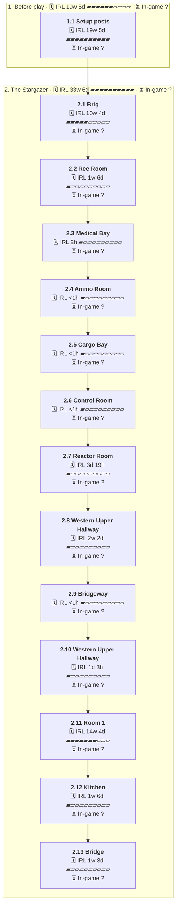

# C09 Metal City: Timeline

Where the party went, in order. Each outer box is an area, and each box inside it is a room or spot the party spent time in.

- 🗓️ **IRL** is measured from the first post there to the first post at the next place.
- ⏳ **In-game** time is filled in by the GM. An area's total appears once all of its rooms have one.

## 1. Before play

- 🗓️ **IRL:** 4 Sep 2025 to 21 Jan 2026, 19w 5d
- ⏳ **In-game:** not all rooms filled in

### 1.1 Setup posts

- 🗓️ **IRL:** 4 Sep 2025 to 21 Jan 2026, 19w 5d, 43 posts
- ⏳ **In-game:** not filled in (`"2025-09#1"` in `timelines/C09-Metal-City.json`)
- 💬 **Time said in posts:** "... 1 week later ..."

**Events**

- 04 Sep: GM posted a link.
- 05 Sep: GM stated the professor had a massive impact on character's life.
- 07 Sep: Redecter asked if this was starfinder.
- 07 Sep: Redecter asked for the books.
- 07 Sep: Antoine stated everything needed was on the SF2E AON.
- 14 Nov: GM stated the party were crew on a ship.
- 14 Nov: Oscar said he wanted to be a bounty hunter.
- 14 Nov: Oscar asked how many bounties were on the ship.
- 14 Nov: Ryo guessed Oscar wondered if crew had bounties on them.
- 14 Nov: Chua said bounties were just one way of making money.
- 23 Dec: GM stated the party was aboard the ship.
- 16 Jan: An alert popped up on screen.
- 16 Jan: Arctus pressed the screen.
- 17 Jan: The ship shook from a laser cannon blast.
- 20 Jan: Arctus tried to hail the attacking pirates.
- 20 Jan: All passed out.
- 21 Jan: Holis checked the ship for missing items.

## 2. The Stargazer

- 🗓️ **IRL:** 21 Jan 2026 to 15 Sep 2026, 33w 6d
- ⏳ **In-game:** not all rooms filled in

### 2.1 Brig

- 🗓️ **IRL:** 21 Jan 2026 to 6 Apr 2026, 10w 4d, 164 posts
- ⏳ **In-game:** not filled in (`"2026-01#33"` in `timelines/C09-Metal-City.json`)

**Events**

- 21 Jan: Woke up restrained together in the brig.
- 26 Jan: A portal opened with green and blue flame.
- 26 Jan: The corpse of a cat-man came out of the portal.
- 26 Jan: A distant alarm from the brig sensors was heard.
- 27 Jan: The door slid up revealing an automaton cleaner.
- 27 Jan: Joo-Dee attempted to scoot through the open door.
- 09 Feb: Automaton cleaner rolled toward Bones's corpse and began cleaning.
- 09 Feb: Cleaning bot short-circuited and beeped near the corpse.
- 09 Feb: Taller cleaning robot with keycards stepped through the brig door.
- 14 Feb: Cleaning robot whispered the red substance was interrupted transmutation.
- 16 Feb: Cleaning robot freed the party and returned their gear.
- 24 Feb: Combat against Dekker started with the players going first.
- 01 Mar: Dekker died from Damon's shot and the corpse was torn apart.
- 01 Mar: Arctus estimated fewer than ten pirates remained on board.
- 01 Mar: Oofy explained they were in room 1 and described the ship layout.
- 05 Mar: Arktos confirmed the corpse was caught mid-transmutation into an ooze.
- 05 Mar: The party looted weapons, armor, grenades and a communicator.
- 11 Mar: Joo-Dee opened the cell doors and freed Chik and Kae-Vo.
- 06 Apr: Ooofy perked up and asked to be interviewed. [↗](https://t.me/Path_Wars/107171/142849)
- 06 Apr: Ooofy asked Holis about sponsorship. [↗](https://t.me/Path_Wars/107171/142850)

### 2.2 Rec Room

- 🗓️ **IRL:** 6 Apr 2026 to 19 Apr 2026, 1w 6d, 141 posts
- ⏳ **In-game:** not filled in (`"2026-04#3"` in `timelines/C09-Metal-City.json`)
- 💬 **Time said in posts:** "about a minute later"; "A few minute pass"

**Events**

- 06 Apr: Ooofy sent a long-range distress call. [↗](https://t.me/Path_Wars/107171/142873)
- 06 Apr: A hostile ship hit The Stargazer. [↗](https://t.me/Path_Wars/107171/142877)
- 06 Apr: Four pirates burst into the rec room and demanded passage to the pods. [↗](https://t.me/Path_Wars/107171/142882)
- 19 Apr: Damon blasted the head off a Nova Pirate. [↗](https://t.me/Path_Wars/107171/146030)
- 19 Apr: Combat ended with the pirates dead. [↗](https://t.me/Path_Wars/107171/146031)
- 19 Apr: Oofy reported the floor was clear and suggested looking around or going upstairs. [↗](https://t.me/Path_Wars/107171/146038)

### 2.3 Medical Bay

- 🗓️ **IRL:** 19 Apr 2026 to 19 Apr 2026, 2h, 24 posts
- ⏳ **In-game:** not filled in (`"2026-04#144"` in `timelines/C09-Metal-City.json`)

**Events**

- 19 Apr: The party entered the medical bay. [↗](https://t.me/Path_Wars/107171/146055)
- 19 Apr: The party found a medkit, medpatches and a bone serum in the cabinets. [↗](https://t.me/Path_Wars/107171/146058)
- 19 Apr: Joo-Dee examined Damon and found no trace of slime. [↗](https://t.me/Path_Wars/107171/146111)
- 19 Apr: Joo-Dee started leading the group toward the Ammo Room. [↗](https://t.me/Path_Wars/107171/146130)

### 2.4 Ammo Room

- 🗓️ **IRL:** 19 Apr 2026 to 19 Apr 2026, <1h, 5 posts
- ⏳ **In-game:** not filled in (`"2026-04#168"` in `timelines/C09-Metal-City.json`)

**Events**

- 19 Apr: The party entered the ammo room full of starship-grade munitions. [↗](https://t.me/Path_Wars/107171/146131)
- 19 Apr: The party saw battery charging stations in the room. [↗](https://t.me/Path_Wars/107171/146132)
- 19 Apr: The group decided to move to the control room next. [↗](https://t.me/Path_Wars/107171/146136)

### 2.5 Cargo Bay

- 🗓️ **IRL:** 19 Apr 2026 to 19 Apr 2026, <1h, 1 posts
- ⏳ **In-game:** not filled in (`"2026-04#173"` in `timelines/C09-Metal-City.json`)

**Events**

- 19 Apr: The party passed through the cargo bay and collected an autograppler, cable, ammunition and batteries. [↗](https://t.me/Path_Wars/107171/146138)

### 2.6 Control Room

- 🗓️ **IRL:** 19 Apr 2026 to 19 Apr 2026, <1h, 24 posts
- ⏳ **In-game:** not filled in (`"2026-04#174"` in `timelines/C09-Metal-City.json`)

**Events**

- 19 Apr: The party entered the control room overlooking the aft. [↗](https://t.me/Path_Wars/107171/146139)
- 19 Apr: Oofy reported a ship missile got stuck from the bone ship attacks. [↗](https://t.me/Path_Wars/107171/146144)
- 19 Apr: Oofy said someone could unjam the missile from the promenade deck. [↗](https://t.me/Path_Wars/107171/146145)
- 19 Apr: The party found a rare life-sized plushie in the cabinet. [↗](https://t.me/Path_Wars/107171/146151)
- 19 Apr: The party confirmed lower rooms were explored except the reactor. [↗](https://t.me/Path_Wars/107171/146155)

### 2.7 Reactor Room

- 🗓️ **IRL:** 19 Apr 2026 to 23 Apr 2026, 3d 19h, 46 posts
- ⏳ **In-game:** not filled in (`"2026-04#198"` in `timelines/C09-Metal-City.json`)

**Events**

- 19 Apr: The party entered the reactor room. [↗](https://t.me/Path_Wars/107171/146252)
- 19 Apr: The Symposium fixed and stabilised the reactor. [↗](https://t.me/Path_Wars/107171/146337)
- 19 Apr: The reactor released a last burst of unstable energy. [↗](https://t.me/Path_Wars/107171/146346)
- 19 Apr: The Symposium took a small zap from the reactor. [↗](https://t.me/Path_Wars/107171/146370)
- 19 Apr: Joo-Dee treated Kae-Vo with medicine and restored health. [↗](https://t.me/Path_Wars/142887/146381)
- 23 Apr: Chik urged heading upstairs to secure the ship. [↗](https://t.me/Path_Wars/107171/147389)

### 2.8 Western Upper Hallway

- 🗓️ **IRL:** 23 Apr 2026 to 10 May 2026, 2w 2d, 77 posts
- ⏳ **In-game:** not filled in (`"2026-04#244"` in `timelines/C09-Metal-City.json`)

**Events**

- 23 Apr: The party went upstairs. [↗](https://t.me/Path_Wars/107171/147460)
- 27 Apr: The party arrived in the western upper hallway. [↗](https://t.me/Path_Wars/107171/148951)
- 27 Apr: Oofy described the missile launcher to the west and the central room to the east. [↗](https://t.me/Path_Wars/107171/148952)
- 28 Apr: Hinata Hoshibi introduced herself and offered to join forces. [↗](https://t.me/Path_Wars/107171/149501)
- 28 Apr: Joo-Dee introduced the party members to Hinata. [↗](https://t.me/Path_Wars/107171/149519)
- 28 Apr: Arktos headed through the magnetic field to tinker with the missiles. [↗](https://t.me/Path_Wars/107171/149577)
- 02 May: Hinata asked about the group's capabilities and tactics. [↗](https://t.me/Path_Wars/107171/150136)
- 02 May: Joo-Dee said a high frequency sound wave knocked the crew out. [↗](https://t.me/Path_Wars/107171/150331)
- 09 May: Oofy said repairing the jammed missile launcher on the bridgeway would take a few minutes. [↗](https://t.me/Path_Wars/107171/152003)
- 09 May: Oofy stated the repair required DC 15 Acrobatics or Athletics and DC 15 Crafting. [↗](https://t.me/Path_Wars/107171/152005)
- 10 May: Oofy asked Hinata who she was and how she got onto the ship. [↗](https://t.me/Path_Wars/107171/152102)
- 10 May: Oofy opened the door to the bridge at a terminal. [↗](https://t.me/Path_Wars/107171/152109)

### 2.9 Bridgeway

- 🗓️ **IRL:** 10 May 2026 to 10 May 2026, <1h, 5 posts
- ⏳ **In-game:** not filled in (`"2026-05#34"` in `timelines/C09-Metal-City.json`)

**Events**

- 10 May: The party made their way over to attempt the repair. [↗](https://t.me/Path_Wars/107171/152111)
- 10 May: Arktos kept balance on the damaged bridgeway and held the edge. [↗](https://t.me/Path_Wars/107171/152130)
- 10 May: Arktos unjammed the missile launcher and made their way back inside. [↗](https://t.me/Path_Wars/107171/152131)

### 2.10 Western Upper Hallway

- 🗓️ **IRL:** 10 May 2026 to 11 May 2026, 1d 3h, 14 posts
- ⏳ **In-game:** not filled in (`"2026-05#39"` in `timelines/C09-Metal-City.json`)

**Events**

- 10 May: Oofy congratulated Arktos after coming back inside. [↗](https://t.me/Path_Wars/107171/152133)
- 10 May: Oofy said a scream knocked the crew unconscious. [↗](https://t.me/Path_Wars/107171/152178)
- 10 May: The party agreed to move to the next room. [↗](https://t.me/Path_Wars/107171/152183)
- 11 May: Hinata said she woke on the ship after the scream and confirmed she was Solarian. [↗](https://t.me/Path_Wars/107171/152476)

### 2.11 Room 1

- 🗓️ **IRL:** 11 May 2026 to 20 Aug 2026, 14w 4d, 190 posts
- ⏳ **In-game:** not filled in (`"2026-05#53"` in `timelines/C09-Metal-City.json`)

**Events**

- 11 May: The party entered ROOM 1 with large storage crates. [↗](https://t.me/Path_Wars/107171/152518)
- 11 May: Polly demanded why the cursed prisoners were out of their cages. [↗](https://t.me/Path_Wars/107171/152523)
- 12 May: A blast from the undead ship hit the Stargazer and ripped a hole in the ceiling. [↗](https://t.me/Path_Wars/107171/153228)
- 12 May: The darkness formed into a nightmarish lovecraftian entity. [↗](https://t.me/Path_Wars/107171/153243)
- 18 May: Arktos learned the sinkwell was immune to traditional damage and needed 3 successes to disperse. [↗](https://t.me/Path_Wars/142887/154454)
- 18 May: Arktos relayed the sinkwell's capabilities to the rest of the party. [↗](https://t.me/Path_Wars/142887/154492)
- 02 Jun: Chik attempted Occultism checks against the Sinkwell. [↗](https://t.me/Path_Wars/142887/158362)
- 02 Jun: Damon moved into range and attempted Thievery checks against the Sinkwell. [↗](https://t.me/Path_Wars/142887/158364)
- 15 Jun: Hinata was grabbed by the Sinkwell. [↗](https://t.me/Path_Wars/142887/161495)
- 15 Jun: Damon disabled the Spiritual Sinkwell and ended combat. [↗](https://t.me/Path_Wars/142887/161522)
- 23 Jun: A Diplomacy check to befriend Polly succeeded. [↗](https://t.me/Path_Wars/107171/162741)
- 01 Jul: Polly said she did not want to die there and suggested allying for safety. [↗](https://t.me/Path_Wars/107171/164298)
- 01 Jul: Polly recharged all of the party's batteries for free. [↗](https://t.me/Path_Wars/107171/164299)
- 01 Jul: Oofy warned the captain was no more than 2 rooms away and to get ready for a fight to the death. [↗](https://t.me/Path_Wars/107171/164302)
- 08 Jul: Laetheron said he would like to continue but did not know how many people were still here. [↗](https://t.me/Path_Wars/107171/165921)
- 27 Jul: GM paused the campaign to recruit and said the Stargazer sat exactly where it was. [↗](https://t.me/Path_Wars/107171/168709)
- 30 Jul: Bruce said he had been busy and was still a week out. [↗](https://t.me/Path_Wars/107171/169289)
- 19 Aug: A far greater swell of power rose after the spiritual sinkwell was destroyed. [↗](https://t.me/Path_Wars/107171/173362)
- 19 Aug: Arktos established their warp and scanned the area for anomalies. [↗](https://t.me/Path_Wars/107171/173401)
- 19 Aug: Oofy reported the pirates had retreated from the living room to the bridge. [↗](https://t.me/Path_Wars/107171/173415)
- 19 Aug: The Stargazer shook from necro plasma cannon blasts. [↗](https://t.me/Path_Wars/107171/173416)
- 19 Aug: Polly stowed away below deck. [↗](https://t.me/Path_Wars/107171/173418)
- 20 Aug: Arktos floated off with LUKA. [↗](https://t.me/Path_Wars/107171/173523)

### 2.12 Kitchen

- 🗓️ **IRL:** 22 Aug 2026 to 26 Aug 2026, 1w 6d, 59 posts
- ⏳ **In-game:** not filled in (`"2026-08#23"` in `timelines/C09-Metal-City.json`)
- 💬 **Time said in posts:** "for several days"

**Events**

- 22 Aug: The party went into the next room and found the big open plan kitchen rearranged. [↗](https://t.me/Path_Wars/107171/173810)
- 22 Aug: A large glass cube with grey figures stood where the table had been. [↗](https://t.me/Path_Wars/107171/173885)
- 22 Aug: The ghost people in the prison became solid and looked like the crew companions. [↗](https://t.me/Path_Wars/107171/173889)
- 24 Aug: Arktos tinkered with the cube and deactivated the prison. [↗](https://t.me/Path_Wars/107171/174183)
- 24 Aug: The cube opened and the prisoners walked free. [↗](https://t.me/Path_Wars/107171/174187)
- 26 Aug: Bella started jamming a knife into the bridge door to force it open. [↗](https://t.me/Path_Wars/107171/175508)

### 2.13 Bridge

- 🗓️ **IRL:** 4 Sep 2026 to 15 Sep 2026, 1w 3d, 57 posts
- ⏳ **In-game:** not filled in (`"2026-09#1"` in `timelines/C09-Metal-City.json`)

**Events**

- 04 Sep: The party saw the bridge. [↗](https://t.me/Path_Wars/107171/177039)
- 04 Sep: The party saw Captain Vex Ashburn. [↗](https://t.me/Path_Wars/107171/177061)
- 10 Sep: The ship shook as necro-missiles struck it. [↗](https://t.me/Path_Wars/107171/178078)
- 13 Sep: Captain Vex Ashburn ordered the Nova pirates to attack. [↗](https://t.me/Path_Wars/107171/178742)
- 15 Sep: Arktos blasted Captain Vex Ashburn to within an inch of her life. [↗](https://t.me/Path_Wars/107171/179422)
- 15 Sep: Bella urged everyone to get out fast. [↗](https://t.me/Path_Wars/107171/179518)
