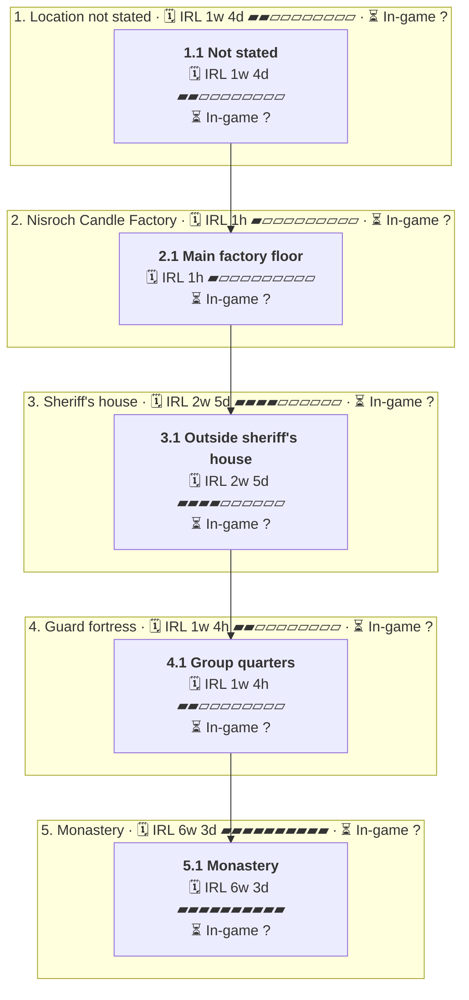

# C11 Dark Pockets: Timeline

Where the party went, in order. Each outer box is an area, and each box inside it is a room or spot the party spent time in.

- 🗓️ **IRL** is measured from the first post there to the first post at the next place.
- ⏳ **In-game** time is filled in by the GM. An area's total appears once all of its rooms have one.

## 1. Location not stated

- 🗓️ **IRL:** 7 Apr 2026 to 18 Apr 2026, 1w 4d
- ⏳ **In-game:** not all rooms filled in

### 1.1 Not stated

- 🗓️ **IRL:** 7 Apr 2026 to 18 Apr 2026, 1w 4d, 143 posts
- ⏳ **In-game:** not filled in (`"2026-04#1"` in `timelines/C11-Dark-Pockets.json`)
- 💬 **Time said in posts:** "1:00am"

**Events**

- 08 Apr: The group was restored to good health by medicine. [↗](https://t.me/Path_Wars/1242/1693)
- 08 Apr: Olla woke first and sat up changed with grey-tinted irises. [↗](https://t.me/Path_Wars/1242/1701)
- 14 Apr: A Nature check confirmed Olla held deeper shadow magic. [↗](https://t.me/Path_Wars/1242/1810)
- 18 Apr: Olla mistook Ger for her father and called him dad. [↗](https://t.me/Path_Wars/1242/1926)
- 18 Apr: Ger learned Olla was evolving from pure planar shadow infusion. [↗](https://t.me/Path_Wars/1242/1945)
- 18 Apr: Tal'lysae the red slime introduced herself to observe Ger. [↗](https://t.me/Path_Wars/1242/2000)

## 2. Nisroch Candle Factory

- 🗓️ **IRL:** 18 Apr 2026 to 18 Apr 2026, 1h
- ⏳ **In-game:** not all rooms filled in

### 2.1 Main factory floor

- 🗓️ **IRL:** 18 Apr 2026 to 18 Apr 2026, 1h, 127 posts
- ⏳ **In-game:** not filled in (`"2026-04#144"` in `timelines/C11-Dark-Pockets.json`)

**Events**

- 18 Apr: The party returned up the stairs to the main factory floor. [↗](https://t.me/Path_Wars/1242/2030)
- 18 Apr: The bewitched factory workers were found passed out. [↗](https://t.me/Path_Wars/1242/2032)
- 18 Apr: Tal'lysae touched Feyra's forehead and revealed missing memories. [↗](https://t.me/Path_Wars/1242/2047)
- 18 Apr: Tal'lysae advised Feyra to meditate and reach out to her patron. [↗](https://t.me/Path_Wars/1242/2080)
- 18 Apr: Rino's Survival check pulled Ger's swarm toward the River of River-Way. [↗](https://t.me/Path_Wars/1242/2127)
- 18 Apr: Rino pulled the legs off Ger's gifted spider. [↗](https://t.me/Path_Wars/1242/2143)

## 3. Sheriff's house

- 🗓️ **IRL:** 18 Apr 2026 to 7 May 2026, 2w 5d
- ⏳ **In-game:** not all rooms filled in

### 3.1 Outside sheriff's house

- 🗓️ **IRL:** 18 Apr 2026 to 7 May 2026, 2w 5d, 63 posts
- ⏳ **In-game:** not filled in (`"2026-04#271"` in `timelines/C11-Dark-Pockets.json`)
- 💬 **Time said in posts:** "00:30"

**Events**

- 18 Apr: The party arrived outside the sheriff's house at 00:30. [↗](https://t.me/Path_Wars/1242/2168)
- 18 Apr: Lucian opened the door and dropped his candle seeing Olla. [↗](https://t.me/Path_Wars/1242/2178)
- 18 Apr: Lucian embraced his daughter Olla. [↗](https://t.me/Path_Wars/1242/2191)
- 18 Apr: Lucian demanded to know what had happened to Olla. [↗](https://t.me/Path_Wars/1242/2207)
- 18 Apr: NJ said Quiz had taken Olla hostage and infected her with shadow magic. [↗](https://t.me/Path_Wars/1242/2236)
- 18 Apr: Lucian asked who Quiz was and if he was a fetchling. [↗](https://t.me/Path_Wars/1242/2237)
- 03 May: NJ explained what the group knew about Quiz and the kidnapping. [↗](https://t.me/Path_Wars/1242/2347)
- 03 May: Lucian said he would investigate the factory with trusted guards. [↗](https://t.me/Path_Wars/1242/2353)
- 03 May: Lucian offered free lodgings in the barracks and a meal. [↗](https://t.me/Path_Wars/1242/2361)
- 07 May: NJ accepted Lucian's offer. [↗](https://t.me/Path_Wars/1242/2395)

## 4. Guard fortress

- 🗓️ **IRL:** 7 May 2026 to 15 May 2026, 1w 4h
- ⏳ **In-game:** not all rooms filled in

### 4.1 Group quarters

- 🗓️ **IRL:** 7 May 2026 to 15 May 2026, 1w 4h, 55 posts
- ⏳ **In-game:** not filled in (`"2026-05#15"` in `timelines/C11-Dark-Pockets.json`)
- 💬 **Time said in posts:** "in the morning"; "09:00am"

**Events**

- 07 May: Lucian guided the party to group quarters in the guard fortress. [↗](https://t.me/Path_Wars/1242/2411)
- 07 May: Lucian thanked the group for saving his daughter. [↗](https://t.me/Path_Wars/1242/2415)
- 07 May: Everyone had dark dreams and awoke feeling restored. [↗](https://t.me/Path_Wars/1242/2420)
- 07 May: A cat-like entity tried to give Nariya a dagger of flaming darkness. [↗](https://t.me/Path_Wars/1242/2441)
- 09 May: NJ apologised to the group for causing nightmares. [↗](https://t.me/Path_Wars/1242/2465)
- 10 May: Lucian arrived with four other guards. [↗](https://t.me/Path_Wars/1242/2483)

## 5. Monastery

- 🗓️ **IRL:** 15 May 2026 to 29 Jun 2026, 6w 3d
- ⏳ **In-game:** not all rooms filled in

### 5.1 Monastery

- 🗓️ **IRL:** 15 May 2026 to 29 Jun 2026, 6w 3d, 30 posts
- ⏳ **In-game:** not filled in (`"2026-05#70"` in `timelines/C11-Dark-Pockets.json`)
- 💬 **Time said in posts:** "14:00"

**Events**

- 15 May: The party were in the monastery. [↗](https://t.me/Path_Wars/1242/2563)
- 18 May: NJ said Nariya ate tapestry and died. [↗](https://t.me/Path_Wars/1242/2580)
- 08 Jun: GM clarified anyone could do in-game actions in the topic. [↗](https://t.me/Path_Wars/1242/2668)
- 09 Jun: Luke Skillen asked what was next. [↗](https://t.me/Path_Wars/1242/2671)
- 10 Jun: GM asked what Rino would like to do. [↗](https://t.me/Path_Wars/1242/2689)
- 19 Jun: GM posted the session summary. [↗](https://t.me/Path_Wars/1242/2730)
- 22 Jun: Poo Poo reacted to Torture trank. [↗](https://t.me/Path_Wars/1242/2743)
- 29 Jun: GM asked what happened next. [↗](https://t.me/Path_Wars/1242/2761)
