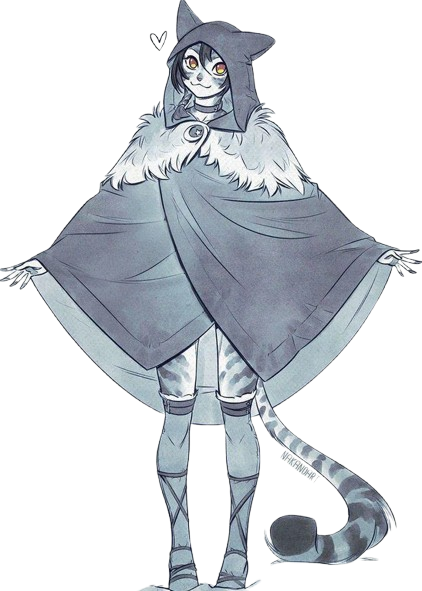

# C01-Lenma-Moonshine

## Character art.

> Art
>> {style="inline"}
>> - Artist: https://x.com/nakanodrawing?lang=en

## Character lore.

> Core.
>> - What is your character's name? Lenma Moonshine.
>> - What does your character's first name mean? Dewdrop in Amurrun, given by parents at birth.
>> - What does your character's last name mean? Moonshine (the liquor), the adolescent name she picked for herself as customary of ammurun tradition.
>> - Does your character have a title? For example, "Arthur, the Dragon knight of Camelot!" Parents affectionately refer to her as a klutz.

> Age.
>> - How old is your character? 20 years old.
>> - What year was your character born? 4669 AR. 20 years = 4649 AR.
>> - What day is your character's birthday? Calistril 2nd.
>> - At what age did the character become an adventurer? Like most other Amurrun, Moonshine left home to travel and explore the world as soon as she matured ~ 16 years old.

> Class #1.
>> - What is your character's class? Monk
>> - Does your character enjoy their class? She does not consider herself a "Monk" but.
>> - How did your character become their class? Total accident and dumb (Cat's) luck.
>> - Who trained your character in their class? Natural Amurrun hunting instincts (and probably apprenticeship under parents/uncles etc who hunt game and taught her self-defence skills in preparation for travelling)

> Class #2. (If using dual class)
>> - What will/is your character's 2nd class be? Thaumaturge.
>> - Does/Will your character enjoy their 2nd class? Yes, infinite booze gourd :D.

> Race
>> - What is your character's Race? Amurrun (Cat folk)
>> - What is your character's Sub-Race? Winter Cat folk Heritage
>> - Has your character met other members of their race? We are Raised in large extended families like most Amurrun.
>> - Does your character like your race? She does not think a lot about being Amurrun, she just is, but she loves her family.
>> - Does your character like any races in particular? Why? Not particularly, but she thinks gentle giant minotaurs are pretty cool (she has a single minotaur uncle within her extended family back home); she also enjoys Halflings' happy-go-lucky attitudes that she shares.
>> - Does your character hate any races in particular? Why? Uh, no, she is not racist? I do not think? Maybe Athamaru if they smell like rotting fish.

> Parents and Family.
>> - Where was your character born? Small Amurrun community near Raven moor in Varisia.
>> - Where were you raised? The same community where she grew up causing trouble and learning life lessons the hard way.
>> - Who raised your characters? The whole collective Amurrun community.
>> - Who are your parents? Mother is a Hunter and brewery distiller father.
>> - What are your parents' names? Father = Dornsi, Mother = Mirra.
>> - Are your parents alive? Yes!
>> - What did your parents do for a living? Father owns a tavern and mother hunts game for a community butcher.
>> - Do you have any other family or friends? We can discuss this more if we are going to introduce relevant character background NPCs but maybe a few familiar faces she keeps running into in Riddleport.

> Love.
>> - What is your character's sexuality? (Not specified)
>> - What is your character's marital status? Single
>> - Does your character have kids? No
>> - Does your character want kids? Absolutely not
>> - Is your character in love? With alcohol and napping
>> - Has your character ever been in love? Have not had a chance to know any for long enough that way.

> The Mind | Thoughts and Feelings.
>> - What is your character's alignment? Neutral Good (Leaning chaotic out of reckless irresponsibility rather than active preference for chaos)
>> - What is your character's moral code? Live and let live (unless a paradox of tolerance, tyranny will not be tolerated)
>> - Does your character have goals? Sail around the world! (Have not made it out of Riddleport yet)
>> - Does your character follow a God? Nope, but Cayden Cailean is pretty cool (her dad always talks about him)
>> - What God (if any) does your character follow? Culturally practices Shoanti Animism as a tradition but is not dogmatically indoctrinated.
>> - What are your character's personal beliefs? Do your best and everything will work out! If you are not feeling it, then that is about the best you can do at the time, so just take it easy!
>> - Does your character have any personality quirks? Always drinking and falling asleep after drinking and dreaming about drinking.
>> - Are they anti-social? She loves meeting new people!
>> - Are they Arrogant? Not exactly arrogant but may often overestimate herself in situations other would be more cautious in because (view next question)
>> - Are they Optimistic? Extremely, nothing has ever and will ever go wrong.
>> - Are They Paranoid? Extremely NOT, a bit of a flaw and overly trusting, even.
>> - Why does your character adventure? As any amurrun ought to be.
>> - How does your character view his/her role as an adventurer? Adventurer? Oh, you mean freelancing for fare fees to travel the world, yeah?
>> - How does your character get along with others? Hopefully well
>> - Is there anything that your character hates? Hangovers, traitors, slimy textures that get stuck in her fur, especially if it smells.
>> - Is there anything that your character fears? Not being welcome home.
>> - What sin does your character align with closest? Greed, Pride, Lust, Envy, Gluttony, Wrath or Sloth? Gluttony but only for alcohol and Sloth but only for post-drinking naps.
>> - What apocalypse would your character most likely cause: War, Famine, Pestilence or Death? Famine, everyone is too busy being blacked out.

> The Body | Biological Appearance.
>> - What does your character look like? Snow leopard cat folk with large auburn eyes.
>> - Gender? Female (She/Her)
>> - Height? 5'8
>> - Weight? 172 lbs ~ 78kg
>> - Skin colour? Pink covered in white and cyan leopard print fur.
>> - Eye colour? Auburn
>> - Hair colour? Dark blue, almost black
>> - Hair length? Around chin length
>> - Hairstyle? Wavy bob with bangs
>> - Physique and body shape? Extremely athletic as an active, hunting Amurrun.
>> - What additional attributes would be noticed upon meeting the character? Large, long, fluffy tail.
>> - How do they Speak? Vocal speech and sometimes meows and purrs.
>> - What are their Mannerisms? Ear wiggles and nose twitches when listening or smelling.
>> - Does your character have any distinguishing marks? Probably the leopard print fur.
>> - Do they have birthmarks? Covered up by fur if there are any.
>> - Do they have Scars? A patch of missing fur due to a scar on her forehead covered by bangs.
>> - Do they have Deformities? Her claws never fully grew out like other Amurrun.
>> - Is your character attractive? By what conventions? Maybe? Probably conventionally attractive in Amurrun culture.
>> - Whatever is applicable: Cock Size? Breast Size? (?)
>> - Any aspects of your character that are unusual? Pronounced canines even amongst cat folk visible in toothy laughs.

> Weapons.
>> - What kind of weapons does your character fight with? Wok (Throwing Shield)
>> - What does your character's weapon look like? (Community made throwing shield/wok)
>> - Who made your character's weapon? Community smith back home
>> - Who added the runes to your character's weapons? No runes yet.
>> - Who trained your character in using weapons? Self-taught and family guided.
>> - Does your character like using weapons? Whatever works, the wok is just always carried on her back or worn on head when raining and ready at hand at an instant notice, but she is ready to throw hands or whatever else is good for throwing.

> Armour.
>> - What kind of armour does your character wear? Cloak to stay warm in the cold waters of Riddleport's open seas over a set of explorer's clothing from home (send off gift)
>> - What does your character's armour look like? (Not specified)
>> - Who made your character's armour? The Community's tailor back home.
>> - Who added the runes to your character's armour? Cloak of Feline Rest was also a gift, either from family or the first captain she crewed under (if you wanna make that NPC)
>> - Who trained your character in wearing armour? Family trained in unarmoured defence.
>> - Does your character like wearing armour? Actual armour? No. Explorer's clothing and cloak? Yes, it reminds her of her goals and where she came from.

> Magic
>> - What kind of magic does your character use? (Not specified yet)
>> - Does your character like magic? It is undeniably a large part of the world and a useful skill. She does not have any inherent suspicion against it. It is fun and sparkly and cool! Until a baddie uses it >:o.
>> - Is your character magical? Yes? Kinda? Qi spells soon will be.
>> - How is your character magical? Thaumaturge dual class already is magical from esoterica. I think you wanted to discuss how the second "class" came to be?
>> - Who trained your character in using weapons? Family/home community
>> - Does your character like using weapons? It makes up for her lack of claws, but her fists work just fine too.
>> - Do you have any magical items? Staff? Wands? Starting at level 2? Just the cloak of feline's rest. Also, her magical wine gourd (Chalice Implement) with infinite moonshine. Besides, the rest of her esoterica.
>> - Where did you get your magical items? I have some ideas, but I did not expect "class" to be a concrete thing in the setting. I think it would make sense if she just had a bad habit of hoarding items of sentiment and inadvertently qualified as a thaumaturge from her collection.

> Spell Caster.
>> - Can your character cast spells? Not yet but qi spells are in the plans.
>> - What tradition is your character's magic? Arcane? Primal? Divine? Occult? Not yet but qi spells are in the plans.
>> - Where does your character's magic come from? Who knew the key to enlightenment was drug abuse and blacking out? Fumble enough and you hallucinate psionics into existence.
>> - Who trained your character to use your magic? The Way of the Drunken Hallucination always finds its pupils.
>> - What does your character like to do with your magic? Be lazier, telekinetic hand, message, light, just do all the utilities, please.
>> - What is the highest level spell slot your character has access to? At second level, none.

> Equipment.
>> - Does your character have a backpack? Yes, a small round pack over the shoulder.
>> - What does your character's backpack look like? Bedroll strapped on top, cooking wok attached to the back if not worn on the head.
>> - Does your character have a bag of holding? Nope, not high enough level.
>> - What does your character's bag of holding look like? Do not have one.

> Food and Drink.
>> - What does your character like to eat? Meat and carbs
>> - What does your character not like to eat? Despite being an Amurrun in Riddleport, seafood. It is tough out here, man.
>> - What does your character like to drink? Specifically, fruit ciders and wines, also water, really helped with the hangovers.
>> - What does your character not like to drink? Seawater, unfortunately, unavoidable when working in Riddleport.
>> - Does your character cook? It is an essential skill when on the road, yeah.
>> - Does your character drink alcohol? If so, how heavily? Hahahahaha.
>> - Do they partake in Drugs? Alcohol is a drug but would not pass up peshleaf if offered for free.

> Alignment Scale.
>> - What is your character's alignment scale? The link does not work, but assuming this is standard D&D alignment, I already answered this earlier (Neutral-Leaning Chaotic-Good)

> Plot hooks.
>> - Part 1 of 3: What are (at least) 5 accomplishments your character wishes to achieve? What is a personal milestone your character dreams of reaching? Sail around the world and collect items of sentiment from every location. Subgoal: owning her own ship and captaining a crew.
>> - Does your character have a relationship they want to build or repair? I think there could be, but I would wanna discuss any NPCs with you.
>> - Is there a location they have always wanted to visit or conquer? Why? Tian Xia seems like such a faraway mystery to her, and she wants to see what it is like halfway across Golarion.
>> - Does your character have an ideal legacy they wish to leave behind? (Not specified)
>> - What is one immediate, achievable goal they are pursuing right now? Getting back on her feet and finding another opportunity for coin.
>> - Is there a wrong they feel compelled to make right, either for themselves or someone else? (Not specified)
>> - What is a selfish desire they may not admit to others but secretly want to fulfill? Get rich lmao.
>> - Part 2 of 3: What are (at least) 3 secrets your character is hiding from the party? Do they have a past mistake or failure they are ashamed of? (Not specified)
>> - Is there a relationship, alliance or obligation they have not told the party about? This one sounds fun, and I think it would make sense for her to have some sort of debt due to her recklessness.
>> - Are they concealing something magical, cursed or otherwise unusual about themselves? I really feel like I cannot answer these yet because it needs to be discovered in play.
>> - Do they harbour feelings of jealousy, resentment or distrust toward a party member? Why? (Not specified)
>> - Is there an ulterior motive behind their reason for adventuring with the party that they have not shared? I really feel like I cannot answer these yet because it needs to be discovered in play.
>> - Part 3 of 3: Try to tie in (at least) one thing with another member of the party? I do not know anything about the existing party, but her carelessness can certainly be a burden.

> Backstory.
>> - What is your character's backstory? (See the yearly breakdown below)

> Backstory by each Year.
>> - AR 4669, age 0: born
>> - AR 4670, age 1: running around and learning to hunt
>> - AR 4675, age 6: basic literacy and accounting skills
>> - AR 4679, age 10: basic survival skills and first taste of alcohol.
>> - AR 4685, age 16: coming of age ceremony, embarks on a journey through the inner seas' region.
>> - AR 4686, age 17: arrives at Riddleport and starts learning to sail.
>> - AR 4687, age 18: hired onto first crew, achieved Level 1.
>> - AR 4688, age 19: fired and kicked out of crew, worked on several crews after, Level 2.
>> - AR 4689, age 20: unemployed with a reputation in Riddleport for being a drunken klutz surviving on sheer luck, looking for opportunities to earn more money and get back on her feet.

> Beyond the first level.
>> - Are you higher than level 1? What level? Riddleport campaign is currently level 2.
>> - What year did your character achieve first level in their class? Age 18.
>> - How long has it been chronological since your character was first level? Two years of bumbling around from ship to ship.
>> - What has your character been doing since they started adventuring (aka first level)? Trying to earn coin by working as a crew member on ships in Riddleport.
>> - How did you achieve each level? Aka what did you kill to level up? Does level up require a "kill"? Seems like a bit of an old-fashioned RPG idea. Experience is probably defending cargo ships from pirates before getting thrown out of the crew for being too much of a drunk again.
>> - How long did each level take to achieve? It Took 2 years of travelling through Varisia by foot to go from a trained apprentice at level 0 when leaving home to getting level 1 by arrival in Riddleport.

> Time since level 1.
>> - Level progression: 
>> - Level 0 at age 16 when embarking on the world. 
>> - Level 1 at 18. 
>> - Level 2 at 19. 
>> - Currently still level 2 after turning 20.