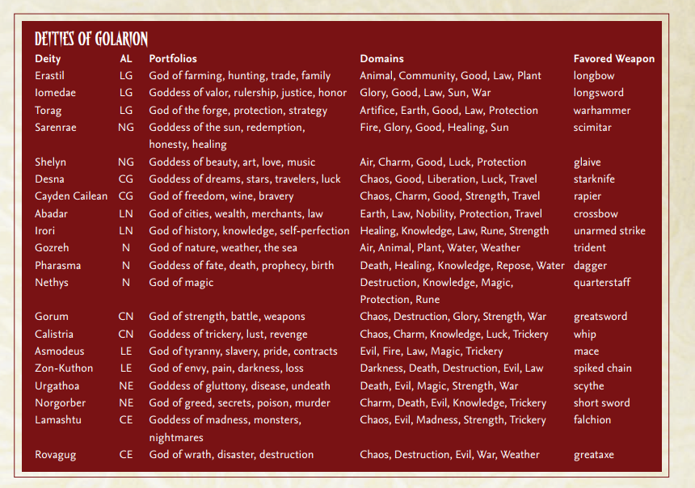

# Golarion Lore = The Spoiler-Free Version!

## Golarion Map.
[Inner-Sea-Map](https://github.com/LewisIsWorking/PathWarsWiki/blob/master/Writerside/Inner-Sea-Map.pdf)

## The Seas of Golarion.
1. Castrovin Sea.
2. Fever Sea.
3. Inner Sea.
4. Ivory Sea.
5. Shining Sea.
6. Sightless Sea.
7. Songil Sea.
8. Steaming Sea.
9. Valashmai Sea

## The Oceans of Golarion.
1. Antarkos Ocean = The Antarkos Ocean, which covers most of Golarion's southern hemisphere, including the South Pole, and is largely composed of a permanent ice shelf.
2. Arcadian Ocean = The Arcadian Ocean, west of Avistan and Garund, east of Arcadia, and surrounding where Azlant once was.
3. The Embaral Ocean = The Embaral Ocean is touching Casmaron, Tian Xia, and Sarusan.
4. The Obari Ocean = The Obari Ocean between Garund and Casmaron.
5. The Okaiyo Ocean = The Okaiyo Ocean separating Tian Xia from Arcadia.

## The Continents of Golarion.
1. Arcadia.
2. Avistan.
3. Casmaron.
4. Garund = People of the Sands.
5. Sarusan.
6. The Crown of the World.
7. Tian Xia = The Dragon Empire.

## Varisians.
These are the people of Varisia.
The Varisians call Giant’s “The Builders” in their language.

## Deities of Golarion Infographic.

1. Abadar.
2. Asmodeus.
3. Calistria.
4. Cayden Cailean.
5. Desna.
6. Erastil.
7. Gorum.
8. Gozreh.
9. Iomedae.
10. Irori.
11. Lamashtu.
12. Nethys.
13. Norgorber.
14. Pharasma.
15. Rovagug.
16. Sarenrae.
17. Shelyn.
18. Torag.
19. Urgathoa.
20. Zon-Kuthon.

### Abadar.

Abadar, the god of:
1. Cities
2. Law
3. Merchants
4. Wealth

Titles.
God of Walls and Ditches.
The Gold-Fisted.
Judge of the Gods.
Master of the First Vault.
God of the First Vault.
Wealthy Father.

Role in society:
Banking.
Guarding civilisation.
Marketplace.

Description.
Capitalism
Abadar likes expanding built-up areas like cities.

## Asmodeus.

The Archfiend.
Dark Prince.
The First.
God-Fiend.
King of Hell.
Lord of Darkness.
Lord of Hell.
Lord of the Pit.
Master of Witches.
Prince of Darkness.
Prince of Devils.
Prince of Hell.
Prince of Law.
Ruler of Hell.

1. Hell
2. Tyranny
3. Slavery
4. Pride
5. Contracts

Strongest Devil.
Role in Society:
Contract making.

## Calistria

1. Lust
2. Revenge
3. Trickery

Lust god.

## Cayden Cailean

1. Freedom
2. Ale
3. Wine
4. Bravery
Freedom god

## Desna
The Song of
the Spheres
The Great
Dreamer
Starsong
The Tender
of Dreams
Lady Luck
Resplendent
Goddess of Fortune
Goddess of
the North Star
Queen of
the North Star
Mother Moon

God of:
1. Dreams
2. Luck
3. Stars
4. Travelers

Luck god

## Erastil
1. Family
2. Farming
3. Hunting
4. Trade

Hunting god

## Gorum
1. WAR
2. Strength
3. Battle
4. Weapons

War god

## Gozreh
1. Nature
2. Weather
3. The sea
4. Wind and Waves

Nature god

## Iomedae
1. Honour
2. Justice
3. Rulership
4. Valour

Knight god

## Irori
1. History
2. Knowledge
3. Self-perfection

Martial arts god

## Lamashtu
1. Aberrance.
2. Madness.
3. Monsters.
4. Nightmares.

God of the Abyss.
God of the Demons.

## Nethys
1. Magic.
2. Duality of Creation and Destruction.

Magic god

## Norgorber.

1. Greed.
2. Secrets.
3. Poison.
4. Murder.

Thief god.

## Pharasma

God of Death.
God of Judgement.
The 2nd most powerful God.

Role in Society:
Funeral handling.
Defeating the undead.

## Rovagug

The Rough Beast.
The destroyer.
The most powerful God.

## Sarenrae

1. Sun
2. Redemption
3. Honesty
4. Healing

Role in Society:
Hospitals.

## Shelyn

1. Art
2. Beauty
3. Love
4. Music

## Torag

1. Forge
2. Protection
3. Strategy

Dwarf god
Forging god

## Urgathoa.

1. Gluttony
2. Disease
3. Undeath

Urgathoa (pronounced oor-gah-THO-ah) is the Varisian goddess of physical excess, disease, and the undead.
She is most worshipped by dark necromancers, the undead, and those wishing to become undead.
Sometimes those who live gluttonous lifestyles make supplication to her, as does that are suffering from a serious illness.

Undead god

## Zon-Kuthon.

1. Envy
2. Pain
3. Darkness
4. Loss

Pain god.
