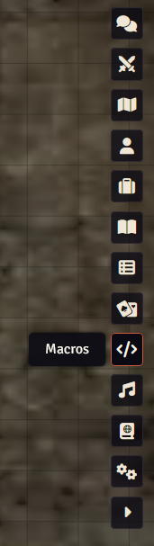
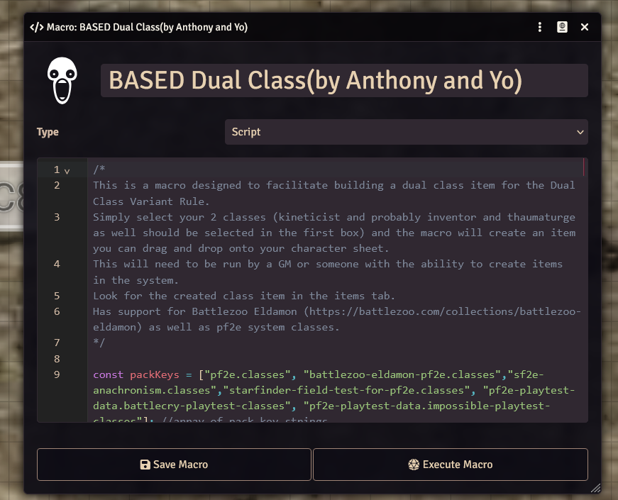
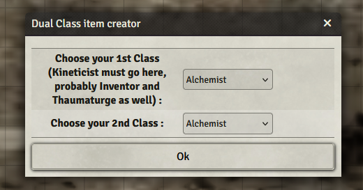
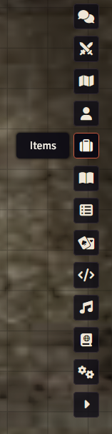

# Setting-up-dual-class-(FoundryVTT)

| Step | Action                                                                     | Visual Reference                                                     |
|------|----------------------------------------------------------------------------|----------------------------------------------------------------------|
| 1    | Go to: https://doomsday-funtime.eu.forge-vtt.com/game                      |                                                                      |
| 2    | Login                                                                      |                                                                      |
| 3    | Go to macros                                                               |                  |
| 4    | Search "Based Dual Class"                                                  |                |
| 5    | Execute Dual Class Macro                                                   |  |
| 6    | Select Your Classes                                                        |          |
| 7    | Find your dual-class item in the "items" directory                         |                |
| 8    | Drag the dual-class item onto your character sheet from the item directory |                                                                      |
