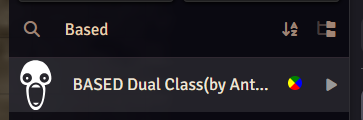

# Setting-up-dual-class-(FoundryVTT)

> Steps.
>> - Go to: https://doomsday-funtime.eu.forge-vtt.com/game.
>> - Login.
>> - Go to macros: .
>> - Search "Based Dual Class". .
>> - Execute Dual Class Macro. .
>> - Select Your Classes .
>> - Find your dual-class item in the "items" directory. .
>> - Drag the dual-class item onto your character sheet from the item directory.