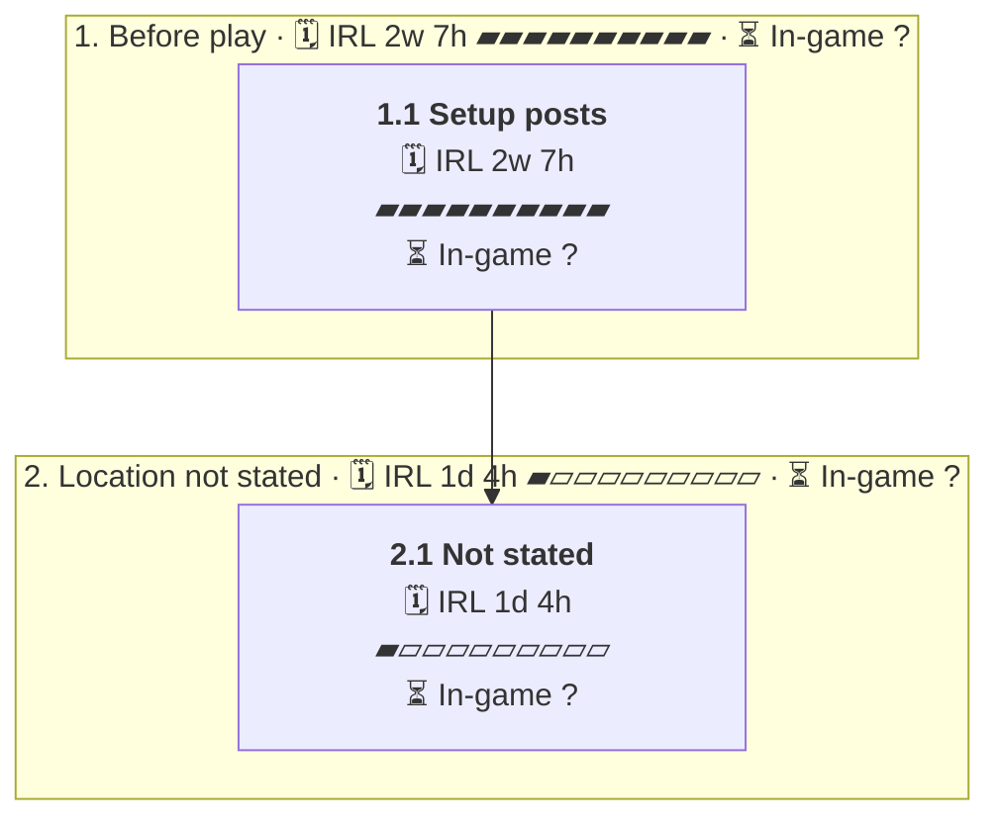

# C10 The Junction: Timeline

Where the party went, in order. Each outer box is an area, and each box inside it is a room or spot the party spent time in.

- 🗓️ **IRL** is measured from the first post there to the first post at the next place.
- ⏳ **In-game** time is filled in by the GM. An area's total appears once all of its rooms have one.

## 1. Before play

- 🗓️ **IRL:** 30 Aug 2026 to 30 Aug 2026, 2w 7h
- ⏳ **In-game:** not all rooms filled in

### 1.1 Setup posts

- 🗓️ **IRL:** 30 Aug 2026 to 30 Aug 2026, 2w 7h, 8 posts
- ⏳ **In-game:** not filled in (`"2026-08#1"` in `timelines/C10-The-Junction.json`)

**Events**

- 30 Aug: GM said they were still looking for players [↗](https://t.me/Path_Wars/146645/176282)
- 30 Aug: Anthony said no [↗](https://t.me/Path_Wars/146645/176283)
- 30 Aug: Anthony said don't [↗](https://t.me/Path_Wars/146645/176285)
- 30 Aug: Anthony told GM to finish Kibwe [↗](https://t.me/Path_Wars/146645/176288)

## 2. Location not stated

- 🗓️ **IRL:** 13 Sep 2026 to 14 Sep 2026, 1d 4h
- ⏳ **In-game:** not all rooms filled in

### 2.1 Not stated

- 🗓️ **IRL:** 13 Sep 2026 to 14 Sep 2026, 1d 4h, 2 posts
- ⏳ **In-game:** not filled in (`"2026-09#1"` in `timelines/C10-The-Junction.json`)

**Events**

- 13 Sep: GM said So. [↗](https://t.me/Path_Wars/146645/178783)
- 14 Sep: GM described Acomhal as trade hub. [↗](https://t.me/Path_Wars/146645/179038)
