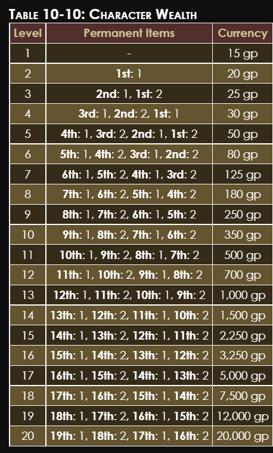
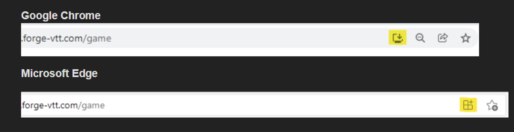

# PW~Getting-started-guide

Long story short, make a character and play some DND! :)

This guide will help you get set up.
You will:
- Make a character.
- Get ready up to play on Foundry.
- If you need any help, ask on the discord server.

> REQUIREMENT #1 = ONLY JOIN IF YOU ARE 18+
>> - Before you can join any Path Wars campaign, you must be 18+.
>> - If you are under 18, then I am afraid we cannot and will not let you play.
>> - Most players will be in their 20s and do not want to play with children.
>> - If you are under 18: PLEASE LEAVE THE DISCORD SERVER AND TELEGRAM GROUP.

> REQUIREMENT #2 = ONLY JOIN IF YOU CAN COMMIT TO MULTIPLE SESSIONS + SHOW UP TO SESSIONS + PLAY IN THE LONG TERM.

> REQUIREMENT #3 = ONLY JOIN IF YOU ARE COMFORTABLE WITH THE CONTENT GUIDE.

## Welcome!

- Hello Pathfinder newbie!
- If you are reading this, you probably want to join one of the currently running Path Wars Pathfinder 2e campaigns. 
- This is a guide that will hopefully result in you being ready to play. 
- Just follow each section, complete each part, and you will be ready to play.

**Help.**
- If you need any help, please reach out to the GM on Telegram or Discord.

> Before we go any further...
>> - This campaign is COMPLETELY FREE. Foundry is free, the telegram is free, discord is free.
>> - PLEASE READ STEP 0. It is for your comfort and the comfort of the other players.
>> - You do not need to know the lore. Experience the story as you play.
>> - You do not need to make a deep backstory. It is appreciated but definitely not required!
>> - Most of the variant rules are optional, you can be as vanilla as you like!
>> - No prior Pathfinder, dnd or TTRPG experience is required to play with us, absolute noobs and hardened veterans are both completely welcome. :)
>> - There is a lot of information on this GitHub, you do not need to read any of it, we are just playing a game here, it is all just for fun. The information is just here on GitHub for people to look up & reference if they want to.

> Unlocking the Discord.
>> - At the moment you will only be seeing a couple of public channels on the server, including the lobby.
>> - To unlock the rest of the server, please read the rest of the page.
>> - The “What To do Now” heading contains further information.

## What to do now!

1. Please read step 0. This step describes the possible content that could come up in-game.
2. Please decide if you consent to this content being possibly in the game.
3. Go to the ✅-join-the-campaign channel and tick the ✅ emoji.

> Why did I add step 0?
>> - After GMing for a long time, you come to realise that different people have different levels of tolerance for all kinds of different things.
>> - The intent of step 0 is to ensure that you as a potential new player are well aware of possible in-game events, and the types of interpersonal interactions that can occur.
>> - This explanation is for the benefit of everyone as everyone is on the same page when it comes to expressing themselves without fear of upsetting someone else.
>> - While mostly it is just edgy jokes, if any of the possible story elements could make you unwilling to play, then this community / TTRPG experience is likely not for you.

## Step #0.
> Content Warning about Possible Content. The content guide checklist.
>> - The list of possible things is taken from “The Digital RPG Consent Checklist”.
>> - The link to the safety checklist can be found here:
>> - This checklist is a safety tool created to ensure a safe gaming environment.
>> - A big thank you to the tool for ensuring happy gaming.
>> - I am using it here because I think it covers *nearly* every possible event that could possibly occur in a campaign.

> Is this stuff always going to happen?
>> - One or more items on the following list may never occur in a Path-War campaign.
>> - However, it is important that the possibility is made clear so that people are not put off if such a thing happened. 
>> - Any of these topics could also come up in conversation over voice on discord or on text on the telegram.

> Horror.
>> 1. Bugs
>> 2. Blood
>> 3. Demons
>> 4. Eyeballs
>> 5. Gore
>> 6. Harm to animals
>> 7. Harm to children
>> 8. Rats
>> 9. Spiders

> Relationships.
>> 1. Romance.
>> 2. Romance with a fade to black
>> 3. Romance that is explicitly described
>> 4. Romance Between PCs and NPCs
>> 5. Romance Between PCs
>> 6. Sex
>> 7. Sex with a fade to black
>> 8. Sex that is explicitly described
>> 9. Sex between PCs and NPCs
>> 10. Sex between PCs
>> 11. Emotional Abuse with a fade to black
>> 12. Emotional Abuse that is explicitly described
>> 13. Emotional Abuse between PCs and NPCs
>> 14. Emotional Abuse between PCs
>> 15. Physical Abuse with a fade to black
>> 16. Physical Abuse that is explicitly described
>> 17. Physical Abuse between PCs and NPCs
>> 18. Physical Abuse between PCs
>> 19. Violent Conflict between PCs
>> 20. Betrayal between PCs

> Social and Cultural Issues.
>> 1. Homophobia
>> 2. Racism
>> 3. Real-World Religion
>> 4. Sexism
>> 5. Transphobia
>> 6. Specific Cultural Issues

> Mental and Physical Health.
>> 1. Cancer
>> 2. Claustrophobia
>> 3. Freezing to Death
>> 4. Gas-based lighting
>> 5. Genocide
>> 6. Heatstroke
>> 7. Natural Disasters (earthquakes, forest fires)
>> 8. Paralysis/physical restraint
>> 9. Police, police aggression
>> 10. Pregnancy, Miscarriage or Abortion.
>> 11. Self-Harm
>> 12. Severe Weather (hurricanes, tornado)
>> 13. Sexual Assault
>> 14. Starvation
>> 15. Terrorism
>> 16. Torture
>> 17. Thirst

> How Do You Feel About the Permanent Death of Player Characters?
>> - “I am OK with it.”
>> - You need to be OK with the fact that your character may die and that your character may be permanently dead.
>> - While resurrection is often an option, there are many instances where it is not feasible, or the party decides not to resurrect your character.
>> - This needs to be accepted before play can begin.

> How Do You Feel About the Permanent Death of Significant NPCs?
>> - You need to be OK with the fact that significant NPCs may die and be permanently dead.

> Additional: Slavery.
>> - All of the above comes from the RPG Safety kit.
>> - I am adding slavery as my own custom addition as it is part of the campaign world setting.
>> - This means that slavery can often come up.
>> - You need to be OK with:
>> 1. Slavery exists.
>> 2. Players or NPCs own slaves.
>> - This is all I think of in regard to slavery.
>> - If anyone has any suggestions on how the slavery content list could be expanded, please let me know.

> Additional: Comedy.
>> - I have also added this section.
>> - Jokes are subjective, so please be OK with jokes of any kind, any subject, etc.
>> - I, myself, enjoy dark and edgy humour. 
>> - However, I know that it is not for everyone.
>> - That is why it is important to acknowledge this and ensure people are prepared for the possibility of jokes being made by anyone involved in the campaign or from the community as a whole.

> Additional: Other. 
>> - Per suggestions from players, I will add:
>> 1. Depression.
>> 2. Anxiety.
>> 3. Disabilities.

> Suggestions.
>> - If you have any ideas on how to extend out the content warning list, please let me know.
>> - Telegram is the best way to reach me.

## Become Social!

The first steps are the socials we use to organise the sessions and to chat about Pathfinder and other stuff.

## Step #1.
> Telegram.
>> - We use Telegram for out-of-game chat, and some in-session links and image sharing.
>> - The link to the Telegram group is below.
>> - All the links do the same thing.
>> - Click the link: 

## Step #2.
> Discord.
>> - Discord invite link: 

.

> What is next? Establishing The Character’s Lore.
>> - With these steps, we will establish the character alongside their backstory, traits, appearance and more!

## Step #3.
> The Great Spoiler Warning.
>> - Read = 

## Step #4.
> How to Build Your Character’s Life.
>> - Go here and paste the table onto your writerside instance OR your word processor of choice: 
>> - If you need information on the world, check out: 

> OPTIONAL: GitHub.
>> - Put your character's lore into a Writerside project.
>> - Create a GitHub repo.
>> - Push up your project.
>> - Share it with me! :)

***Now you know what your character is like!***
- I cannot wait to meet them. 😃

> What is next? Learning the rules.
>> - It is time to learn!
>> - Do not worry, this is the fun kind of learning.
>> - You can learn as you go!
>> - There is no pressure. :)

## Step #5.
> Paizo Variant Rules.
>> - YOU DO NOT NEED TO USE A VARIANT RULE IF YOU DO NOT WANT TO. 
>> - You do not need to use dual class, free archetype, etc. 
>> - You can make a single class non-free-archetype character if you wish to do so.
>> - Please read the following page:
>> - You can find out what Paizo Variant rules are used in the page linked above!
>> - The campaigns ran in the Path War community have some homebrew rule changes. 
>> - You can find a mostly complete list of the rule changes here: 

## Step #6.
> Talk to the Game Master, me!
>> - Reach out to me. 
>> - Share with me your built-up character's lore. 
>> - We will integrate your character into the campaign. 
>> - Check out my 5 plot threads rule on 
>> - I will go through this with you to integrate you into the campaign.

> What is up next? Building the character's stats and abilities!
>> - The next steps are all about making the character.

## Step #7.
> Path Builder 2e + Character Creation.
>> - Time to actually make your character’s stats and abilities.

> Buying the Full Version of Path-Builder 2e. 
>> - Should you buy the full version? You do NOT need to!
>> - Buying the full version of Path-builder 2e is, however, very worth it. 
>> - All the campaigns on this server are multi-year 100+ session campaigns, you will get your value for money. 
>> - Using Path-Builder 2e ensures that you build your character correctly without missing out important steps.

> Pathbuilder setup. 
>> - Here is how to set up Path Builder 2e = 
>> - The link to Path-Builder is here: 

> Go on Path-Builder. 
>> - Go to Path-Builder's character builder web application.

> Enable the variant rules.
>> - Enable the variant rules that are applicable to your campaign.
>> - To find out what variant rules you need to enable, check here: 

> How to enable the variant rules.
>> - To enable variant rules on Path-Builder 2e do the following: 
>> - Options → Then Tick the Box next to the rule. 
>> - For dual-class it would be: Options → Tick the Dual Class box.

> NOTE ABOUT = Selecting 3rd party content on Pathbuilder:
>> - **3rd Party Content.**
>> - Check the 3rd party page to find out what is available: 
>> - 3rd Party content will not be selectable in Path-Builder 2e due to it not being official Paizo content.
>> - To use 3rd party content, you will need to add it in Foundry manually.
>> - Ask me about this! 
>> - Some 3rd party content may already be available in Foundry thanks to community modules.

> NOTE ABOUT = Uncommon, Rare and Unique equipment, feats, spells and races.
>> - Before selecting anything with these traits, make sure you read: 
>> - You can play ANY background, class and/or race, regardless of their rarity.

> Create your character.
>> - To create your character, on pathbuilder set your character's level to the level they will be playing at.
>> - To find out what level your character should be set to, ask the discord.
>> - Now fill out your character on Pathbuilder 2e.
>> - Pick your class, pick your race and pick your subrace. 
>> - Go through each level and apply all your ability score boosts, make your feat selections, etc.

> Pick your equipment.
>> - Here is the Starting Wealth table: 
>> - This table explains what items you start with.
>> - You need to consult the table by using your level to determine what equipment you start with.
>> - 

> Examples of equipment.:
>> - 9th Level Items. One 8th. Two 7th. One 6th. Two 5th. 250 GP.
>> - 11th Level Items. One 10th, two 9th, one 8th, two 7th. 
>> - 12th Level Items. One 11th. Two 10th. 1 9th. 2 8th. 700 GP. 
>> - 13th Level Items. 12th level item x 1. 11th level item x 2. 10th level item x 1. 9th level item x 2. 1,000 Gold Pieces.

> Bag of holding costs.**
>> - Type 1 = 4th level item. 75 GP. 
>> - Type 2 = 7th level item. 300 GP. 
>> - Type 3 = 11th level item. 1,200 GPs. 
>> - Type 4 = 13th level item. 2,400 GPs.

> Apply lore increases. 
>> - You can read about the lore increases homebrew rule here: 

> Foundry Virtual Table Top Time.
>> - It is time to get started on getting you set up on Foundry.
>> - The following steps will get you ready for Foundry!

## Step #8.

> Foundry.
>> - We use Foundry to play Pathfinder on.
>> - You can read about what Foundry is here: https://www.rpgmatch.org/vtt/foundry-vtt-review/
>> - It is basically Roll20 if you have used that website before.
>> -  You do not need to download Forge/Foundry. 
>> -  You do not need to pay anything to use Forge/Foundry.

> Download Link for Chrome.
>> - I would recommend downloading / using Chrome. 
>> - Foundry is made to work with Chrome.
>> - Chrome will offer you the best performance. 
>> - Chrome will offer you the best user experience. 
>> - You do not NEED to use Chrome, but I do recommend it.
>> - 
>> - You can alternatively use Microsoft Edge for very close performance. 
>> - Either one is totally fine. 😃

## Step #9.
> What is the Forge?
>> - This step will get you set up on the Forge.
>> - What is the Forge? The Forge is a server-hosting platform. 
>> - The Forge hosts Foundry worlds. 
>> - I pay per a month to have the Foundry world hosted on the forge. 
>> - You do not need to pay anything.

## Step #10.
> Join The Forge Campaign
>> - Ask for a Forge invite link.
>> - You need to create an account.
>> - Once you have done that, you will be an official player in the campaign.
>> - **_Congratulations you are now on Foundry and an official player!_**

> “BUT THIS LINK DOES NOT WORK!!!”
>> - If the link does not work, just ask on the telegram chat for a new one.

## Step #11.
> Request a Foundry User.
>> - Now that you have a Forge account, you can launch the game.
>> - This will take you to the Foundry login screen.
>> - To log into Foundry, you need a Foundry User.
>> - Foundry users must be created manually by the Foundry Admin, me!
>> - Request a Foundry user on the telegram group, and I will create a user for you.

## Step #12.
> Log into the Foundry.
>> - Watch this video before using Foundry VTT.
>> - https://www.youtube.com/watch?v=ja88yRVQmck
>> - You may need to refresh your browser.
>> - Select your username from the list of users.
>> - Input your password into the password text area.
>> - Click join game session!

## Step #13.
> Desktop-ing Foundry.
>> - 
>> - Click the button: 
>> - Click 'Install'. It does not actually install anything. 
>> - Takes about 5 seconds to 'install'.

## Step #14.
> Pick your player colour.
>> - Once you have logged in Foundry will prompt you to pick your player colour. 
>> - Pick your colour.
>> - You can change it in the bottom left corner by right-clicking on your username.
>> - Continue to the next step!

## Step #15.
> Request a Character sheet.
>> - Ask on Telegram for a character sheet.

## Step #16.
> Open your character sheet.
>> - In the top right corner of your screen on Foundry, there is an “actors” icon. 
>> - Click the icon. 
>> - You should see your character sheet.

## Step #17.
> Set up your character sheet on the Forge VTT.
>> - Go to the Forge VTT. 
>> -  Open your sheet. 
>> - Drag in your class, feats, etc.
>> - If stuck, ask for help.

## Step #18.
> Pick a token image.
>> - Find an image to be the image for your character's token. 
>> - This is the image that will represent your character on the virtual tabletop. 
>> - Save that image somewhere you can find. 
>> - Send me the image.

## Step #19.
> Request Vision Setup + Token Placement. 
>> - Is your screen entirely black? 
>> - Then your character has not yet been placed in the current scene. 
>> - Request that the Game Master place your token and set up your token’s vision.

## Step #20.
> Talk to the Game Master. 
>> - Set up a time to call and together establish 5 unique story hooks.

## Step #21.
> Other random things.
>> - Below are other random hopefully helpful things.

> Easy tools.
>> - Here is a link to Easy Tools: https://pf2easy.com/tree/
>> - Click the burger menu in the top right. 
>> - Click “Filter Content”. 
>> - Click “Player Mode”. 
>> - Apply.

## Stating actions.
> Saying everything aloud is essential:
>> 1. If you did not say you did it, then you did not do it.
>> 2. If you do not have the item on your sheet, you do not have the item.
>> 3. If you did not say out loud that you looted an item, then you did not loot an item.
>> 4. If you did not buy an item, then you did not buy an item. 

> If I did not hear you say it, it did not happen. 
>> - Please make sure I can hear you properly.

> Why is this a thing? 
>> - It is to set a standard to avoid arguments where, for example, someone's character dies.

## How to LEAVE a campaign.
> If you want to leave a campaign, please do one thing first:
>> - **Talk to me about it. Please!**
>> - If there is a problem, then there is a good chance we can talk it out and figure it out.

## ERP.

> There might be some. That is about it.

## What is the Time Zone of the GM?

> It's Dublin/London.

## Step #22.
> The Final step. Everything might be ready? 
>> - Final checks.
>> - Is your character sheet on Foundry populated with all your choices?
>> - Do you have all the optional rules applied to your character’s build? 
>> - Do you have your equipment picked?
>> - Is all your equipment on your character sheet? 
>> - Can you move your token to the Foundry? 
>> - Can you see via your token on Foundry? 
>> - Can you turn your token on Foundry? 
>> - If you answer all of the above with: “Yes”, then you are ready to play in the next session!
>> - You should find your campaigns on this wiki on the Path Wars Homepage. 
>> - See more pages here on GitHub.

**And with that, we should be ready to roll the dice, kill shit and have fun.** 😃.

> Make sure to complete the [Character-Lore-Builder](PW~Character-Lore-Builder.md)

## Change log.

> 2025-01-19.
>> - Changed formatting.

> 13/08/2024.
>> - Ross gave me a LOT of feedback, so I have made a lot of changes.

> 24/01/2023.
>> - This guide was once 25 separate pages. 
>> - I got a lot of feedback that stated that having all these pages being separate was clunky, hard to navigate and hard to read. 
>> - So I have instead made it one longer page. 
>> - People enjoy this change, hopefully.
